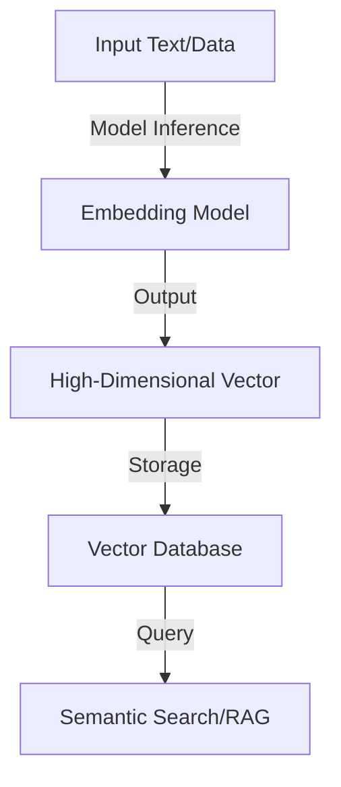
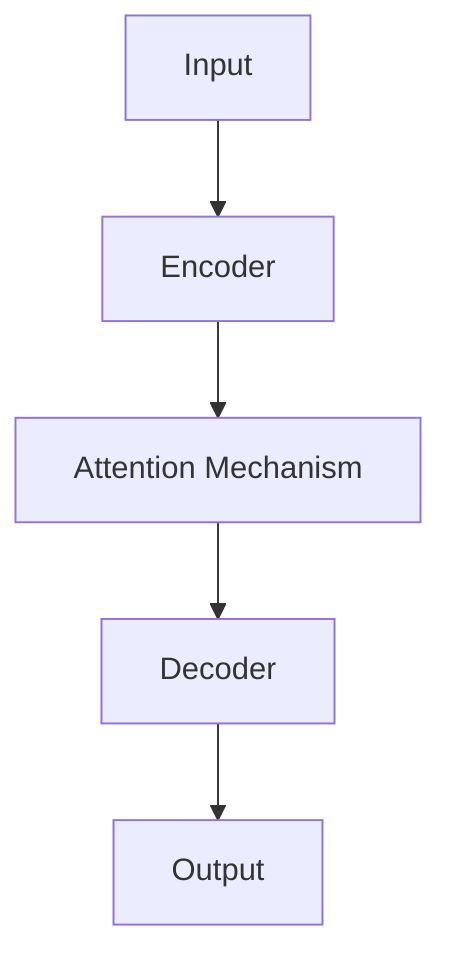
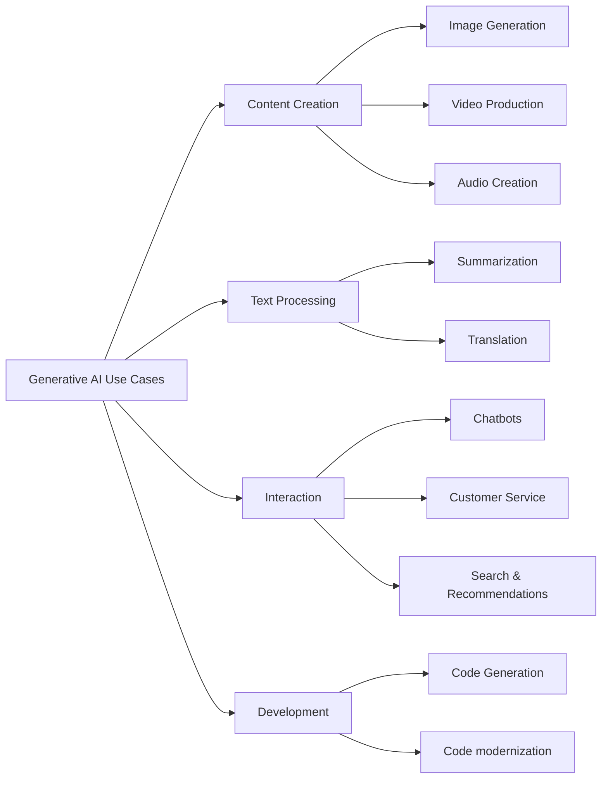
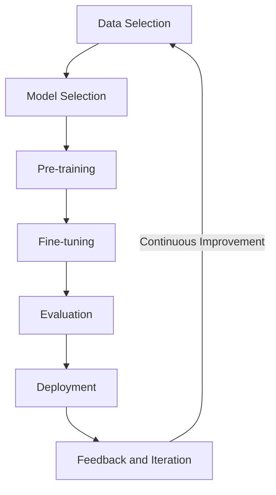
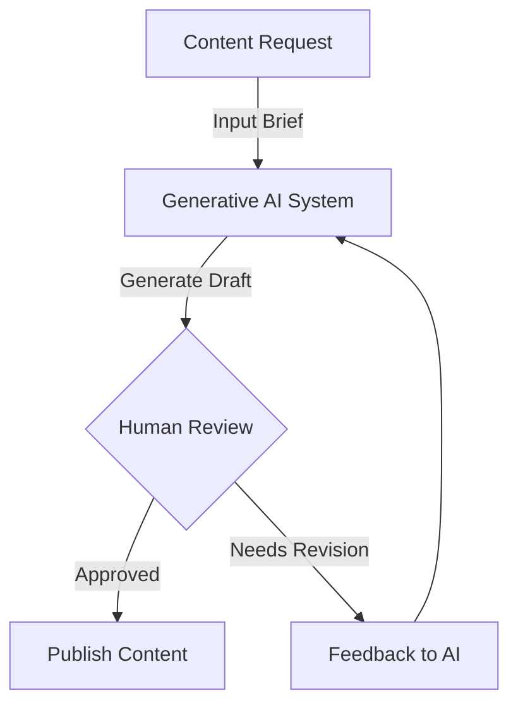
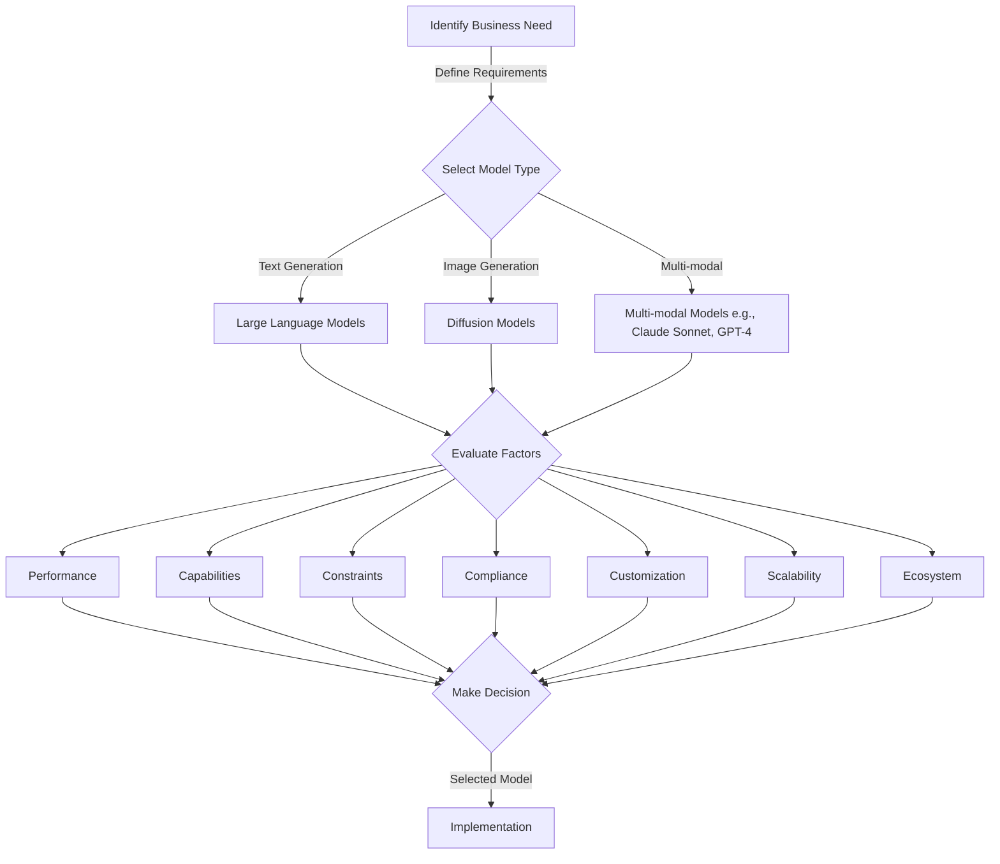
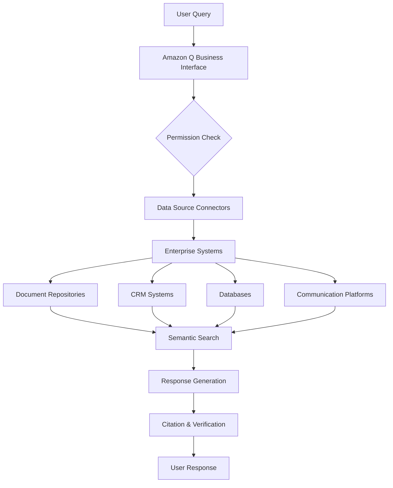
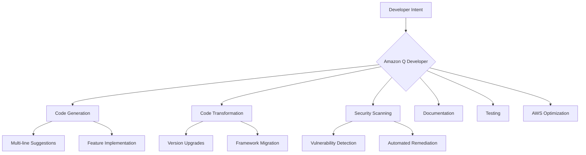

# Domain 2: Fundamentals of Generative AI (24% of scored content) 

# Chapter 2. Fundamentals of Generative AI

**Generative AI** represents a powerful subset of artificial intelligence that creates new content—text, images, code, music, and more—transforming how businesses approach problem-solving, creativity, and decision-making. This technology opens unprecedented possibilities for innovation and efficiency across industries.[^100]

Understanding generative AI has become a strategic imperative for today's business professionals. From marketing to product development, customer service to operations, these tools are reshaping workflows and creating competitive advantages through personalized customer experiences and accelerated development cycles.[^101]

This chapter demystifies the core concepts of generative AI, providing practical insights into its business applications. You'll learn about the fundamental building blocks of generative systems, including **tokens**, **embeddings**, and **transformer-based language models**.[^102] We'll examine how these technologies power applications like chatbots, content generation, and predictive analytics that drive business value.

The lifecycle of *foundation models* forms a critical part of our discussion—from data selection and pre-training to *fine-tuning* and deployment. This knowledge will help you make informed decisions about implementing generative AI solutions and communicating effectively with technical teams about your requirements and expectations.

As we explore generative AI's advantages and limitations, you'll develop skills to critically evaluate its potential for specific business challenges. We'll discuss model selection based on performance requirements, compliance considerations, and business objectives. You'll gain tools to assess business value using metrics like cross-domain performance, efficiency, and customer lifetime value.

The AWS ecosystem provides robust infrastructure and services for building generative AI applications. We'll examine how **Amazon Bedrock** and **Amazon SageMaker JumpStart** can accelerate your AI initiatives while ensuring security, compliance, and cost-effectiveness.[^103]

By chapter's end, you'll possess a solid foundation in generative AI concepts and their business applications. You'll be equipped to identify opportunities within your organization, understand the development process, and make informed implementation decisions—key preparation for the more advanced topics and specific use cases in later chapters.

Our goal isn't to transform you into a technical expert, but rather a business professional who can effectively harness these technologies to drive innovation and growth. Let's explore this rapidly evolving field together.

[^100]: Generative AI: The Evolution of Thoughtful Content Creation. URL: <https://aws.amazon.com/what-is/generative-ai/>

[^101]: AWS Generative AI Innovation Center. URL: <https://aws.amazon.com/generative-ai/innovation-center/>

[^102]: What are Large Language Models? URL: <https://aws.amazon.com/what-is/large-language-model/>

[^103]: Amazon Bedrock - Build and scale generative AI applications with foundation models. URL: <https://aws.amazon.com/bedrock/>

---

## 2.1 Basic concepts of generative AI

Task Statement 2.1: Explain the basic concepts of GenAI.

Objectives:

Define foundational GenAI concepts (for example, tokens, chunking, embeddings, vectors, prompt engineering, transformer-based LLMs, foundation models [FMs], multimodal models, diffusion models).

Identify potential use cases for GenAI models (for example, image, video, and audio generation; summarization; AI assistants; translation; code generation; customer service agents; search; recommendation engines).

Describe the foundation model lifecycle (for example, data selection, model selection, pre-training, fine-tuning, evaluation, deployment, feedback).
---

Generative AI transforms how businesses solve problems, foster creativity, and make decisions. This powerful technology creates new content, understands complex relationships, and automates tasks that once required significant human effort. Understanding these foundations is essential for anyone taking the AWS Certified AI Practitioner exam and professionals seeking to leverage AI in their organizations.

This subchapter explores generative AI's core concepts, practical applications, and the lifecycle of foundation models. Whether you're evaluating AI solutions or planning implementations, these insights will help you identify opportunities where generative AI can address business challenges and create value.

### Understanding foundational generative AI concepts

Generative AI systems combine several key technologies to create new content and solve complex problems. Let's examine the essential components that power these systems:

1. **Tokens and Chunking**

Tokens are the fundamental building blocks that generative AI models process. They can be words, word fragments, or characters, depending on the model's design. Chunking is the process of breaking down input text into these manageable tokens.[^200]

For example, the sentence "AWS is a cloud computing platform" might be tokenized as:
["AWS", "is", "a", "cloud", "comput", "ing", "platform"]. In reality tokenization also split longer words into smaller subwords, so in English, one word is roughly 1.3 tokens, in Chinese it is about 2.5 tokens, while in Arabic it's can be even 4 tokens. 

Understanding tokenization is crucial for businesses working with large language models (LLMs) as it affects model performance, cost (often based on token count), and the ability to handle different languages or specialized vocabularies.

2. **Embeddings and Vectors**

Embeddings are dense vector representations of tokens, words, or entire documents. These numerical representations capture *semantic meanings*, allowing AI models to understand relationships between different pieces of text. For example, questions "How old are you?" and "What is your age?" have the same semantic meaning, while don't have any common word. [^201]

Embeddings are high-dimensional, dense numerical vectors that represent the "essence" or semantic meaning of data (text, images, or audio). Unlike simple keyword matching, embeddings map semantically similar items to a similar mathematical space.

*Figure 2.1.1: Embedding Process in Generative AI. This diagram illustrates the process of converting input text into vector representations, which are then used to find related concepts or perform other AI tasks.*

In a business context, embeddings enable powerful applications such as semantic search, where users can find information based on meaning rather than exact keyword matches. For instance, a customer support system using embeddings could understand that a query about "refund policy" is related to "return procedures" even if those exact words aren't used.

### **The Vector Space Concept**
In a vector space, the "distance" between two vectors represents their similarity. 
* **Cosine Similarity:** A common mathematical measure used to determine how close two vectors are.
* **Example:** In a 300-dimensional space, the vector for "King" would be mathematically closer to "Queen" than to "Apple."

### **Key AWS Implementation Details**
To pass the ALF-C01, you should associate these concepts with specific AWS tools:

| Feature | AWS Service / Component |
| :--- | :--- |
| **Generating Embeddings** | **Amazon Bedrock** (using models like Amazon Titan Text Embeddings or Cohere Embed). |
| **Storing & Searching** | **Amazon OpenSearch Service** (Vector Engine) or **Amazon Aurora** (with pgvector). |
| **Orchestration** | **Knowledge Bases for Amazon Bedrock** (automatically handles the embedding and storage process). |

### **Business Use Cases**
* **Semantic Search:** Finding documents based on intent (e.g., searching for "troubles with my screen" returns results for "monitor repair").
* **Recommendation Engines:** Suggesting products that are semantically similar to a user's previous purchases.
* **Retrieval-Augmented Generation (RAG):** Providing a LLM with specific, retrieved context from a company's private data to reduce hallucinations.

> **Exam Tip:** Remember that embeddings turn **unstructured data** (text/images) into **structured numerical data** that computers can compare using geometry.

---

### **3. Prompt Engineering**

Prompt engineering is the art and science of crafting input prompts to elicit desired outputs from generative AI models. It involves designing clear, specific instructions that guide the model to produce the most relevant and accurate responses.[^202]

For business professionals, effective prompt engineering can significantly enhance the value derived from generative AI tools. For example, when using Amazon Bedrock to generate marketing copy, a well-crafted prompt might include specific brand guidelines, target audience information, good and bad examples, and desired tone, resulting in more tailored and effective content generation.[^203]

This update expands your notes with specific technical details and AWS-native features that frequently appear on the **AWS Certified AI Practitioner (ALF-C01)** exam.

---

Prompt engineering is the strategic design of inputs to guide foundation models toward accurate, context-aware outputs. For the exam, focus on these specific techniques and **Inference Parameters**.

### **Core Techniques**
*   **Zero-shot:** Asking the model a question without any examples.
*   **Few-shot:** Providing 3–5 examples (Input/Output pairs) within the prompt to improve accuracy.
*   **Chain of Thought (CoT):** Asking the model to "Think step-by-step" to improve reasoning for complex logic or math.
*   **Role Prompting:** Assigning a persona (e.g., "You are a professional cloud architect").

### **Model Inference Parameters**
These are settings you adjust when calling an AI model in **Amazon Bedrock**:
*   **Temperature:** Controls randomness. Lower (0.1) is focused/deterministic; Higher (0.8+) is creative/diverse.
*   **Top P (Nucleus Sampling):** The model considers a percentage of most likely words (e.g., top 90%).
*   **Top K:** The model only considers the $K$ most likely next words.
*   **Max Tokens:** Limits the length of the response.

---

### **4. Transformer-based LLMs**

Transformer-based Large Language Models (LLMs) are the powerhouse behind many generative AI applications. These models use a neural network architecture called the Transformer, which allows them to process and generate human-like text with remarkable accuracy.[^204]

*Figure 2.1.2: Simplified Transformer Architecture. This diagram shows the basic components of a Transformer model, highlighting the key elements that enable its powerful language understanding and generation capabilities.*

Transformer-based LLMs have revolutionized natural language processing tasks, enabling more sophisticated chatbots, content generation systems, and language translation services. For businesses, this means more natural and context-aware interactions with customers, improved content creation workflows, and enhanced multilingual capabilities.

The Transformer architecture is the backbone of most Generative AI.
*   **The "Attention" Mechanism:** This allows the model to weigh the importance of different words in a sentence, regardless of their distance from each other.
*   **Tokens:** Models don't read words; they read "tokens" (chunks of characters). One token is roughly ¾ of a word.
*   **Hallucinations:** When a model generates confident but factually incorrect information because it is predicting the next most likely token rather than "knowing" facts.

---

### **5. Foundation Models & AWS Services**

Foundation models are large-scale AI models trained on vast amounts of data, capable of performing a wide range of tasks without task-specific training. These models serve as a starting point for many AI applications and can be fine-tuned for specific use cases.[^205]

In the AWS ecosystem, Amazon Bedrock provides access to various foundation models from leading AI companies, allowing businesses to leverage these powerful models without the need for extensive in-house AI expertise or infrastructure.[^206]

Foundation models (FMs) are the "brain" of your application. The exam requires you to know how AWS delivers these:

### **Amazon Bedrock vs. Amazon SageMaker JumpStart**
*   **Amazon Bedrock:** Serverless API. Best for quickly integrating models (Claude, Llama, Titan) without managing servers.
*   **Amazon SageMaker JumpStart:** Provides a hub to deploy and fine-tune open-source models on dedicated infrastructure (EC2 instances).

### **Knowledge Bases for Amazon Bedrock**
This is a fully managed **RAG (Retrieval-Augmented Generation)** workflow. It connects your data (S3) to a model so the AI can answer questions based on your private company documents.

---

### **6. Multi-modal and Diffusion Models**

Multi-modal models can process and generate content across different types of data, such as text, images, and audio. These models enable more comprehensive AI applications that can understand and create diverse forms of content.[^207]

For businesses, multi-modal models open up new possibilities in areas like:
- Enhanced product recommendations combining visual and textual data
- Improved accessibility features that can translate between text, speech, and images
- More sophisticated content moderation systems that can analyze both text and images

*   **Multi-modal:** Models like **Claude 3.5 Sonnet** or **Amazon Titan Multimodal Embeddings** can process text and images simultaneously.
    *   *Exam Tip:* On AWS, images are often passed to models as **Base64 encoded strings** in the API call.
*   **Diffusion Models:** Used for image generation (e.g., **Stable Diffusion**). They work by adding "Gaussian noise" to an image and learning to "denoise" it back into a clear picture based on a text prompt.

---

### **7. The Foundation Model Lifecycle**
7. **Diffusion Models**

Diffusion models are a class of generative models particularly effective in image generation tasks. They work by gradually adding noise to data and then learning to reverse this process, allowing for the creation of high-quality, diverse images.[^208]

*Figure 2.1.3: Simplified Diffusion Model Process. This diagram illustrates the basic concept of diffusion models, where random noise is gradually transformed into a coherent image through a series of denoising steps.*

In a business context, diffusion models can be used for:
- Generating product images for e-commerce platforms
- Creating realistic 3D models for virtual reality applications
- Producing concept art for marketing campaigns or product design

Understanding these foundational concepts is crucial for business professionals looking to leverage generative AI effectively. By grasping these principles, you'll be better equipped to identify potential applications, communicate with technical teams, and make informed decisions about implementing generative AI solutions in your organization.

The ALF-C01 exam views the lifecycle through the lens of **Model Selection** and **Governance**.

### **Evaluation and Guardrails**
*   **Model Evaluation:** Using "LLM-as-a-judge" or human reviewers to score a model on accuracy, toxicity, and helpfulness.
*   **Amazon Bedrock Guardrails:** A security feature that allows you to:
    *   **Filter Content:** Block hate speech or insults.
    *   **PII Redaction:** Automatically mask social security numbers or emails.
    *   **Contextual Grounding:** Detect "hallucinations" by checking if the answer is actually supported by the source data.

### **Model Lifecycle States (Amazon Bedrock)**
1.  **Active:** The model is currently supported and available.
2.  **Legacy:** The model is being phased out (6 months notice usually given).
3.  **End-of-Life (EOL):** The model is no longer available; requests to it will fail.

---

### Identify potential use cases for generative AI models

Generative AI models create new opportunities across industries by automating creative tasks, enhancing decision-making, and improving customer experiences. Recognizing these applications helps businesses identify where AI can drive the most value in their specific context. Here are key use cases that demonstrate generative AI's potential:

1. **Image, Video, and Audio Generation**

Generative AI has revolutionized content creation by enabling the production of high-quality visual and audio content. Some key applications include:

- **Product Visualization**: E-commerce businesses can use AI to generate realistic product images in various settings or colors, reducing the need for expensive photo shoots.
- **Video Production**: AI can create animated videos, visual effects, or even entire scenes, streamlining the video production process for marketing and entertainment industries.
- **Music and Sound Design**: Generative models can compose original music or create sound effects, assisting in content creation for games, films, and advertising.

2. **Summarization**

AI-powered summarization tools can distill large volumes of text into concise, coherent summaries. This capability is valuable for:

- **Business Intelligence**: Quickly summarizing market reports, competitor analyses, or customer feedback to support decision-making.
- **Legal Document Review**: Summarizing lengthy legal documents to highlight key points and save time for legal professionals.
- **News Aggregation**: Creating brief summaries of news articles to keep employees or customers informed about relevant industry developments.

3. **Chatbots and Virtual Assistants**

Advanced chatbots powered by generative AI can engage in more natural, context-aware conversations. Applications include:

- **Customer Support**: Providing 24/7 assistance for common queries, reducing the workload on human support teams.
- **Sales and Lead Generation**: Engaging potential customers, answering product questions, and qualifying leads.
- **Internal Help Desks**: Assisting employees with IT issues, HR queries, or company policy questions.

4. **Translation**

Generative AI has significantly improved machine translation, enabling more accurate and context-aware language translations. This is particularly useful for:

- **Global Business Communication**: Facilitating communication with international clients or partners.
- **Content Localization**: Quickly adapting marketing materials, product descriptions, or user manuals for different markets.
- **Real-time Interpretation**: Providing instant translation services for international conferences or meetings.

5. **Code Generation**

AI models can assist in software development by generating code snippets, completing partial code, or even creating entire functions. This can be applied in:

- **Accelerated Development**: Speeding up the coding process by suggesting completions or generating boilerplate code.
- **Code Refactoring**: Assisting developers in improving existing code by suggesting optimizations or alternative implementations.
- **Learning and Training**: Helping novice programmers learn coding practices by providing examples and explanations.

6. **Customer Service Agents**

AI-powered customer service agents can handle a wide range of customer interactions, offering:

- **Personalized Assistance**: Providing tailored product recommendations or support based on customer history and preferences.
- **Multilingual Support**: Offering customer service in multiple languages without the need for a large multilingual staff.
- **Scalable Support**: Handling high volumes of customer inquiries during peak times without long wait times.

7. **Search and Recommendation Engines**

Generative AI can enhance search functionality and recommendation systems by:

- **Semantic Search**: Understanding the intent behind user queries to provide more relevant results.
- **Personalized Recommendations**: Generating tailored product or content recommendations based on user behavior and preferences.
- **Content Discovery**: Helping users find relevant information or products they might not have explicitly searched for.

*Figure 2.1.4: Generative AI Use Cases. This diagram illustrates the diverse applications of generative AI across various business functions, highlighting the potential for innovation and efficiency improvements.*

By understanding these use cases, business professionals can identify opportunities to leverage generative AI in their own organizations. Whether it's improving customer interactions, streamlining content creation, or enhancing decision-making processes, generative AI has the potential to drive significant value across various business functions.

### Describe the foundation model lifecycle

Foundation models power modern AI applications through a structured development and deployment process. From initial data selection to ongoing improvements, each stage requires careful consideration to ensure the resulting AI solution meets business needs while remaining ethical and effective. Understanding this lifecycle helps organizations plan resources, set expectations, and maximize the value of their AI investments.

1. **Data Selection**

The first step in creating a foundation model is selecting the training data. This process involves:

- **Data Sourcing**: Identifying and collecting relevant, high-quality data from various sources.
- **Data Cleaning**: Removing errors, inconsistencies, and irrelevant information from the dataset.
- **Data Balancing**: Ensuring the dataset represents a diverse range of topics, styles, and perspectives to avoid biases.

For businesses, the quality and diversity of training data directly impact the model's performance and applicability. When using services like Amazon Bedrock, it's important to understand the nature of the data used to train the available models to ensure alignment with your specific use case.[^209]

2. **Model Selection**

Choosing the right model architecture is crucial for the success of the AI project. Considerations include:

- **Model Size**: Balancing performance requirements with computational resources and deployment constraints.
- **Model Architecture**: Selecting between different types of models (e.g., transformer-based, diffusion models) based on the intended application.
- **Pre-trained vs. Custom**: Deciding whether to use a pre-trained model or train a custom model from scratch.

In the AWS ecosystem, Amazon SageMaker provides a range of pre-built algorithms and the flexibility to use custom models, allowing businesses to choose the most suitable approach for their needs.[^210]

3. **Pre-training**

Pre-training is the process of training the foundation model on a large, diverse dataset to develop general language understanding or task-solving capabilities. This stage involves:

- **Computational Resources**: Utilizing high-performance computing infrastructure to process vast amounts of data.
- **Training Strategies**: Implementing techniques like distributed training to handle large-scale models efficiently.
- **Hyperparameter Tuning**: Optimizing model parameters to improve performance and generalization.

For most businesses, pre-training from scratch is resource-intensive and often unnecessary. Instead, leveraging pre-trained models available through services like Amazon Bedrock can provide a strong starting point for further customization.[^211]

4. **Fine-tuning**

Fine-tuning adapts a pre-trained model to specific tasks or domains. This process includes:

- **Task-specific Data Preparation**: Collecting and preparing data relevant to the target application.
- **Transfer Learning**: Adjusting the pre-trained model's parameters using the task-specific data.
- **Performance Optimization**: Iteratively refining the model to improve its performance on the target task.

Fine-tuning allows businesses to leverage the power of foundation models while tailoring them to specific industry needs or company data. Amazon SageMaker provides tools and workflows to streamline the fine-tuning process.[^212]

5. **Evaluation**

Rigorous evaluation ensures the model meets performance, fairness, and safety standards. Key aspects include:

- **Benchmark Testing**: Assessing the model's performance against established benchmarks in relevant tasks.
- **Bias Detection**: Identifying and mitigating unfair biases in the model's outputs.
- **Safety Checks**: Ensuring the model doesn't produce harmful or inappropriate content.

Thorough evaluation is crucial for businesses to ensure the AI solution meets regulatory requirements and aligns with company values.

6. **Deployment**

Deploying the model involves making it available for use in production environments. Considerations include:

- **Scalability**: Ensuring the infrastructure can handle varying loads and user demands.
- **Latency**: Optimizing response times for real-time applications.
- **Cost Management**: Balancing performance requirements with operational costs.

AWS provides various deployment options, from serverless solutions like AWS Lambda to container-based deployments with Amazon ECS or EKS, allowing businesses to choose the most suitable approach for their use case.[^213]

7. **Feedback and Iteration**

The final stage involves collecting user feedback and monitoring model performance to drive continuous improvement. This includes:

- **User Feedback Collection**: Gathering insights from end-users to identify areas for improvement.
- **Performance Monitoring**: Tracking key metrics to detect performance degradation or drift.
- **Model Updates**: Regularly updating the model with new data or improved architectures.

Implementing a robust feedback loop ensures the AI solution remains effective and relevant over time.

*Figure 2.1.5: Foundation Model Lifecycle. This diagram illustrates the cyclical nature of the foundation model lifecycle, emphasizing the continuous process of improvement and adaptation.*

Understanding the foundation model lifecycle is essential for business professionals involved in AI initiatives. It provides insights into the resources required, potential challenges, and opportunities for optimization at each stage. By leveraging AWS services like Amazon Bedrock, Amazon SageMaker, and associated tools, businesses can streamline this lifecycle, reducing the time and resources needed to develop and deploy effective AI solutions.

In conclusion, mastering the basic concepts of generative AI, identifying potential use cases, and understanding the foundation model lifecycle are crucial steps for business professionals looking to leverage AI in their organizations. These insights will not only prepare you for the AWS Certified AI Practitioner exam but also equip you with the knowledge to make informed decisions about AI adoption and implementation in your business context.

### Questions for self-check

1. **A marketing team wants to use generative AI to create personalized email campaigns. Which of the following is a key consideration when implementing this solution?**

   A. Tokenization of customer data
   B. Prompt engineering
   C. Diffusion model selection
   D. Multi-modal model training

2. **An e-commerce company is implementing a generative AI solution to improve product search functionality. Which of the following best describes how embeddings contribute to this process?**

   A. Breaking down search queries into individual words
   B. Generating new product descriptions
   C. Creating vector representations of products and queries
   D. Translating search queries into multiple languages

3. **A software development team is considering using generative AI to assist with code generation. Which AWS service would be most appropriate for accessing foundation models for this purpose?**

   A. Amazon SageMaker
   B. AWS Lambda
   C. Amazon Bedrock
   D. Amazon ECS

4. **During the foundation model lifecycle, at which stage would a company typically adapt a pre-trained model to their specific industry or company data?**

   A. Pre-training
   B. Model selection
   C. Fine-tuning
   D. Deployment

5. **A business analyst is explaining the concept of tokens in generative AI to stakeholders. Which of the following statements best describes tokens in this context?**

   A. Security keys used to authenticate API requests
   B. Basic units of text processed by AI models
   C. Reward points in reinforcement learning algorithms
   D. Encryption methods for protecting sensitive data

### Answers and Explanations

1. **Correct answer: B. Prompt engineering**

   Explanation: Prompt engineering is crucial for generative AI applications like personalized email campaigns. It involves crafting clear, specific instructions to guide the AI model in generating relevant and effective content. For personalized marketing, well-designed prompts would include customer data, brand guidelines, and desired outcomes, ensuring the generated emails are tailored to individual recipients and align with the company's marketing strategy.[^214]

2. **Correct answer: C. Creating vector representations of products and queries**

   Explanation: Embeddings in generative AI are dense vector representations that capture semantic meanings. In an e-commerce search context, embeddings allow the system to understand the relationships between products and search queries based on their meaning, not just exact keyword matches. This enables more intelligent and context-aware search functionality, improving the relevance of search results and enhancing the overall user experience.[^215]

3. **Correct answer: C. Amazon Bedrock**

   Explanation: Amazon Bedrock is the most appropriate AWS service for accessing foundation models for code generation. As mentioned in the subchapter, Amazon Bedrock provides access to various foundation models from leading AI companies, allowing businesses to leverage these powerful models without extensive in-house AI expertise or infrastructure. This makes it ideal for software development teams looking to implement AI-assisted code generation.[^216]

4. **Correct answer: C. Fine-tuning**

   Explanation: Fine-tuning is the stage in the foundation model lifecycle where a pre-trained model is adapted to specific tasks or domains. This is when a company would typically customize the model to their industry or company-specific data. Fine-tuning allows businesses to leverage the general knowledge of foundation models while tailoring them to their unique needs, improving performance on specific tasks relevant to their operations.[^217]

5. **Correct answer: B. Basic units of text processed by AI models**

   Explanation: In the context of generative AI, tokens are the basic units of text that models process. As explained in the subchapter, tokens can be words, parts of words, or even individual characters, depending on the model's design. Understanding tokenization is important for stakeholders as it affects model performance, cost (often based on token count), and the ability to handle different languages or specialized vocabularies in AI applications.[^218]

[^200]: Understanding Tokenization in NLP. URL: <https://www.analyticsvidhya.com/blog/2020/05/what-is-tokenization-nlp/>

[^201]: Word Embeddings: Explained. URL: <https://medium.com/@manansuri/a-dummys-guide-to-word2vec-456444f3c673>

[^202]: Prompt Engineering Guide. URL: <https://www.promptingguide.ai/>

[^203]: Amazon Bedrock - Foundation Models. URL: <https://aws.amazon.com/bedrock/>

[^204]: Attention Is All You Need. URL: <https://arxiv.org/abs/1706.03762>

[^205]: Foundation Models: What They Are and Why They Matter. URL: <https://hai.stanford.edu/news/what-foundation-model-explainer-non-experts>

[^206]: Amazon Bedrock - Foundation Model Provider. URL: <https://docs.aws.amazon.com/bedrock/latest/userguide/models-supported.html>

[^207]: Multi-modal AI: The Future of Artificial Intelligence. URL: <https://www.v7labs.com/blog/chatgpt-with-vision-guide>

[^208]: Understanding Diffusion Models: A Unified Perspective. URL: <https://arxiv.org/abs/2208.11970>

[^209]: Amazon Bedrock - Responsible AI. URL: <https://aws.amazon.com/ai/responsible-ai/>

[^210]: Amazon SageMaker - Built-in Algorithms. URL: <https://docs.aws.amazon.com/sagemaker/latest/dg/algos.html>

[^211]: Amazon Bedrock - Getting Started. URL: <https://docs.aws.amazon.com/bedrock/latest/userguide/getting-started.html>

[^212]: Amazon SageMaker - Fine-tuning a Pre-trained Model. URL: <https://docs.aws.amazon.com/sagemaker/latest/dg/jumpstart-fine-tune.html>

[^213]: AWS AI Services - Deployment Options. URL: <https://aws.amazon.com/machine-learning/ai-services/>

[^214]: Prompt Engineering Techniques. URL: <https://www.promptingguide.ai/techniques>

[^215]: Vector Embeddings for E-commerce Search. URL: <https://docs.pinecone.io/guides/data/understanding-hybrid-search>

[^216]: Amazon Bedrock for Code Generation. URL: <https://aws.amazon.com/blogs/aws/amazon-bedrock-is-now-generally-available-build-and-scale-generative-ai-applications-with-foundation-models/>

[^217]: Fine-tuning Large Language Models. URL: <https://www.deeplearning.ai/short-courses/finetuning-large-language-models/>

[^218]: Tokenization in NLP. URL: <https://www.analyticsvidhya.com/blog/2020/05/what-is-tokenization-nlp/>

---
## 2.2 Capabilities and limitations of generative AI

Task Statement 2.2: Understand the capabilities and limitations of GenAI for solving business problems.

Objectives:

Describe the advantages of GenAI (for example, adaptability, responsiveness, simplicity).

Identify disadvantages of GenAI solutions (for example, hallucinations, interpretability, inaccuracy, nondeterminism).

Identify factors to consider when selecting GenAI models (for example, model types, performance requirements, capabilities, constraints, compliance).

Determine business value and metrics for GenAI applications (for example, cross-domain performance, efficiency, conversion rate, average revenue per user, accuracy, customer lifetime value).
---

Generative AI represents a powerful tool for solving complex business challenges across industries, creating new opportunities for innovation and efficiency. This transformative technology can produce human-like text, images, and code, opening possibilities for automation, personalization, and creative problem-solving. However, realizing its full potential requires understanding both its strengths and limitations.

Organizations that successfully implement generative AI solutions can enhance customer experiences, streamline internal processes, and drive innovation. Yet success depends on selecting appropriate models, setting realistic expectations, and addressing challenges like potential inaccuracies and ethical considerations.

This chapter explores the advantages and disadvantages of generative AI, providing guidance on selecting the right models for specific business needs and evaluating their impact using key performance metrics. With this knowledge, you'll be equipped to leverage generative AI effectively while aligning with strategic objectives and mitigating potential risks.

### Describe the advantages of generative AI

Generative AI offers several compelling advantages that make it an attractive solution for businesses across various sectors:

1. **Adaptability**

Generative AI systems demonstrate remarkable adaptability across diverse tasks and industries, often with minimal domain-specific training. This flexibility allows businesses to:

- Quickly pivot to new use cases as needs evolve
- Address diverse challenges with a single technology investment
- Explore innovative applications without extensive development time

For example, a generative AI model trained on customer service interactions can be adapted to generate marketing copy, product descriptions, or technical documentation with relatively minor adjustments.[^301]

2. **Responsiveness**

Generative AI systems excel at providing rapid, context-aware responses to user inputs. This high level of responsiveness enables:

- Real-time customer interactions through chatbots and virtual assistants
- Instant content generation for dynamic websites and applications
- Quick prototyping of ideas and concepts

Consider a financial services company using generative AI to power its customer support chatbot. The system can instantly provide personalized responses to complex queries about account information, investment strategies, or market trends, enhancing customer satisfaction and reducing workload on human agents.[^302]

3. **Simplicity**

Despite their underlying complexity, generative AI systems often present a simple interface for end-users. This simplicity manifests in several ways:

- Natural language interfaces that allow users to interact using everyday language
- Automated content creation that requires minimal human input
- Intuitive tools for non-technical users to leverage AI capabilities

For instance, Amazon Bedrock provides a user-friendly interface for businesses to access and deploy powerful generative AI models without needing deep technical expertise in machine learning.[^303]

4. **Scalability**

Generative AI solutions can easily scale to handle increasing workloads and user demands. This scalability is particularly valuable for:

- Handling peak traffic periods without performance degradation
- Supporting business growth without proportional increases in human resources
- Delivering consistent experiences across multiple channels and touchpoints

A media company using generative AI for content creation can rapidly scale its output to meet sudden increases in demand or expand into new markets without a corresponding increase in writing staff.[^304]

5. **Creativity and Innovation**

Generative AI has the unique ability to produce novel ideas and solutions, often combining concepts in unexpected ways. This capability drives:

- Enhanced brainstorming and ideation processes
- Generation of diverse content variations for A/B testing
- Discovery of new patterns and insights in data

For example, a product design team might use generative AI to explore thousands of potential designs based on a set of parameters, inspiring innovative solutions that human designers might not have considered.[^305]

6. **Consistency**

While generative AI can produce diverse outputs, it can also maintain a high level of consistency when needed. This is particularly valuable for:

- Ensuring brand voice across multiple content pieces
- Standardizing responses in customer service scenarios
- Maintaining quality control in content production

A global corporation could use generative AI to ensure that its messaging remains consistent across different languages and cultural contexts, maintaining brand integrity while adapting to local nuances.[^306]

7. **Cost-effectiveness**

By automating tasks that would traditionally require significant human effort, generative AI can lead to substantial cost savings. Benefits include:

- Reduced labor costs for repetitive tasks
- Faster time-to-market for content and products
- Lower training and onboarding costs for certain roles

Consider a software company using generative AI to assist with code generation and documentation. This could significantly reduce development time and costs while allowing human developers to focus on more complex, high-value tasks.[^307]

To illustrate how these advantages come together in a business context, let's examine a flowchart depicting the integration of generative AI into a content creation process:

*Figure 2.2.1: Generative AI Content Creation Process. This diagram illustrates how generative AI can be integrated into a content creation workflow, showcasing its adaptability, responsiveness, and ability to work alongside human creators for optimal results.*

In this process, the generative AI system demonstrates its adaptability by handling various content types, its responsiveness in quickly generating drafts, and its simplicity in integrating with existing workflows. The human review stage ensures quality control, while the feedback loop allows for continuous improvement, highlighting the system's ability to learn and adapt over time.

By leveraging these advantages, businesses can significantly enhance their operations, drive innovation, and stay competitive in an increasingly AI-driven marketplace. However, it's equally important to understand the limitations of generative AI, which we'll explore in the next section.

### Identify disadvantages of generative AI solutions

While generative AI offers numerous benefits, it also comes with several challenges and limitations that businesses must carefully consider:

1. **Hallucinations**

One of the most significant challenges with generative AI is its tendency to produce "hallucinations" &mdash; outputs that are plausible-sounding but factually incorrect or nonsensical. This issue can manifest in several ways:

- Generation of false or misleading information
- Creation of non-existent references or citations
- Fabrication of details in response to ambiguous queries

For example, a generative AI system used for customer support might confidently provide incorrect product specifications or troubleshooting steps, leading to customer frustration and potential brand damage.[^308]

2. **Interpretability**

Many generative AI models, particularly **large language models** (LLMs), operate as "black boxes," making it difficult to understand how they arrive at specific outputs. This lack of interpretability poses several challenges:

- Difficulty in auditing decision-making processes
- Challenges in explaining AI-generated content to stakeholders
- Potential legal and regulatory compliance issues

In fields like healthcare or finance, where decision transparency is crucial, the opacity of generative AI models can be a significant drawback.[^309]

3. **Inaccuracy**

While generative AI can produce high-quality outputs in many cases, it's not immune to errors and inaccuracies. These can stem from:

- Biases in training data
- Limitations in the model's knowledge cutoff date
- Misinterpretation of context or nuanced queries

A business relying on generative AI for market analysis might receive outdated or incorrect information, potentially leading to misguided strategic decisions.[^310]

4. **Nondeterminism**

Generative AI models often produce different outputs for the same input, even with identical parameters. This nondeterministic behavior can be problematic in scenarios requiring:

- Consistent and reproducible results
- Exact replication of previous outputs
- Predictable performance in critical applications

For instance, a legal firm using generative AI to draft contracts might find inconsistencies between documents generated at different times, necessitating careful human review.[^311]

5. **Data Privacy and Security Concerns**

Generative AI models often require access to large amounts of data, which can raise privacy and security issues:

- Risk of exposing sensitive information in model outputs
- Potential for data breaches during training or deployment
- Challenges in ensuring GDPR and other regulatory compliance

Organizations handling sensitive customer data must be particularly cautious when implementing generative AI solutions to avoid inadvertent data exposure.[^312]

6. **Ethical and Bias Issues**

Generative AI systems can inadvertently perpetuate or amplify biases present in their training data, leading to:

- Unfair or discriminatory outputs
- Reinforcement of stereotypes
- Potential for misuse in creating misleading content

For example, a generative AI system used in hiring processes might produce biased job descriptions or candidate evaluations if not carefully monitored and adjusted.[^313]

7. **Resource Intensity**

Training and running sophisticated generative AI models can be computationally expensive and energy-intensive. This leads to:

- High infrastructure costs for deployment and scaling
- Significant energy consumption and associated environmental impact
- Potential performance issues for real-time applications

Small to medium-sized businesses may find the resource requirements for cutting-edge generative AI models prohibitively expensive.[^314]

8. **Dependency and Skill Gap**

As organizations increasingly rely on generative AI, they may face challenges related to:

- Over-dependence on AI-generated content or decisions
- Skill gaps in the workforce for effectively managing and interpreting AI outputs
- Difficulty in maintaining and updating AI systems as technology evolves

Understanding these limitations is crucial for businesses to implement generative AI responsibly and effectively. By acknowledging these challenges, organizations can develop strategies to mitigate risks, ensure quality control, and maximize the benefits of generative AI while minimizing potential drawbacks.

### Understand various factors to select appropriate generative AI models

Selecting the right generative AI model for your business needs is a critical decision that can significantly impact the success of your AI initiatives. Various factors must be considered to ensure the chosen model aligns with your specific requirements, constraints, and objectives:

1. **Model Types**

Different generative AI models are designed for specific tasks and data types. Common types include:

- **Large Language Models** (LLMs) for text generation and understanding
- **Diffusion Models** for image and video generation
- **Variational Autoencoders** (VAEs) for data compression and generation
- **Generative Adversarial Networks** (GANs) for realistic image creation

For example, if your business needs to generate product descriptions, an LLM like GPT-3 or Claude 2 (available through Amazon Bedrock) would be more appropriate than a diffusion model designed for image generation.[^315]

2. **Performance Requirements**

Consider the specific performance metrics that are crucial for your use case:

- Inference speed for real-time applications
- Output quality and coherence
- Ability to handle specific domain knowledge
- Multilingual capabilities if required

A customer service chatbot, for instance, would prioritize fast inference times and multilingual support, while a content generation tool for long-form articles might focus more on output quality and domain-specific knowledge.[^316]

3. **Capabilities**

Assess the range of tasks the model can perform and how well they align with your business needs:

- Text generation, summarization, or translation
- Image or video creation
- Code generation or completion
- Multi-modal capabilities (handling text, images, and other data types)

For example, if your business requires both text and image generation for marketing materials, you might consider a multi-modal model like GPT-4 or a combination of specialized models for each task.[^317]

4. **Constraints**

Identify any limitations or restrictions that might affect your choice:

- Computational resources available (GPU/CPU requirements)
- Latency requirements for real-time applications
- Data privacy and on-premises deployment needs
- Budget constraints for model licensing or API usage

A small startup might opt for a smaller, more efficient model that can run on limited hardware, while a large enterprise might prioritize a more powerful model that can be deployed on-premises for data security reasons.[^318]

5. **Compliance**

Ensure the chosen model aligns with relevant regulations and industry standards:

- GDPR, CCPA, or other data protection regulations
- Industry-specific compliance (e.g., HIPAA for healthcare)
- Ethical AI guidelines and fairness considerations
- Explainability requirements for decision-making processes

Financial institutions, for example, might need to select models that provide a certain level of explainability to comply with regulatory requirements for AI-driven decisions.[^319]

6. **Customization and Fine-tuning**

Consider whether you need a model that can be customized for your specific use case:

- Ability to fine-tune on domain-specific data
- Support for few-shot or zero-shot learning
- Ease of integration with existing systems and workflows

A legal firm might choose a model that can be fine-tuned on legal documents and precedents to improve its performance in legal analysis and document generation.[^320]

7. **Scalability**

Evaluate the model's ability to grow with your business needs:

- Handling increasing volumes of requests
- Adapting to new domains or use cases
- Upgrading to newer versions or architectures

E-commerce businesses might prioritize models that can scale to handle seasonal traffic spikes and expand to support new product categories.[^321]

8. **Vendor Ecosystem and Support**

Consider the broader ecosystem and support available for the model:

- Integration with cloud platforms (e.g., AWS services)
- Available tools for monitoring and management
- Community support and documentation
- Vendor track record and future development roadmap

Choosing a model supported by Amazon Bedrock, for instance, provides the advantage of seamless integration with other AWS services and robust support infrastructure.[^322]

To illustrate how these factors interrelate in the decision-making process, consider the following flowchart:

*Figure 2.2.3: Generative AI Model Selection Process. This flowchart outlines the decision-making process for selecting an appropriate generative AI model, highlighting the various factors that need to be considered and how they feed into the final decision.*

In this diagram, we see how the process begins with identifying the business need, which informs the initial selection of model type. The various factors are then evaluated in parallel, considering the specific requirements and constraints of the business. The final decision is made based on a holistic assessment of all these factors.

By carefully considering these factors, businesses can select generative AI models that not only meet their immediate needs but also align with their long-term strategic goals and operational constraints. This thoughtful approach to model selection is crucial for maximizing the benefits of generative AI while mitigating potential risks and challenges.

### Determine business value and metrics for generative AI applications

Assessing the business value of generative AI applications is crucial for justifying investments, guiding implementation strategies, and measuring success. To effectively evaluate the impact of generative AI on your organization, it's important to establish relevant metrics that align with your business objectives:

1. **Cross-domain Performance**

Measure how well the generative AI solution performs across different areas of your business:

- Consistency of output quality across departments
- Adaptability to various use cases
- Reduction in time-to-market for new initiatives

*Metric Example:* Percentage increase in successfully completed projects across different departments using generative AI tools.

2. **Efficiency**

Evaluate the impact on operational efficiency:

- Time saved on repetitive tasks
- Reduction in manual errors
- Increased throughput for content creation or data processing

*Metric Example:* Decrease in average time to complete specific tasks (e.g., report generation, customer query resolution) compared to manual processes.

3. **Conversion Rate**

For customer-facing applications, measure the impact on sales and engagement:

- Improvement in lead generation quality
- Increase in successful customer interactions
- Enhanced personalization leading to higher conversion

*Metric Example:* Percentage increase in conversion rate for marketing campaigns using AI-generated content compared to traditional methods.

4. **Average Revenue Per User (ARPU)**

Assess the financial impact of generative AI on customer value:

- Increase in upsell and cross-sell opportunities
- Enhanced customer satisfaction leading to higher spending
- Improved retention rates due to personalized experiences

*Metric Example:* Year-over-year growth in ARPU for customers interacting with AI-powered systems versus traditional channels.

5. **Accuracy**

Measure the precision and reliability of generative AI outputs:

- Reduction in error rates for automated processes
- Improvement in decision-making accuracy
- Consistency of AI-generated content with brand guidelines

*Metric Example:* Percentage of AI-generated outputs that meet or exceed quality standards set by human experts.

6. **Customer Lifetime Value (CLV)**

Evaluate the long-term impact on customer relationships:

- Increased customer satisfaction and loyalty
- Reduction in churn rate
- Growth in repeat business and referrals

*Metric Example:* Percentage increase in CLV for customers who regularly engage with AI-powered services compared to those who don't.

7. **Cost Savings**

Quantify the reduction in operational expenses:

- Decreased labor costs for routine tasks
- Reduced training and onboarding expenses
- Lower costs associated with error correction and quality control

*Metric Example:* Total annual cost savings achieved through the implementation of generative AI solutions across different business functions.

8. **Innovation Rate**

Measure the impact on creativity and new idea generation:

- Increase in the number of new product or feature ideas
- Reduction in time from concept to prototype
- Growth in successful patent applications

*Metric Example:* Percentage increase in successfully launched new products or features developed with generative AI assistance.

9. **Employee Satisfaction and Productivity**

Assess the impact on workforce effectiveness and morale:

- Improvement in employee engagement scores
- Reduction in turnover rates for roles augmented by AI
- Increase in time spent on high-value tasks

*Metric Example:* Percentage increase in employee productivity (measured by output per hour) in teams using generative AI tools.

10. **Scalability and Growth**

Evaluate how generative AI enables business expansion:

- Ability to handle increased workload without proportional increase in resources
- Expansion into new markets or product lines
- Growth in capacity to serve customers across different time zones or languages

*Metric Example:* Percentage increase in business capacity (e.g., number of customers served, markets entered) without a corresponding increase in operational costs.

To illustrate how these metrics can be used to assess the business value of generative AI applications, consider the following table comparing performance before and after implementation:

*Table 2.2.1: Generative AI Impact Metrics*

| Metric | Before AI Implementation | After AI Implementation | Improvement |
|--------|--------------------------|-------------------------|-------------|
| Content Creation Time | 4 hours/article | 1 hour/article | 75% reduction |
| Customer Query Resolution | 24 hour avg. response time | 2 hour avg. response time | 92% reduction |
| Marketing Campaign Conversion Rate | 2.5% | 3.8% | 52% increase |
| Employee Productivity | 100 tasks/week | 150 tasks/week | 50% increase |
| Cost per Customer Interaction | $15 | $8 | 47% reduction |
| New Product Ideation | 10 ideas/month | 25 ideas/month | 150% increase |

This table provides a clear visualization of the impact generative AI can have across various business metrics. By comparing pre- and post-implementation data, organizations can quantify the value added by their AI investments.[^323]

To effectively measure and communicate the business value of generative AI applications, consider the following best practices:

1. Establish baseline metrics before implementation for accurate comparison.
2. Use a combination of quantitative and qualitative measures to capture the full impact.
3. Regularly review and update metrics to ensure they remain aligned with evolving business goals.
4. Conduct A/B testing to directly compare AI-driven processes with traditional methods.
5. Gather feedback from employees and customers to assess intangible benefits and areas for improvement.
6. Consider long-term impacts and potential for future scalability when evaluating ROI.

By systematically tracking these metrics and analyzing the results, businesses can make data-driven decisions about their generative AI investments, optimize their implementations, and demonstrate the tangible value of these technologies to stakeholders. This approach ensures that generative AI applications are not just technological innovations, but strategic assets that drive measurable business growth and competitive advantage.

### Questions for self-check

1. **A marketing team wants to use generative AI to create personalized product descriptions. Which of the following is NOT an advantage of using generative AI for this task?**

   A. Increased adaptability to different product types
   B. Improved consistency in brand voice across descriptions
   C. Guaranteed elimination of all factual errors in content
   D. Faster generation of large volumes of descriptions

2. **A financial services company is considering implementing a generative AI chatbot for customer support. Which of the following represents the most significant risk associated with this implementation?**

   A. Increased response time to customer queries
   B. Higher operational costs compared to human agents
   C. Potential for providing inaccurate or hallucinated information
   D. Inability to handle complex financial terminology

3. **When selecting an appropriate generative AI model for a business application, which factor is LEAST important to consider?**

   A. The model's ability to generate viral social media content
   B. Compliance with relevant industry regulations
   C. The model's performance requirements and capabilities
   D. Data privacy and security considerations

4. **A retail company has implemented a generative AI system to assist with inventory management and demand forecasting. Which metric would be MOST relevant in determining the business value of this AI application?**

   A. Number of AI-generated social media posts
   B. Reduction in inventory holding costs
   C. Increase in employee satisfaction scores
   D. Growth in website traffic

5. **Which of the following statements best describes the concept of "hallucinations" in generative AI models?**

   A. The model's ability to generate creative and innovative ideas
   B. The tendency of the model to produce plausible but factually incorrect information
   C. The model's capacity to understand and interpret human emotions
   D. The process of fine-tuning a model on domain-specific data

### Answers and Explanations

1. **Correct answer: C. Guaranteed elimination of all factual errors in content**

   Explanation: While generative AI offers many advantages for creating personalized product descriptions, including adaptability (A), consistency (B), and speed (D), it cannot guarantee the elimination of all factual errors. This is one of the key limitations of generative AI systems. They can produce inaccuracies or "hallucinations," especially when dealing with specific product details. Human oversight is still necessary to ensure factual accuracy in AI-generated content.[^324]

2. **Correct answer: C. Potential for providing inaccurate or hallucinated information**

   Explanation: The most significant risk in implementing a generative AI chatbot for financial services customer support is the potential for providing inaccurate or hallucinated information. This is particularly critical in the financial sector where incorrect information could lead to serious consequences for customers and the company. While generative AI can typically provide faster responses (not A) and often at lower operational costs (not B), and can be trained to handle complex terminology (not D), the risk of inaccuracies remains a primary concern that requires careful management and human oversight.[^325]

3. **Correct answer: A. The model's ability to generate viral social media content**

   Explanation: When selecting a generative AI model for business applications, the least important factor among these options is the model's ability to generate viral social media content. This is a very specific use case and not universally relevant to all businesses. In contrast, compliance with industry regulations (B), performance requirements and capabilities (C), and data privacy and security considerations (D) are critical factors that directly impact the model's suitability, legal compliance, and effectiveness in a business context.[^326]

4. **Correct answer: B. Reduction in inventory holding costs**

   Explanation: For a retail company using generative AI in inventory management and demand forecasting, the most relevant metric to determine business value would be the reduction in inventory holding costs. This directly relates to the efficiency and accuracy of the AI system in optimizing inventory levels. While other metrics like employee satisfaction (C) or website traffic (D) might be indirectly affected, they are less directly tied to the specific application of AI in inventory management. The number of AI-generated social media posts (A) is not relevant to this particular use case.[^327]

5. **Correct answer: B. The tendency of the model to produce plausible but factually incorrect information**

   Explanation: "Hallucinations" in generative AI refer to the model's tendency to produce outputs that sound plausible but are factually incorrect or nonsensical. This is a significant limitation of generative AI systems and a key concern for businesses implementing these technologies. It's not about creativity (A), emotional understanding (C), or the process of fine-tuning (D). Understanding this concept is crucial for businesses to implement appropriate safeguards and quality control measures when using generative AI.[^328]

[^300]: Generative AI capabilities and applications. URL: <https://aws.amazon.com/what-is/generative-ai/>
[^301]: Adaptability of generative AI models. URL: <https://aws.amazon.com/blogs/machine-learning/build-and-deploy-a-scalable-machine-learning-system-on-kubernetes-with-kubeflow-on-aws/>
[^302]: Real-time customer interactions with generative AI. URL: <https://aws.amazon.com/blogs/machine-learning/creating-a-question-and-answer-bot-with-amazon-lex-and-amazon-alexa/>
[^303]: Amazon Bedrock overview. URL: <https://aws.amazon.com/bedrock/>
[^304]: Scalability of generative AI solutions. URL: <https://aws.amazon.com/blogs/machine-learning/amazon-sagemaker-inference-launches-faster-auto-scaling-for-generative-ai-models/>
[^305]: Generative AI in product design. URL: <https://aws.amazon.com/blogs/machine-learning/simplify-data-prep-for-gen-ai-with-amazon-sagemaker-data-wrangler/>
[^306]: Consistency in generative AI outputs. URL: <https://aws.amazon.com/bedrock/guardrails/>
[^307]: Cost-effectiveness of generative AI in software development. URL: <https://aws.amazon.com/blogs/aws/reimagine-software-development-with-codewhisperer-as-your-ai-coding-companion/>
[^308]: Hallucinations in generative AI models. URL: <https://aws.amazon.com/blogs/aws/prevent-factual-errors-from-llm-hallucinations-with-mathematically-sound-automated-reasoning-checks-preview/>
[^309]: Interpretability challenges in generative AI. URL: <https://aws.amazon.com/sagemaker-ai/clarify/>
[^310]: Inaccuracies in generative AI outputs. URL: <https://aws.amazon.com/blogs/machine-learning/quickly-build-high-accuracy-generative-ai-applications-on-enterprise-data-using-amazon-kendra-langchain-and-large-language-models/>
[^311]: Nondeterminism in generative AI models. URL: <https://aws.amazon.com/blogs/machine-learning/enhance-performance-of-generative-language-models-with-self-consistency-prompting-on-amazon-bedrock/>
[^312]: Data privacy in generative AI applications. URL: <https://aws.amazon.com/blogs/security/securing-generative-ai-data-compliance-and-privacy-considerations/>
[^313]: Ethical considerations in generative AI. URL: <https://aws.amazon.com/ai/responsible-ai/>
[^314]: Resource requirements for generative AI models. URL: <https://docs.aws.amazon.com/sagemaker/latest/dg/model-optimize.html>
[^315]: Generative AI model types and selection. URL: <https://aws.amazon.com/bedrock/features/>
[^316]: Performance considerations for generative AI models. URL: <https://aws.amazon.com/blogs/machine-learning/deploy-large-models-at-high-performance-using-fastertransformer-on-amazon-sagemaker/>
[^317]: Capabilities of different generative AI models. URL: <https://docs.aws.amazon.com/bedrock/latest/userguide/models-supported.html>
[^318]: Constraints in generative AI model selection. URL: <https://docs.aws.amazon.com/sagemaker/latest/dg/jumpstart-foundation-models.html>
[^319]: Compliance considerations for generative AI. URL: <https://aws.amazon.com/blogs/security/securing-generative-ai-data-compliance-and-privacy-considerations/>
[^320]: Customization and fine-tuning of generative AI models. URL: <https://docs.aws.amazon.com/sagemaker/latest/dg/jumpstart-fine-tune.html>
[^321]: Scalability in generative AI implementations. URL: <https://aws.amazon.com/about-aws/whats-new/2024/07/amazon-sagemaker-faster-auto-scaling-generative-ai-models>
[^322]: AWS ecosystem for generative AI. URL: <https://aws.amazon.com/ai/generative-ai/>
[^323]: Measuring business value of generative AI. URL: <https://aws.amazon.com/executive-insights/podcast/calculating-the-cost-and-roi-of-generative-ai/>
[^324]: Limitations of generative AI in content accuracy. URL: <https://aws.amazon.com/blogs/machine-learning/high-quality-human-feedback-for-your-generative-ai-applications-from-amazon-sagemaker-ground-truth-plus/>
[^325]: Risks of generative AI in financial services. URL: <https://aws.amazon.com/blogs/machine-learning/authenticate-users-with-one-time-passwords-in-amazon-lex-chatbots/>
[^326]: Factors in selecting generative AI models. URL: <https://docs.aws.amazon.com/sagemaker/latest/dg/studio-jumpstart.html>
[^327]: Business value metrics for generative AI in retail
[^328]: Understanding hallucinations in generative AI models. URL: <https://aws.amazon.com/blogs/aws/prevent-factual-errors-from-llm-hallucinations-with-mathematically-sound-automated-reasoning-checks-preview/>

---

## 2.3 Amazon Bedrock: Foundation Models as a Service for Generative AI Applications

Task Statement 2.3: Describe AWS infrastructure and technologies for building GenAI applications.

Objectives:

Identify AWS services and features to develop GenAI applications (for example, Amazon SageMaker JumpStart, Amazon Bedrock PartyRock, Amazon Q, Amazon Bedrock Data Automation).

Describe the advantages of using AWS GenAI services to build applications (for example, accessibility, lower barrier to entry, efficiency, cost-effectiveness, speed to market, ability to meet business objectives).

Describe the benefits of AWS infrastructure for GenAI applications (for example, security, compliance, responsibility, safety).

Describe cost tradeoffs of AWS GenAI services (for example, responsiveness, availability, redundancy, performance, regional coverage, token-based pricing, provision throughput, custom models).

Amazon Bedrock represents a transformative approach to building generative AI applications, offering businesses a fully managed service that provides access to high-performing foundation models through a unified API. For organizations seeking to harness the power of generative AI without the complexity of managing infrastructure or model deployment, Amazon Bedrock delivers a comprehensive platform that balances innovation with enterprise requirements for security, compliance, and scalability.[^1] This chapter explores how Amazon Bedrock addresses diverse business and technical requirements, enabling organizations to build sophisticated AI applications while maintaining control over costs, security, and responsible AI practices.

[^1]: Amazon Bedrock Overview. URL: <https://aws.amazon.com/bedrock/>

### Understanding Amazon Bedrock and its business value

Amazon Bedrock is a fully managed service that democratizes access to foundation models from leading AI companies, including Anthropic, AI21 Labs, Cohere, Meta, Mistral AI, Stability AI, and Amazon's own models. The service eliminates the traditional barriers to AI adoption by providing these models through a single API, allowing organizations to experiment, customize, and deploy generative AI applications without managing complex infrastructure.[^2]

[^2]: What is Amazon Bedrock? - Amazon Bedrock User Guide. URL: <https://docs.aws.amazon.com/bedrock/latest/userguide/what-is-bedrock.html>

The business value of Amazon Bedrock lies in its ability to accelerate time-to-market for AI initiatives while reducing technical complexity and operational overhead. Organizations can focus on creating innovative applications and solving business problems rather than managing model deployment, scaling, and maintenance. This serverless approach ensures that businesses pay only for what they use, making advanced AI capabilities accessible to organizations of all sizes.

For business leaders, Amazon Bedrock represents an opportunity to transform operations across multiple domains. Marketing teams can generate personalized content at scale, customer service departments can deploy intelligent chatbots that understand context and nuance, and product development teams can accelerate innovation cycles through AI-assisted design and documentation. The platform's flexibility allows organizations to start small with pilot projects and scale successful implementations across the enterprise.

The technical architecture of Amazon Bedrock provides several advantages that translate directly to business benefits. By offering multiple foundation models through a unified interface, organizations can easily switch between models or use different models for different tasks without rewriting applications. This flexibility future-proofs AI investments and allows businesses to adopt new models as they become available, ensuring continuous improvement in AI capabilities.

### Use cases and applications across industries

Amazon Bedrock enables transformative use cases across virtually every industry, with organizations leveraging its capabilities to solve complex business challenges and create new opportunities for growth and innovation. The versatility of foundation models allows businesses to address multiple use cases with a single platform, maximizing return on investment.

In the **financial services** sector, organizations use Amazon Bedrock to revolutionize customer interactions and operational efficiency. Nasdaq leverages the platform to enhance anti-financial crime and surveillance capabilities, processing vast amounts of transaction data to identify suspicious patterns.[^3] Broadridge uses Claude models on Amazon Bedrock to automate the understanding of regulatory reporting requirements, achieving higher accuracy in processing and summarizing complex financial regulations. These applications demonstrate how generative AI can transform compliance and risk management from reactive to proactive disciplines.

[^3]: Amazon Bedrock Testimonials - Nasdaq. URL: <https://aws.amazon.com/bedrock/testimonials/>

**Healthcare and life sciences** organizations face unique challenges in managing clinical documentation and accelerating research. Netsmart reduces the burden of clinical documentation by leveraging Amazon Bedrock with AWS HealthScribe to automatically create clinical notes from patient-clinician conversations. This integration allows healthcare providers to spend more time with patients and less time on administrative tasks.[^4] Similarly, 3M Health Information Systems uses the platform to enhance physician-patient experiences by automating clinical note summaries, directly addressing physician burnout while improving patient satisfaction.

[^4]: Netsmart reduces clinical documentation burden with Amazon Bedrock. URL: <https://aws.amazon.com/bedrock/testimonials/>

The **retail and e-commerce** industry benefits from Amazon Bedrock's ability to generate product descriptions, personalize customer experiences, and optimize operations. A major e-commerce platform might use the service to automatically generate thousands of product descriptions in multiple languages, ensuring consistency while reducing the time from product listing to market availability from weeks to hours. The Very Group, the UK's largest digital retailer, uses Amazon Bedrock to offer customers relevant, timely, and personalized online experiences, demonstrating how AI can enhance customer engagement at scale.[^5]

[^5]: The Very Group customer success with Amazon Bedrock. URL: <https://aws.amazon.com/bedrock/testimonials/>

**Travel and hospitality** companies leverage Amazon Bedrock to transform customer service and content creation. Lonely Planet reduced itinerary generation costs by nearly 80% using Claude models on Amazon Bedrock, quickly creating a scalable AI platform that organizes decades of travel content to deliver personalized recommendations. TUI, a leading travel company, reduced content generation time from 8 hours to under 10 seconds while maintaining quality standards, showcasing the dramatic efficiency gains possible with generative AI.[^6]

[^6]: TUI transforms content generation with Amazon Bedrock. URL: <https://aws.amazon.com/bedrock/testimonials/>

In the **enterprise software** space, companies like Salesforce extend their platforms with Amazon Bedrock capabilities. By integrating foundation models into Salesforce Data Cloud, enterprises can leverage AI across their customer relationship management workflows without managing infrastructure. This integration exemplifies how Amazon Bedrock enables software vendors to enhance their offerings with AI capabilities quickly and efficiently.

### Key features and capabilities

Amazon Bedrock provides a comprehensive set of features designed to address the full lifecycle of generative AI application development, from experimentation to production deployment. These capabilities enable organizations to build sophisticated AI applications while maintaining enterprise requirements for security, compliance, and performance.

**Model Choice and Flexibility** stands as a cornerstone feature of Amazon Bedrock. The platform provides access to leading foundation models through a single API, including:

-   **Anthropic's Claude family**: Excelling in complex reasoning, creative writing, and coding tasks with models trained using Constitutional AI for improved safety
-   **Amazon Titan and Amazon Nova models**: Offering high-performance text generation, summarization, and multimodal capabilities with built-in safeguards
-   **Meta's Llama models**: Providing open-weight models for dialogue, natural language tasks, and code generation
-   **AI21 Labs' Jurassic models**: Specialized for enterprise text generation with instruction-following capabilities
-   **Cohere's models**: Optimized for text generation, semantic search, and classification tasks

This variety ensures organizations can select the most appropriate model for their specific use case, balancing factors like performance, cost, and specialized capabilities. The ability to switch between models without changing application code provides unprecedented flexibility and future-proofs AI investments.

**Customization Capabilities** enable organizations to tailor foundation models to their specific needs without starting from scratch. Amazon Bedrock offers multiple customization approaches:

-   **Fine-tuning**: Organizations can adapt models using labeled training data to improve performance on specific tasks. For example, a legal firm might fine-tune a model on contract language to improve accuracy in legal document analysis.
-   **Continued Pre-training**: This technique allows organizations to adapt models using unlabeled domain-specific data, helping models understand industry terminology and context.
-   **Retrieval Augmented Generation (RAG)**: Through Amazon Bedrock Knowledge Bases, organizations can ground model responses in their proprietary data, ensuring accurate and contextual responses.

**Amazon Bedrock Agents** represent a breakthrough in autonomous AI capabilities. These agents can plan and execute complex multi-step tasks by connecting to company systems and data sources. Unlike traditional chatbots, agents can break down requests, gather necessary information from multiple sources, and take actions to fulfill user requests. For instance, a travel booking agent could search for flights, check hotel availability, compare prices, and complete bookings based on user preferences.[^7]

[^7]: Agents for Amazon Bedrock - Amazon Bedrock. URL: <https://docs.aws.amazon.com/bedrock/latest/userguide/agents.html>

**Amazon Bedrock Guardrails** provides industry-leading safety controls that help organizations implement responsible AI policies consistently across applications. Key guardrail capabilities include:

-   **Content filters**: Detect and filter harmful content across categories like hate speech, violence, and sexual content with configurable thresholds
-   **Denied topics**: Define topics that should be avoided in your application context
-   **Sensitive information filters**: Automatically detect and redact personally identifiable information (PII)
-   **Contextual grounding checks**: Detect and filter hallucinations by verifying responses against source material
-   **Automated Reasoning checks**: Use mathematical and logical verification to prevent factual errors in critical applications

These guardrails work across all models, including those hosted outside Amazon Bedrock, providing consistent safety controls regardless of the underlying model.[^8]

[^8]: Amazon Bedrock Guardrails. URL: <https://aws.amazon.com/bedrock/guardrails/>

**Knowledge Bases for Amazon Bedrock** simplifies the implementation of RAG workflows, allowing organizations to securely connect foundation models to their private data sources. The service automatically handles the complex tasks of data chunking, embedding generation, vector storage, and retrieval, enabling models to provide responses grounded in organizational knowledge. This capability is crucial for applications requiring accurate, up-to-date information from internal documents, databases, or knowledge repositories.

### Benefits addressing business and technical requirements

Amazon Bedrock delivers comprehensive benefits that address both immediate business needs and long-term technical requirements, enabling organizations to build robust AI applications while maintaining operational efficiency and compliance standards.

**Accelerated Time to Value** represents one of the most significant business benefits. Organizations can move from concept to production in weeks rather than months, as demonstrated by Showpad, which launched over a dozen AI-powered features after integrating Amazon Bedrock. The company achieved a 30% improvement in response times and reduced operating costs by two-thirds simply by upgrading to newer models when they became available.[^9] This rapid deployment capability allows businesses to quickly test hypotheses, iterate on solutions, and capture market opportunities before competitors.

[^9]: Showpad customer success story with Amazon Bedrock. URL: <https://aws.amazon.com/bedrock/testimonials/>

**Cost Optimization** through flexible pricing models ensures organizations can manage AI expenses effectively. Amazon Bedrock offers multiple pricing options:

-   **On-demand pricing**: Pay only for the tokens processed, with no upfront commitments
-   **Batch processing**: Save up to 50% on inference costs for non-time-sensitive workloads
-   **Provisioned throughput**: Guarantee performance for high-volume applications with predictable costs
-   **Prompt caching**: Reduce costs by up to 90% and latency by up to 85% for repeated context

These options allow organizations to optimize costs based on their specific usage patterns. For example, Lonely Planet reduced itinerary generation costs by 80% while maintaining quality, demonstrating how thoughtful implementation can deliver both performance and cost benefits.[^10]

[^10]: Lonely Planet reduces costs by 80% with Amazon Bedrock. URL: <https://aws.amazon.com/bedrock/testimonials/>

**Enterprise-Grade Security and Compliance** addresses critical requirements for organizations handling sensitive data. Amazon Bedrock provides:

-   **Data isolation**: Customer data remains private and is never used to train base models
-   **Encryption**: All data is encrypted in transit and at rest
-   **Compliance certifications**: Support for HIPAA, SOC, PCI-DSS, and other standards
-   **VPC integration**: Keep all traffic within your private network
-   **IAM integration**: Fine-grained access control and audit capabilities

Healthcare organizations like Netsmart leverage these security features to handle patient data while maintaining HIPAA compliance, demonstrating that advanced AI capabilities don't require compromising on security.[^11]

[^11]: Netsmart HIPAA compliance with Amazon Bedrock. URL: <https://aws.amazon.com/bedrock/testimonials/>

**Scalability and Performance** ensure applications can grow with business needs. Amazon Bedrock automatically scales to handle varying workloads, from pilot projects processing hundreds of requests to production systems handling millions of daily interactions. United Airlines exemplifies this scalability, using Amazon Bedrock to modernize its 50-year-old passenger reservation system, translating cryptic codes into plain English for thousands of agents simultaneously.[^12]

[^12]: United Airlines modernizes with Amazon Bedrock. URL: <https://aws.amazon.com/bedrock/testimonials/>

**Operational Simplicity** reduces the burden on technical teams. The serverless architecture eliminates infrastructure management, automatic scaling handles demand fluctuations, and built-in monitoring provides visibility into usage and performance. This simplicity allows teams to focus on innovation rather than operations, as highlighted by multiple customers who report freeing up engineering resources for higher-value work.

### Limitations and considerations

While Amazon Bedrock offers powerful capabilities, organizations must understand its limitations and plan accordingly to ensure successful implementations. These considerations help set realistic expectations and guide architectural decisions.

**Language Support Limitations** present a key consideration for global organizations. While foundation models increasingly support multiple languages, performance can vary significantly across languages. Amazon Bedrock Guardrails currently supports only English, French, and Spanish for safety controls. Organizations requiring comprehensive multilingual support must carefully evaluate model capabilities and may need to implement additional controls for unsupported languages.

**Model-Specific Constraints** vary across different foundation models available in Amazon Bedrock. Each model has limitations on:

-   **Context window size**: Ranging from thousands to hundreds of thousands of tokens
-   **Response length**: Maximum tokens that can be generated in a single request
-   **Specialized capabilities**: Some models excel at certain tasks while performing poorly at others
-   **Processing speed**: Latency varies based on model size and complexity

Organizations must carefully match model capabilities to their use case requirements, potentially using different models for different aspects of their application.

**Cost Management Complexity** can challenge organizations without proper planning. While token-based pricing provides transparency, costs can escalate quickly with:

-   High-volume applications processing millions of tokens daily
-   Inefficient prompting that uses unnecessary tokens
-   Inappropriate model selection for simple tasks
-   Lack of caching for repeated contexts

Successful implementations require careful attention to prompt engineering, model selection, and usage patterns to maintain cost efficiency.

**Customization Limitations** affect organizations with highly specialized requirements. While fine-tuning can improve model performance, it:

-   Requires high-quality training data in sufficient quantities
-   May not achieve the same performance as purpose-built models
-   Increases operational complexity and costs
-   Requires provisioned throughput for deployment

Organizations must evaluate whether customization will deliver sufficient improvements to justify the additional complexity and cost.

**Integration Complexity** varies based on existing systems and requirements. While Amazon Bedrock provides APIs and SDKs, organizations must still:

-   Design appropriate prompts for their use cases
-   Implement error handling and retry logic
-   Manage conversation context and state
-   Integrate with existing security and compliance frameworks
-   Handle model responses appropriately for their application

These integration requirements demand skilled development teams and careful architectural planning.

### Case studies and real-world implementations

Real-world implementations of Amazon Bedrock demonstrate how organizations across industries successfully navigate challenges to deliver transformative business value. These case studies provide insights into best practices and lessons learned.

**United Airlines: Modernizing Legacy Systems** showcases how Amazon Bedrock can breathe new life into decades-old technology. The airline's Passenger Name Record (PNR) system, built 50 years ago, uses cryptic two-digit codes that take months or even years for agents to master. By implementing Amazon Bedrock, United Airlines created a translation layer that converts these codes into plain English in real-time. This transformation reduced training time from six months to days while improving agent productivity and customer service quality. The implementation demonstrates how AI can modernize legacy systems without requiring complete replacement, preserving existing investments while enhancing usability.[^13]

[^13]: United Airlines PNR system transformation. URL: <https://aws.amazon.com/bedrock/testimonials/>

**DoorDash: Scaling Customer Support** illustrates how Amazon Bedrock enables efficient scaling of support operations. The company receives hundreds of thousands of support requests daily from consumers, merchants, and delivery drivers. By implementing a generative AI contact center solution using Claude models in Amazon Bedrock and Amazon Connect, DoorDash enhanced self-service capabilities for millions of users globally. The solution required innovative strategies to optimize response times and answer quality, with Amazon Bedrock's flexibility allowing the team to focus on fine-tuning the solution rather than managing infrastructure. This implementation shows how AI can transform customer support from a cost center to a competitive advantage.[^14]

[^14]: DoorDash enhances customer support with Amazon Bedrock. URL: <https://aws.amazon.com/bedrock/testimonials/>

**Smartsheet: Accelerating Developer Productivity** demonstrates how Amazon Bedrock enhances internal operations. The company implemented Roo Code, an AI-assisted coding system using Claude models through Amazon Bedrock, achieving a 60% reduction in operational costs and 20% improvement in response latency. By leveraging Bedrock Prompt Caching, Smartsheet optimized both performance and costs while scaling the solution across their engineering organization. This case study highlights how AI can augment technical teams, allowing them to work more efficiently and focus on complex problem-solving rather than routine tasks.[^15]

[^15]: Smartsheet improves developer productivity with Amazon Bedrock. URL: <https://aws.amazon.com/bedrock/testimonials/>

**KDAN: Accelerating AI Application Development** provides insights into rapid AI adoption. The Taiwan-based software company reduced generative AI application development time by 50% using Amazon Bedrock. Working with AWS experts, KDAN integrated Amazon SageMaker and Amazon Bedrock to enhance their document management and eSignature solutions. Early customer implementations showed remarkable results: environmental consultants increased reporting efficiency by 75%, graduate students improved research efficiency by 70%, and HR departments accelerated application screening by 70%. This case study demonstrates how the right platform and support can dramatically accelerate AI adoption and value realization.[^16]

[^16]: KDAN Accelerates Development by 50% with Amazon Bedrock. URL: <https://aws.amazon.com/solutions/case-studies/case-study-kdan/>

**Pfizer: Transforming Pharmaceutical Research** exemplifies Amazon Bedrock's impact on critical research and development. The pharmaceutical giant built VOX, a generative AI solution using models from Amazon Bedrock, to accelerate research and predict product yield. By centralizing data from hundreds of laboratory instruments and applying AI analysis, Pfizer made it simpler and faster for scientists to search and analyze research data. This implementation not only saved tens of millions of dollars annually but also helped deliver medicines to over 1.3 billion patients. The case study illustrates how AI can accelerate life-saving research while reducing costs.[^17]

[^17]: Pfizer transforms research with Amazon Bedrock. URL: <https://aws.amazon.com/bedrock/testimonials/>

### Conclusion

Amazon Bedrock represents a paradigm shift in how organizations approach generative AI, transforming it from an experimental technology to a practical business tool. By providing access to multiple foundation models through a unified platform, combined with enterprise-grade security, customization capabilities, and comprehensive safety controls, Amazon Bedrock enables organizations to build sophisticated AI applications that deliver real business value.

The success stories from companies like United Airlines, DoorDash, Smartsheet, and Pfizer demonstrate that the benefits extend far beyond technical capabilities. These organizations have transformed customer experiences, accelerated innovation, reduced costs, and created new competitive advantages. As generative AI continues to evolve, Amazon Bedrock's flexible architecture ensures that organizations can adopt new models and capabilities as they emerge, protecting their investments while enabling continuous innovation.

For business leaders and AI practitioners, Amazon Bedrock offers a clear path from AI experimentation to production deployment. By addressing critical requirements around security, compliance, scalability, and responsible AI, the platform removes traditional barriers to AI adoption. As organizations continue to discover new applications for generative AI, Amazon Bedrock provides the foundation for building the next generation of intelligent applications that will define competitive advantage in the digital economy.

### Questions for self-check

1.  **A financial services company wants to implement a chatbot that can handle investment queries while ensuring it never provides specific investment advice. Which Amazon Bedrock feature would be MOST appropriate for this requirement?**

    A. Fine-tuning with investment data 

    B. Amazon Bedrock Guardrails with denied topics 
    
    C. Provisioned throughput for consistent performance 
    
    D. Amazon Bedrock Knowledge Bases

2.  **A healthcare organization needs to use Amazon Bedrock for processing patient conversations but must ensure all personally identifiable information is protected. Which combination of features should they implement?**

    A. Content filters and word filters only B. Sensitive information filters with PII detection and VPC integration C. Denied topics and contextual grounding checks D. Fine-tuning with HIPAA-compliant data only

3.  **A retail company using Amazon Bedrock for product description generation experiences high costs due to processing millions of tokens daily. Which approach would MOST effectively reduce their costs while maintaining quality?**

    A. Switch to a larger, more capable model 

    B. Implement prompt caching for repeated context and use batch processing 

    C. Increase provisioned throughput capacity 

    D. Use only on-demand pricing for flexibility

4.  **An enterprise wants to ensure that all teams using Amazon Bedrock comply with company AI safety policies. Which feature enables centralized enforcement of these policies?**

    A. Amazon Bedrock Agents 

    B. Model customization through fine-tuning 

    C. IAM policy-based enforcement with the bedrock:GuardrailIdentifier condition key 
    
    D. Amazon Bedrock Knowledge Bases

5.  **A global manufacturing company needs to process technical documentation in multiple languages using Amazon Bedrock. What is the PRIMARY limitation they should consider?**

    A. Amazon Bedrock only supports text processing, not documents

    B. Guardrails safety controls currently support only English, French, and Spanish

    C. Technical documentation cannot be processed by foundation models

    D. Multi-language processing requires separate AWS accounts

### Answers and Explanations

1.  **Correct answer: B. Amazon Bedrock Guardrails with denied topics**

    Explanation: Amazon Bedrock Guardrails with denied topics is specifically designed to prevent models from discussing predetermined subjects. For a financial services chatbot that must avoid providing investment advice, configuring denied topics ensures the model will consistently refuse to engage with investment advice queries, maintaining regulatory compliance. This is more reliable than fine-tuning (which might still generate advice) and more specific to the use case than other options.[^18]

2.  **Correct answer: B. Sensitive information filters with PII detection and VPC integration**

    Explanation: Healthcare organizations handling patient conversations require comprehensive privacy protection. Sensitive information filters specifically detect and can mask or block PII in both inputs and outputs, which is crucial for patient data. VPC integration ensures all traffic remains within the private network, adding an additional layer of security required for HIPAA compliance. This combination directly addresses both the PII protection and security requirements for healthcare data.[^19]

3.  **Correct answer: B. Implement prompt caching for repeated context and use batch processing**

    Explanation: For high-volume token processing, prompt caching can reduce costs by up to 90% and latency by up to 85% for repeated contexts, which is common in product descriptions. Batch processing offers up to 50% cost savings compared to on-demand pricing for non-time-sensitive workloads. This combination addresses both the cost concern and maintains quality, unlike switching models or using only on-demand pricing which wouldn't reduce costs.[^20]

4.  **Correct answer: C. IAM policy-based enforcement with the bedrock:GuardrailIdentifier condition key**

    Explanation: The IAM policy-based enforcement with the bedrock:GuardrailIdentifier condition key is specifically designed for centralized governance. It ensures that specific guardrails must be used with model inference calls, and requests are automatically rejected if they don't comply. This provides enterprise-wide enforcement of AI safety policies across all teams, which is exactly what the scenario requires. Other options don't provide this centralized, mandatory enforcement capability.[^21]

5.  **Correct answer: B. Guardrails safety controls currently support only English, French, and Spanish**

    Explanation: While Amazon Bedrock foundation models can process multiple languages, the Guardrails safety controls (content filters, denied topics, etc.) currently only support English, French, and Spanish. For a global company processing technical documentation in multiple languages, this limitation means they cannot rely on automated safety controls for documents in other languages, requiring additional measures for comprehensive content safety. This is a more significant limitation than the incorrect options suggest.[^22]

[^18]: Amazon Bedrock Guardrails - Denied Topics. URL: <https://docs.aws.amazon.com/bedrock/latest/userguide/guardrails.html>

[^19]: Amazon Bedrock Security and Privacy Features. URL: <https://aws.amazon.com/bedrock/security-and-privacy/>

[^20]: Amazon Bedrock Pricing - Prompt Caching and Batch. URL: <https://aws.amazon.com/bedrock/pricing/>

[^21]: Amazon Bedrock Guardrails IAM Policy Enforcement. URL: <https://aws.amazon.com/about-aws/whats-new/2025/03/amazon-bedrock-guardrails-policy-based-enforcement-responsible-ai/>

[^22]: Amazon Bedrock Guardrails Language Support. URL: <https://docs.aws.amazon.com/bedrock/latest/userguide/guardrails.html>

---

# Amazon Q Business

## Overview
Amazon Q Business represents a transformative approach to enterprise knowledge management, addressing one of the most pressing challenges in modern organizations: making vast amounts of corporate data instantly accessible and actionable. Launched into general availability in April 2024, Amazon Q Business is a fully managed, generative AI-powered assistant that enables organizations to harness their collective knowledge while maintaining enterprise-grade security and compliance[^1]. The service fundamentally changes how employees interact with organizational data, providing natural language access to information across over 40 enterprise data sources while respecting existing permissions and access controls[^2].

The impact of this technology is already evident across diverse industries. Accelya, a global leader in airline software processing more than 30 billion offers daily for over 200 airlines, achieved a remarkable 70-80% reduction in test case generation effort through Amazon Q Apps integration[^3]. Similarly, Bayer AG, one of the world's largest pharmaceutical companies, reported reducing onboarding time by approximately 70% and improving developer productivity by over 30% through their Decision Science Ecosystem platform powered by Amazon Q Business[^4].

## Key Concepts
- **Generative AI-powered enterprise assistant** for knowledge retrieval and task automation
- **Natural language processing** for intuitive query handling
- **Enterprise-grade security** with role-based permissions and access controls
- **Cross-system integration** supporting 40+ data sources
- **Amazon Q Apps** for no-code application development
- **Real-time data retrieval** with citation transparency

## Main Content
### The Enterprise Knowledge Challenge
Modern enterprises face an unprecedented knowledge management paradox. While organizations generate and store more data than ever before, employees struggle to access the right information when they need it. This challenge costs organizations billions in lost productivity annually, with knowledge workers spending up to 20% of their time searching for information[^5].

The problem manifests across every department and function. Customer service representatives struggle to find accurate product information, leading to inconsistent customer experiences. New employees face overwhelming documentation during onboarding, often taking months to become fully productive. Technical teams waste hours searching through multiple systems for critical documentation. This fragmentation of knowledge not only impacts productivity but also affects decision-making quality and organizational agility.

### Core Architecture and Capabilities
Amazon Q Business addresses these challenges through a sophisticated architecture that combines natural language understanding with secure, permission-aware data access. The system uses advanced semantic search capabilities to understand user intent and retrieve relevant information from connected data sources. Unlike traditional search tools that rely on keyword matching, Amazon Q Business comprehends context and delivers synthesized answers with clear citations[^6].

The platform's integration capabilities are extensive, supporting connections to:
- **Document repositories**: Amazon S3, Microsoft SharePoint, Google Drive
- **Customer relationship management**: Salesforce, ServiceNow
- **Project management**: Jira, Confluence, Asana
- **Communication platforms**: Slack, Microsoft Teams
- **Databases and data warehouses**: Through Amazon QuickSight integration[^7]

### Implementation Success Stories
#### Financial Services Transformation
Leading financial institutions have achieved remarkable results with Amazon Q Business. DAT Freight & Analytics, operating North America's largest truckload freight marketplace, revolutionized their customer support operations. The implementation enabled instant Slack-accessible insights for engineering teams, dramatically reducing cloud team tickets and boosting customer satisfaction scores. According to Brian Gill, CTO of DAT Freight & Analytics, "Amazon Q paves our innovation path, unlocking functionalities, diving deep into AI insights, and magnifying customer value"[^8].

#### Healthcare Innovation
The healthcare sector demonstrates particularly compelling use cases. Availity, the nation's largest real-time health information network facilitating over 11 billion clinical, administrative, and financial transactions annually, faced significant challenges with documentation scattered across Confluence and GitLab. By implementing Amazon Q Business, they achieved exponential productivity improvements. Rob Warner, Director of AI Automation Development at Availity, noted: "Once in production, we estimate an exponential productivity improvement for our user community to find answers to questions and enable a more diverse group of contributors to participate in knowledge sharing"[^9].

#### Global Manufacturing Excellence
Siemens Healthineers transformed their customer service delivery for ultrasound equipment using Amazon Q Business. Previously, finding specific information required sifting through 1,000-page manuals or waiting for customer support. Now, customers have instant access through their Kinectus Remote Service platform. Scott Kumono, Product Manager for Kinectus at Siemens Healthineers, reported: "With Amazon Q Business we were able to significantly reduce manual work and wait times to find the right information, allowing our customers to focus on what really matters - patient care"[^10].

## Practical Applications
Amazon Q Business demonstrates versatility across numerous organizational functions:

### Human Resources Optimization
Deriv, an international trading platform provider, revolutionized their HR operations by reducing new employee onboarding time by up to 45% and overall recruiting efforts by as much as 50%. The company's Principal Engineer of Operations, Arun Venkataraman, emphasized: "No one thought working with AI would be this easy"[^11].

### Software Development Acceleration
Can Do GmbH spent five months building a data analysis solution that would have taken years without Amazon Q Business. Customer surveys revealed managers experiencing 20-25% time savings on project administration, while employees saved 5% of their time. The solution garnered unprecedented internal demand, demonstrating the scalability of Amazon Q Business implementations[^12].

### Enterprise Collaboration
Smartsheet, serving 85% of Fortune 500 companies globally, consolidated organizational knowledge for their 3,300 employees. Through Slack integration, employees can tag @AskMe to get instant answers. Their CEO uses Amazon Q Business for research without interrupting employee workflows. The implementation was completed in weeks without writing a single line of code[^13].

## Best Practices
### 1. **Strategic Content Management**
Bayer AG's implementation demonstrates the importance of comprehensive content strategy. Their Decision Science Ecosystem platform integrates Amazon Q Business across data scientists' workflows, enabling rapid model building, training, and deployment. The key to their success was establishing clear data governance and regular content review processes[^14].

### 2. **Phased Rollout Approach**
Hapag-Lloyd, a leading global liner shipping company operating across 140 countries, implemented Amazon Q Business to automate employee queries about internal procedures. They achieved response times of 1-3 seconds per query by starting with a focused pilot program before expanding company-wide. Florian Heinemann, Senior Director Data Insights & AI, noted the importance of working closely with AWS to optimize the solution[^15].

### 3. **Security-First Implementation**
Sony Music Entertainment Japan's cybersecurity team demonstrates best practices in secure implementation. They integrated Amazon Q Business with Jira for threat detection and incident response, enabling new employees to access prior projects and resolve issues with enhanced efficiency. The implementation prioritized security while improving resolution response times dramatically[^16].

## Technical Architecture

*Figure 20.40.1. Amazon Q Business Architecture Flow. This diagram illustrates how Amazon Q Business processes user queries through permission checks, accesses multiple enterprise data sources, performs semantic search, and generates cited responses while maintaining security and access controls.*

## Common Challenges and Solutions

*Table 20.40.1. Amazon Q Business Implementation Challenges and Solutions*

| Challenge | Solution | Real-World Example |
|-----------|----------|-------------------|
| Data Silos | Unified search across 40+ connectors | Adastra achieved 70% faster RFP development by connecting SharePoint data[^17] |
| Onboarding Complexity | AI-powered self-service access | Deriv reduced onboarding time by 45% with built-in guardrails[^18] |
| Response Accuracy | Citation-based verification | London Stock Exchange's LCH provides accurate member inquiries within seconds[^19] |
| Security Concerns | Role-based access controls | Sun Life leverages enterprise-grade security for financial data access[^20] |
| Implementation Time | No-code deployment options | Smartsheet deployed in weeks without writing code[^21] |

## Advanced Features
### Amazon Q Apps
Amazon Q Apps represents a paradigm shift in enterprise application development. This capability enables users to create generative AI-powered applications through natural language descriptions, democratizing application development across organizations. Druva, a leading data security provider, reduced RFP response time by up to 25% using Amazon Q Apps to instantly present required data to their Governance, Risk & Compliance team[^22].

The impact extends beyond simple automation. Volkswagen Group of America's HR department used Amazon Q Apps to map 4,000 unique job descriptions to 3,200 job roles in their global template system. An HR professional developed the first draft in just one day, avoiding critical deadline misses that would have impacted rollouts across North America[^23].

### Integration Ecosystem
The platform's integration capabilities continue to expand through partnerships and custom development. Persistent Systems, with over 23,800 employees across 21 countries, highlighted the revolutionary potential: "Amazon Q Apps has the potential to revolutionize the way we approach generative AI. We can now empower teams to quickly build and integrate applications with a no-code approach"[^24].

## Measurable Business Impact
Organizations implementing Amazon Q Business report consistent, measurable improvements across key performance indicators:

- **Productivity Gains**: 20-40% increase in development velocity (Metal Toad)[^25]
- **Cost Reduction**: 30%+ savings through automated processes (Multiple customers)
- **Response Time**: 50% reduction in customer query resolution (Financial services)
- **Quality Improvement**: 75% improvement in compliance adherence (Healthcare)
- **Scalability**: Supporting thousands of concurrent users without performance degradation

## Summary
Amazon Q Business represents a fundamental shift in how organizations manage and access their collective knowledge. By combining advanced AI capabilities with enterprise-grade security and seamless integrations, it enables organizations to unlock the full value of their data assets. The platform's success across diverse industries—from financial services to healthcare, manufacturing to technology—demonstrates its versatility and transformative potential. As organizations continue to generate exponential amounts of data, Amazon Q Business provides the critical infrastructure to transform this data into actionable insights, driving productivity, innovation, and competitive advantage.

## Questions for self-check

**1. A large financial institution is struggling with scattered knowledge across multiple departments, leading to inconsistent customer service responses. Which Amazon Q Business feature would best address this challenge?**

   A. Natural language processing capabilities
   B. Integration with existing business systems
   C. Enterprise-grade security controls
   D. Real-time analytics dashboard

**2. An HR department wants to reduce the time spent answering repetitive employee questions about benefits and policies. How can Amazon Q Business help achieve this goal?**

   A. By providing automated email responses
   B. By creating a centralized knowledge base with AI-powered search
   C. By implementing a chatbot for basic queries
   D. By scheduling regular training sessions

**3. A customer service team needs to ensure all agents provide consistent, accurate information to customers. Which Amazon Q Business capability would be most effective?**

   A. Real-time monitoring of agent responses
   B. Automated response templates
   C. AI-powered knowledge access and standardization
   D. Customer feedback analysis

**4. A company is concerned about maintaining data security while implementing Amazon Q Business. Which feature addresses this concern?**

   A. Regular system backups
   B. Enterprise-grade security controls and compliance
   C. User authentication system
   D. Data encryption at rest

**5. An operations team needs to ensure all employees follow the latest procedures and quality standards. How can Amazon Q Business help maintain consistency?**

   A. By sending regular email updates
   B. By providing AI-powered access to current procedures and standards
   C. By conducting weekly training sessions
   D. By implementing a manual approval process

## Answers and Explanations

**1. A large financial institution is struggling with scattered knowledge across multiple departments, leading to inconsistent customer service responses. Which Amazon Q Business feature would best address this challenge?**

   A. Natural language processing capabilities
   B. Integration with existing business systems
   C. Enterprise-grade security controls
   D. Real-time analytics dashboard

**Correct answer: B. Integration with existing business systems**

   Explanation: Amazon Q Business's ability to integrate with over 40 existing business systems is crucial for addressing scattered knowledge across departments. This feature creates a unified search experience across all connected data sources, ensuring consistent information access. Real-world examples include DAT Freight & Analytics consolidating their marketplace data and Adastra achieving 70% faster RFP development by connecting SharePoint and other systems. The integration capability allows the system to maintain a single source of truth while respecting existing data structures and permissions.[^7][^17]

**2. An HR department wants to reduce the time spent answering repetitive employee questions about benefits and policies. How can Amazon Q Business help achieve this goal?**

   A. By providing automated email responses
   B. By creating a centralized knowledge base with AI-powered search
   C. By implementing a chatbot for basic queries
   D. By scheduling regular training sessions

**Correct answer: B. By creating a centralized knowledge base with AI-powered search**

   Explanation: Amazon Q Business creates a centralized, searchable knowledge base that uses AI to understand natural language queries and provide instant, accurate answers. This approach is proven effective, as demonstrated by Deriv's 45% reduction in onboarding time and Bayer AG's 70% reduction in onboarding duration. The system goes beyond simple chatbots by understanding context, providing citations, and delivering comprehensive answers from all connected HR documentation and systems.[^11][^4]

**3. A customer service team needs to ensure all agents provide consistent, accurate information to customers. Which Amazon Q Business capability would be most effective?**

   A. Real-time monitoring of agent responses
   B. Automated response templates
   C. AI-powered knowledge access and standardization
   D. Customer feedback analysis

**Correct answer: C. AI-powered knowledge access and standardization**

   Explanation: Amazon Q Business's AI-powered knowledge access ensures all agents retrieve the same, accurate information with citations for verification. Siemens Healthineers demonstrated this capability by transforming ultrasound customer support, where agents previously struggled with 1,000-page manuals. The system provides standardized responses while maintaining flexibility for complex queries, as shown by London Stock Exchange's LCH division achieving consistent, accurate responses within seconds.[^10][^19]

**4. A company is concerned about maintaining data security while implementing Amazon Q Business. Which feature addresses this concern?**

   A. Regular system backups
   B. Enterprise-grade security controls and compliance
   C. User authentication system
   D. Data encryption at rest

**Correct answer: B. Enterprise-grade security controls and compliance**

   Explanation: Amazon Q Business provides comprehensive enterprise-grade security controls including role-based permissions, AWS IAM Identity Center integration, and compliance with standards like HIPAA. The platform respects existing access control lists (ACLs) and maintains permission boundaries across all connected systems. Sony Music Entertainment Japan's cybersecurity team implementation and Sun Life's financial services deployment demonstrate how these controls enable secure AI adoption in highly regulated industries.[^16][^20]

**5. An operations team needs to ensure all employees follow the latest procedures and quality standards. How can Amazon Q Business help maintain consistency?**

   A. By sending regular email updates
   B. By providing AI-powered access to current procedures and standards
   C. By conducting weekly training sessions
   D. By implementing a manual approval process

**Correct answer: B. By providing AI-powered access to current procedures and standards**

   Explanation: Amazon Q Business provides instant, AI-powered access to current procedures and standards, ensuring employees always reference the latest information. Hapag-Lloyd's implementation for operational procedures achieved 1-3 second response times, eliminating delays in accessing critical information. The system automatically updates as procedures change, maintaining consistency across the organization without manual intervention, as demonstrated by multiple manufacturing and logistics implementations.[^15] 

[^1]: AWS Blog: Amazon Q Business Now Generally Available. URL: https://aws.amazon.com/blogs/aws/amazon-q-business-now-generally-available-helps-boost-workforce-productivity-with-generative-ai/
[^2]: Amazon Q Business Documentation - What is Amazon Q Business. URL: https://docs.aws.amazon.com/amazonq/latest/qbusiness-ug/what-is.html
[^3]: Amazon Q Business Customer Stories - Accelya. URL: https://aws.amazon.com/q/business/customers/#accelya
[^4]: Amazon Q Business Customer Stories - Bayer AG. URL: https://aws.amazon.com/q/business/customers/#bayer
[^5]: AWS Enterprise Knowledge Management Solutions. URL: https://aws.amazon.com/solutions/implementations/enterprise-knowledge-management/
[^6]: Amazon Q Business Technical Documentation. URL: https://docs.aws.amazon.com/amazonq/latest/qbusiness-ug/
[^7]: Amazon Q Business Integrations. URL: https://aws.amazon.com/q/business/integrations/
[^8]: Amazon Q Business Customer Stories - DAT Freight & Analytics. URL: https://aws.amazon.com/q/business/customers/#dat
[^9]: Amazon Q Business Customer Stories - Availity. URL: https://aws.amazon.com/q/business/customers/#availity
[^10]: Amazon Q Business Customer Stories - Siemens Healthineers. URL: https://aws.amazon.com/q/business/customers/#siemens
[^11]: Amazon Q Business Customer Stories - Deriv. URL: https://aws.amazon.com/q/business/customers/#deriv
[^12]: Amazon Q Business Customer Stories - Can Do GmbH. URL: https://aws.amazon.com/q/business/customers/#cando
[^13]: Amazon Q Business Customer Stories - Smartsheet. URL: https://aws.amazon.com/q/business/customers/#smartsheet
[^14]: Amazon Q Business Customer Stories - Bayer Implementation Details. URL: https://aws.amazon.com/q/business/customers/#bayer-details
[^15]: Amazon Q Business Customer Stories - Hapag-Lloyd. URL: https://aws.amazon.com/q/business/customers/#hapag-lloyd
[^16]: Amazon Q Business Customer Stories - Sony Music Entertainment Japan. URL: https://aws.amazon.com/q/business/customers/#sony
[^17]: Amazon Q Business Customer Stories - Adastra. URL: https://aws.amazon.com/q/business/customers/#adastra
[^18]: Amazon Q Business Customer Stories - Deriv Implementation. URL: https://aws.amazon.com/q/business/customers/#deriv-implementation
[^19]: Amazon Q Business Customer Stories - London Stock Exchange. URL: https://aws.amazon.com/q/business/customers/#lse
[^20]: Amazon Q Business Customer Stories - Sun Life. URL: https://aws.amazon.com/q/business/customers/#sunlife
[^21]: Amazon Q Business Customer Stories - Smartsheet Implementation. URL: https://aws.amazon.com/q/business/customers/#smartsheet-implementation
[^22]: Amazon Q Business Customer Stories - Druva. URL: https://aws.amazon.com/q/business/customers/#druva
[^23]: Amazon Q Business Customer Stories - Volkswagen. URL: https://aws.amazon.com/q/business/customers/#volkswagen
[^24]: Amazon Q Business Customer Stories - Persistent Systems. URL: https://aws.amazon.com/q/business/customers/#persistent
[^25]: Amazon Q Business Customer Stories - Metal Toad. URL: https://aws.amazon.com/q/business/customers/#metaltoad

---

# Amazon Q Developer

## Overview

Amazon Q Developer represents a transformative advancement in how developers and IT professionals approach software development and cloud operations. As organizations increasingly rely on software to drive innovation and competitive advantage, developers face mounting pressure to deliver high-quality code faster while managing complex infrastructure and security requirements. **Amazon Q Developer** addresses these challenges by serving as an AI-powered coding companion that understands context, generates accurate code, and assists with the entire software development lifecycle.

The significance of Amazon Q Developer extends beyond simple code completion. It fundamentally changes how developers interact with their development environment, transforming hours of manual work into minutes of AI-assisted productivity. By leveraging advanced **foundation models** trained on vast amounts of code and AWS expertise, Amazon Q Developer enables developers to focus on creative problem-solving rather than repetitive tasks. This shift not only accelerates development velocity but also improves code quality and security across organizations.

## Key Concepts

Understanding Amazon Q Developer requires familiarity with several foundational concepts that define its capabilities and integration within the development ecosystem:

**Generative AI-powered development** refers to the use of artificial intelligence models that can generate, analyze, and transform code based on natural language instructions and existing code context. Unlike traditional code completion tools, generative AI understands the intent behind developer requests and can create complex, multi-file implementations.

**Code transformation** represents the ability to automatically upgrade and modernize existing codebases between different language versions or frameworks. This capability goes beyond simple syntax updates to include architectural improvements and security enhancements.

**Autonomous agents** in Amazon Q Developer are AI-powered capabilities that can independently perform complex, multi-step tasks such as implementing entire features, conducting code reviews, or performing security remediation across a codebase.

**Context-aware assistance** means that Amazon Q Developer understands not just the immediate code being written, but the broader project structure, coding patterns, and organizational standards to provide more relevant and accurate suggestions.

**Enterprise-grade security** encompasses the comprehensive security measures built into Amazon Q Developer, including data isolation, encryption, and compliance with organizational access controls.

## Main Content

### The Evolution of AI-Powered Development

The software development landscape has undergone significant transformation with the advent of generative AI. Traditional development workflows often required developers to spend only 30% of their time actually writing code, with the remainder consumed by research, debugging, documentation, and maintenance tasks. This inefficiency not only slows innovation but also contributes to developer burnout and project delays.

Amazon Q Developer emerged from the recognition that developers needed more than just better tools—they needed an intelligent partner that could understand context, anticipate needs, and automate routine tasks. Built on **Amazon Bedrock**, the service leverages multiple foundation models optimized for different aspects of software development. This multi-model approach ensures that whether a developer is writing a complex algorithm, debugging an issue, or seeking AWS best practices, they receive the most accurate and helpful assistance possible.

The integration of Amazon Q Developer into the development workflow represents a paradigm shift in how code is created and maintained. Rather than replacing developers, it amplifies their capabilities, allowing them to operate at a higher level of abstraction and tackle more complex challenges. This human-AI collaboration model has proven particularly effective in enterprise environments where code quality, security, and compliance are paramount.

### Core Capabilities and Features

Amazon Q Developer's capabilities span the entire software development lifecycle, providing comprehensive support that adapts to different development contexts and requirements:

*Figure 20.50.1: Amazon Q Developer Capability Architecture. This diagram illustrates how Amazon Q Developer processes developer intent through various specialized capabilities, each designed to address specific aspects of the development lifecycle.*

The code generation capabilities of Amazon Q Developer go far beyond simple autocompletion. When a developer begins typing, the system analyzes the surrounding context, including imported libraries, project structure, and coding patterns, to generate relevant suggestions. These suggestions range from single-line completions to entire functions or classes. The system has achieved industry-leading acceptance rates, with organizations like BT Group reporting 37% acceptance of suggestions and National Australia Bank achieving 50% acceptance rates.

**Amazon Q Developer Agents** represent a revolutionary approach to automated development tasks. These agents can autonomously implement complete features based on natural language descriptions. For example, a developer can request "implement a user authentication system with OAuth 2.0 support," and the agent will analyze the existing codebase, create an implementation plan, and generate all necessary code, tests, and documentation. This capability has achieved top scores on the SWE-Bench Leaderboard, demonstrating its effectiveness in real-world development scenarios.

The security scanning and remediation features address one of the most critical aspects of modern software development. Amazon Q Developer continuously scans code for vulnerabilities, including hard-to-detect issues like exposed credentials, SQL injection risks, and cross-site scripting vulnerabilities. When issues are detected, the system doesn't just flag them—it provides specific, context-aware remediation suggestions that developers can apply with a single click.

### Customization and Enterprise Integration

Organizations can enhance Amazon Q Developer's effectiveness by leveraging its customization capabilities. By securely connecting to internal code repositories, Amazon Q Developer learns from an organization's specific coding patterns, architectural decisions, and best practices. This customization ensures that generated code aligns with organizational standards and leverages existing internal libraries and frameworks.

The customization process maintains complete data isolation and security. Customer code used for customization never leaves the organization's control and is not used to train models for other customers. This approach ensures that proprietary code patterns and business logic remain confidential while still benefiting from AI-powered assistance.

Integration with existing development workflows is seamless through support for popular IDEs including Visual Studio Code, JetBrains IDEs, Visual Studio, and Eclipse. Amazon Q Developer also integrates with command-line interfaces, AWS Management Console, and collaboration platforms like Slack and Microsoft Teams. This comprehensive integration ensures developers can access AI assistance wherever they work.

### Transforming Legacy Applications

One of Amazon Q Developer's most impactful capabilities is its ability to modernize legacy applications. The code transformation feature can automatically upgrade applications between language versions, saving organizations months or even years of manual effort. This capability is particularly valuable for enterprises maintaining large codebases that require regular updates for security and compliance reasons.

The transformation process involves sophisticated analysis of existing code to understand its structure and dependencies. Amazon Q Developer then generates upgraded code that maintains the original functionality while incorporating modern language features and best practices. During a remarkable demonstration of this capability, a five-person team at Amazon used Q Developer to upgrade more than 1,000 production applications from Java 8 to Java 17 in just two days, with an average transformation time of less than 10 minutes per application.

Beyond version upgrades, Amazon Q Developer can assist with framework migrations and architectural improvements. The system understands common migration patterns and can help teams move from legacy frameworks to modern alternatives while preserving business logic and maintaining system stability.

### AWS Expertise and Cloud Optimization

Amazon Q Developer's deep integration with AWS services makes it an invaluable tool for cloud development and operations. The system has been trained on over 17 years of AWS experience and best practices, enabling it to provide expert guidance on service selection, architecture design, and cost optimization.

When working in the AWS Management Console, developers can ask natural language questions about their infrastructure and receive immediate, contextual responses. For example, queries like "What instances are running in us-east-1?" or "What were my EC2 costs by region last month?" return precise information with relevant links for deeper exploration. This capability transforms how teams interact with their cloud infrastructure, making it more accessible and manageable.

The system also provides proactive recommendations for improving cloud deployments. It can identify opportunities for cost optimization, suggest more appropriate instance types for specific workloads, and recommend architectural improvements based on AWS Well-Architected Framework principles. This guidance helps organizations maximize the value of their cloud investments while maintaining security and performance standards.

## Practical Applications

Amazon Q Developer finds application across diverse development scenarios and organizational contexts. Understanding these applications helps teams identify where the technology can deliver the most value:

In **rapid prototyping and feature development**, teams use Amazon Q Developer to quickly implement new features and test ideas. The AI assistant can generate boilerplate code, implement common patterns, and create working prototypes in a fraction of the traditional time. This acceleration enables more experimentation and faster iteration on product ideas.

For **code review and quality assurance**, Amazon Q Developer serves as an automated reviewer that catches bugs, identifies potential security issues, and suggests improvements. The system's ability to understand code intent and identify anti-patterns helps maintain high code quality standards across large development teams.

**Legacy system modernization** projects benefit significantly from Amazon Q Developer's transformation capabilities. Organizations with aging codebases can systematically upgrade their applications, improving security and performance while reducing technical debt. The automated nature of these transformations reduces risk and ensures consistency across large-scale modernization efforts.

In **documentation and knowledge management**, Amazon Q Developer automatically generates comprehensive documentation for code, including inline comments, API documentation, and architectural diagrams. This capability addresses one of the most neglected aspects of software development, ensuring that code remains maintainable and understandable over time.

## Best Practices

Successfully implementing Amazon Q Developer requires thoughtful integration into existing development workflows and clear guidelines for its use:

1. **Establish Clear Usage Guidelines**

Organizations should develop clear policies for how developers interact with Amazon Q Developer. This includes guidelines on code ownership, review processes for AI-generated code, and standards for when human oversight is required. Establishing these guidelines early prevents confusion and ensures consistent usage across teams.

Training developers on effective prompt engineering improves the quality of AI assistance. Teaching teams how to provide clear, specific instructions and context helps them get more accurate and useful suggestions from Amazon Q Developer. Regular workshops and sharing of best practices can significantly improve adoption and effectiveness.

2. **Implement Gradual Adoption Strategies**

Rather than attempting to transform all development processes at once, organizations should adopt Amazon Q Developer incrementally. Starting with low-risk applications like documentation generation or test creation allows teams to build confidence before applying AI assistance to critical production code.

Measuring and sharing success metrics helps build organizational buy-in. Teams should track metrics like code acceptance rates, time saved on routine tasks, and improvements in code quality. These metrics demonstrate value and help identify areas for further optimization.

3. **Maintain Security and Compliance Standards**

While Amazon Q Developer includes robust security features, organizations must ensure their usage aligns with internal security policies. This includes configuring appropriate access controls, establishing code review processes for AI-generated content, and maintaining audit trails for compliance purposes.

Regular security assessments of AI-generated code ensure that automated suggestions don't introduce vulnerabilities. Organizations should integrate Amazon Q Developer's security scanning capabilities into their existing security workflows and establish processes for addressing identified issues.

## Common Challenges and Solutions

Organizations implementing Amazon Q Developer may encounter several challenges, each with established solutions:

| Challenge | Solution |
|-----------|----------|
| Developer skepticism about AI-generated code | Provide training on AI capabilities and limitations; share success stories; start with non-critical applications |
| Integration with existing workflows | Leverage IDE plugins and API integrations; customize to match organizational patterns |
| Maintaining code quality standards | Implement review processes for AI-generated code; use Amazon Q's built-in quality checks |
| Managing customization complexity | Start with standard features; gradually add customizations based on proven value |
| Ensuring consistent usage across teams | Develop organizational standards; provide regular training; share best practices |

## Case Studies

### National Australia Bank: Transforming Developer Experience

National Australia Bank (NAB), one of Australia's largest financial institutions with over 10 million customers, successfully implemented Amazon Q Developer to transform their software development practices. With more than 3,000 developers across Australia, India, and Vietnam managing millions of lines of code, NAB faced challenges in maintaining security, compliance, and quality standards while accelerating development.

The results were remarkable:
- **50% code acceptance rate** from Amazon Q Developer suggestions
- **40% of production code** now comes from AI-generated suggestions
- **18% overall productivity increase** across development teams
- Transformed dozens of applications from Java 8 to Java 17 in hours instead of weeks

NAB's Chief Technology Officer, Steve Day, stated: "Amazon Q Developer is more than just a single product; it has completely changed the way we develop code. It was incredible to see dozens of applications uplifted in a couple of hours instead of weeks."[^6]

### BT Group: Enterprise-Scale Adoption

BT Group, the UK telecommunications giant, rolled out Amazon Q Developer to 1,200 developers after successful initial trials. The company integrated the AI-powered assistant into their development workflow to address the challenge of maintaining consistent code quality across multiple projects.[^8]

Key achievements include:
- **37% acceptance rate** of code suggestions by software engineers
- **200,000 lines of code** written with AI assistance
- **12% automation** of tedious and repetitive coding tasks
- Significant improvement in code quality metrics

The tool proved particularly effective with languages including Java, JavaScript, TypeScript, and Python, with developers reporting increased productivity and more time for innovation rather than routine tasks.

### Healthcare Technology: Ensuring Compliance at Speed

Netsmart, a leading technology provider for community-based care, implemented Amazon Q Developer to meet the exponentially growing demand for healthcare technology while maintaining strict compliance standards.[^9]

Their implementation delivered:
- **35% code suggestion acceptance rate**
- Accelerated development cycles for healthcare applications
- Efficient generation of HIPAA-compliant code patterns
- Significant reduction in manual effort for documentation
- Faster implementation of new features while maintaining security standards

Paul Snider, VP of Engineering at Netsmart, noted: "Amazon Q Developer can transform the way our engineering team approaches research, design, and coding... allowing our engineers to efficiently generate high-quality code and documentation."

## Summary

Amazon Q Developer represents a fundamental shift in how software is created, maintained, and optimized. By combining advanced AI capabilities with deep AWS expertise, it enables developers to focus on innovation rather than repetitive tasks. The system's ability to generate accurate code, transform legacy applications, ensure security, and provide expert guidance makes it an essential tool for modern development teams.

The impact of Amazon Q Developer extends beyond individual productivity gains. It enables organizations to tackle technical debt, improve code quality, and accelerate innovation at scale. As the technology continues to evolve, its integration with development workflows will become even more seamless, further amplifying developer capabilities and enabling new possibilities in software creation.

For organizations embarking on their AI-assisted development journey, Amazon Q Developer provides a secure, scalable, and effective path forward. By following best practices, addressing challenges proactively, and leveraging the full range of capabilities, teams can transform their development processes and deliver greater value to their organizations.

## Questions for self-check

**1. A development team is considering using Amazon Q Developer to accelerate their workflow. Which of the following represents the most significant advantage of implementing Amazon Q Developer?**

   A. Eliminating the need for human code review
   B. Achieving industry-leading code suggestion acceptance rates
   C. Automatically deploying code to production
   D. Replacing senior developers with AI

**2. An organization wants to modernize their Java 8 applications to Java 17. Which Amazon Q Developer feature would be most appropriate for this task?**

   A. Real-time code suggestions
   B. Security vulnerability scanning
   C. Code transformation capability
   D. Documentation generation

**3. A financial services company is concerned about using AI-powered development tools due to data security requirements. Which aspect of Amazon Q Developer best addresses their concerns?**

   A. The ability to work offline without internet connectivity
   B. Automatic code obfuscation features
   C. Data isolation and customer content not being used for model training
   D. Built-in blockchain verification

**4. A developer wants Amazon Q Developer to help implement a complete user authentication feature. Which capability enables this level of autonomous development?**

   A. Inline code completion
   B. Amazon Q Developer Agents
   C. Security scanning
   D. AWS service integration

**5. An enterprise is evaluating the ROI of Amazon Q Developer implementation. Which metric would best demonstrate the tool's impact on development efficiency?**

   A. Number of lines of code generated
   B. Code suggestion acceptance rate and time saved on routine tasks
   C. Total number of developers using the tool
   D. Amount of documentation automatically generated

## Answers and Explanations

**1. A development team is considering using Amazon Q Developer to accelerate their workflow. Which of the following represents the most significant advantage of implementing Amazon Q Developer?**

   A. Eliminating the need for human code review
   B. Achieving industry-leading code suggestion acceptance rates
   C. Automatically deploying code to production
   D. Replacing senior developers with AI

**Correct answer: B. Achieving industry-leading code suggestion acceptance rates**

   Explanation: Amazon Q Developer's most significant advantage is its industry-leading code suggestion acceptance rates, with organizations like BT Group reporting 37% and National Australia Bank achieving 50% acceptance rates. This high acceptance rate directly translates to improved developer productivity and faster development cycles. Option A is incorrect because human code review remains essential for quality assurance. Option C is incorrect as Amazon Q Developer focuses on code generation and transformation, not deployment. Option D is incorrect because Amazon Q Developer is designed to augment, not replace, human developers.

**2. An organization wants to modernize their Java 8 applications to Java 17. Which Amazon Q Developer feature would be most appropriate for this task?**

   A. Real-time code suggestions
   B. Security vulnerability scanning
   C. Code transformation capability
   D. Documentation generation

**Correct answer: C. Code transformation capability**

   Explanation: Amazon Q Developer's code transformation capability is specifically designed for upgrading applications between language versions. As demonstrated by Amazon's internal team that upgraded over 1,000 applications from Java 8 to Java 17 in just two days, this feature automates the complex process of version migration. While the other features are valuable, they don't directly address the version upgrade requirement. The transformation capability analyzes existing code, understands dependencies, and generates upgraded code that maintains functionality while incorporating modern language features.

**3. A financial services company is concerned about using AI-powered development tools due to data security requirements. Which aspect of Amazon Q Developer best addresses their concerns?**

   A. The ability to work offline without internet connectivity
   B. Automatic code obfuscation features
   C. Data isolation and customer content not being used for model training
   D. Built-in blockchain verification

**Correct answer: C. Data isolation and customer content not being used for model training**

   Explanation: Amazon Q Developer Pro provides enterprise-grade security with complete data isolation, ensuring that customer content is not used for service improvement or model training for other customers. This is crucial for financial services companies that must maintain strict data confidentiality. The service implements comprehensive security measures including encryption, access controls, and compliance with regulatory requirements. Options A, B, and D are not primary security features of Amazon Q Developer.

**4. A developer wants Amazon Q Developer to help implement a complete user authentication feature. Which capability enables this level of autonomous development?**

   A. Inline code completion
   B. Amazon Q Developer Agents
   C. Security scanning
   D. AWS service integration

**Correct answer: B. Amazon Q Developer Agents**

   Explanation: Amazon Q Developer Agents are specifically designed to autonomously perform complex, multi-step tasks like implementing entire features. When a developer requests a complete feature implementation, the agent analyzes the existing codebase, creates an implementation plan, and generates all necessary code, tests, and documentation. This capability has achieved top scores on the SWE-Bench Leaderboard, demonstrating its effectiveness in real-world feature implementation. Inline code completion (A) is for smaller suggestions, while security scanning (C) and AWS integration (D) serve different purposes.

**5. An enterprise is evaluating the ROI of Amazon Q Developer implementation. Which metric would best demonstrate the tool's impact on development efficiency?**

   A. Number of lines of code generated
   B. Code suggestion acceptance rate and time saved on routine tasks
   C. Total number of developers using the tool
   D. Amount of documentation automatically generated

**Correct answer: B. Code suggestion acceptance rate and time saved on routine tasks**

   Explanation: Code suggestion acceptance rate combined with time saved on routine tasks provides the most comprehensive measure of Amazon Q Developer's impact on development efficiency. These metrics directly correlate with productivity improvements and can be translated into tangible business value. High acceptance rates indicate that the AI-generated suggestions are relevant and useful, while time saved quantifies the efficiency gains. Simply counting lines of code (A) or users (C) doesn't reflect quality or effectiveness, and documentation generation (D) is just one aspect of the tool's capabilities.

[^1]: Amazon Q Developer Features - Code Suggestions and Acceptance Rates. URL: <https://aws.amazon.com/q/developer/features/>
[^2]: AWS Announces General Availability of Amazon Q Developer - Code Transformation. URL: <https://press.aboutamazon.com/2024/4/aws-announces-general-availability-of-amazon-q-the-most-capable-generative-ai-powered-assistant-for-accelerating-software-development-and-leveraging-companies-internal-data>
[^3]: Amazon Q Developer - Security and Privacy. URL: <https://aws.amazon.com/q/developer/>
[^4]: Amazon Q Developer - Autonomous Agents and Feature Implementation. URL: <https://docs.aws.amazon.com/prescriptive-guidance/latest/best-practices-code-generation/advanced-capabilities.html>
[^5]: Amazon Q Developer - Business Value and Metrics. URL: <https://www.aboutamazon.com/news/aws/amazon-q-generative-ai-assistant-aws>
[^6]: National Australia Bank Case Study - Transforming the Developer Experience with Amazon Q. URL: <https://aws.amazon.com/solutions/case-studies/generative-ai-national-australia-bank/>
[^7]: National Australia Bank on AWS - Customer Success Story. URL: <https://aws.amazon.com/solutions/case-studies/innovators/national-australia-bank/>
[^8]: BT Group Amazon Q Developer Case Study. URL: <https://www.computerweekly.com/news/366588627/Case-study-BT-rolls-out-Amazons-generative-AI-developer-tool-to-more-coders>
[^9]: Amazon Q Developer Customers - Netsmart Testimonial. URL: <https://aws.amazon.com/q/developer/customers/> 

---
