Content Domain 3: Applications of Foundation Models

## 3.1 Design considerations for applications that use foundation models

---
Task Statement 3.1: Describe design considerations for applications that use foundation models (FMs).

Objectives:

Identify selection criteria to choose pre-trained models (for example, cost, modality, latency, multi-lingual, model size, model complexity, customization, input/output length, prompt caching).

Describe the effect of inference parameters on model responses (for example, temperature, input/output length).

Define Retrieval Augmented Generation (RAG) and describe its business applications (for example, Amazon Bedrock Knowledge Bases).

Identify AWS services that help store embeddings within vector databases (for example, Amazon OpenSearch Service, Amazon Aurora, Amazon Neptune, Amazon RDS for PostgreSQL).

Explain the cost tradeoffs of various approaches to FM customization (for example, pre-training, fine-tuning, in-context learning, RAG).

Describe the role of agents in multi-step tasks (for example, Amazon Bedrock Agents, agentic AI, model context protocol).

---

Foundation models represent a significant advancement in artificial intelligence, offering powerful capabilities in natural language processing, image generation, and complex problem-solving. These sophisticated AI models, available through services like Amazon Bedrock[^600], have transformed how organizations approach AI implementation. Understanding design considerations for applications leveraging these models is essential for both AWS Certified AI Practitioner exam preparation and real-world implementation.

Effectively designing and implementing applications with foundation models has become a critical competency as AI adoption accelerates across industries. Each design decision—from model selection to parameter configuration and implementation of techniques like **Retrieval Augmented Generation (RAG)**[^601]—significantly impacts performance, cost, and overall success. Staying current with AWS services and best practices for model customization and deployment provides organizations with a competitive advantage in an increasingly AI-driven marketplace.

### Identifying selection criteria for pre-trained models

Selecting the appropriate pre-trained model is a foundational step that significantly impacts the performance, cost, and effectiveness of your AI solution. Consider these key selection criteria:

1. **Cost**: Financial implications vary widely between models. Larger, more complex models typically incur higher computational costs for both training and inference, requiring careful budget consideration.

2. **Modality**: Foundation models handle various data types including text, images, audio, and multimodal inputs. Selecting a model aligned with your application's primary data type ensures optimal performance.

3. **Latency**: Real-time applications such as chatbots or recommendation systems require low latency. Smaller models or those optimized for inference speed often perform better in these scenarios.

4. **Multi-lingual support**: For global applications, models with robust multi-lingual capabilities enable seamless communication across different languages and markets.

5. **Model size and complexity**: Larger models typically offer higher accuracy but demand more computational resources. This requires balancing performance needs against available infrastructure.

6. **Customization options**: Some models are more amenable to fine-tuning or domain-specific adaptation. Applications requiring specialized knowledge benefit from models supporting efficient customization.

7. **Input/output length**: Models have varying limitations on input processing and output generation length. Ensure your selected model handles your expected data dimensions.

To illustrate the selection process, consider a global e-commerce company designing an AI-powered customer service chatbot:

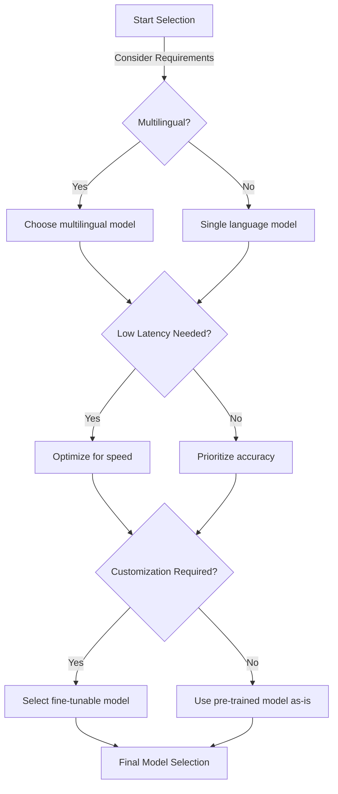

*Figure 3.1.1: Model Selection Flowchart. This diagram illustrates the decision-making process for selecting an appropriate foundation model based on key criteria such as multilingual support, latency requirements, and customization needs.*

In this scenario, the company might prioritize a multilingual model with low latency and customization options to handle diverse customer inquiries efficiently across different markets. They could leverage Amazon Bedrock to access a variety of foundation models and choose one that best fits these criteria, such as the Anthropic Claude model[^602] for its strong multilingual capabilities and customization options.

### Understanding the effect of inference parameters on model responses

Once you've selected a suitable foundation model, optimizing inference parameters becomes crucial for fine-tuning the model's responses to meet specific application needs. Two key parameters that significantly influence model output are temperature and input/output length.

1. **Temperature**: This parameter controls the randomness or creativity of the model's output. 
   - Lower temperature (e.g., 0.2) results in more deterministic, focused responses.
   - Higher temperature (e.g., 0.8) leads to more diverse and creative outputs.

2. **Input/Output Length**: These parameters define the maximum token count for input prompts and generated responses.
   - Longer inputs provide more context but may increase processing time and costs.
   - Longer outputs allow for more detailed responses but can also introduce irrelevant information.

#### **Model Inference Parameters**
These are settings you adjust when calling an AI model in **Amazon Bedrock**:
*   **Temperature:** Controls randomness. Lower (0.1) is focused/deterministic; Higher (0.8+) is creative/diverse.
*   **Top P (Nucleus Sampling):** The model considers a percentage of most likely words (e.g., top 90%).
*   **Top K:** The model only considers the $K$ most likely next words.
*   **Max Tokens:** Limits the length of the response.


Let's examine how these parameters might affect a customer service chatbot:

*Table 3.1.1: Effect of Temperature on Model Responses*
| Feature | Low Temperature (0.2) | High Temperature (0.8) |
|---------|-----------------------|------------------------|
| **Response Style** | Concise, factual responses | Creative, varied responses |
| **Information** | Consistent, reliable information | Exploratory, diverse suggestions |
| **Best Use Cases** | Specific queries, factual information | Brainstorming, creative tasks |
| **Predictability** | High predictability | More randomness |
| **Use cases** | - Question answering <br> - Factual information retrieval <br> - Technical explanations <br> - Consistent outputs across multiple runs <br> - Precise instructions following  | - Creative writing <br>- Idea generation<br> - Multiple alternative solutions <br>- Conversational variety<br>- Exploration of possibilities |

In practice, businesses might adjust these parameters based on the specific use case. For instance, when handling technical support queries, a lower temperature setting could ensure more precise and consistent answers. Conversely, for product recommendations or creative content generation, a higher temperature might be preferred to generate diverse suggestions.

### Defining Retrieval Augmented Generation (RAG) and its business applications

**Retrieval Augmented Generation (RAG)** is an innovative approach that enhances foundation models by incorporating external knowledge bases. This technique allows models to access and utilize up-to-date, domain-specific information, significantly improving the accuracy and relevance of their outputs[^603].

Key components of RAG:
1. **Foundation Model**: The core language model (e.g., GPT-3, BERT)
2. **Knowledge Base**: External data source containing relevant information
3. **Retrieval System**: Mechanism to fetch pertinent information from the knowledge base
4. **Generation Process**: Combines retrieved information with the model's inherent knowledge

RAG offers several advantages for business applications:
- **Improved Accuracy**: By incorporating current and specific information
- **Reduced Hallucinations**: Minimizes the generation of false or irrelevant content
- **Customization**: Allows tailoring of responses to specific business domains
- **Up-to-date Information**: Enables access to the latest data without constant model retraining

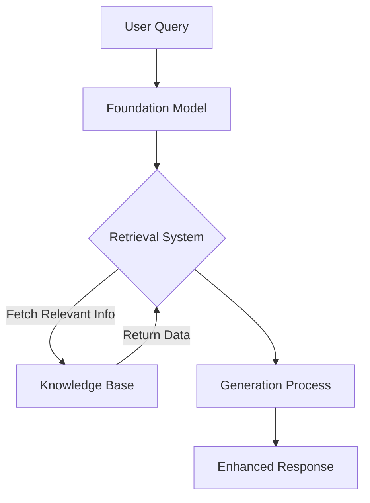

*Figure 3.1.3: Retrieval Augmented Generation Process. This diagram illustrates the flow of information in a RAG system, from the initial user query through the foundation model, retrieval system, and knowledge base, culminating in an enhanced response.*

Business applications of RAG using Amazon Bedrock[^604]:
1. **Customer Support**: Integrating company-specific product information and policies for accurate responses
2. **Financial Analysis**: Incorporating real-time market data for informed decision-making
3. **Healthcare**: Accessing up-to-date medical research for patient care recommendations
4. **Legal Services**: Retrieving current case law and regulations for legal advice
5. **E-commerce**: Enhancing product recommendations with real-time inventory and pricing data

By leveraging RAG through Amazon Bedrock, businesses can create more intelligent and context-aware AI applications that provide accurate, relevant, and up-to-date information to users.

### Identifying AWS services for storing embeddings within vector databases

**Embeddings** are crucial components in modern AI applications, representing complex data (like text or images) as dense vectors. These vectors capture semantic relationships, enabling efficient similarity searches and enhancing the performance of AI models. AWS offers several services that can be used to store and manage these embeddings within vector databases:

1. **Amazon OpenSearch Service**[^605]: 
   - Supports vector search capabilities
   - Ideal for large-scale, real-time search and analytics
   - Offers high performance for similarity searches

2. **Amazon Aurora**[^606]: 
   - PostgreSQL-compatible edition supports vector operations
   - Integrates well with existing relational database workflows
   - Suitable for applications requiring both traditional and vector-based queries

3. **Amazon Neptune**[^607]: 
   - Graph database with vector search capabilities
   - Excellent for relationship-based queries and recommendations
   - Supports complex data structures and relationships

4. **Amazon DocumentDB (with MongoDB compatibility)**[^608]: 
   - Document database supporting vector search
   - Ideal for semi-structured data and flexible schemas
   - Compatible with MongoDB drivers and tools

5. **Amazon RDS for PostgreSQL**[^609]: 
   - Managed relational database with vector extension support
   - Suitable for applications requiring ACID compliance
   - Integrates well with existing PostgreSQL-based systems

To illustrate how these services might be used in a real-world scenario, consider the following table comparing their characteristics:

*Table 3.1.2: Comparison of AWS Vector Database Services*

| Service | Vector Search Capability | Best For | Scalability | Integration |
|---------|--------------------------|----------|-------------|-------------|
| Amazon OpenSearch Service | Native support | Large-scale, real-time search | High | Elasticsearch API |
| Amazon Aurora | Via pgvector extension | Hybrid relational/vector workloads | High | SQL |
| Amazon Neptune | Built-in support | Graph-based recommendations | High | Gremlin, SPARQL |
| Amazon DocumentDB | Via Atlas Vector Search | Flexible, document-based data | Moderate | MongoDB API |
| Amazon RDS for PostgreSQL | Via pgvector extension | Traditional RDBMS with vector support | Moderate | SQL |

Choosing the right service depends on factors such as:
- Existing data infrastructure
- Required query patterns
- Scale of vector operations
- Integration needs with other AWS services

For instance, a recommendation system for an e-commerce platform might leverage Amazon Neptune to store product embeddings and customer relationship data, enabling complex recommendation queries that consider both item similarity and user behavior.

### Explaining cost tradeoffs of foundation model customization approaches

Customizing foundation models to suit specific business needs is a crucial aspect of AI application development. However, different customization approaches come with varying cost implications. Understanding these tradeoffs is essential for making informed decisions about model deployment and optimization.

Let's explore the main customization approaches and their associated cost considerations:

1. **Pre-training**:
   - Process: Training a model from scratch on domain-specific data
   - Costs: Highest initial investment in computational resources and time
   - Benefits: Fully customized model tailored to specific domain
   - Best for: Large organizations with substantial data and unique requirements

2. **Fine-tuning**:
   - Process: Adjusting pre-trained model weights on domain-specific data
   - Costs: Moderate computational resources, shorter training time than pre-training
   - Benefits: Improved performance on specific tasks while leveraging general knowledge
   - Best for: Organizations with moderate data and specific use cases

3. **In-context learning**:
   - Process: Providing examples or instructions within the input prompt
   - Costs: Minimal additional computational cost, no training required
   - Benefits: Quick adaptation to new tasks without model modification
   - Best for: Rapid prototyping or handling diverse, low-volume tasks

4. **Retrieval Augmented Generation (RAG)**:
   - Process: Enhancing model responses with external knowledge base
   - Costs: Additional storage and retrieval costs, minimal training required
   - Benefits: Improved accuracy and up-to-date information without full retraining
   - Best for: Applications requiring current, domain-specific knowledge

To visualize the cost-benefit tradeoffs of these approaches, consider the following diagram:

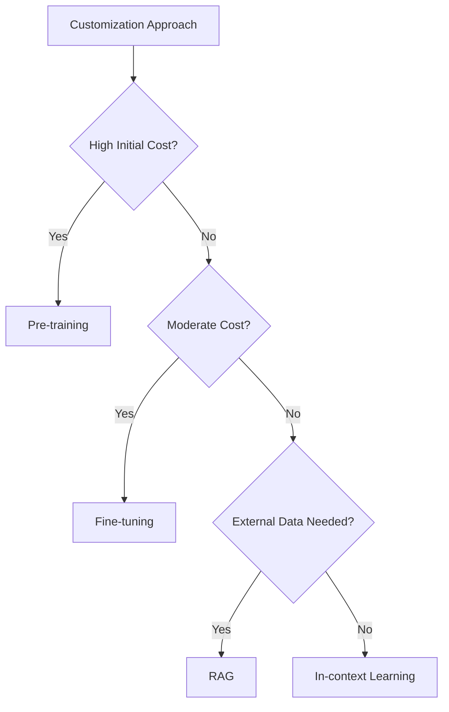

*Figure 3.1.4: Cost-Benefit Decision Tree for Model Customization. This diagram illustrates the decision-making process for choosing a model customization approach based on cost considerations and specific needs.*

When leveraging Amazon Bedrock for foundation model customization, businesses can optimize costs by:
- Starting with in-context learning for quick experiments
- Utilizing RAG for incorporating domain knowledge without full retraining
- Employing fine-tuning for specific use cases with moderate data volumes
- Considering pre-training only for large-scale, unique applications

By carefully evaluating these tradeoffs, organizations can balance performance requirements with budget constraints, ensuring efficient and effective AI implementations.

### Understanding the role of agents in multi-step tasks

**Agents** in AI applications, particularly those built on foundation models, play a crucial role in handling complex, multi-step tasks. These agents act as intelligent intermediaries, breaking down complex queries into manageable steps, orchestrating multiple AI services, and providing coherent responses to users. Amazon Bedrock offers Agents capabilities[^610] that significantly enhance the ability of foundation models to perform sophisticated, multi-step operations.

Key aspects of AI agents:
1. **Task Decomposition**: Breaking complex queries into smaller, manageable subtasks
2. **Service Orchestration**: Coordinating multiple AI and cloud services to complete tasks
3. **Context Management**: Maintaining context across multiple interactions or steps
4. **Decision Making**: Choosing appropriate actions based on intermediate results
5. **Response Synthesis**: Combining results from multiple steps into coherent outputs

Let's explore how agents might handle a complex business scenario:

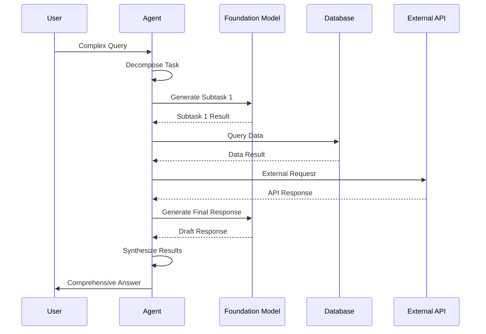

*Figure 3.1.5: Agent Workflow for Multi-step Tasks. This diagram illustrates how an AI agent orchestrates various components to handle a complex query, from task decomposition through interaction with multiple services to final response synthesis.*

Business applications of agents in Amazon Bedrock:
1. **Customer Service**: Handling complex inquiries that require accessing multiple databases, policies, and external services
2. **Financial Planning**: Orchestrating market analysis, risk assessment, and personalized recommendation generation
3. **Supply Chain Optimization**: Coordinating inventory checks, demand forecasting, and logistics planning
4. **Healthcare Diagnostics**: Managing patient data analysis, symptom checking, and treatment recommendation processes
5. **Travel Planning**: Orchestrating flight searches, hotel bookings, and itinerary optimization based on user preferences

By leveraging agents in Amazon Bedrock, businesses can create more sophisticated AI applications capable of handling complex, multi-step tasks that closely mimic human problem-solving processes. This approach not only enhances the capabilities of AI systems but also improves user experience by providing comprehensive, context-aware responses to complex queries.

In conclusion, designing applications that effectively utilize foundation models requires careful consideration of various factors, from model selection and parameter tuning to advanced techniques like RAG and the use of AI agents. By understanding these design considerations and leveraging the powerful capabilities of Amazon Bedrock and related AWS services, businesses can create AI applications that are not only powerful and efficient but also tailored to their specific needs and constraints. As the field of AI continues to evolve rapidly, staying informed about these design principles and best practices will be crucial for business professionals aiming to harness the full potential of AI in their organizations.

### Questions for self-check

1. **When selecting a pre-trained foundation model for an AI application, which of the following is NOT typically a key consideration?**

   A. Model size and complexity
   B. Multi-lingual support
   C. The model's training dataset size
   D. Input/output length limitations

2. **A company is developing an AI-powered customer service chatbot that needs to provide consistent, factual responses. Which temperature setting would be most appropriate for this use case?**

   A. 0.2
   B. 0.5
   C. 0.8
   D. 1.0

3. **Which AWS service is best suited for storing embeddings in a vector database when the application requires both traditional relational queries and vector-based similarity searches?**

   A. Amazon OpenSearch Service
   B. Amazon Aurora
   C. Amazon Neptune
   D. Amazon DocumentDB

4. **A startup is developing an AI application that needs to leverage up-to-date industry-specific information without constant model retraining. Which approach would be most suitable for this scenario?**

   A. Pre-training
   B. Fine-tuning
   C. In-context learning
   D. Retrieval Augmented Generation (RAG)

5. **In the context of AI agents handling multi-step tasks, which of the following is NOT a key aspect of their functionality?**

   A. Task decomposition
   B. Service orchestration
   C. Model pre-training
   D. Response synthesis

### Answers and Explanations

1. **Correct answer: C. The model's training dataset size**

   Explanation: While the size of the training dataset is important for the overall quality of a foundation model, it is not typically a key consideration when selecting a pre-trained model for an application. The subchapter mentions cost, modality, latency, multi-lingual support, model size and complexity, customization options, and input/output length as primary selection criteria. The training dataset size is generally not directly relevant to the application-specific needs and is more of an internal characteristic of the model's development[^611].

2. **Correct answer: A. 0.2**

   Explanation: For a customer service chatbot that needs to provide consistent, factual responses, a lower temperature setting is more appropriate. The subchapter explains that lower temperature values (e.g., 0.2) result in more deterministic, focused responses, which is ideal for scenarios requiring factual and consistent information. Higher temperatures (like 0.8) lead to more diverse and creative outputs, which is not desirable for this specific use case where accuracy and consistency are prioritized[^612].

3. **Correct answer: B. Amazon Aurora**

   Explanation: According to the subchapter, Amazon Aurora (PostgreSQL-compatible edition) supports vector operations and integrates well with existing relational database workflows. It is described as suitable for applications requiring both traditional and vector-based queries. This makes it the ideal choice for a scenario where both relational queries and vector-based similarity searches are needed, offering a balance between traditional database functionality and vector search capabilities[^613].

4. **Correct answer: D. Retrieval Augmented Generation (RAG)**

   Explanation: Retrieval Augmented Generation (RAG) is the most suitable approach for this scenario. The subchapter describes RAG as a technique that enhances foundation models by incorporating external knowledge bases, allowing access to up-to-date, domain-specific information without constant model retraining. This aligns perfectly with the startup's need to leverage current industry-specific information without frequent model updates, making it more efficient and cost-effective than alternatives like pre-training or fine-tuning[^614].

5. **Correct answer: C. Model pre-training**

   Explanation: Model pre-training is not listed as a key aspect of AI agents' functionality in handling multi-step tasks. The subchapter outlines the key aspects of AI agents as task decomposition, service orchestration, context management, decision making, and response synthesis. Model pre-training is a separate process that occurs before the deployment of the foundation model and is not part of the agent's role in managing complex, multi-step tasks[^615].

[^600]: Amazon Bedrock Overview. URL: <https://aws.amazon.com/bedrock/>
[^601]: Foundation Models for RAG - Amazon Bedrock Knowledge Bases. URL: <https://aws.amazon.com/bedrock/knowledge-bases/>
[^602]: Anthropic Claude on Amazon Bedrock. URL: <https://aws.amazon.com/bedrock/claude/>
[^603]: Retrieve data and generate AI responses with Amazon Bedrock Knowledge Bases. URL: <https://docs.aws.amazon.com/bedrock/latest/userguide/knowledge-base.html>
[^604]: Build Generative AI Applications with Foundation Models - Amazon Bedrock. URL: <https://aws.amazon.com/bedrock/>
[^605]: Amazon OpenSearch Service Vector Search. URL: <https://docs.aws.amazon.com/opensearch-service/latest/developerguide/vector-search.html>
[^606]: Amazon Aurora PostgreSQL Vector Support. URL: <https://docs.aws.amazon.com/AmazonRDS/latest/AuroraUserGuide/postgresql-vector.html>
[^607]: Amazon Neptune Vector Search. URL: <https://docs.aws.amazon.com/neptune/latest/userguide/vector-search.html>
[^608]: Amazon DocumentDB Vector Search. URL: <https://docs.aws.amazon.com/documentdb/latest/developerguide/vector-search.html>
[^609]: Amazon RDS for PostgreSQL Vector Support. URL: <https://docs.aws.amazon.com/AmazonRDS/latest/UserGuide/PostgreSQL_vector.html>
[^610]: Amazon Bedrock Agents Overview. URL: <https://docs.aws.amazon.com/bedrock/latest/userguide/agents.html>
[^611]: AWS Foundation Model Selection Guide. URL: <https://docs.aws.amazon.com/bedrock/latest/userguide/model-selection.html>
[^612]: AWS Foundation Model Inference Parameters. URL: <https://docs.aws.amazon.com/bedrock/latest/userguide/inference-parameters.html>
[^613]: Building AI-powered search in PostgreSQL using Amazon SageMaker and pgvector. URL: <https://aws.amazon.com/blogs/database/building-ai-powered-search-in-postgresql-using-amazon-sagemaker-and-pgvector/>
[^614]: Retrieve data and generate AI responses with Amazon Bedrock Knowledge Bases. URL: <https://docs.aws.amazon.com/bedrock/latest/userguide/knowledge-base.html>
[^615]: Amazon Bedrock Agents Functionality. URL: <https://docs.aws.amazon.com/bedrock/latest/userguide/agents-functionality.html>

---

## 3.2 Choose effective prompt engineering techniques

Prompt engineering is a critical skill for maximizing the value of foundation models in business. This specialized discipline focuses on crafting input queries that elicit optimal responses from AI models, particularly large language models (LLMs) available through Amazon Bedrock.[^701] As organizations adopt AI-driven solutions, the ability to design effective prompts directly impacts the quality of insights generated, content produced, and problems solved.

Business professionals who master prompt engineering gain significant advantages in extracting value from AI investments. Whether developing customer service chatbots, generating marketing content, or analyzing complex datasets, the quality of AI outputs largely depends on the prompts provided. Across industries—from finance and healthcare to retail and manufacturing—prompt engineering continues to drive innovation and competitive advantage.[^702]

This subchapter explores prompt engineering fundamentals, advanced techniques, implementation best practices, and potential limitations. Understanding these elements enables business professionals to harness foundation models effectively, enhance decision-making, and create more sophisticated AI-powered solutions.

### Concepts and constructs of prompt engineering

Prompt engineering is built upon several key concepts that form the foundation for effective AI model interaction. Understanding these elements is crucial for crafting prompts that yield accurate, relevant, and useful responses.

1. **Context**: Background information provided to the AI model that frames the task or question. Proper context helps the model understand the specific domain, situation, or perspective needed for generating an appropriate response. For example, when analyzing financial data, specifying the industry, time period, or company significantly improves relevance and accuracy.

2. **Instruction**: Explicit directives given to the model about what task to perform or how to process the input. Clear, precise instructions guide the model's behavior and output format. Examples include "Summarize the following text in three bullet points" or "Translate this sentence from English to French."

3. **Negative prompts**: Instructions that tell the model what to avoid or exclude in its response. This technique refines outputs and prevents unwanted content. For instance, "Generate a product description without mentioning price or competitors" focuses the model's output by explicitly stating exclusions.

4. **Model latent space**: The high-dimensional representation of knowledge within the AI model. While not directly manipulable, understanding this concept informs strategies for navigating the model's knowledge base more effectively to retrieve relevant information.[^703]

The following diagram illustrates how these concepts work together in a business context:

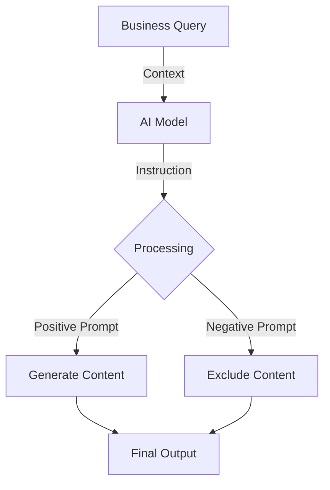

*Figure 3.2.1: Prompt Engineering Workflow. This diagram illustrates the process of prompt engineering, showing how context, instructions, and both positive and negative prompts interact with the AI model to produce the final output.*

In practice, a marketing team using Amazon Bedrock to generate product descriptions might craft prompts that include:[^704]

- Context: "You are an expert copywriter for a luxury watch brand."
- Instruction: "Write a 100-word product description for our new smartwatch."
- Positive prompt: "Highlight its elegant design and advanced health tracking features."
- Negative prompt: "Do not mention battery life or compare it to competitors."

By applying these prompt engineering constructs strategically, businesses can guide AI models to produce more targeted, relevant outputs that better serve their specific needs and improve decision-making processes.

### Techniques for prompt engineering

Prompt engineering encompasses various techniques that enable sophisticated interactions with AI models. These methods allow business professionals to extract more nuanced and contextually appropriate responses from foundation models:

1. **Chain-of-thought**: Breaking down complex problems into a series of intermediate steps, guiding the AI model through a logical reasoning process. This technique leads to more accurate and explainable results, particularly for tasks requiring multi-step reasoning.[^705]

2. **Zero-shot learning**: Asking the model to perform a task without providing any specific examples. This technique leverages the model's general knowledge to address novel situations, making it valuable for handling unexpected queries or exploring new problem domains.[^706]

3. **Single-shot learning**: Providing one example to illustrate the desired output format or approach. This technique calibrates the model's response style and improves consistency in outputs.

4. **Few-shot learning**: Offering multiple examples (typically 2-5) to guide the model's understanding of the task. This approach significantly enhances performance on specific tasks by demonstrating patterns and expectations through examples.[^707]

5. **Prompt templates**: Pre-designed structures for prompts that can be customized for specific use cases. Templates maintain consistency across different interactions and can be optimized over time for better performance.

The following diagram illustrates how these techniques are applied in a business context using Amazon Bedrock:

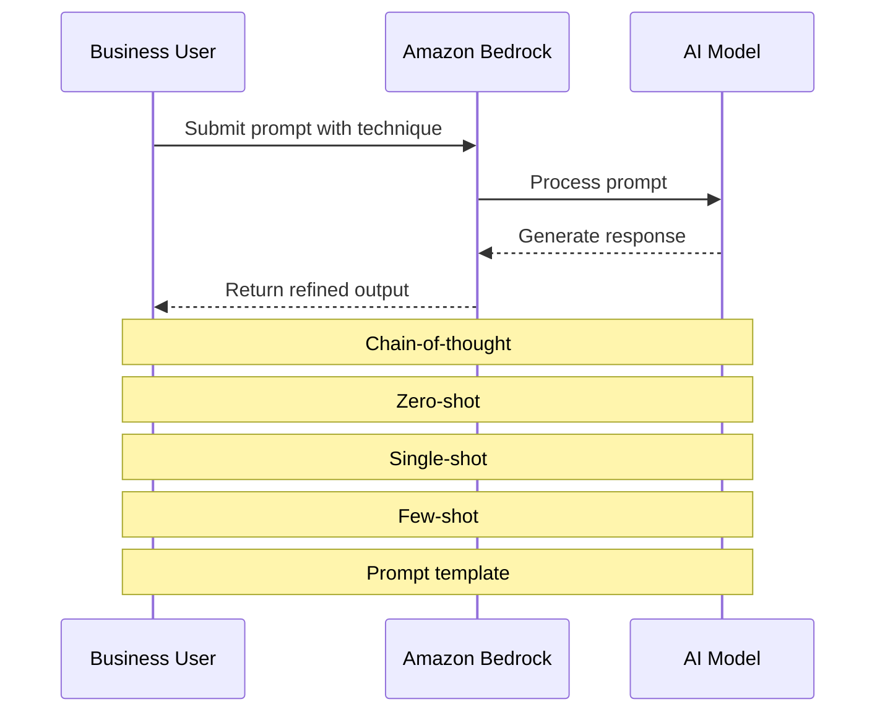

*Figure 3.2.2: Prompt Engineering Techniques in Action. This sequence diagram shows how different prompt engineering techniques are applied when interacting with an AI model through Amazon Bedrock.*

Practical applications of these techniques include:

1. **Chain-of-thought example**:
   Prompt: "Calculate the total revenue for Q1 2025. Step 1: List monthly revenues. Step 2: Sum the monthly figures. Step 3: Present the total."

2. **Zero-shot example**:
   Prompt: "Suggest three innovative features for a smart home device targeting elderly users."

3. **Single-shot example**:
   Prompt: "Summarize customer feedback in one sentence. Example: 'Product X received positive reviews for its durability but criticism for its high price.' Now summarize feedback for Product Y."

4. **Few-shot example**:
   Prompt: "Classify the sentiment of customer reviews:
   1. 'Great product!' - Positive
   2. 'Terrible experience.' - Negative
   3. 'It's okay.' - Neutral
   Now classify: 'I'm satisfied with my purchase.'"

5. **Prompt template example**:
   Template: "As a [ROLE], provide [NUMBER] [TYPE] for [CONTEXT]. Focus on [ASPECT] and avoid [EXCLUSION]."
   Filled template: "As a financial analyst, provide 3 insights for our Q1 2025 earnings report. Focus on revenue growth and avoid mentioning specific clients."

Mastering these techniques enables business professionals to extract valuable insights and generate high-quality outputs from AI models across various applications—from analyzing market trends to generating creative content and solving complex business problems.

### Benefits and best practices for prompt engineering

Effective prompt engineering delivers substantial benefits for businesses using AI technologies while following best practices ensures consistent, high-quality results.

**Benefits of Effective Prompt Engineering:**

1. **Response quality improvement**: Well-crafted prompts enhance the relevance, accuracy, and usefulness of AI-generated outputs, leading to more reliable insights and better decision-making.

2. **Increased efficiency**: Strategic prompting reduces the need for multiple iterations or human intervention, streamlining workflows and saving valuable time.

3. **Customization and flexibility**: Prompt engineering tailors AI responses to specific needs, industries, or brand voices without requiring extensive model retraining.

4. **Cost optimization**: Efficient prompts reduce computational resources and API calls, potentially lowering costs associated with AI usage.[^708]

5. **Enhanced user experience**: For customer-facing applications, better prompts create more natural and helpful AI interactions, improving overall user satisfaction.

**Best Practices for Prompt Engineering:**

1. **Experimentation**: Test different prompt structures and techniques to identify what works best for specific tasks. A/B testing can be particularly effective in optimizing prompts for consistent results.

2. **Guardrails implementation**: Incorporate safeguards in prompts to ensure AI outputs align with business policies, ethical guidelines, and legal requirements. This includes specifying tone, content restrictions, and required disclaimers.[^709]

3. **Discovery-oriented prompting**: Use open-ended prompts to explore new possibilities or generate creative ideas during brainstorming sessions or product development.

4. **Specificity and concision**: Craft clear, specific prompts that provide necessary context without overwhelming the model. Avoid ambiguity and unnecessary verbosity.

5. **Using multiple prompts**: For complex tasks, break down the problem into multiple prompts, each addressing a specific aspect. This approach leads to more comprehensive and accurate results.

6. **Continuous refinement**: Regularly review and update prompts based on performance metrics, user feedback, and evolving business needs to ensure ongoing improvement.

The following diagram illustrates the prompt refinement process:

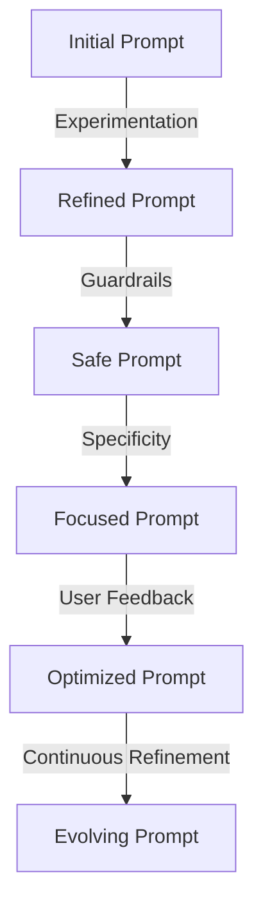

*Figure 3.2.3: Prompt Refinement Process. This diagram illustrates the iterative process of refining prompts based on best practices and feedback, leading to continuously improving AI interactions.*

A practical application using Amazon Bedrock might look like this:

**Scenario**: A retail company wants to generate product descriptions for a new line of eco-friendly home goods.

**Initial Prompt**: "Write a product description for an eco-friendly water bottle."

**Refined Prompt** (after applying best practices):

```
Context: You are a copywriter for EcoHome, a brand known for sustainable home products.

Task: Generate a product description for our new stainless steel water bottle.

Specifications:
- 20 oz capacity
- Double-wall insulation
- Made from 100% recycled materials
- Available in 3 colors: Ocean Blue, Forest Green, and Sunset Orange

Style Guidelines:
- Emphasize sustainability and durability
- Use a friendly, conversational tone
- Include at least one emotional appeal to eco-conscious consumers
- Keep the description between 75-100 words

Constraints:
- Do not mention specific prices
- Avoid comparisons to other brands
- Ensure all claims are factually accurate and avoid greenwashing

Output Format:
Provide the product description followed by 3 suggested social media hashtags for promotion.
```

This refined prompt incorporates specificity, guardrails, and clear instructions to generate a more targeted and effective product description. By consistently applying these best practices and refining prompts based on performance and feedback, businesses can significantly enhance their AI-driven processes.

### Potential risks and limitations of prompt engineering

While prompt engineering offers significant benefits, businesses must understand its inherent risks and limitations to implement effective safeguards. Key concerns include:

1. **Exposure**: Inadvertent disclosure of sensitive information when prompts contain confidential data or when AI responses reveal proprietary information.[^710]

2. **Poisoning**: Adversarial attacks where malicious inputs manipulate the model's behavior, resulting in biased or harmful outputs that could damage reputation or decision-making processes.[^711]

3. **Hijacking**: Occurs when inputs override the intended behavior of the AI system, leading to unexpected or malicious responses that compromise application integrity.[^712]

4. **Jailbreaking**: Attempts to bypass ethical guidelines or content restrictions by crafting prompts specifically designed to circumvent model safeguards.

5. **Over-reliance**: Excessive dependence on AI-generated outputs without human oversight, allowing errors to propagate through business processes.

6. **Bias amplification**: Poorly designed prompts can reinforce or amplify biases present in training data, leading to unfair or discriminatory outputs.[^713]

7. **Inconsistency**: Different prompts for similar tasks yielding variable results, potentially causing confusion or errors in business operations.

8. **Privacy concerns**: Prompts containing personal or sensitive information may create privacy issues, especially when using third-party AI services.[^714]

The following diagram illustrates these risks and their potential business impacts:

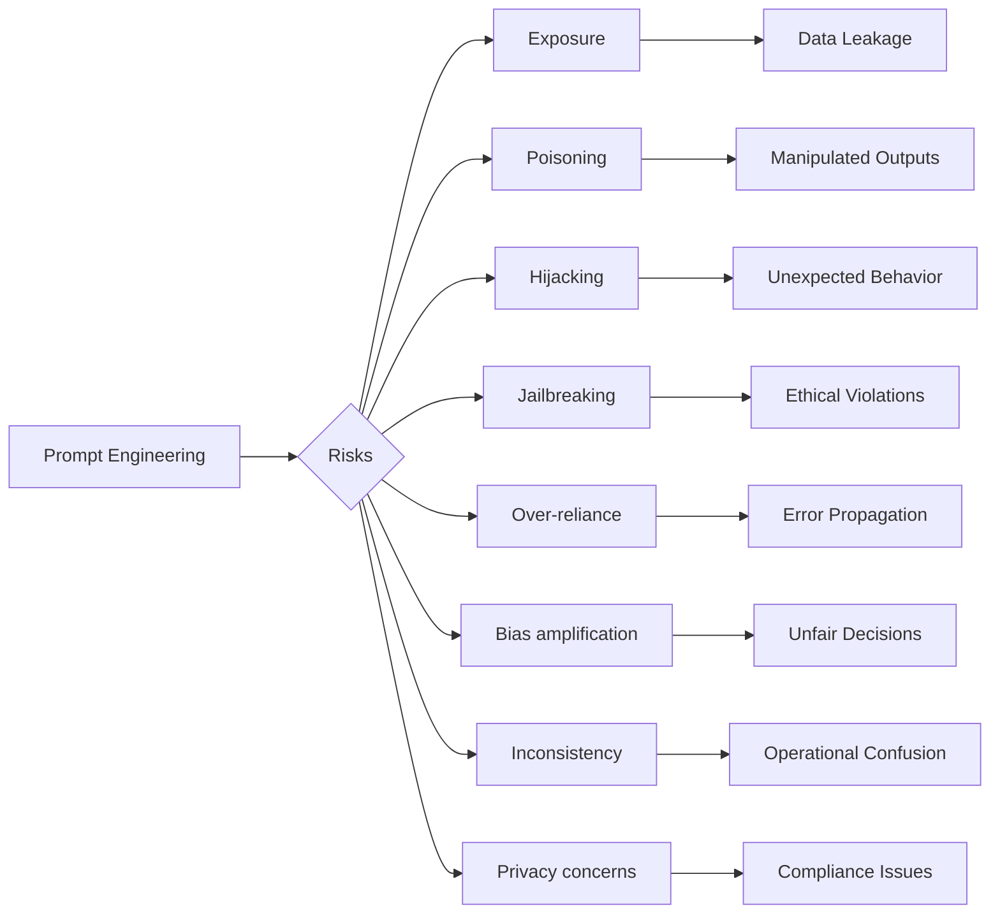

*Figure 3.2.4: Risks and Impacts of Prompt Engineering. This flowchart illustrates the various risks associated with prompt engineering and their potential impacts on business operations.*

To mitigate these risks, businesses should implement robust safeguards:

1. **Data sanitization**: Remove sensitive information from prompts before sending them to AI models.

2. **Input validation**: Develop strong validation mechanisms to detect and prevent potentially malicious prompts.

3. **Output filtering**: Implement post-processing filters to screen AI-generated outputs for inappropriate or sensitive content.

4. **Human-in-the-loop**: Maintain human oversight in critical decision-making processes, using AI as a supportive tool rather than a replacement for human judgment.[^715]

5. **Regular auditing**: Conduct periodic audits of AI interactions to identify potential biases, inconsistencies, or security vulnerabilities.

6. **Ethical guidelines**: Establish clear ethical guidelines for AI usage and ensure all employees receive proper training.

7. **Privacy-preserving techniques**: Utilize technologies such as federated learning or differential privacy when handling sensitive data.[^716]

8. **Continuous monitoring**: Implement real-time monitoring systems to detect unusual patterns or potential attacks.

By acknowledging these limitations and implementing appropriate safeguards, businesses can harness prompt engineering's power while minimizing associated risks. As AI technologies evolve, staying informed about potential vulnerabilities and adapting security measures accordingly remains crucial for maintaining the integrity of AI-driven business processes.

In conclusion, prompt engineering is a powerful capability that significantly enhances AI applications in business contexts. By understanding its concepts, mastering various techniques, implementing best practices, and addressing potential risks, organizations can leverage foundation models to drive innovation, improve decision-making, and gain competitive advantages. The ability to craft effective prompts is becoming an essential skill for business professionals across industries, enabling them to unlock the full potential of AI in solving complex business challenges.

### Questions for self-check

1. **Which prompt engineering technique involves breaking down complex problems into a series of intermediate steps to guide the AI model through a logical reasoning process?**

   A. Zero-shot learning
   B. Chain-of-thought
   C. Few-shot learning
   D. Prompt templates

2. **A marketing team wants to generate product descriptions for a new line of eco-friendly products without providing specific examples. Which prompt engineering technique is most appropriate?**

   A. Single-shot learning
   B. Few-shot learning
   C. Zero-shot learning
   D. Chain-of-thought

3. **Which of the following is NOT a benefit of effective prompt engineering in business contexts?**

   A. Improved response quality
   B. Increased efficiency
   C. Elimination of all biases in AI outputs
   D. Cost optimization

4. **A financial analyst is concerned about potential data leakage when using AI models for market analysis. Which prompt engineering risk does this scenario primarily relate to?**

   A. Jailbreaking
   B. Exposure
   C. Poisoning
   D. Hijacking

5. **Which best practice for prompt engineering involves regularly testing different prompt structures and techniques to identify what works best for specific tasks or domains?**

   A. Guardrails implementation
   B. Specificity and concision
   C. Experimentation
   D. Continuous refinement

### Answers and Explanations

1. **Correct answer: B. Chain-of-thought**

   Explanation: Chain-of-thought is a prompt engineering technique that involves breaking down complex problems into a series of intermediate steps, guiding the AI model through a logical reasoning process. This technique is particularly useful for tasks that require multi-step reasoning and can lead to more accurate and explainable results. Zero-shot learning, few-shot learning, and prompt templates are other prompt engineering techniques but do not specifically involve breaking down problems into intermediate steps.[^717]

2. **Correct answer: C. Zero-shot learning**

   Explanation: Zero-shot prompts ask the model to perform a task or answer a question without any specific examples or prior training on that exact task. This technique leverages the model's general knowledge to address novel situations, making it particularly useful for handling unexpected queries or exploring new problem domains. In this scenario, the marketing team wants to generate product descriptions without providing specific examples, which aligns perfectly with the zero-shot learning approach.[^718]

3. **Correct answer: C. Elimination of all biases in AI outputs**

   Explanation: While effective prompt engineering offers numerous benefits, including improved response quality, increased efficiency, and cost optimization, it cannot completely eliminate all biases in AI outputs. Biases can be inherent in the training data or the model itself, and while prompt engineering can help mitigate some biases, it cannot guarantee their complete elimination. The other options (A, B, and D) are all genuine benefits of effective prompt engineering as mentioned in the subchapter.[^719]

4. **Correct answer: B. Exposure**

   Explanation: The scenario describes a concern about potential data leakage when using AI models for market analysis, which directly relates to the risk of exposure in prompt engineering. Exposure occurs when prompts inadvertently contain or reveal sensitive information. In financial analysis, there's a high risk of exposing confidential market data or proprietary information if prompts are not carefully managed. This is distinct from jailbreaking (bypassing ethical guidelines), poisoning (malicious inputs manipulating model behavior), or hijacking (overriding intended behavior).[^720]

5. **Correct answer: C. Experimentation**

   Explanation: Experimentation is the best practice that involves regularly testing different prompt structures and techniques to identify what works best for specific tasks or domains. The subchapter explicitly mentions that "Regularly test different prompt structures and techniques to identify what works best for specific tasks or domains. A/B testing can be particularly effective in optimizing prompts." This approach allows businesses to continuously improve their prompt engineering strategies and adapt to changing needs or contexts.[^721]

[^700]: AWS AI Services Overview. URL: <https://aws.amazon.com/machine-learning/ai-services/>

[^701]: Amazon Bedrock Overview. URL: <https://aws.amazon.com/bedrock/>

[^702]: Gartner Forecasts Worldwide Artificial Intelligence Software Market to Reach $62 Billion in 2022. URL: <https://www.gartner.com/en/newsroom/press-releases/2021-11-22-gartner-forecasts-worldwide-artificial-intelligence-software-market-to-reach-62-billion-in-2022>

[^703]: Understanding Latent Space in Machine Learning. URL: <https://towardsdatascience.com/understanding-latent-space-in-machine-learning-de5a7c687d8d>

[^704]: Amazon Bedrock Prompt Engineering Guide. URL: <https://docs.aws.amazon.com/bedrock/latest/userguide/prompt-engineering.html>

[^705]: Chain-of-Thought Prompting Elicits Reasoning in Large Language Models. URL: <https://arxiv.org/abs/2201.11903>

[^706]: Zero-Shot Learning - A Comprehensive Evaluation of the Good, the Bad and the Ugly. URL: <https://arxiv.org/abs/1707.00600>

[^707]: Few-Shot Learning: A Survey. URL: <https://arxiv.org/abs/1904.05046>

[^708]: AWS Cost Optimization for Machine Learning. URL: <https://aws.amazon.com/blogs/machine-learning/cost-optimization-for-machine-learning-in-the-cloud/>

[^709]: AWS AI Service Cards. URL: <https://aws.amazon.com/machine-learning/ai-services/ai-service-cards/>

[^710]: AWS Security Best Practices for Machine Learning. URL: <https://docs.aws.amazon.com/whitepapers/latest/security-best-practices-for-machine-learning/security-best-practices-for-machine-learning.html>

[^711]: Prompt Injection Attacks Against GPT-3. URL: <https://arxiv.org/abs/2206.11349>

[^712]: Defending Against Prompt Injection Attacks. URL: <https://docs.anthropic.com/en/docs/test-and-evaluate/strengthen-guardrails/mitigate-jailbreaks>

[^713]: Bias in AI: Sources and Mitigation Strategies. URL: <https://aws.amazon.com/blogs/publicsector/framework-mitigate-bias-improve-outcomes-new-age-ai/>

[^714]: AWS Privacy Considerations for Machine Learning. URL: <https://www.ibm.com/think/insights/ai-privacy>

[^715]: Human-in-the-Loop Machine Learning. URL: <https://aws.amazon.com/blogs/machine-learning/automated-exploratory-data-analysis-and-model-operationalization-framework-with-a-human-in-the-loop/>

[^716]: AWS Privacy-Preserving Machine Learning. URL: <https://aws.amazon.com/blogs/machine-learning/large-language-model-inference-over-confidential-data-using-aws-nitro-enclaves/>

[^717]: Chain-of-Thought Prompting Elicits Reasoning in Large Language Models. URL: <https://arxiv.org/abs/2201.11903>

[^718]: Zero-Shot Learning - A Comprehensive Evaluation of the Good, the Bad and the Ugly. URL: <https://arxiv.org/abs/1707.00600>

[^719]: Mitigating Bias in Artificial Intelligence (AI) Models. URL: <https://aws.amazon.com/blogs/publicsector/framework-mitigate-bias-improve-outcomes-new-age-ai/>

[^720]: AWS Security Best Practices for Machine Learning. URL: <https://docs.aws.amazon.com/whitepapers/latest/security-best-practices-for-machine-learning/security-best-practices-for-machine-learning.html>

[^721]: Amazon SageMaker Experiments - Organize, Track, and Compare Your Machine Learning Trainings. URL: <https://aws.amazon.com/blogs/aws/amazon-sagemaker-experiments-organize-track-and-compare-your-machine-learning-trainings/>

---


## 3.3 The Training and Fine-Tuning Process for Foundation Models

Foundation models represent a powerful class of AI systems that can transform organizational capabilities when properly implemented. The process of training and fine-tuning these models requires specific knowledge and techniques that significantly impact their effectiveness in business applications. Mastering these processes allows organizations to customize models for their unique needs while maximizing return on AI investments. This subchapter examines the essential components of training foundation models, explores various fine-tuning methodologies, and outlines best practices for data preparation—knowledge critical for success in both the AWS Certified AI Practitioner exam and real-world AI implementations.

### Key Elements of Training a Foundation Model

Training foundation models requires substantial computational resources and specialized expertise. Understanding this process helps business professionals make informed decisions about AI implementation strategy and resource allocation.

#### Pre-training

Pre-training is the initial phase where the foundation model acquires general knowledge and language understanding from vast amounts of unlabeled data. This creates a versatile base model capable of performing a wide range of tasks.[^801]

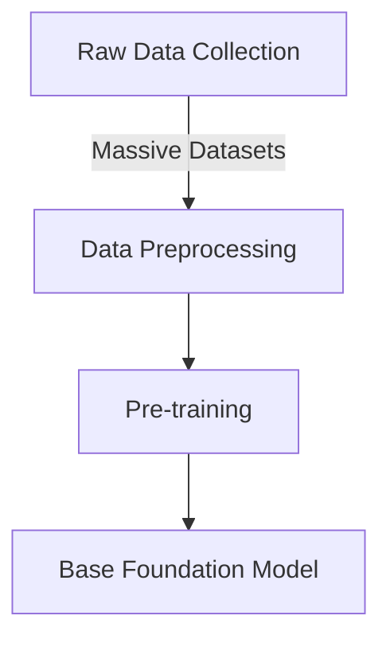

*Figure 3.3.1: Pre-training Process for Foundation Models*

This diagram illustrates the pre-training process, starting with raw data collection and ending with a base foundation model. The process involves gathering massive datasets, preprocessing the data, and then conducting the pre-training to create a versatile base model.

Pre-training typically involves:

- **Self-supervised learning** on diverse datasets
- Masking or predicting parts of the input data
- Learning *contextual representations* of data

For business applications, pre-trained models like those available through **Amazon Bedrock** offer a powerful starting point, saving significant time and computational resources.[^802]

#### Fine-tuning

Fine-tuning adapts the pre-trained model to specific tasks or domains, enhancing its performance for particular business applications.[^803]

- Task-specific data is used to adjust model parameters
- The process is more efficient than training from scratch
- It allows for customization without losing general knowledge

#### Continuous Pre-training

Continuous pre-training keeps the model updated with new information and evolving language patterns.[^804]

- Regular updates with fresh data
- Maintains model relevance in dynamic environments
- Crucial for industries with rapidly changing terminology or knowledge

For businesses, understanding these elements is crucial for:

- Selecting appropriate pre-trained models
- Deciding on fine-tuning strategies
- Planning for ongoing model maintenance and improvement

By leveraging services like **Amazon SageMaker**, organizations can streamline these processes, making advanced AI capabilities more accessible and manageable.[^805]

### Methods for Fine-Tuning a Foundation Model

Fine-tuning transforms generic foundation models into specialized tools that address specific business needs. This crucial step enables organizations to leverage pre-trained capabilities while customizing for their unique requirements. Here are the key fine-tuning approaches:

#### Instruction Tuning

Instruction tuning fine-tunes a model on datasets containing instructions and their corresponding outputs. This method significantly improves a model's ability to follow specific directives.[^806]

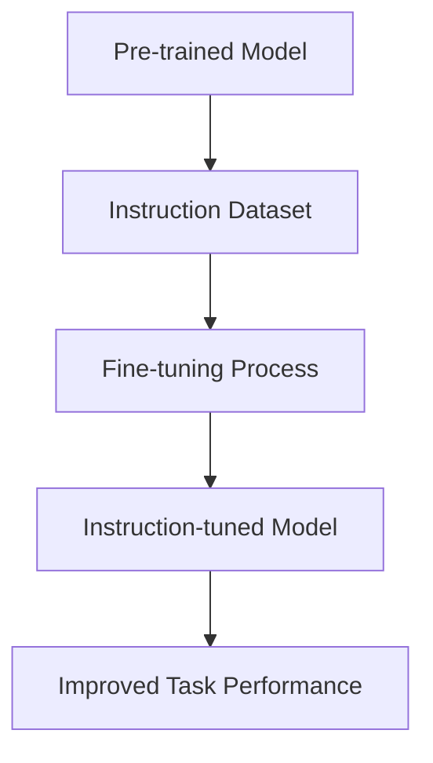

*Figure 3.3.2: Instruction Tuning Process*

This diagram shows the instruction tuning process, starting with a pre-trained model and using an instruction dataset to create an instruction-tuned model that performs better on specific tasks.

Benefits for businesses:
- Enhances model's ability to understand and execute specific instructions
- Improves performance on task-oriented applications
- Useful for customer service chatbots or automated task completion systems

#### Adapting Models for Specific Domains

**Domain adaptation** involves fine-tuning a model on data from a specific field or industry, allowing it to understand and generate domain-specific content more accurately.[^807]

Key considerations:
- Requires curated datasets representative of the target domain
- Can significantly improve performance in specialized areas
- Particularly valuable for industries with unique terminology or concepts

Example: A financial services company might adapt a foundation model to understand complex financial instruments and regulations, improving its performance in tasks like risk assessment or regulatory compliance.

#### Transfer Learning

**Transfer learning** leverages knowledge gained from one task to improve performance on a related task. This method is particularly useful when labeled data for the target task is limited.[^808]

Steps in transfer learning:
1. Start with a pre-trained model
2. Replace the final layer(s) with new ones suited to the target task
3. Fine-tune the model on the new task's dataset

Business applications:
- Rapid development of models for new, related tasks
- Efficient use of limited domain-specific data
- Accelerated time-to-market for AI-powered products or services

#### Continuous Pre-training

Continuous pre-training involves ongoing updates to the model using new data, ensuring it remains current and relevant.[^809]

Benefits:
- Keeps the model updated with evolving language and knowledge
- Adapts to changing business environments and market trends
- Maintains model performance over time

Implementation strategies:
- Regular updates with fresh, relevant data
- Monitoring model performance to identify when updates are needed
- Balancing new learning with retention of existing knowledge

For businesses leveraging AWS services, **Amazon SageMaker** provides robust tools for implementing these fine-tuning methods. It offers scalable infrastructure for training and deployment, along with features like **SageMaker Experiments** for tracking and comparing different fine-tuning approaches.[^810]

Table 3.3.1: Comparison of Fine-Tuning Methods

| Method | Primary Use Case | Data Requirements | Typical Business Application |
|--------|------------------|--------------------|-----------------------------|
| Instruction Tuning | Task-specific improvements | Task-instruction pairs | Customer service automation |
| Domain Adaptation | Industry-specific applications | Large domain-specific datasets | Specialized content generation |
| Transfer Learning | New tasks with limited data | Small task-specific dataset | Rapid prototyping of new AI features |
| Continuous Pre-training | Maintaining model relevance | Ongoing stream of new data | Real-time market analysis |

By understanding and effectively utilizing these fine-tuning methods, businesses can significantly enhance the performance and applicability of foundation models to their specific needs, driving innovation and competitive advantage in their respective industries.

### Preparing Data to Fine-Tune a Foundation Model

Data quality and preparation directly determine the success of foundation model fine-tuning. Properly prepared datasets ensure models learn effectively and produce reliable outputs that meet your organization's specific requirements.

#### Data Curation

**Data curation** involves selecting, organizing, and maintaining datasets used for fine-tuning. This process is critical for ensuring the quality and relevance of the data.[^811]

Key aspects of data curation:
- *Relevance*: Ensure data aligns with the target domain or task
- *Quality*: Remove errors, duplicates, and irrelevant information
- *Diversity*: Include a wide range of examples to improve model generalization
- *Recency*: Incorporate up-to-date information for current relevance

Business impact:
- Improves model accuracy and reliability
- Reduces bias in model outputs
- Enhances the model's ability to handle real-world scenarios

#### Data Governance

Implementing robust **data governance** practices is essential for maintaining data integrity, security, and compliance throughout the fine-tuning process.

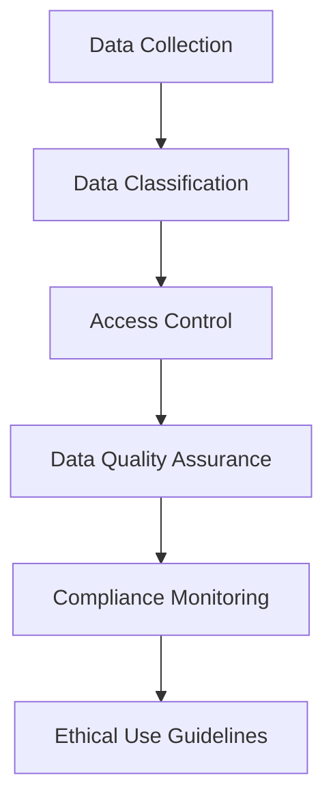

*Figure 3.3.3: Data Governance Framework for AI Model Fine-Tuning*

This diagram outlines a comprehensive data governance framework for AI model fine-tuning, highlighting the key steps from data collection to ensuring ethical use guidelines.

Key components of data governance:
- Data privacy: Ensure compliance with regulations like GDPR or CCPA
- Security: Implement measures to protect sensitive information
- Versioning: Maintain clear records of dataset versions used in fine-tuning
- Auditability: Enable tracing of data lineage and usage

AWS services like **Amazon Macie** and **AWS Glue** can assist in implementing robust data governance practices, helping businesses maintain compliance and data integrity throughout the AI development process.[^812]

#### Dataset Size and Composition

The size and composition of the fine-tuning dataset significantly impact the model's performance and generalization capabilities.[^813]

Considerations for dataset size:
- Larger datasets generally lead to better performance, but with diminishing returns
- Balance between dataset size and computational resources required
- Quality often trumps quantity &mdash; a smaller, high-quality dataset can outperform a larger, noisy one

Composition factors:
- *Class balance*: Ensure equal representation of different categories or outcomes
- *Task coverage*: Include examples that cover the full range of expected tasks
- *Edge cases*: Incorporate unusual or challenging examples to improve robustness

#### Data Labeling

For supervised fine-tuning tasks, accurate **data labeling** is crucial. This process involves annotating data with the correct outputs or categories.[^814]

Labeling strategies:
- Manual labeling by domain experts
- Crowdsourcing for large-scale labeling tasks
- Semi-automated labeling using existing models or rules

AWS offers services like **Amazon SageMaker Ground Truth** to streamline and scale data labeling processes, making it easier for businesses to prepare high-quality datasets for fine-tuning.[^815]

#### Data Representativeness

Ensuring that your fine-tuning dataset accurately represents the real-world scenarios your model will encounter is critical for its practical performance.[^816]

Key aspects:
- *Demographic diversity*: Include data from various user groups or market segments
- *Temporal coverage*: Ensure data spans relevant time periods
- *Scenario completeness*: Cover all potential use cases or situations

Business impact:
- Improves model fairness and reduces bias
- Enhances model performance across diverse real-world scenarios
- Increases user trust and adoption of AI-powered solutions

#### Reinforcement Learning from Human Feedback (RLHF)

**RLHF** is an advanced technique that incorporates human preferences into the fine-tuning process, allowing for more nuanced and context-aware model improvements.[^817]

Process overview:
1. Generate model outputs for various prompts
2. Collect human feedback on the quality of these outputs
3. Train a reward model based on this feedback
4. Fine-tune the foundation model using the reward model

Benefits:
- Aligns model behavior with human preferences
- Improves output quality and relevance
- Addresses subtle aspects of language and context that are difficult to capture with traditional fine-tuning

Implementing RLHF requires careful consideration of feedback collection methods and potential biases. AWS services like Amazon SageMaker can facilitate the implementation of RLHF pipelines, allowing businesses to leverage this advanced technique effectively.[^818]

By mastering these data preparation techniques, businesses can significantly enhance the effectiveness of their fine-tuning processes, resulting in foundation models that are better aligned with their specific needs and use cases. This not only improves the performance of AI applications but also ensures that the deployed models are robust, reliable, and tailored to the unique requirements of the organization.

### Questions for self-check

1. **A business analyst is tasked with fine-tuning a foundation model for a financial services company. Which of the following methods would be most appropriate for adapting the model to understand complex financial instruments and regulations?**

   A. Instruction tuning
   B. Domain adaptation
   C. Transfer learning
   D. Continuous pre-training

2. **An AI practitioner is preparing data for fine-tuning a foundation model. Which of the following is NOT a key aspect of data curation?**

   A. Ensuring data relevance to the target domain
   B. Maximizing dataset size regardless of quality
   C. Removing errors and duplicates
   D. Including diverse examples for improved generalization

3. **A retail company wants to keep its AI model updated with the latest fashion trends and customer preferences. Which fine-tuning method should they primarily focus on?**

   A. Instruction tuning
   B. Transfer learning
   C. Continuous pre-training
   D. RLHF (Reinforcement Learning from Human Feedback)

4. **Which AWS service is most suitable for implementing robust data governance practices during the fine-tuning process of foundation models?**

   A. Amazon SageMaker
   B. Amazon Bedrock
   C. Amazon Macie
   D. AWS Lambda

5. **A startup is developing an AI-powered customer service chatbot. They want to improve the model's ability to understand and execute specific instructions. Which fine-tuning method should they prioritize?**

   A. Domain adaptation
   B. Instruction tuning
   C. Transfer learning
   D. Continuous pre-training

### Answers and Explanations

1. **Correct answer: B. Domain adaptation**

   Explanation: Domain adaptation is the most appropriate method for adapting a foundation model to understand complex financial instruments and regulations. This method involves fine-tuning the model on data from a specific field or industry, allowing it to understand and generate domain-specific content more accurately. For a financial services company, this would involve using curated datasets representative of the financial domain, significantly improving the model's performance in specialized areas like understanding complex financial instruments and regulations.[^819]

2. **Correct answer: B. Maximizing dataset size regardless of quality**

   Explanation: In data curation for fine-tuning foundation models, quality often trumps quantity. While larger datasets generally lead to better performance, this is true only up to a point and with diminishing returns. The other options (A, C, and D) are all key aspects of proper data curation. Maximizing dataset size without regard for quality can introduce noise and irrelevant information, potentially degrading the model's performance. It's more important to have a balanced, high-quality dataset that accurately represents the target domain and tasks.[^820]

3. **Correct answer: C. Continuous pre-training**

   Explanation: For a retail company wanting to keep its AI model updated with the latest fashion trends and customer preferences, continuous pre-training is the most appropriate method. This involves ongoing updates to the model using new data, ensuring it remains current and relevant. Continuous pre-training is crucial for industries with rapidly changing terminology or knowledge, such as fashion retail. It allows the model to adapt to changing business environments and market trends, maintaining its performance over time in a dynamic field like fashion.[^821]

4. **Correct answer: C. Amazon Macie**

   Explanation: Among the options provided, Amazon Macie is the most suitable AWS service for implementing robust data governance practices during the fine-tuning process of foundation models. Amazon Macie is a data security and privacy service that uses machine learning and pattern matching to discover and protect sensitive data in AWS. It can help in maintaining data integrity, security, and compliance throughout the fine-tuning process by automatically discovering, classifying, and protecting sensitive data. While Amazon SageMaker is crucial for model development and training, it doesn't specifically focus on data governance like Macie does.[^822]

5. **Correct answer: B. Instruction tuning**

   Explanation: For an AI-powered customer service chatbot where the goal is to improve the model's ability to understand and execute specific instructions, instruction tuning is the most appropriate fine-tuning method. Instruction tuning involves fine-tuning a model on a dataset of instructions and corresponding outputs. This method is particularly effective for improving a model's ability to follow specific directives, which is crucial for a customer service chatbot that needs to understand and respond to various customer inquiries and instructions accurately.[^823]

[^800]: AWS Machine Learning Blog: "The evolution of foundation models and their impact on AI applications" URL: <https://aws.amazon.com/blogs/machine-learning/the-evolution-of-foundation-models-and-their-impact-on-ai-applications/>

[^801]: AWS Documentation: "Introduction to Foundation Models" URL: <https://docs.aws.amazon.com/sagemaker/latest/dg/jumpstart-foundation-models.html>

[^802]: Amazon Bedrock Overview URL: <https://aws.amazon.com/bedrock/>

[^803]: AWS Machine Learning Blog: "Fine-tuning foundation models with Amazon SageMaker" URL: <https://aws.amazon.com/blogs/machine-learning/fine-tuning-foundation-models-with-amazon-sagemaker/>

[^804]: AWS Whitepaper: "Continuous Learning in AI/ML Systems" URL: <https://d1.awsstatic.com/whitepapers/continuous-learning-in-aiml-systems.pdf>

[^805]: Amazon SageMaker Overview URL: <https://aws.amazon.com/sagemaker/>

[^806]: AWS Machine Learning Blog: "Instruction tuning for better model performance" URL: <https://aws.amazon.com/blogs/machine-learning/instruction-tuning-for-better-model-performance/>

[^807]: AWS Documentation: "Domain Adaptation in Machine Learning" URL: <https://docs.aws.amazon.com/prescriptive-guidance/latest/ml-model-adaptation/domain-adaptation.html>

[^808]: AWS Machine Learning Blog: "Transfer learning for TensorFlow image classification models in Amazon SageMaker" URL: <https://aws.amazon.com/blogs/machine-learning/transfer-learning-for-tensorflow-image-classification-models-in-amazon-sagemaker/>

[^809]: AWS Cloud Adoption Framework for Artificial Intelligence, Machine Learning URL: <https://docs.aws.amazon.com/whitepapers/latest/aws-caf-for-ai/aws-caf-for-ai.html>

[^810]: Amazon SageMaker Experiments Overview URL: <https://docs.aws.amazon.com/sagemaker/latest/dg/experiments.html>

[^811]: AWS What is Data Labeling? - Data Labeling Explained URL: <https://aws.amazon.com/what-is/data-labeling/>

[^812]: Amazon Macie Overview URL: <https://aws.amazon.com/macie/>

[^813]: AWS Documentation: "Preparing Data for Machine Learning" URL: <https://docs.aws.amazon.com/machine-learning/latest/dg/preparing-data.html>

[^814]: Training data labeling using humans with Amazon SageMaker Ground Truth URL: <https://docs.aws.amazon.com/sagemaker/latest/dg/sms.html>

[^815]: Amazon SageMaker Ground Truth Overview URL: <https://aws.amazon.com/sagemaker/groundtruth/>

[^816]: Policy advice and best practices on bias and fairness in AI URL: <https://link.springer.com/article/10.1007/s10676-024-09746-w>

[^817]: AWS What is RLHF? - Reinforcement Learning from Human Feedback Explained URL: <https://aws.amazon.com/what-is/reinforcement-learning-from-human-feedback/>

[^818]: Amazon SageMaker RL Overview URL: <https://docs.aws.amazon.com/sagemaker/latest/dg/reinforcement-learning.html>

[^819]: AWS Machine Learning Blog: "Domain-adaptation Fine-tuning of Foundation Models in Amazon SageMaker JumpStart on financial data" URL: <https://aws.amazon.com/blogs/machine-learning/domain-adaptation-fine-tuning-of-foundation-models-in-amazon-sagemaker-jumpstart-on-financial-data/>

[^820]: AWS Glue Data Quality - AWS Glue URL: <https://docs.aws.amazon.com/glue/latest/dg/glue-data-quality.html>

[^821]: AWS Retail Competency: "AI/ML Solutions for Retail" URL: <https://aws.amazon.com/retail/partner-solutions/>

[^822]: Amazon Macie Features URL: <https://aws.amazon.com/macie/features/>

[^823]: AWS Machine Learning Blog: "Build a self-service digital assistant using Amazon Lex and Amazon Bedrock Knowledge Bases" URL: <https://aws.amazon.com/blogs/machine-learning/build-a-self-service-digital-assistant-using-amazon-lex-and-amazon-bedrock-knowledge-bases/>