# Domain 1: Fundamentals of AI and ML (20% of scored content) 

## Table of Contents

### [1.1 AI and ML Concepts and Terminologies](#11-ai-and-ml-concepts-and-terminologies)
- [Defining Basic AI Terms](#defining-basic-ai-terms)
- [Similarities and Differences Between AI, ML, and Deep Learning](#similarities-and-differences-between-ai-ml-and-deep-learning)
- [Types of Inferencing](#types-of-inferencing)
- [Types of Data in AI Models](#types-of-data-in-ai-models)
- [Supervised, Unsupervised, and Reinforcement Learning](#supervised-unsupervised-and-reinforcement-learning)
- [Questions for self-check](#questions-for-self-check)

### [1.2 Practical use cases for AI](#12-practical-use-cases-for-ai)
- [Recognize applications where AI/ML can provide value](#recognize-applications-where-aiml-can-provide-value)
- [Determine when AI/ML solutions are not appropriate](#determine-when-aiml-solutions-are-not-appropriate)
- [Select the appropriate ML techniques for specific use cases](#select-the-appropriate-ml-techniques-for-specific-use-cases)
- [Identify examples of real-world AI applications](#identify-examples-of-real-world-ai-applications)
- [Explain the capabilities of AWS managed AI/ML services](#explain-the-capabilities-of-aws-managed-aiml-services)
- [Questions for self-check](#questions-for-self-check-1)

### [1.3 The ML Development Lifecycle](#13-the-ml-development-lifecycle)
- [Components of an ML Pipeline](#components-of-an-ml-pipeline)
- [Sources of ML Models](#sources-of-ml-models)
- [Methods to Use a Model in Production](#methods-to-use-a-model-in-production)
- [AWS Services for ML Pipeline Stages](#aws-services-for-ml-pipeline-stages)

---

## 1.1 AI and ML Concepts and Terminologies

Objectives:

Define basic AI terms (for example, AI, ML, deep learning, neural networks, computer vision, natural language processing [NLP], model, algorithm, training and inferencing, bias, fairness, fit, large language models(LLMs)).

Describe the similarities and differences between AI, ML, GenAI, and deep learning.

Describe various types of inferencing (for example, batch, real-time).

Describe the different types of data in AI models (for example, labeled and unlabeled, tabular, time-series, image, text, structured and unstructured).

Describe supervised learning, unsupervised learning, and reinforcement learning.


Understanding artificial intelligence (AI) and its related concepts has become essential for professionals across all industries. AI transforms business processes, decision-making, and customer experiences, making it vital to grasp the fundamental terminology and concepts that underpin this technology. This knowledge enables effective communication with technical teams and empowers business leaders to make informed decisions about AI adoption and strategy.

The AWS Certified AI Practitioner exam assesses your ability to explain basic AI concepts and their practical applications in business contexts.[^200] Mastering these foundational elements will equip you to identify opportunities for AI implementation, evaluate AI solutions, and contribute meaningfully to AI-driven initiatives within your organization.

### Defining Basic AI Terms

Artificial Intelligence (AI) encompasses a broad range of technologies and approaches designed to enable machines to perform tasks that typically require human intelligence. To navigate the AI landscape effectively, it's crucial to understand the following key terms:

- **Artificial Intelligence (AI)**: The overarching field of creating intelligent machines that can simulate human-like cognitive functions such as learning, problem-solving, and decision-making.[^201]

- **Machine Learning (ML)**: A subset of AI that focuses on developing algorithms and statistical models that enable computer systems to improve their performance on a specific task through experience, without being explicitly programmed.[^202]

- **Deep Learning**: A specialized subset of machine learning that uses artificial neural networks with multiple layers (deep neural networks) to model and process complex patterns in data.[^203]

- **Neural Networks**: Computing systems inspired by biological neural networks, consisting of interconnected nodes (neurons) that process and transmit information.[^204]

- **Computer Vision**: A field of AI that enables machines to interpret and understand visual information from the world, such as images and videos.[^205]

- **Natural Language Processing (NLP)**: The branch of AI focused on enabling machines to understand, interpret, and generate human language in a valuable way.[^206]

- **Model**: A mathematical representation of a real-world process, trained on data to make predictions or decisions without being explicitly programmed to perform the task.[^207]

- **Algorithm**: A set of rules or instructions given to an AI system to help it learn from data and make decisions.[^208]

- **Training**: The process of teaching a machine learning model to make predictions by showing it many examples of input data and the corresponding correct outputs.[^209]

- **Inferencing**: The process of using a trained model to make predictions on new, unseen data.[^210]

- **Bias**: Systematic errors in AI systems that can lead to unfair or inaccurate outcomes, often reflecting human biases present in the training data or algorithm design.[^211]

- **Fairness**: The principle of ensuring that AI systems do not discriminate against individuals or groups based on protected characteristics such as race, gender, or age.[^212]

- **Fit**: How well a machine learning model's predictions match the actual outcomes in the training data. A good fit means the model accurately captures the underlying patterns without overfitting or underfitting.[^213]
I'll add a bullet point about Generative AI that mentions it will be covered in detail in the next chapter:

- **Generative AI**: A category of artificial intelligence that can create new content, including text, images, code, and more. These systems learn patterns from training data and generate novel outputs that reflect those patterns. Generative AI is revolutionizing numerous fields and applications. We'll explore this transformative technology in depth in the next chapter.

Generative AI can automate the creation of new data based on existing patterns, enhancing productivity and innovation

Generative AI in the AWS cloud environment is advantageous because it automates the creation of new data from existing patterns, which can significantly boost productivity and drive innovation. This capability allows businesses to generate new insights, designs, and solutions more efficiently.

References:
https://aws.amazon.com/what-is/generative-ai/
https://aws.amazon.com/ai/generative-ai/services/

Generative AI encompasses models and algorithms capable of creating new content such as text, images, and audio based on patterns learned from existing data

Generative artificial intelligence (generative AI) is a type of AI that can create new content and ideas, including conversations, stories, images, videos, and music. AI technologies attempt to mimic human intelligence in nontraditional computing tasks like image recognition, natural language processing (NLP), and translation.

- **Large Language Model (LLM)**: A type of AI model trained on vast amounts of text data, capable of understanding and generating human-like text across a wide range of topics and tasks.[^214]

- **Transformer Model (LLM)**: They process entire sequences in parallel rather than one element at a time, making them highly efficient. They can capture long-range dependencies in text much better than previous models. The architecture scales extremely well, leading to models with billions or trillions of parameters. They're versatile and work for translation, text generation, image processing, protein folding, and more.

To illustrate the relationships between these concepts, let's consider a diagram:

```mermaid
flowchart TD
    A[Artificial Intelligence] --> B[Machine Learning]

    B --> C[Deep Learning]
    B --> D[Computer Vision]
    B --> E[Natural Language Processing]

    C --> F[Neural Networks]
    F --> G[CNNs (Images)]
    F --> H[RNNs / Transformers (Text)]

    %% Styling
    classDef main fill:#e3f2fd,stroke:#1e88e5,stroke-width:2px;
    classDef sub fill:#e8f5e9,stroke:#43a047,stroke-width:2px;
    classDef deep fill:#fff3e0,stroke:#fb8c00,stroke-width:2px;
    classDef app fill:#fce4ec,stroke:#d81b60,stroke-width:2px;
    classDef nn fill:#ede7f6,stroke:#5e35b1,stroke-width:2px;

    class A main;
    class B sub;
    class C deep;
    class D,E app;
    class F,G,H nn;
```  
The above diagram illustrates the hierarchical relationship between key concepts in the AI landscape. Artificial Intelligence represents the broadest domain, encompassing all technologies that enable computers to mimic human intelligence. Machine Learning is a subset of AI focused on systems that learn from data without explicit programming. Deep Learning further narrows the scope as a specialized subset of Machine Learning, utilizing complex, multi-layered neural networks. The diagram also highlights important application areas of Machine Learning, including Computer Vision and Natural Language Processing. Understanding this hierarchy helps business professionals navigate AI terminology and conceptualize how specific technologies relate to broader AI initiatives.

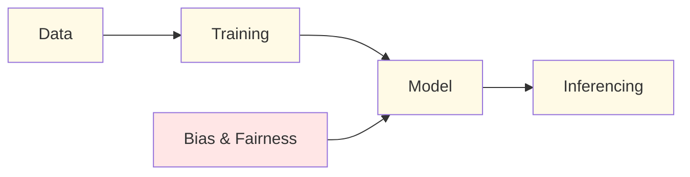
```mermaid
flowchart LR
    G[Data] --> H[Training]
    H --> I[Model]
    I --> J[Inferencing]
    K[Bias & Fairness] --> I
    style G fill:#fffae6
    style H fill:#fffae6
    style I fill:#fffae6
    style J fill:#fffae6
    style K fill:#ffe6e6    
```

This second diagram depicts the essential workflow in developing and deploying AI systems. The process begins with Data collection and preparation, which feeds into the Training phase where algorithms learn patterns from the data. This results in a Model that encapsulates the learned patterns. The model then performs Inferencing—applying what it has learned to new, unseen data. Importantly, considerations of Bias & Fairness must be integrated during model development to ensure ethical AI systems. Business leaders who understand this lifecycle can better manage AI projects, allocate appropriate resources at each stage, and implement proper governance frameworks to address ethical concerns throughout the development process.

### Similarities and Differences Between AI, ML, and Deep Learning

While AI, ML, and deep learning are closely related, they have distinct characteristics and applications:

**Artificial Intelligence (AI)**:
- Broadest category, encompassing all efforts to make machines intelligent
- Can include rule-based systems and symbolic AI, not just data-driven approaches
- Aims to create systems that can perform tasks requiring human-like intelligence

**Machine Learning (ML)**:
- Subset of AI focused on algorithms that improve through experience
- Relies on statistical techniques to enable computers to "learn" from data
- Includes various approaches such as supervised learning, unsupervised learning, and reinforcement learning

**Deep Learning**:
- Specialized subset of machine learning
- Uses artificial neural networks with multiple layers
- Particularly effective for processing unstructured data like images, audio, and text

Table 1.1.1. Comparison of AI, ML, and Deep Learning

| Aspect | Artificial Intelligence | Machine Learning | Deep Learning |
|--------|-------------------------|-------------------|----------------|
| Scope | Broadest | Subset of AI | Subset of ML |
| Approach | Various (rule-based, symbolic, statistical) | Statistical, data-driven | Neural networks with multiple layers |
| Data Requirements | Varies | Large datasets | Very large datasets |
| Interpretability | Can be high (e.g., rule-based systems) | Moderate to low | Generally low |
| Typical Applications | Expert systems, game AI, robotics | Predictive analytics, recommendation systems | Image recognition, natural language processing |

In practice, these technologies often work together in AI solutions. For example, a customer service chatbot might use:
- AI principles for overall design and decision-making
- ML algorithms for intent classification and entity recognition
- Deep learning models (like LLMs) for generating human-like responses

Understanding these distinctions helps business professionals choose the right approach for specific use cases and communicate more effectively with technical teams.

### Types of Inferencing

Inferencing, the process of using a trained model to make predictions on new data, can be performed in various ways depending on the business requirements and technical constraints. The two main types of inferencing are:

1. **Batch Inferencing**:
   - Processes large volumes of data at once, typically on a scheduled basis
   - Suitable for non-time-sensitive applications or when processing large datasets is more efficient
   - Examples: Monthly customer churn predictions, bulk product recommendations

2. **Real-time Inferencing**:
   - Processes data and returns predictions immediately, often within milliseconds
   - Crucial for applications requiring instant decisions or responses
   - Examples: Fraud detection for online transactions, real-time personalization in e-commerce

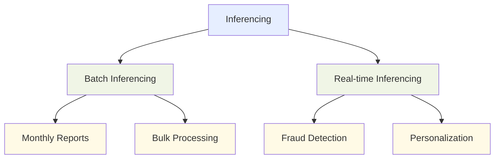
```mermaid
flowchart TD
    A[Inferencing] --> B[Batch Inferencing]
    A --> C[Real-time Inferencing]
    B --> D[Monthly Reports]
    B --> E[Bulk Processing]
    C --> F[Fraud Detection]
    C --> G[Personalization]
    style A fill:#e6eeff
    style B fill:#f0f5e6
    style C fill:#f0f5e6
    style D fill:#fffae6
    style E fill:#fffae6
    style F fill:#fffae6
    style G fill:#fffae6
```

When choosing between batch and real-time inferencing, consider factors such as:
- Latency requirements
- Data volume and frequency
- Cost considerations (real-time inferencing often requires more resources)
- Integration with existing systems and processes

For example, a financial services company might use real-time inferencing for fraud detection on individual transactions, while employing batch inferencing for monthly risk assessments of their entire customer portfolio.[^215]

### Types of Data in AI Models

AI models can work with various types of data, each requiring different preprocessing techniques and model architectures. Understanding these data types is crucial for selecting appropriate AI solutions and preparing data for model training:

1. **Labeled vs. Unlabeled Data**:
   - Labeled data: Includes both input features and corresponding output labels (used in supervised learning)
   - Unlabeled data: Contains only input features without corresponding labels (used in unsupervised learning)

2. **Structured vs. Unstructured Data**:
   - Structured data: Organized in a predefined format (e.g., databases, spreadsheets)
   - Unstructured data: Lacks a predefined format (e.g., text documents, images, audio files)

3. **Specific Data Types**:
   - Tabular data: Organized in rows and columns (e.g., customer information, sales records)
   - Time-series data: Sequential data points indexed in time order (e.g., stock prices, sensor readings)
   - Image data: Visual information represented as pixel values
   - Text data: Natural language in various formats (e.g., documents, social media posts, customer reviews)

Table 1.1.2. Data Types and Their Characteristics

| Data Type | Structure | Typical Sources | Common AI Applications |
|-----------|-----------|-----------------|------------------------|
| Tabular | Structured | Databases, spreadsheets | Customer segmentation, fraud detection |
| Time-series | Structured | IoT sensors, financial markets | Forecasting, anomaly detection |
| Image | Unstructured | Cameras, medical imaging | Object recognition, quality control |
| Text | Unstructured | Documents, social media | Sentiment analysis, chatbots |

Different AI models and techniques are better suited for certain types of data. For instance:
- Tabular data often works well with traditional machine learning algorithms like decision trees or random forests
- Image data typically requires deep learning models such as convolutional neural networks (CNNs)[^216]
- Text data is often processed using natural language processing techniques and models like recurrent neural networks (RNNs) or transformers[^217]

By understanding these data types, business professionals can better assess the feasibility of AI projects and communicate data requirements effectively with technical teams.

### Supervised, Unsupervised, and Reinforcement Learning

Machine learning approaches can be categorized into three main types based on how they learn from data:

1. **Supervised Learning**:
   - Uses labeled data where both input features and corresponding output labels are provided
   - The model learns to predict the output given new input data
   - Examples: Classification (e.g., spam detection), regression (e.g., price prediction)

2. **Unsupervised Learning**:
   - Works with unlabeled data, finding patterns or structures without predefined outputs
   - Useful for discovering hidden patterns or grouping similar data points
   - Examples: Clustering (e.g., customer segmentation), dimensionality reduction

3. **Reinforcement Learning**:
   - Learns through interaction with an environment, receiving rewards or penalties for actions
   - Aims to maximize cumulative rewards over time
   - Examples: Game AI, robotics, autonomous vehicles

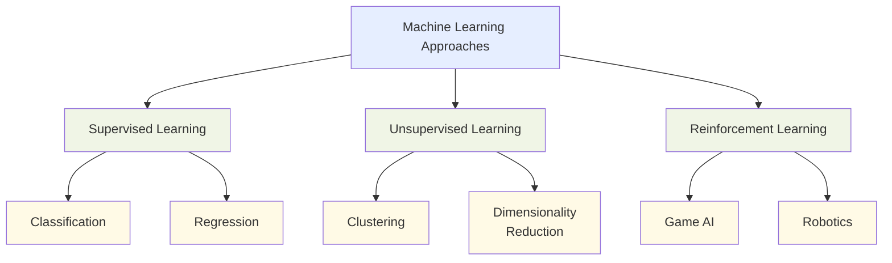
```mermaid
flowchart TD
    A[Machine Learning Approaches] --> B[Supervised Learning]
    A --> C[Unsupervised Learning]
    A --> D[Reinforcement Learning]
    B --> E[Classification]
    B --> F[Regression]
    C --> G[Clustering]
    C --> H[Dimensionality<br>Reduction]
    D --> I[Game AI]
    D --> J[Robotics]
    style A fill:#e6eeff
    style B fill:#f0f5e6
    style C fill:#f0f5e6
    style D fill:#f0f5e6
    style E fill:#fffae6
    style F fill:#fffae6
    style G fill:#fffae6
    style H fill:#fffae6
    style I fill:#fffae6
    style J fill:#fffae6
```

Each approach has its strengths and is suited for different types of problems:

**Supervised Learning**:
- Best for problems where you have a clear target variable to predict
- Requires high-quality labeled data, which can be expensive or time-consuming to obtain
- Widely used in business applications like customer churn prediction or credit scoring

**Unsupervised Learning**:
- Useful for exploratory data analysis and finding hidden patterns
- Doesn't require labeled data, making it suitable when labeling is impractical or expensive
- Often used in market segmentation, anomaly detection, or recommendation systems

**Reinforcement Learning**:
- Ideal for sequential decision-making problems
- Can learn complex strategies through trial and error
- Applicable in scenarios like optimizing trading strategies or managing industrial processes
-----
This is an excellent breakdown of the core machine learning types for the **AIF-C01** exam. You've captured the "business logic" of when to use each, which is a major part of the exam's focus.

However, I spotted a few typos and "near-misses" in your algorithm names that might trip you up during the test. For the AWS exam, you need to recognize the official terminology.

---

## 🛠️ Refined Algorithm List

### 1. Supervised Learning (Labeled Data)
* **Classification (Predicting Buckets):**
    * **Naive Bayes** (not "Native bayers") — Often used for simple text/spam classification.
    * **Logistic Regression** (not "log aggression") — Despite the name, this is a **classification** algorithm.
    * **SVM** (Support Vector Machines).
    * **KNN** (K-Nearest Neighbors, not "KVM") — Categorizes data based on its "neighbors."
    * **Decision Tree** & **Random Forest**.
    * **XGBoost** — The "gold standard" for tabular data accuracy.


[Image of supervised learning classification vs regression]
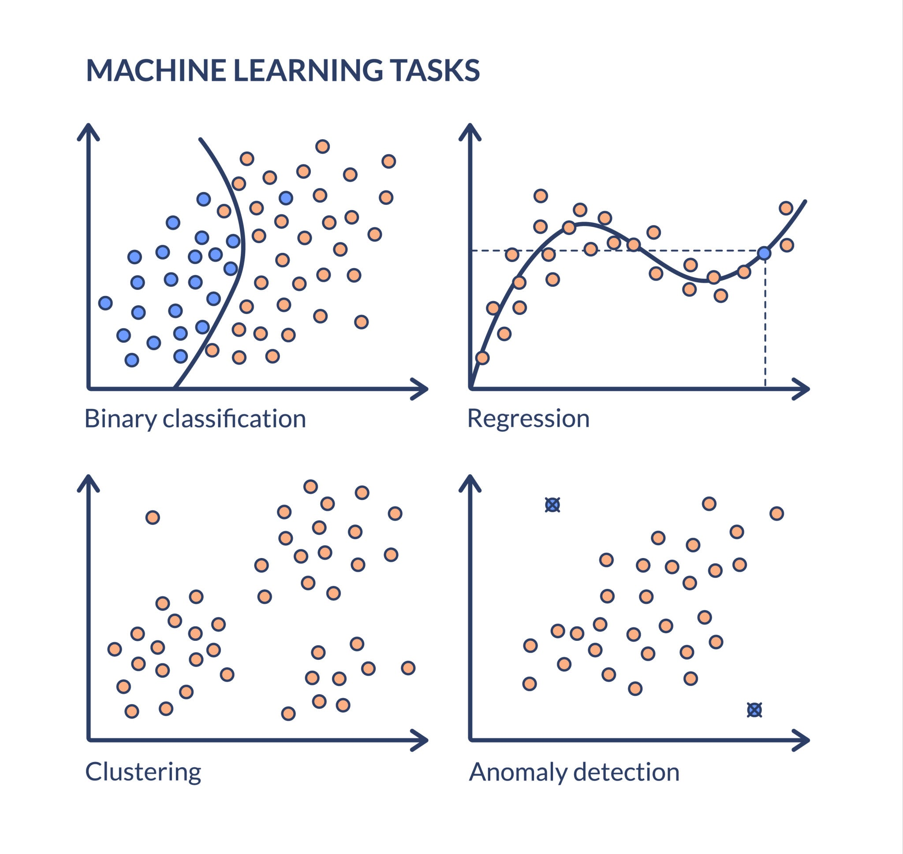

* **Regression (Predicting Numbers):**
    * **Linear Regression** — Predicting a continuous value (like price).

---

### 2. Unsupervised Learning (Unlabeled Data)
* **Clustering (Grouping):**
    * **K-Means** — The most common clustering algorithm on the exam.
    * **DBSCAN** — Grouping based on density.
* **Dimensionality Reduction (Simplifying):**
    * **PCA** (Principal Component Analysis) — Reducing many variables down to the "most important" ones.
    * **SVD** (Singular Value Decomposition).


---

### 3. Reinforcement Learning (Trial and Error)
* **Key Algorithms:**
    * **Q-Learning** — Learning the "value" of an action.
    * **PPO** (Proximal Policy Optimization) — A stable, modern algorithm commonly used in AWS SageMaker.
    * **DQN** (Deep Q-Network).

[Image of reinforcement learning feedback loop]
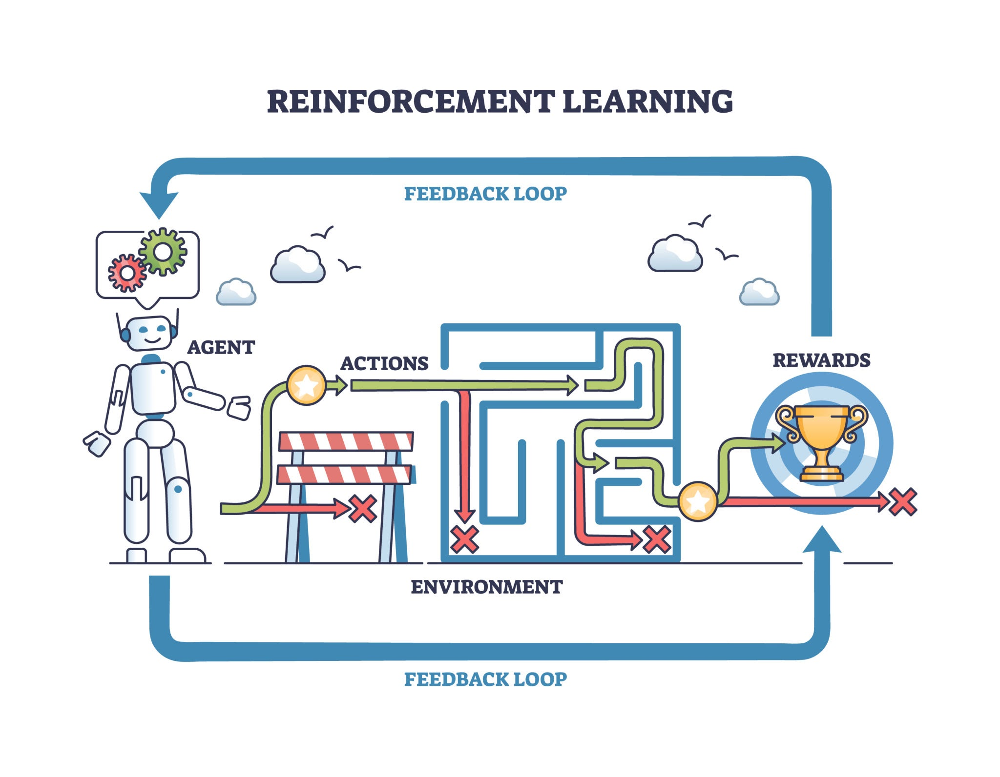

## 💡 AIF-C01 "Exam Traps" to Watch For:
1.  **The Logistic Regression Trick:** If the exam asks for a **Classification** algorithm and lists "Logistic Regression," pick it! It is one of the most common "trick" questions.
2.  **K-Means vs. KNN:**
    * **K-Means** = Unsupervised (Clustering).
    * **KNN** = Supervised (Classification).
    * *Mnemonic:* K-**M**eans = **M**ake your own groups. K-**N**earest = **N**eighbors tell you who you are.
3.  **Random Forest vs. XGBoost:** Both are "Ensembles" (groups of trees), but **XGBoost** is generally faster and more accurate because it uses "Boosting" (learning from previous mistakes).

As of today, April 24, 2026, you're looking very solid on these fundamentals. Would you like to try a "Which Algorithm Am I?" scenario quiz to lock these in?

-----
In practice, many AI solutions combine these approaches. For example, a recommendation system might use:
- Supervised learning to predict user ratings for items
- Unsupervised learning to group similar items or users
- Reinforcement learning to optimize the recommendation strategy over time

Understanding these learning paradigms helps business professionals assess the feasibility of AI projects, estimate data requirements, and set realistic expectations for AI system capabilities.

By mastering these fundamental AI concepts and terminologies, business professionals can effectively navigate the AI landscape, communicate with technical teams, and make informed decisions about AI adoption and strategy. As AI continues to evolve and transform industries, this knowledge will be invaluable in leveraging AI's potential to drive innovation and competitive advantage.

### Questions for self-check

1. **A data scientist is working on a project to identify patterns in customer purchasing behavior without any predefined categories. Which type of machine learning approach is most suitable for this task?**

   A. Supervised learning
   B. Unsupervised learning
   C. Reinforcement learning
   D. Semi-supervised learning

2. **An AI-powered chatbot is designed to improve its responses over time based on user feedback. Which learning paradigm does this scenario best represent?**

   A. Supervised learning
   B. Unsupervised learning
   C. Reinforcement learning
   D. Transfer learning

3. **A financial services company wants to implement an AI system for real-time fraud detection on individual transactions. Which type of inferencing should they use?**

   A. Batch inferencing
   B. Real-time inferencing
   C. Offline inferencing
   D. Delayed inferencing

4. **Which of the following best describes the relationship between Artificial Intelligence (AI), Machine Learning (ML), and Deep Learning?**

   A. They are interchangeable terms for the same technology
   B. Deep Learning is a subset of AI, which is a subset of ML
   C. ML is a subset of AI, and Deep Learning is a subset of ML
   D. AI, ML, and Deep Learning are separate, unrelated fields

5. **A retail company has a large dataset of customer information stored in a structured database. Which type of data would this be classified as?**

   A. Unstructured data
   B. Time-series data
   C. Image data
   D. Tabular data

### Answers and Explanations

1. **Correct answer: B. Unsupervised learning**

   Explanation: Unsupervised learning is the most suitable approach for identifying patterns in data without predefined categories or labels. In this scenario, the data scientist is looking to discover hidden patterns in customer purchasing behavior without any prior categorization. Unsupervised learning algorithms, such as clustering, can group similar customers or products together based on their characteristics, revealing natural patterns in the data.[^218]

2. **Correct answer: C. Reinforcement learning**

   Explanation: This scenario best represents reinforcement learning. In reinforcement learning, an agent (in this case, the chatbot) learns to make decisions by interacting with its environment (user interactions) and receiving feedback (user responses). The chatbot improves its performance over time by maximizing positive feedback, which is a key characteristic of reinforcement learning. This approach allows the AI to adapt and optimize its behavior based on real-world interactions.[^219]

3. **Correct answer: B. Real-time inferencing**

   Explanation: For real-time fraud detection on individual transactions, real-time inferencing is the most appropriate choice. Real-time inferencing processes data and returns predictions immediately, often within milliseconds, which is crucial for applications requiring instant decisions. In the case of fraud detection for financial transactions, the system needs to make immediate decisions to approve or flag transactions as they occur, making real-time inferencing essential.[^220]

4. **Correct answer: C. ML is a subset of AI, and Deep Learning is a subset of ML**

   Explanation: This option correctly describes the relationship between AI, ML, and Deep Learning. Artificial Intelligence is the broadest field, encompassing various approaches to create intelligent machines. Machine Learning is a subset of AI that focuses on algorithms that can learn from data. Deep Learning is a further specialized subset of ML that uses neural networks with multiple layers to model complex patterns in data. This hierarchical relationship is fundamental to understanding the AI landscape.[^221]

5. **Correct answer: D. Tabular data**

   Explanation: The scenario describes customer information stored in a structured database, which is characteristic of tabular data. Tabular data is organized in rows and columns, similar to a spreadsheet or database table. This type of structured data is common in business applications and is well-suited for many traditional machine learning algorithms. Understanding data types is crucial for selecting appropriate AI models and preprocessing techniques.[^222]

[^200]: AWS Certified AI Practitioner Exam Guide. URL: <https://d1.awsstatic.com/training-and-certification/docs-ai-practitioner/AWS-Certified-AI-Practitioner_Exam-Guide.pdf>

[^201]: AWS Cloud Adoption Framework for Artificial Intelligence, Machine Learning. URL: <https://docs.aws.amazon.com/whitepapers/latest/aws-caf-for-ai/aws-caf-for-ai.html>

[^202]: Amazon SageMaker Developer Guide: What Is Machine Learning? URL: <https://docs.aws.amazon.com/sagemaker/latest/dg/what-is-machine-learning.html>

[^203]: AWS Machine Learning Decision Guide: Choosing an AWS machine learning service. URL: <https://docs.aws.amazon.com/decision-guides/latest/machine-learning-on-aws-how-to-choose/guide.html>

[^204]: What is a Neural Network? - Artificial Neural Network Explained - AWS. URL: <https://aws.amazon.com/what-is/neural-network/>

[^205]: Amazon Rekognition Developer Guide: What Is Amazon Rekognition? URL: <https://docs.aws.amazon.com/rekognition/latest/dg/what-is.html>

[^206]: Amazon Comprehend Developer Guide: What Is Amazon Comprehend? URL: <https://docs.aws.amazon.com/comprehend/latest/dg/what-is.html>

[^207]: How I Got Into The Top 2% In AWS DeepRacer. URL: <https://medium.com/@marsmans/how-i-got-into-the-top-2-in-aws-deepracer-32127a364212>

[^208]: Choosing an AWS machine learning service. URL: <https://docs.aws.amazon.com/decision-guides/latest/machine-learning-on-aws-how-to-choose/guide.html>

[^209]: Amazon SageMaker Developer Guide: Train a Model. URL: <https://docs.aws.amazon.com/sagemaker/latest/dg/how-it-works-training.html>

[^210]: Amazon SageMaker Developer Guide: Deploy a Model. URL: <https://docs.aws.amazon.com/sagemaker/latest/dg/how-it-works-deployment.html>

[^211]: Tune ML models for additional objectives like fairness with SageMaker Automatic Model Tuning. URL: <https://aws.amazon.com/blogs/machine-learning/tune-ml-models-for-additional-objectives-like-fairness-with-sagemaker-automatic-model-tuning/>

[^212]: Responsible AI – Building AI Responsibly – AWS. URL: <https://aws.amazon.com/ai/responsible-ai/>

[^213]: Ground truth curation and metric interpretation best practices for evaluating generative AI question-answering using FMEval. URL: <https://aws.amazon.com/blogs/machine-learning/ground-truth-curation-and-metric-interpretation-best-practices-for-evaluating-generative-ai-question-answering-using-fmeval/>

[^214]: What is LLM? - Large Language Models Explained - AWS. URL: <https://aws.amazon.com/what-is/large-language-model/>

[^215]: Build a GNN-based real-time fraud detection solution using Amazon SageMaker, Amazon Neptune, and the Deep Graph Library. URL: <https://aws.amazon.com/blogs/machine-learning/build-a-gnn-based-real-time-fraud-detection-solution-using-amazon-sagemaker-amazon-neptune-and-the-deep-graph-library/>

[^216]: What is a Neural Network? - Artificial Neural Network Explained - AWS. URL: <https://aws.amazon.com/what-is/neural-network/>

[^217]: What is NLP? - Natural Language Processing Explained - AWS. URL: <https://aws.amazon.com/what-is/nlp/>

[^218]: Supervised vs Unsupervised Learning - AWS. URL: <https://aws.amazon.com/compare/the-difference-between-machine-learning-supervised-and-unsupervised/>

[^219]: Optimize customer engagement with reinforcement learning | AWS Machine Learning Blog. URL: <https://aws.amazon.com/blogs/machine-learning/optimize-customer-engagement-with-reinforcement-learning/>

[^220]: Real-time inference - Amazon SageMaker AI. URL: <https://docs.aws.amazon.com/sagemaker/latest/dg/realtime-endpoints.html>

[^221]: AWS Machine Learning Blog: AI, ML, and Deep Learning Explained. URL: <https://aws.amazon.com/compare/the-difference-between-artificial-intelligence-and-machine-learning/>

[^222]: AWS Machine Learning Blog: Working with Tabular Data in Amazon SageMaker. URL: <https://docs.aws.amazon.com/sagemaker/latest/dg/algorithms-tabular.html>


## 1.2 Practical use cases for AI


Objectives:

Recognize applications where AI/ML can provide value (for example, assist human decision making, solution scalability, automation).

Determine when AI/ML solutions are not appropriate (for example, cost-benefit analyses, situations when a specific outcome is needed instead of a prediction).

Select the appropriate ML techniques for specific use cases (for example, regression, classification, clustering).

Identify examples of real-world AI applications (for example, computer vision, NLP, speech recognition, recommendation systems, fraud detection, forecasting).

Explain the capabilities of AWS managed AI/ML services (for example, Amazon SageMaker AI, Amazon Transcribe, Amazon Translate, Amazon Comprehend, Amazon Lex, Amazon Polly).


Artificial intelligence (AI) and machine learning (ML) have become powerful tools that transform how organizations operate, serve customers, and gain competitive advantages. Understanding where AI can deliver value—and where it might not be suitable—enables businesses to make strategic technology decisions. This subchapter explores practical AI applications, helps you identify appropriate use cases, and introduces the AWS services that can turn AI concepts into business solutions.

### Recognize applications where AI/ML can provide value

AI and ML technologies excel at analyzing large datasets, identifying patterns, and making predictions that enhance business operations in several key areas:

1. **Assisting human decision-making**: AI systems analyze vast amounts of data to provide insights that augment human expertise, leading to more informed decisions.

2. **Solution scalability**: ML models can process increasing volumes of data without proportional resource increases, enabling efficient business scaling.

3. **Automation**: AI-powered systems handle repetitive tasks, freeing human resources for strategic and creative work.

The following flowchart demonstrates how AI integrates into a typical business process:

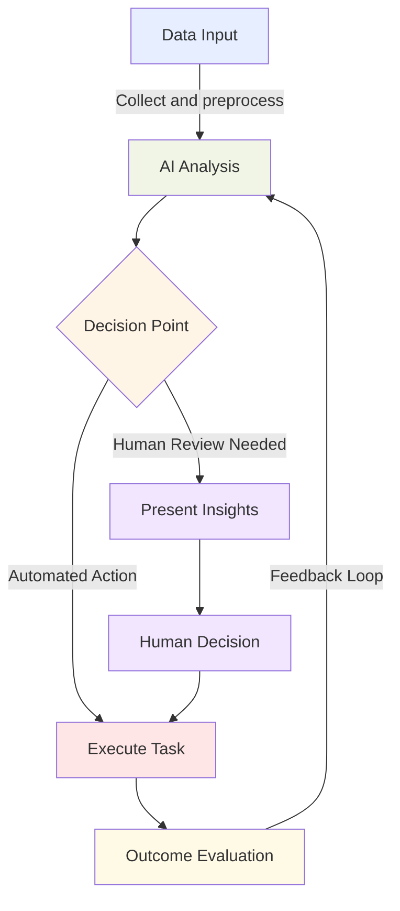
```mermaid
flowchart TD
    A[Data Input] -->|Collect and preprocess| B[AI Analysis]
    B --> C{Decision Point}
    C -->|Automated Action| D[Execute Task]
    C -->|Human Review Needed| E[Present Insights]
    E --> F[Human Decision]
    F --> D
    D --> G[Outcome Evaluation]
    G -->|Feedback Loop| B
    style A fill:#e6eeff
    style B fill:#f0f5e6
    style C fill:#fff5e6
    style D fill:#ffe6e6
    style E fill:#f2e6ff
    style F fill:#f2e6ff
    style G fill:#fffae6
```

*Figure 1.2.1: AI-Assisted Business Process Flow. This diagram illustrates how AI can be integrated into a typical business process, from data input to outcome evaluation, showing both automated actions and human decision points.*

Here are specific examples where AI/ML provides significant business value:

- **Customer Service**: AI-powered chatbots and virtual assistants handle routine customer inquiries 24/7, improving response times while allowing human agents to focus on complex issues. **Amazon Lex**, integrated with Amazon Connect, creates intelligent conversational interfaces that understand natural language.[^300]

- **Predictive Maintenance**: ML models analyze equipment sensor data to predict potential failures before they occur, reducing downtime and maintenance costs. **Amazon SageMaker** enables building, training, and deploying these predictive models at scale.[^301]

- **Personalized Recommendations**: E-commerce platforms use ML algorithms to analyze customer behavior and provide tailored product recommendations, increasing sales and satisfaction. **Amazon Personalize** offers a fully managed service to create real-time personalized recommendations.[^302]

- **Financial Fraud Detection**: Banks employ ML models to analyze transaction patterns and identify potentially fraudulent activities in real-time. **Amazon Fraud Detector** provides a fully managed service that uses ML to detect suspicious activities.[^303]

- **Supply Chain Optimization**: AI analyzes historical data, market trends, and external factors to optimize inventory levels, predict demand, and improve supply chain efficiency. **Amazon Forecast** generates accurate demand forecasts based on historical time series data.[^304]

These AI applications enable businesses to enhance operational efficiency, improve customer experiences, and gain competitive advantages in their markets.

### Determine when AI/ML solutions are not appropriate

Recognizing situations where AI may not be the optimal solution is equally important for making sound technology decisions. Several factors should influence whether to implement AI for a particular business challenge:

1. **Cost-benefit considerations**: AI implementation requires investments in data infrastructure, model development, and ongoing maintenance. For some problems, these costs may exceed potential benefits.

2. **Situations requiring specific outcomes**: When definitive, rule-based outcomes are needed (such as in regulatory compliance), traditional rule-based systems often work better than AI's probability-based approaches.

3. **Limited or poor-quality data**: AI/ML models depend on substantial high-quality data. Without sufficient quality data, predictions will be unreliable and potentially harmful to business operations.

4. **Ethical considerations**: Using AI for certain decision-making processes raises ethical concerns, particularly in sensitive areas like healthcare diagnostics or criminal justice. Human judgment remains essential for ensuring fair outcomes.

5. **Explainability requirements**: Some industries require clear explanations for decisions. While *explainable AI* has advanced, complex models like deep neural networks can be difficult to interpret, making them unsuitable when decision transparency is crucial.

6. **Real-time processing needs**: For ultra-low-latency applications, traditional rule-based systems may provide more reliable response times than some AI systems.

This flowchart helps determine whether an AI/ML solution fits a particular business need:

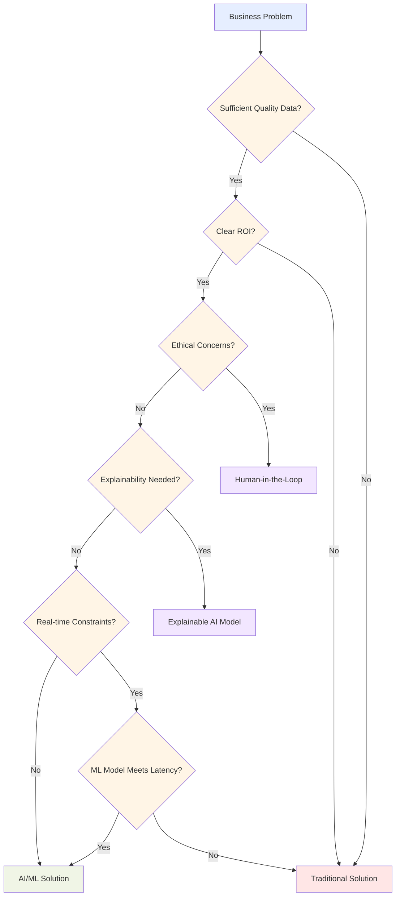
```mermaid
flowchart TD
    A[Business Problem] --> B{Sufficient Quality Data?}
    B -->|Yes| C{Clear ROI?}
    B -->|No| H[Traditional Solution]
    C -->|Yes| D{Ethical Concerns?}
    C -->|No| H
    D -->|No| E{Explainability Needed?}
    D -->|Yes| I[Human-in-the-Loop]
    E -->|No| F{Real-time Constraints?}
    E -->|Yes| J[Explainable AI Model]
    F -->|No| G[AI/ML Solution]
    F -->|Yes| K{ML Model Meets Latency?}
    K -->|Yes| G
    K -->|No| H
    style A fill:#e6eeff
    style B fill:#fff5e6
    style C fill:#fff5e6
    style D fill:#fff5e6
    style E fill:#fff5e6
    style F fill:#fff5e6
    style G fill:#f0f5e6
    style H fill:#ffe6e6
    style I fill:#f2e6ff
    style J fill:#f2e6ff
    style K fill:#fff5e6
```

*Figure 1.2.2: AI/ML Solution Appropriateness Flowchart. This diagram outlines the decision-making process for determining whether an AI/ML solution is appropriate for a given business problem, considering factors such as data quality, ROI, ethical concerns, explainability needs, and real-time constraints.*

When evaluating AI solutions, ask these critical questions:

- Is there clear business value that outweighs implementation costs?
- Do we have sufficient high-quality data to train and maintain the model?
- Are there ethical or regulatory concerns with using AI for this application?
- Do we need to provide clear explanations for the system's decisions?
- Can we tolerate some uncertainty in the outcomes?

Sometimes a hybrid approach combining AI with human oversight or traditional systems provides the most effective solution.

### Select the appropriate ML techniques for specific use cases

Matching the right machine learning technique to your business problem significantly impacts project success. Different ML approaches suit different types of problems and data characteristics. Here are three fundamental ML techniques and their typical applications:

1. **Regression**:
   - **Purpose**: Predicts continuous numerical values based on input features.
   - **Use cases**: Sales forecasting, price prediction, demand estimation.
   - **Example**: Predicting house prices based on features like square footage, location, and number of bedrooms.

2. **Classification**:
   - **Purpose**: Categorizes input data into predefined classes or categories.
   - **Use cases**: Spam detection, sentiment analysis, image recognition.
   - **Example**: Determining whether an email is spam or legitimate based on its content and metadata.

3. **Clustering**:
   - **Purpose**: Groups similar data points without predefined categories.
   - **Use cases**: Customer segmentation, anomaly detection, recommendation systems.
   - **Example**: Grouping customers with similar purchasing behaviors for targeted marketing campaigns.

This table summarizes key ML techniques and their business applications:

*Table 1.2.1: ML Techniques and Their Business Applications*

| ML Technique | Description | Business Use Case | AWS Service |
|--------------|-------------|-------------------|-------------|
| Regression | Predicts continuous values | Sales forecasting | Amazon Forecast |
| Classification | Categorizes data into classes | Sentiment analysis | Amazon Comprehend |
| Clustering | Groups similar data points | Customer segmentation | Amazon SageMaker |

When selecting an ML technique, consider these factors:

1. **Nature of the problem**: Is it a prediction task (regression), a categorization task (classification), or an exploratory analysis (clustering)?

2. **Type of data available**: Is your data labeled (supervised learning) or unlabeled (unsupervised learning)?

3. **Desired outcome**: Do you need a specific numerical prediction, a category assignment, or insights into data patterns?

4. **Interpretability requirements**: Some techniques (e.g., decision trees) are more easily interpretable than others (e.g., neural networks).

5. **Scalability needs**: Consider the volume of data you'll be processing and the frequency of predictions required.

This decision flow helps select an appropriate ML technique:

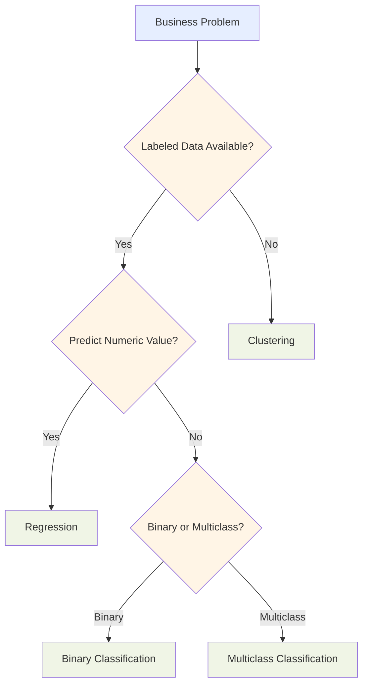
```mermaid
flowchart TD
    A[Business Problem] --> B{Labeled Data Available?}
    B -->|Yes| C{Predict Numeric Value?}
    B -->|No| D[Clustering]
    C -->|Yes| E[Regression]
    C -->|No| F{Binary or Multiclass?}
    F -->|Binary| G[Binary Classification]
    F -->|Multiclass| H[Multiclass Classification]
    style A fill:#e6eeff
    style B fill:#fff5e6
    style C fill:#fff5e6
    style D fill:#f0f5e6
    style E fill:#f0f5e6
    style F fill:#fff5e6
    style G fill:#f0f5e6
    style H fill:#f0f5e6
```

*Figure 1.2.3: ML Technique Selection Flowchart. This diagram illustrates the decision-making process for selecting an appropriate ML technique based on the nature of the data and the desired outcome.*

In real-world scenarios, combining multiple techniques or employing more advanced methods may deliver optimal results. The key is aligning the technical approach with your specific business needs and data characteristics.

### Identify examples of real-world AI applications

AI technology has transformed operations across numerous industries. Understanding these practical applications can inspire new implementation ideas for your organization. Here are prominent examples of AI applications in various domains:

1. **Computer Vision**:
   - **Application**: Object detection and recognition in images and videos.
   - **Use case**: Autonomous vehicles use computer vision to identify road signs, pedestrians, and other vehicles.
   - **AWS service**: **Amazon Rekognition** provides pre-trained computer vision capabilities for image and video analysis.[^305]

2. **Natural Language Processing (NLP)**:
   - **Application**: Understanding and generating human language.
   - **Use case**: Chatbots that comprehend and respond to customer queries in natural language.
   - **AWS service**: **Amazon Comprehend** offers NLP capabilities for extracting insights from text.[^306]

3. **Speech Recognition**:
   - **Application**: Converting spoken language into text.
   - **Use case**: Voice-controlled virtual assistants like Alexa or Siri.
   - **AWS service**: **Amazon Transcribe** converts speech to text in real-time.[^307]

4. **Recommendation Systems**:
   - **Application**: Suggesting relevant items based on user preferences and behavior.
   - **Use case**: E-commerce platforms recommending products based on browsing and purchase history.
   - **AWS service**: **Amazon Personalize** provides custom recommendation capabilities.[^308]

5. **Fraud Detection**:
   - **Application**: Identifying unusual patterns that may indicate fraudulent activity.
   - **Use case**: Banks detecting and preventing credit card fraud in real-time.
   - **AWS service**: **Amazon Fraud Detector** identifies potentially fraudulent online activities.[^309]

6. **Forecasting**:
   - **Application**: Predicting future trends based on historical data.
   - **Use case**: Retailers forecasting product demand to optimize inventory.
   - **AWS service**: **Amazon Forecast** generates accurate demand forecasts from historical data.[^310]

This diagram illustrates how these AI applications integrate into a business ecosystem:

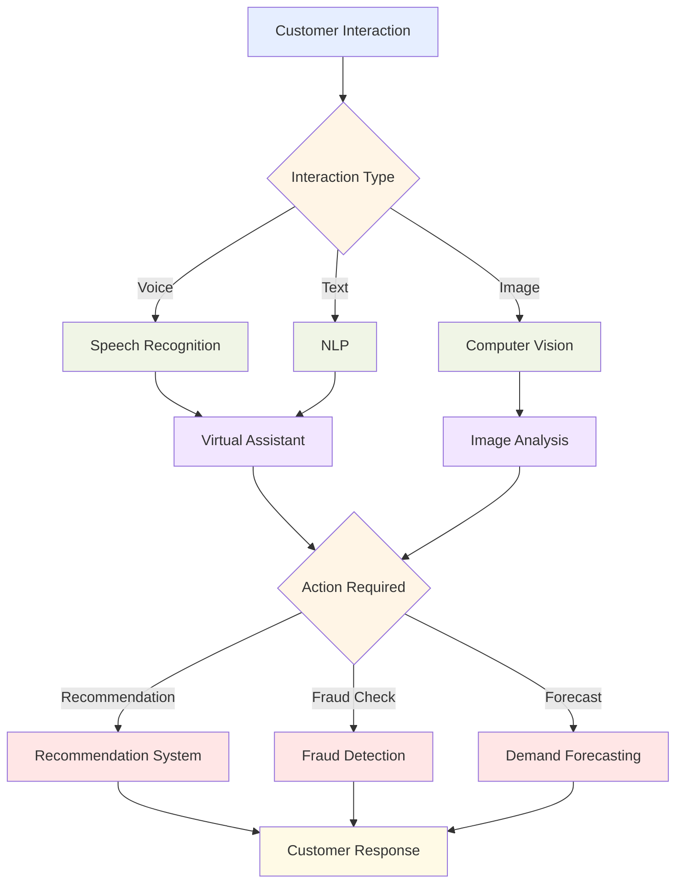
```mermaid
flowchart TD
    A[Customer Interaction] --> B{Interaction Type}
    B -->|Voice| C[Speech Recognition]
    B -->|Text| D[NLP]
    B -->|Image| E[Computer Vision]
    C --> F[Virtual Assistant]
    D --> F
    E --> G[Image Analysis]
    F --> H{Action Required}
    G --> H
    H -->|Recommendation| I[Recommendation System]
    H -->|Fraud Check| J[Fraud Detection]
    H -->|Forecast| K[Demand Forecasting]
    I --> L[Customer Response]
    J --> L
    K --> L
    style A fill:#e6eeff
    style B fill:#fff5e6
    style C fill:#f0f5e6
    style D fill:#f0f5e6
    style E fill:#f0f5e6
    style F fill:#f2e6ff
    style G fill:#f2e6ff
    style H fill:#fff5e6
    style I fill:#ffe6e6
    style J fill:#ffe6e6
    style K fill:#ffe6e6
    style L fill:#fffae6
```

*Figure 1.2.4: Integrated AI Applications in Business. This diagram shows how various AI applications can be integrated into a business ecosystem, from initial customer interaction to final response, incorporating different AI technologies based on the interaction type and required action.*

These real-world applications demonstrate AI's versatility in solving complex business problems. By understanding these applications, you can identify similar opportunities within your organization to leverage AI for improved efficiency, customer experience, and decision-making.

### Explain the capabilities of AWS managed AI/ML services

AWS offers comprehensive managed AI/ML services that enable businesses to implement AI solutions without extensive in-house expertise or infrastructure. These services range from foundational tools for building custom ML models to pre-trained AI services for specific tasks:

*Table 1.2.2. AWS AI Services Comparison*

| Service | Capability | Features | Use Case |
|---------|------------|----------|----------|
| **Amazon SageMaker** | End-to-end ML platform for building, training, and deploying ML models at scale. | Integrated development environment (IDE) for ML, automated model tuning, distributed training, and model deployment. | Developing custom ML models for various business applications.[^311] |
| **Amazon Transcribe** | Automatic speech recognition service that converts speech to text. | Real-time transcription, custom vocabulary, speaker identification, and language detection. | Transcribing customer service calls for analysis and quality assurance.[^312] |
| **Amazon Translate** | Neural machine translation service providing fast, high-quality language translation. | Support for multiple languages, custom terminology, and batch translation. | Translating product descriptions and customer reviews for global e-commerce platforms.[^313] |
| **Amazon Comprehend** | Natural language processing service for extracting insights from text. | Entity recognition, key phrase extraction, sentiment analysis, and topic modeling. | Analyzing customer feedback to identify common issues and sentiment trends.[^314] |
| **Amazon Lex** | Service for building conversational interfaces using voice and text. | Automatic speech recognition, natural language understanding, and dialog management. | Creating chatbots for customer service and support.[^315] |
| **Amazon Polly** | Text-to-speech service that converts text into lifelike speech. | Multiple languages and voices, speech marks for synchronization, and custom lexicons. | Generating voice prompts for interactive voice response systems.[^316] |
| **Amazon Bedrock** | Fully managed service providing access to foundation models (FMs) from leading AI companies through a single API. | Access to models from AI21 Labs, Anthropic, Stability AI, and Amazon; fine-tuning capabilities; and enterprise-grade security. | Building generative AI applications for content creation, summarization, and question-answering.[^317] |

This diagram shows how AWS managed AI/ML services integrate into a comprehensive solution:

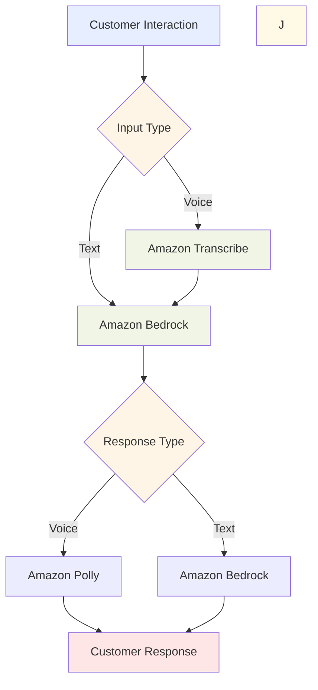
```mermaid
flowchart TD
    A[Customer Interaction] --> B{Input Type}
    B -->|Voice| C[Amazon Transcribe]
    B -->|Text| D[Amazon Bedrock]
    D --> G{Response Type}
    C --> D
    G -->|Text| I[Amazon Bedrock]
    G -->|Voice| E[Amazon Polly]
    E --> H[Customer Response]
    I --> H
    style A fill:#e6eeff
    style B fill:#fff5e6
    style C fill:#f0f5e6
    style D fill:#f0f5e6   
    style G fill:#fff5e6
    style H fill:#ffe6e6
    style J fill:#fffae6
```

*Figure 1.2.5: Integrated AWS AI/ML Services. This diagram illustrates how various AWS managed AI/ML services can be combined to create a comprehensive AI solution for customer interactions, from input processing to response generation.*


Overall explanation
Correct options:

Amazon Polly is used to deploy high-quality, natural-sounding human voices in dozens of languages

Amazon Polly is a cloud service that converts text into lifelike speech. You can use Amazon Polly to develop applications that increase engagement and accessibility. Amazon Polly supports multiple languages and includes a variety of lifelike voices.

Amazon Comprehend service uses machine learning to find insights and relationships in the text

Amazon Comprehend is a natural language processing (NLP) service that uses machine learning to find insights and relationships in text, no machine learning experience is required. Amazon Comprehend uses machine learning to help you uncover the insights and relationships in your unstructured data.

Incorrect options:

Amazon Comprehend uses machine learning models to convert speech to text - This statement is incorrect. Amazon Transcribe uses machine learning models to convert speech to text.

Amazon Transcribe is an AWS service for building conversational interfaces for applications using voice and text - This statement is incorrect. Amazon Transcribe uses machine learning models to convert speech to text. Amazon Lex is the AWS service used to build conversational interfaces for applications using voice and text.

Amazon Rekognition can extract key phrases and automatically organizes a collection of text files by topic - This statement is incorrect. Amazon Rekognition is a cloud-based image and video analysis service that makes it easy to add advanced computer vision capabilities to your applications.

Reference:

https://aws.amazon.com/ai/services/


Key advantages of AWS managed AI/ML services include:

1. **Reduced complexity**: These services abstract away infrastructure and ML complexities, allowing developers to focus on building applications.

2. **Scalability**: AWS manages resource scaling based on demand, ensuring consistent performance under varying loads.

3. **Cost-effectiveness**: Pay-as-you-go pricing allows businesses to start small and scale without large upfront investments.

4. **Continuous updates**: AWS regularly updates services with the latest AI/ML advancements, providing access to state-of-the-art capabilities.

5. **Integration**: These services easily integrate with other AWS services and existing applications through APIs and SDKs.

6. **Security and compliance**: AWS provides robust security features and compliance certifications, addressing common AI adoption concerns.

By leveraging these managed services, businesses of all sizes can rapidly prototype, develop, and deploy AI solutions without extensive in-house AI expertise or infrastructure.

Understanding practical AI use cases, recognizing when AI solutions are appropriate, selecting the right ML techniques, and leveraging AWS managed services are crucial skills for business professionals in the AI era. These capabilities enable you to drive AI initiatives and position your organization for success in an increasingly AI-driven world.

### Questions for self-check

1. **A retail company wants to implement an AI solution to improve its inventory management. Which of the following AWS services would be most appropriate for generating accurate demand forecasts based on historical sales data?**

   A. Amazon Rekognition
   B. Amazon Comprehend
   C. Amazon Forecast
   D. Amazon Personalize

2. **An AI project team is evaluating whether to implement a machine learning solution for a critical business process. Which of the following factors would NOT typically be a reason to avoid using an AI/ML solution?**

   A. The process requires clear explanations for all decisions made
   B. The company has access to large amounts of high-quality historical data
   C. The process involves sensitive ethical considerations
   D. The desired outcome is a definitive, rule-based result

3. **A financial services company wants to implement an AI system to detect potentially fraudulent transactions in real-time. Which machine learning technique would be most appropriate for this use case?**

   A. Regression
   B. Clustering
   C. Classification
   D. Dimensionality reduction

4. **A global e-commerce platform is developing an AI-powered customer service system. Which combination of AWS services would be most appropriate for creating a multilingual chatbot that can understand and respond to customer queries in various languages?**

   A. Amazon Polly and Amazon Rekognition
   B. Amazon Bedrock and Amazon Translate
   C. Amazon SageMaker and Amazon Forecast
   D. Amazon Comprehend and Amazon Personalize

5. **A data scientist is explaining the concept of overfitting to a business team. Which of the following statements best describes the potential business impact of an overfitted machine learning model?**

   A. The model will consistently underperform on all datasets, leading to poor business decisions
   B. The model will require significantly more computational resources, increasing operational costs
   C. The model will perform exceptionally well in production, potentially automating all related business processes
   D. The model will fail to generalize to new data, potentially leading to inaccurate predictions in real-world scenarios

### Answers and Explanations

1. **Correct answer: C. Amazon Forecast**

   Explanation: Amazon Forecast is specifically designed for generating accurate demand forecasts based on historical time series data, which is exactly what the retail company needs for improving inventory management.[^318] Amazon Rekognition (image and video analysis), Amazon Comprehend (natural language processing), and Amazon Personalize (personalized recommendations) are not suitable for this particular use case of demand forecasting.

2. **Correct answer: B. The company has access to large amounts of high-quality historical data**

   Explanation: Having access to large amounts of high-quality historical data is actually a positive factor for implementing an AI/ML solution, not a reason to avoid it. AI and ML models typically require substantial, high-quality data to perform well. The other options are valid reasons to be cautious about implementing AI/ML: the need for clear explanations (A) can be challenging for some complex ML models, ethical considerations (C) may require human oversight, and definitive rule-based outcomes (D) might be better served by traditional systems.

3. **Correct answer: C. Classification**

   Explanation: For detecting potentially fraudulent transactions in real-time, classification is the most appropriate machine learning technique. This is because fraud detection is essentially a binary classification problem (fraudulent or not fraudulent) based on transaction characteristics. Regression is used for predicting continuous values, clustering for grouping similar data points without predefined categories, and dimensionality reduction for reducing the number of input variables, none of which directly address the fraud detection use case.

4. **Correct answer: B. Amazon Bedrock and Amazon Translate**

   Explanation: To create a multilingual chatbot, the combination of Amazon Bedrock and Amazon Translate would be most appropriate. Amazon Bedrock provides the Large Language Models for building chatbots, while Amazon Translate enables real-time translation between languages. This combination allows the chatbot to understand and respond to customer queries in various languages. Also, many LLMs support multiple languages and can be used directly without translation.

5. **Correct answer: D. The model will fail to generalize to new data, potentially leading to inaccurate predictions in real-world scenarios**

   Explanation: This statement accurately describes the business impact of an overfitted model. Overfitting occurs when a model learns the training data too well, including its noise and peculiarities. As a result, while it may perform exceptionally well on the training data, it fails to generalize to new, unseen data. In a business context, this means the model may make inaccurate predictions when applied to real-world scenarios, potentially leading to poor decision-making. This highlights the importance of proper model validation and testing in AI projects.

[^300]: Amazon Lex Overview. URL: <https://aws.amazon.com/lex/>
[^301]: Amazon SageMaker Overview. URL: <https://aws.amazon.com/sagemaker/>
[^302]: Amazon Personalize Overview. URL: <https://aws.amazon.com/personalize/>
[^303]: Amazon Fraud Detector Overview. URL: <https://aws.amazon.com/fraud-detector/>
[^304]: Amazon Forecast Overview. URL: <https://aws.amazon.com/forecast/>
[^305]: Amazon Rekognition Overview. URL: <https://aws.amazon.com/rekognition/>
[^306]: Amazon Comprehend Overview. URL: <https://aws.amazon.com/comprehend/>
[^307]: Amazon Transcribe Overview. URL: <https://aws.amazon.com/transcribe/>
[^308]: Amazon Personalize Overview. URL: <https://aws.amazon.com/personalize/>
[^309]: Amazon Fraud Detector Overview. URL: <https://aws.amazon.com/fraud-detector/>
[^310]: Amazon Forecast Overview. URL: <https://aws.amazon.com/forecast/>
[^311]: Amazon SageMaker Overview. URL: <https://aws.amazon.com/sagemaker/>
[^312]: Amazon Transcribe Overview. URL: <https://aws.amazon.com/transcribe/>
[^313]: Amazon Translate Overview. URL: <https://aws.amazon.com/translate/>
[^314]: Amazon Comprehend Overview. URL: <https://aws.amazon.com/comprehend/>
[^315]: Amazon Lex Overview. URL: <https://aws.amazon.com/lex/>
[^316]: Amazon Polly Overview. URL: <https://aws.amazon.com/polly/>
[^317]: Amazon Bedrock Overview. URL: <https://aws.amazon.com/bedrock/>
[^318]: Amazon Forecast Documentation. URL: <https://docs.aws.amazon.com/forecast/>


## 1.3 The ML Development Lifecycle


Objectives:

Describe components of an ML pipeline (for example, data collection, exploratory data analysis [EDA], data pre-processing, feature engineering, model training, hyperparameter tuning, evaluation, deployment, monitoring).

Describe sources of ML models (for example, open source pre-trained models, training custom models).

Describe methods to use a model in production (for example, managed API service, self-hosted API).

Identify relevant AWS services and features for each stage of an ML pipeline (for example, SageMaker AI, SageMaker Data Wrangler, SageMaker Feature Store, SageMaker Model Monitor).

Describe fundamental concepts of ML operations (MLOps) (for example, experimentation, repeatable processes, scalable systems, managing technical debt, achieving production readiness, model monitoring, model re-training).

Describe model performance metrics (for example, accuracy, Area Under the Curve [AUC], F1 score) and business metrics (for example, cost per user, development costs, customer feedback, return on investment [ROI]) to evaluate ML models.


Understanding the machine learning (ML) development lifecycle is essential for leveraging AI effectively in business environments. This knowledge enables professionals to confidently oversee AI projects, communicate with technical teams, and make data-driven decisions about AI initiatives. The ML development lifecycle consists of interconnected stages from data collection to model deployment and monitoring.[^400] Mastering this process helps organizations streamline AI implementation, reduce time-to-market, and maximize return on investment from AI projects.

The following sections explore the ML development lifecycle with a focus on practical business applications and how AWS services support each stage. This understanding will prepare you for the AWS Certified AI Practitioner exam while equipping you with knowledge to drive AI innovation within your organization.

### Components of an ML Pipeline

ML pipelines form the foundation of AI projects, comprising several critical stages that transform raw data into valuable business insights. A clear understanding of these components enables effective management of ML projects and facilitates productive communication with data science teams.

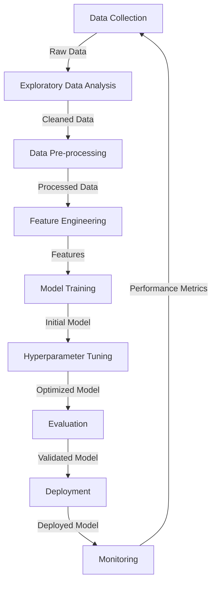
```mermaid
flowchart TD
    A[Data Collection] -->|Raw Data| B[Exploratory Data Analysis]
    B -->|Cleaned Data| C[Data Pre-processing]
    C -->|Processed Data| D[Feature Engineering]
    D -->|Features| E[Model Training]
    E -->|Initial Model| F[Hyperparameter Tuning]
    F -->|Optimized Model| G[Evaluation]
    G -->|Validated Model| H[Deployment]
    H -->|Deployed Model| I[Monitoring]
    I -->|Performance Metrics| A
```

*Figure 1.3.1: ML Pipeline Components. This diagram illustrates the key stages of the ML development lifecycle, showing the flow from data collection to model monitoring and the iterative nature of the process.*

1. **Data Collection**: High-quality, relevant data forms the foundation of successful ML projects. This stage involves gathering data from diverse sources such as customer interactions, IoT devices, or third-party datasets. For example, an e-commerce company might collect user browsing history, purchase data, and product information to build a recommendation system.[^401]

2. **Exploratory Data Analysis (EDA)**: Data scientists examine collected data to understand patterns, identify anomalies, and formulate initial hypotheses during this crucial step. EDA guides subsequent pipeline stages and informs data preparation decisions. Tools like Amazon SageMaker Studio provide interactive notebooks for performing efficient EDA.[^402]

3. **Data Pre-processing**: Raw data typically contains inconsistencies, missing values, or irrelevant information that must be addressed. Pre-processing involves cleaning data, handling missing values, and transforming it into a suitable format for ML algorithms. Amazon SageMaker Data Wrangler offers a visual interface for collaborative data preparation tasks.[^403]

4. **Feature Engineering**: This stage involves creating new machine learning features or transforming existing ones to enhance model performance. For instance, a customer churn prediction model might benefit from a feature representing total customer spending over the past year. Amazon SageMaker Feature Store allows teams to create, share, and manage features across different ML projects.[^404]

5. **Model Training**: With prepared data and engineered features, the next step involves training the ML model by selecting an appropriate algorithm and using training data to teach the model to make predictions. Amazon SageMaker provides numerous built-in algorithms while supporting custom algorithms for flexible model development.[^405]

6. **Hyperparameter Tuning**: ML models contain hyperparameters that control their behavior and significantly impact performance. Amazon SageMaker Automatic Model Tuning employs advanced techniques like Bayesian optimization to automatically identify optimal hyperparameter configurations.[^406]

7. **Evaluation**: Before deployment, model performance must be assessed using various metrics. This stage involves testing the model on separate datasets to ensure it generalizes well to new, unseen data. Amazon SageMaker Model Monitor helps evaluate model performance over time.[^407]

8. **Deployment**: Once a model meets performance requirements, it's deployed to a production environment where it can generate predictions on real-world data. Amazon SageMaker offers multiple deployment options, including real-time inference endpoints and batch transform jobs.[^408]

9. **Monitoring**: Post-deployment, continuous monitoring ensures the model maintains performance over time. This involves tracking metrics and retraining when necessary. Amazon SageMaker Model Monitor automates detection of concept drift and data quality issues.[^409]

Understanding these components helps business professionals effectively oversee ML projects, allocate resources appropriately, set realistic expectations, and communicate more effectively with data science teams throughout the AI development process.

### Sources of ML Models

When initiating an ML project, organizations can obtain models from several sources. Understanding these options helps decision-makers develop effective model strategies and optimize resource allocation.

1. **Open Source Pre-trained Models**: These models have been trained on large datasets and made freely available to the public, offering several advantages:

   - Reduced development time and cost
   - Access to state-of-the-art architectures
   - Community support and continuous improvements

   For example, BERT (Bidirectional Encoder Representations from Transformers) is a popular open-source model for natural language processing tasks. Using Amazon SageMaker, you can easily deploy and fine-tune BERT for specific use cases like sentiment analysis or text classification.[^410]

2. **Training Custom Models**: This approach involves developing models from scratch or fine-tuning existing models for specific business needs. Benefits include:

   - Tailored solutions for unique business problems
   - Greater control over model behavior and performance
   - Potential for competitive advantage through proprietary algorithms

   Amazon SageMaker provides a comprehensive environment for training custom models, from data preparation to deployment and monitoring.[^411]

3. **AWS Pre-trained AI Services**: AWS offers a range of AI services with pre-trained models that can be easily integrated into applications. These include:

   - Amazon Rekognition for image and video analysis
   - Amazon Comprehend for natural language processing
   - Amazon Forecast for time-series forecasting

   These services provide quick solutions for common AI tasks without the need for extensive ML expertise.[^412]

4. **Transfer Learning**: This technique involves using a pre-trained model as a starting point and fine-tuning it for a specific task. It combines the benefits of pre-trained models with customization for specific use cases. Amazon SageMaker supports transfer learning, allowing organizations to leverage existing models while adapting them to their unique requirements.[^413]

The choice between these sources depends on factors such as the specific business problem, available resources, required level of customization, and time-to-market considerations. For instance, a startup looking to quickly implement a chatbot might opt for Amazon Lex, while a large enterprise developing a complex fraud detection system might choose to train a custom model using Amazon SageMaker.

### Methods to Use a Model in Production

Deploying ML models to production environments is a critical step in generating business value from AI investments. Several deployment methods exist, each with distinct advantages and considerations.

1. **Managed API Services**: This approach involves deploying models as managed API endpoints that integrate easily with existing applications. AWS offers several services for this purpose:

   - Amazon SageMaker Endpoints: Provides real-time inference with automatic scaling and load balancing.
   - Amazon Bedrock: Offers API access to foundation models for generative AI applications.[^414]

   Benefits of managed API services include:
   - Simplified deployment and management
   - Automatic scaling to handle varying loads
   - Built-in monitoring and logging capabilities

2. **Self-hosted API**: Organizations with specific requirements or existing infrastructure may prefer self-hosting model APIs using:

   - Amazon EC2 instances with Docker containers
   - Amazon ECS (Elastic Container Service) for container orchestration
   - Amazon EKS (Elastic Kubernetes Service) for Kubernetes-based deployments[^415]

   Self-hosting offers:
   - Greater control over the deployment environment
   - Ability to customize the API interface and functionality
   - Potential for cost optimization in high-volume scenarios

3. **Batch Inference**: For use cases without real-time prediction requirements, batch inference provides an efficient option. Amazon SageMaker Batch Transform processes large datasets in batches, suitable for scenarios like:

   - Generating product recommendations for an e-commerce catalog
   - Scoring credit risk for a large portfolio of loans
   - Analyzing sentiment for a backlog of customer reviews[^416]

4. **Edge Deployment**: Applications requiring low-latency inference or operating with limited connectivity benefit from edge device deployment. AWS IoT Greengrass enables ML inference on edge devices, supporting use cases such as:

   - Predictive maintenance in industrial settings
   - Real-time video analysis for security systems
   - Autonomous vehicle decision-making
   - Smart home device intelligence

   Edge deployment is particularly valuable when immediate decisions are needed without cloud dependency or when connectivity is intermittent. AWS provides optimized solutions for deploying models to various edge devices while maintaining performance.[^417]

5. **Embedded Models**: Some applications benefit from ML models embedded directly into applications or devices, suitable for:

   - Mobile apps requiring offline functionality
   - IoT devices with limited processing power
   - Applications with strict privacy requirements

   AWS services like Amazon SageMaker Neo optimize models for deployment on various hardware platforms, ensuring efficient execution in resource-constrained environments.[^418]

The selection of deployment method depends on factors such as latency requirements, inference volume, available infrastructure, data privacy considerations, and integration with existing systems. For example, a financial services company might use Amazon SageMaker Endpoints for real-time fraud detection during transactions while employing batch inference for monthly risk assessments of its entire customer base.

### AWS Services for ML Pipeline Stages

AWS provides comprehensive services supporting each ML pipeline stage, enabling organizations to build, train, and deploy ML models efficiently. Understanding these services helps organizations effectively leverage AWS's AI/ML capabilities and optimize their ML development lifecycle.

*Table 1.3.1: AWS Services for ML Pipeline Stages*

| Pipeline Stage | AWS Service | Key Features |
|----------------|-------------|--------------|
| Data Collection | Amazon S3 | Scalable object storage for datasets |
| | AWS Glue | ETL service for data preparation |
| Exploratory Data Analysis | Amazon SageMaker Studio | Interactive notebooks for data exploration |
| | Amazon QuickSight | Business intelligence tool for data visualization |
| Data Pre-processing | Amazon SageMaker Data Wrangler | Visual interface for data preparation |
| | AWS Glue DataBrew | Visual data preparation tool |
| Feature Engineering | Amazon SageMaker Feature Store | Centralized repository for feature management |
| | Amazon SageMaker Processing | Distributed data processing for feature creation |
| Model Training | Amazon SageMaker Training | Managed environment for model training |
| | Amazon EC2 | Customizable compute instances for training |
| Hyperparameter Tuning | Amazon SageMaker Automatic Model Tuning | Automated hyperparameter optimization |
| Evaluation | Amazon SageMaker Model Monitor | Automated model evaluation and monitoring |
| | Amazon CloudWatch | Metrics and logging for model performance |
| Deployment | Amazon SageMaker Endpoints | Real-time inference endpoints |
| | Amazon SageMaker Batch Transform | Batch inference for large datasets |
| Monitoring | Amazon SageMaker Model Monitor | Continuous monitoring of deployed models |
| | AWS Lambda | Serverless functions for custom monitoring logic |

Key AWS services supporting the ML pipeline include:

1. **Data Collection and Storage**: Amazon S3 provides scalable, secure storage for large datasets, while AWS Glue offers ETL capabilities to prepare data for analysis.[^419]

2. **Exploratory Data Analysis**: Amazon SageMaker Studio provides Jupyter notebooks for interactive data exploration, while Amazon QuickSight enables creation of interactive dashboards for data visualization.[^420]

3. **Data Pre-processing**: Amazon SageMaker Data Wrangler offers a visual interface for data cleaning and transformation, streamlining data preparation for ML models.[^421]

4. **Feature Engineering**: Amazon SageMaker Feature Store allows teams to create, store, and share features across ML projects, promoting consistency and reducing duplication.[^422]

5. **Model Training**: Amazon SageMaker Training provides a managed environment for ML model training, supporting numerous algorithms and frameworks.[^423]

6. **Hyperparameter Tuning**: Amazon SageMaker Automatic Model Tuning uses advanced techniques to optimize hyperparameters, improving model performance while saving time.[^424]

7. **Evaluation**: Amazon SageMaker Model Monitor enables continuous evaluation of model performance, detecting issues like data drift or model degradation.[^425]

8. **Deployment**: Amazon SageMaker Endpoints offer scalable, real-time inference capabilities, while Amazon SageMaker Batch Transform supports high-volume batch predictions.[^426]

9. **Monitoring**: Amazon SageMaker Model Monitor, along with Amazon CloudWatch, provides comprehensive monitoring of deployed models, ensuring continued performance in production.[^427]

By leveraging these AWS services, organizations can streamline ML development, reduce time-to-market for AI solutions, and ensure ongoing effectiveness of their ML models. For example, a retail company could use Amazon S3 to store customer transaction data, Amazon SageMaker Data Wrangler to clean and prepare the data, Amazon SageMaker Feature Store to create customer behavior features, and Amazon SageMaker to train and deploy a personalized recommendation model.

### Fundamental Concepts of MLOps

**MLOps** (Machine Learning Operations) combines Machine Learning, DevOps, and Data Engineering to streamline and automate the end-to-end ML lifecycle. Organizations looking to scale AI initiatives effectively and maintain high-quality production models need a solid understanding of MLOps principles.[^428]

Key MLOps concepts include:

1. **Experimentation**: Systematic experimentation forms the foundation of effective model development through:
   - Version control for data, code, and models
   - Reproducible experiments ensuring consistency
   - A/B testing for model version comparison

   Amazon SageMaker Experiments helps track and organize machine learning experiments, making it easier to reproduce results and compare different approaches.[^429]

2. **Repeatable Processes**: Standardized ML workflows ensure consistency and reduce errors through:
   - Automated data preparation pipelines
   - Standardized model training procedures
   - Consistent evaluation metrics

   AWS Step Functions creates repeatable, automated ML workflows that integrate various AWS services.[^430]

3. **Scalable Systems**: As ML projects grow, scalability becomes essential through:
   - Distributed training for large datasets
   - Elastic inference to handle varying prediction loads
   - Auto-scaling infrastructure to optimize costs

   Amazon SageMaker supports distributed training and provides auto-scaling inference endpoints to handle varying workloads efficiently.[^431]

4. **Managing Technical Debt**: MLOps reduces technical debt in ML systems by:
   - Implementing modular, reusable code
   - Maintaining comprehensive documentation
   - Regular refactoring and optimization of ML pipelines

   Tools like AWS CodeCommit and AWS CodePipeline help manage code versions and automate deployment processes, reducing technical debt.[^432]

5. **Achieving Production Readiness**: Ensuring ML models are production-ready involves:
   - Rigorous testing and validation
   - Performance optimization
   - Security and compliance checks

   Amazon SageMaker Edge Manager helps optimize models for deployment on edge devices, ensuring they meet performance requirements in production environments.[^433]

6. **Model Monitoring**: Continuous monitoring of deployed models maintains effectiveness through:
   - Tracking prediction accuracy
   - Detecting data drift
   - Monitoring system performance

   Amazon SageMaker Model Monitor provides tools for automated monitoring of model accuracy, data quality, and bias drift.[^434]

7. **Model Re-training**: As data patterns evolve, models require updates through:
   - Automated triggers for model retraining
   - Version control for model iterations
   - Smooth rollout of updated models

   Amazon SageMaker Pipelines enables creation of automated CI/CD pipelines for ML models, facilitating regular retraining and deployment.[^435]

Implementing MLOps practices delivers significant organizational benefits:

- Faster time-to-market for ML projects
- Improved model quality and reliability
- Reduced operational costs through automation
- Enhanced collaboration between data science and IT teams
- Better governance and compliance in AI initiatives

For example, a financial services company implementing MLOps might use Amazon SageMaker Pipelines to create an automated workflow for their credit scoring model. This workflow could include daily data updates, automated retraining when performance drops below a threshold, and staged deployment of new model versions—ensuring model accuracy and regulatory compliance while minimizing manual intervention and error risk.

### Model Performance and Business Metrics

Evaluating ML model success requires examining both technical performance metrics and business impact metrics. Business professionals need to understand both perspectives to make informed AI investment decisions and effectively communicate value to stakeholders.

#### Model Performance Metrics

These technical metrics assess model accuracy and effectiveness:

1. **Accuracy**: The proportion of correct predictions among total cases examined. While intuitive, accuracy can be misleading with imbalanced datasets.[^436]

2. **Area Under the ROC Curve (AUC)**: Measures a model's ability to distinguish between classes. An AUC of 1.0 indicates perfect classification, while 0.5 suggests random guessing. Receiver Operating Characteristic (ROC) curve is a graphical representation of preformance of classification models across different threshold settings. [^437]

3. **F1 Score**: The harmonic mean of precision and recall, providing a balanced performance measure especially useful for imbalanced datasets.[^438]

4. **Mean Absolute Error (MAE)** and **Root Mean Square Error (RMSE)**: Used for regression problems to measure average prediction error magnitude.[^439]

5. **Confusion Matrix**: A table showing true positives, true negatives, false positives, and false negatives, providing comprehensive classification performance insights.[^440]

It is not required to memorize all these performance metrics for the exam. Amazon SageMaker provides built-in capabilities to calculate these metrics during model evaluation, facilitating model performance assessment and comparison.[^441]

#### Business Metrics

These metrics translate model performance into tangible business value:

1. **Cost per User**: The operational cost of running the ML model per user or transaction, helping assess model efficiency and scalability.

2. **Development Costs**: Total investment in developing and deploying the ML model, including data acquisition, infrastructure, and personnel costs.

3. **Customer Feedback**: Qualitative and quantitative feedback from users interacting with ML-powered features, measured through Net Promoter Score (NPS) or customer satisfaction surveys.

4. **Return on Investment (ROI)**: Financial returns generated by the ML model relative to its cost, typically calculated over a specific timeframe.

5. **Time-to-Market**: Duration from project initiation to deployment, often reduced through effective AWS services and MLOps practices.

6. **Operational Efficiency**: Improvements in process speed, resource utilization, or error reduction attributed to the ML model.

7. **Revenue Impact**: Direct or indirect revenue increases from the ML model, such as improved customer retention or increased sales through personalized recommendations.

Aligning these metrics with specific business objectives is crucial for effective evaluation:

*Table 1.3.2: Aligning ML Metrics with Business Objectives*

| Business Objective | Model Performance Metric | Business Metric |
|--------------------|--------------------------|-----------------|
| Reduce Customer Churn | AUC for churn prediction | Customer Retention Rate |
| Increase Sales | Accuracy of recommendation system | Average Order Value |
| Improve Fraud Detection | F1 Score for fraud classification | Fraud-related Losses |
| Enhance Customer Support | Accuracy of query classification | Customer Satisfaction Score |
| Optimize Inventory | RMSE of demand forecasting | Inventory Turnover Rate |

When presenting ML project results to stakeholders, translate technical metrics into business impact:

- "Our customer churn prediction model achieved an AUC of 0.85, which translated to a 15% reduction in customer churn rate, saving an estimated $500,000 in annual revenue."
- "The new product recommendation system improved accuracy by 20%, leading to a 10% increase in average order value and generating an additional $2 million in quarterly revenue."

Amazon SageMaker MLOps tools help continuously monitor both technical and business metrics, enabling organizations to:

- Detect performance degradation early and trigger model retraining
- Assess ongoing business impact of deployed models
- Make data-driven decisions about model updates or replacements
- Justify AI investments with clear, measurable outcomes

By effectively using both model performance and business metrics, organizations ensure ML initiatives remain aligned with business goals, demonstrate tangible value, and drive continuous improvement in AI-powered solutions.

### Questions for self-check

1. **A retail company wants to implement a machine learning solution for inventory management. Which stage of the ML development lifecycle would involve creating new features from existing data, such as calculating the average sales velocity for each product?**

   A. Data Collection
   B. Exploratory Data Analysis
   C. Feature Engineering
   D. Model Training

2. **An insurance company has deployed a fraud detection model using Amazon SageMaker Endpoints. Which AWS service should they use to continuously monitor the model's performance and detect data drift in production?**

   A. Amazon CloudWatch
   B. AWS Lambda
   C. Amazon SageMaker Model Monitor
   D. Amazon QuickSight

3. **A data scientist is preparing to train a machine learning model for predicting customer churn. Which of the following metrics would be most appropriate for evaluating the model's performance in this scenario?**

   A. Mean Absolute Error (MAE)
   B. Area Under the ROC Curve (AUC)
   C. Root Mean Square Error (RMSE)
   D. Perplexity

4. **A financial services company wants to implement MLOps practices to streamline their ML development process. Which of the following is NOT a key concept of MLOps?**

   A. Experimentation with version control for data, code, and models
   B. Manual intervention for each model deployment to ensure quality
   C. Continuous monitoring of deployed models
   D. Automated triggers for model retraining

5. **An e-commerce company has implemented a product recommendation system using machine learning. Which of the following metrics would best demonstrate the business impact of this ML model to stakeholders?**

   A. F1 Score of the model
   B. Time-to-Market for model deployment
   C. Average Order Value increase
   D. Number of features used in the model

### Answers and Explanations

1. **Correct answer: C. Feature Engineering**

   Explanation: Feature Engineering is the stage in the ML development lifecycle where new features are created from existing data to improve model performance. In this scenario, calculating the average sales velocity for each product is an example of feature engineering. This process involves transforming raw data into more meaningful representations that can help the model better understand patterns in inventory management.[^442]

2. **Correct answer: C. Amazon SageMaker Model Monitor**

   Explanation: Amazon SageMaker Model Monitor is specifically designed for continuous monitoring of deployed models, including detection of data drift and model performance degradation. While Amazon CloudWatch can be used for general monitoring and AWS Lambda for custom logic, SageMaker Model Monitor provides built-in capabilities for ML-specific monitoring tasks, making it the most appropriate choice for this scenario.[^443]

3. **Correct answer: B. Area Under the ROC Curve (AUC)**

   Explanation: For a customer churn prediction model, which is a binary classification problem, the Area Under the ROC Curve (AUC) is a highly appropriate metric. AUC measures the model's ability to distinguish between classes (in this case, churning and non-churning customers) across various thresholds. It's particularly useful for imbalanced datasets, which are common in churn prediction scenarios. MAE and RMSE are more suitable for regression problems, while perplexity is typically used in natural language processing tasks.[^444]

4. **Correct answer: B. Manual intervention for each model deployment to ensure quality**

   Explanation: MLOps practices aim to automate and streamline the ML lifecycle, including model deployment. Manual intervention for each deployment goes against the principles of MLOps, which emphasizes automation, repeatability, and scalability. The other options (experimentation with version control, continuous monitoring, and automated triggers for retraining) are all key concepts of MLOps that help in managing ML projects more efficiently and effectively.[^445]

5. **Correct answer: C. Average Order Value increase**

   Explanation: When demonstrating the business impact of an ML model to stakeholders, it's crucial to use metrics that directly relate to business outcomes. An increase in Average Order Value is a clear business metric that shows how the recommendation system is driving more sales. While the F1 Score is important for model performance, it doesn't directly translate to business value. Time-to-Market is relevant but doesn't show ongoing impact, and the number of features used is a technical detail that doesn't demonstrate business value.[^446]

[^400]: Machine Learning Lifecycle Overview. URL: <https://docs.aws.amazon.com/wellarchitected/latest/machine-learning-lens/well-architected-machine-learning-lifecycle.html>
[^401]: Data Collection in Machine Learning. URL: <https://aws.amazon.com/blogs/machine-learning/building-automating-managing-and-scaling-ml-workflows-using-amazon-sagemaker-pipelines/>
[^402]: Amazon SageMaker Studio for EDA. URL: <https://docs.aws.amazon.com/sagemaker/latest/dg/studio.html>
[^403]: Amazon SageMaker Data Wrangler. URL: <https://aws.amazon.com/sagemaker/data-wrangler/>
[^404]: Amazon SageMaker Feature Store. URL: <https://aws.amazon.com/sagemaker/feature-store/>
[^405]: Amazon SageMaker Training. URL: <https://docs.aws.amazon.com/sagemaker/latest/dg/train-model.html>
[^406]: Amazon SageMaker Automatic Model Tuning. URL: <https://docs.aws.amazon.com/sagemaker/latest/dg/automatic-model-tuning.html>
[^407]: Amazon SageMaker Model Monitor. URL: <https://docs.aws.amazon.com/sagemaker/latest/dg/model-monitor.html>
[^408]: Amazon SageMaker Deployment Options. URL: <https://docs.aws.amazon.com/sagemaker/latest/dg/deploy-model.html>
[^409]: Amazon SageMaker Model Monitor for Continuous Monitoring. URL: <https://aws.amazon.com/sagemaker/model-monitor/>
[^410]: Using BERT with Amazon SageMaker. URL: <https://aws.amazon.com/blogs/machine-learning/fine-tuning-a-pytorch-bert-model-and-deploying-it-with-amazon-elastic-inference-on-amazon-sagemaker/>
[^411]: Training Custom Models with Amazon SageMaker. URL: <https://docs.aws.amazon.com/sagemaker/latest/dg/train-model.html>
[^412]: AWS Pre-trained AI Services. URL: <https://aws.amazon.com/machine-learning/ai-services/>
[^413]: Transfer Learning with Amazon SageMaker. URL: <https://aws.amazon.com/blogs/machine-learning/amazon-sagemaker-ground-truth-using-a-pre-trained-model-for-faster-data-labeling/>
[^414]: Amazon Bedrock for Generative AI. URL: <https://aws.amazon.com/bedrock/>
[^415]: Self-hosting ML Models on AWS. URL: <https://docs.aws.amazon.com/sagemaker/latest/dg/deploy-model.html>
[^416]: Amazon SageMaker Batch Transform. URL: <https://docs.aws.amazon.com/sagemaker/latest/dg/batch-transform.html>
[^417]: AWS IoT Greengrass for Edge ML. URL: <https://aws.amazon.com/greengrass/>
[^418]: Amazon SageMaker Neo for Model Optimization. URL: <https://aws.amazon.com/sagemaker/neo/>
[^419]: Amazon S3 and AWS Glue for Data Storage and ETL. URL: <https://aws.amazon.com/blogs/big-data/build-a-data-lake-foundation-with-aws-glue-and-amazon-s3/>
[^420]: Amazon SageMaker Studio and Amazon QuickSight for Data Exploration. URL: <https://docs.aws.amazon.com/quicksight/latest/user/sagemaker-integration.html>
[^421]: Amazon SageMaker Data Wrangler for Data Preparation. URL: <https://aws.amazon.com/sagemaker/data-wrangler/>
[^422]: Amazon SageMaker Feature Store Overview. URL: <https://aws.amazon.com/sagemaker/feature-store/>
[^423]: Amazon SageMaker Training Capabilities. URL: <https://docs.aws.amazon.com/sagemaker/latest/dg/train-model.html>
[^424]: Amazon SageMaker Automatic Model Tuning. URL: <https://docs.aws.amazon.com/sagemaker/latest/dg/automatic-model-tuning.html>
[^425]: Amazon SageMaker Model Monitor for Evaluation. URL: <https://docs.aws.amazon.com/sagemaker/latest/dg/model-monitor.html>
[^426]: Amazon SageMaker Deployment Options. URL: <https://docs.aws.amazon.com/sagemaker/latest/dg/deploy-model.html>
[^427]: Amazon SageMaker Model Monitor and CloudWatch Integration. URL: <https://docs.aws.amazon.com/sagemaker/latest/dg/model-monitor.html>
[^428]: MLOps Overview. URL: <https://aws.amazon.com/blogs/machine-learning/mlops-foundation-roadmap-for-enterprises-with-amazon-sagemaker/>
[^429]: Amazon SageMaker Experiments. URL: <https://docs.aws.amazon.com/sagemaker/latest/dg/experiments.html>
[^430]: AWS Step Functions for ML Workflows. URL: <https://docs.aws.amazon.com/step-functions/latest/dg/use-cases.html>
[^431]: Amazon SageMaker Distributed Training. URL: <https://docs.aws.amazon.com/sagemaker/latest/dg/distributed-training.html>
[^432]: AWS CodeCommit and CodePipeline for ML Version Control. URL: <https://aws.amazon.com/blogs/machine-learning/building-machine-learning-workflows-with-amazon-sagemaker-processing-jobs-and-aws-step-functions/>
[^433]: Amazon SageMaker Edge Manager. URL: <https://aws.amazon.com/sagemaker/edge-manager/>
[^434]: Amazon SageMaker Model Monitor Features. URL: <https://docs.aws.amazon.com/sagemaker/latest/dg/model-monitor.html>
[^435]: Amazon SageMaker Pipelines for ML CI/CD. URL: <https://aws.amazon.com/sagemaker/pipelines/>
[^436]: Accuracy Metric in ML. URL: <https://scikit-learn.org/stable/modules/generated/sklearn.metrics.accuracy_score.html>
[^437]: AUC-ROC Curve Explanation. URL: <https://developers.google.com/machine-learning/crash-course/classification/roc-and-auc>
[^438]: ML model metrics in Amazon SageMaker <https://docs.aws.amazon.com/sagemaker/latest/dg/autopilot-metrics-validation.html>
[^439]: Multiclass Model Insights: <https://docs.aws.amazon.com/machine-learning/latest/dg/multiclass-model-insights.html>
[^440]: Confusion Matrix definition: <https://docs.aws.amazon.com/glue/latest/dg/machine-learning-terminology.html>
[^441]: Amazon SageMaker model metrics: <https://docs.aws.amazon.com/sagemaker/latest/dg/autopilot-metrics-validation.html> 
[^442]: Feature engineering in machine learning: <https://docs.aws.amazon.com/wellarchitected/latest/machine-learning-lens/feature-engineering.html>
[^443]: Amazon SageMaker Model Monitor: <https://docs.aws.amazon.com/sagemaker/latest/dg/model-monitor.html>
[^444]: Area Under the ROC Curve (AUC) explanation: <https://en.wikipedia.org/wiki/Receiver_operating_characteristic>
[^445]: MLOps principles and practices: <https://aws.amazon.com/what-is/mlops/>
[^446]: Business metrics for ML models: <https://aws.amazon.com/machine-learning/ml-use-cases/business-metrics-analysis/>

---

Supervised learning algorithms train on sample data that specifies both the algorithm's input and output. For example, the data could be images of handwritten numbers that are annotated to indicate which numbers they represent. Given sufficient labeled data, the supervised learning system would eventually recognize the clusters of pixels and shapes associated with each handwritten number.

 via - https://aws.amazon.com/compare/the-difference-between-machine-learning-supervised-and-unsupervised/

Linear regression

Linear regression refers to supervised learning models that, based on one or more inputs, predict a value from a continuous scale. An example of linear regression is predicting a house price. You could predict a house’s price based on its location, age, and number of rooms after you train a model on a set of historical sales training data with those variables.

Neural network

A neural network solution is a more complex supervised learning technique. To produce a given outcome, it takes some given inputs and performs one or more layers of mathematical transformation based on adjusting data weightings. An example of a neural network technique is predicting a digit from a handwritten image.

Incorrect options:

Document classification - This is an example of semi-supervised learning. Semi-supervised learning is when you apply both supervised and unsupervised learning techniques to a common problem. This technique relies on using a small amount of labeled data and a large amount of unlabeled data to train systems. When applying categories to a large document base, there may be too many documents to physically label. For example, these could be countless reports, transcripts, or specifications. Training on the unlabeled data helps identify similar documents for labeling.

Association rule learning - This is an example of unsupervised learning. Association rule learning techniques uncover rule-based relationships between inputs in a dataset. For example, the Apriori algorithm conducts market basket analysis to identify rules like coffee and milk often being purchased together.

Clustering - Clustering is an unsupervised learning technique that groups certain data inputs, so they may be categorized as a whole. There are various types of clustering algorithms depending on the input data. An example of clustering is identifying different types of network traffic to predict potential security incidents.

References:

https://aws.amazon.com/what-is/machine-learning/

https://aws.amazon.com/compare/the-difference-between-machine-learning-supervised-and-unsupervised/

-----------------


For the **AWS Certified AI Practitioner (AIF-C01)** exam, you need to understand supervised learning as a method where a model learns from a **labeled dataset**. Think of the label as the "answer key" that tells the model exactly what it is looking at during training.

The exam focuses on two primary types of supervised learning: **Classification** and **Regression**.

---

## 1. Classification (Categorical Data)
Classification is used when the output you want to predict is a **label or category**. The goal is to sort data into discrete buckets.

* **Binary Classification:** Predicting one of two possible outcomes.
    * *Examples:* Spam vs. Not Spam, Fraud vs. Legitimate, Yes vs. No.
* **Multi-class Classification:** Predicting one out of several possible categories.
    * *Examples:* Categorizing support tickets (Billing, Technical, Sales) or identifying animal types in a photo (Cat, Dog, Bird).


[Image of supervised learning classification vs regression]


## 2. Regression (Numerical Data)
Regression is used when the output you want to predict is a **continuous numerical value**. Instead of a category, you are looking for a specific number.

* **Linear Regression:** The most common form, used to model the relationship between variables to predict a number.
    * *Examples:* Predicting house prices based on square footage, forecasting stock prices, or estimating the temperature for tomorrow.

---

## Key Concepts for the AIF-C01 Exam
To pass the exam, you should be able to distinguish these from other learning types (like Unsupervised or Reinforcement) using these specific identifiers:

| Feature | Supervised Learning |
| :--- | :--- |
| **Data Requirement** | Labeled Data (Input + Correct Output) |
| **Primary Goal** | To predict an outcome for new, unseen data |
| **Common Tasks** | **Classification** (Categories) and **Regression** (Numbers) |
| **AWS Services** | **Amazon SageMaker** (training custom models), **Amazon Rekognition** (image classification), **Amazon Forecast** (regression-based forecasting) |

### Use Case Quick-Check
* If the question mentions **"identifying"** or **"sorting"** $\rightarrow$ think **Classification**.
* If the question mentions **"predicting a value"** or **"forecasting a quantity"** $\rightarrow$ think **Regression**.
* If the question mentions **"no labels"** or **"grouping similar items"** $\rightarrow$ it is **NOT** supervised learning (that is Unsupervised Learning/Clustering).

[Supervised Learning vs Unsupervised Learning](https://www.youtube.com/watch?v=YqP8ss5j3CU)

This short video provides a concise breakdown of supervised versus unsupervised learning, which is a common comparison point on the AIF-C01 exam.

----------

This text provides a deep dive into **Context Window Overflow (CWO)** and its security implications, specifically **Prompt Injection**. For your **AWS Certified AI Practitioner (AIF-C01)** exam prep, you can filter this down to several core technical competencies found in the "Generative AI" domain of the exam guide.

---

## 🔑 AIF-C01 Key Concept Summary

### 1. The LLM Architecture
* **Tokens:** LLMs do not read words; they process **tokens** (fragments of text). 1,000 tokens is roughly 750 words.
* **Context Window:** This is the **fixed-size** memory of the model. For the exam, remember that it includes **System Prompts**, **User Inputs**, and **Model Outputs**.
* **FIFO Ring Buffer:** When the window is full, the model uses a "First-In-First-Out" approach—it "forgets" the earliest information to make room for new tokens.

### 2. Retrieval Augmented Generation (RAG)
* **Function:** RAG provides models with up-to-date or proprietary data from external sources (databases, APIs).
* **Impact on Context Window:** Information retrieved via RAG **consumes space** in the context window. If the retrieved data is too large, it can cause CWO, leading the model to "forget" the original system instructions or user intent.


### 3. Model Hallucinations
* **Definition:** Factually incorrect or nonsensical outputs.
* **CWO Link:** Hallucinations often occur when the context window is exceeded because the model loses the "grounding" information provided in the prompt.

### 4. Generative AI Security (Threats & Mitigations)
The exam requires you to identify risks and potential solutions:

| Threat / Concept | Description | AWS Mitigation |
| :--- | :--- | :--- |
| **Prompt Injection** | Using clever phrasing (or CWO) to bypass system filters or change model behavior (e.g., the "potato" example). | **Guardrails for Amazon Bedrock** (to filter harmful content). |
| **Sensitive Data Leak** | Forcing a model to reveal training data or private info via long-tail prompting. | **Amazon Macie** (to discover/protect PII) and input validation. |
| **CWO (Overflow)** | Intentionally filling the window to "push out" security instructions. | **Token Limits** and **Input Validation** at the application layer. |

---

## 🛠 Relevant AWS Services to Know
* **Amazon Bedrock:** The primary service for building GenAI apps. Features like **Guardrails** and **Knowledge Bases** (for RAG) are central to the AIF-C01 exam.
* **Amazon Titan:** AWS's native foundation models mentioned in your text.
* **Amazon CloudWatch:** Used for monitoring spikes in request volume or unusual patterns that might indicate a CWO attack.

### Exam Tip: The "Why" of CWO
If you see a question regarding why a model suddenly stopped following instructions or started giving "garbled" answers after a long conversation, the answer is likely **Context Window Overflow**.

Do you want to practice some sample questions specifically focused on how AWS handles these GenAI security risks?

--------

For the **AIF-C01** exam, you must be able to distinguish between different **Evaluation Metrics** for Natural Language Processing (NLP) tasks. The exam often presents a scenario (e.g., "The company is building a translation app") and asks you to pick the correct metric.

Here is the essential breakdown of the information you provided, organized for study:

---

## 🏆 Key Performance Metrics for NLP

### 1. BLEU Score (Bilingual Evaluation Understudy)
* **Best For:** **Machine Translation**.
* **How it works:** It measures the overlap of **n-grams** (sequences of words) between the machine's output and a human reference translation.
* **Scale:** Usually **0 to 1** (or 0 to 100).
* **Exam Logic:** If the question mentions "Amazon Translate," "multilingual," or "translation accuracy," **BLEU** is almost always the answer.

### 2. ROUGE Score (Recall-Oriented Understudy for Gisting Evaluation)
* **Best For:** **Text Summarization**.
* **How it works:** Similar to BLEU, but it focuses on **recall**—how much of the human reference summary the machine was able to capture.
* **Exam Logic:** If the question mentions "summarizing articles" or "creating abstracts," choose **ROUGE**.

### 3. BERTScore
* **Best For:** **Semantic Similarity**.
* **How it works:** It uses contextual embeddings (from the BERT model) to see if two sentences *mean* the same thing, even if they use different words.
* **Exam Logic:** This is a more "modern" metric. It's often an "incorrect" distractor for basic translation questions where BLEU is the industry standard.

---

## 📊 Comparison Table for the Exam

| Metric | Primary Use Case | Key Concept |
| :--- | :--- | :--- |
| **BLEU** | **Translation** | N-gram overlap (Precision-focused) |
| **ROUGE** | **Summarization** | Content coverage (Recall-focused) |
| **Accuracy** | **Classification** | Percent of correct labels (Too simple for text) |
| **BERTScore** | **Semantic Meaning** | Uses embeddings for deep similarity |


---

## 💡 Quick Recall Strategy
* **B**LEU $\rightarrow$ **B**ilingual (Translation)
* **R**OUGE $\rightarrow$ **R**eading/Reviewing (Summarization)
* **Accuracy** $\rightarrow$ **A**nswering "A, B, or C" (Classification)

### Why Accuracy is usually wrong for NLP:
In the AIF-C01 context, "Accuracy" is a classification metric. If you translate "The cat sat on the mat" to "On the mat sat the cat," a simple accuracy check might mark it 0% correct because the words don't match index-for-index, even though the translation is perfect. That is why we use **BLEU**.

-----------------------------------------------------------------------

For the **AIF-C01** exam, AWS often tests your ability to choose the right tool for a specific business outcome. A common "trick" on the exam is to offer **Model Customization** (Fine-tuning/Pre-training) as a solution when the correct answer is actually **RAG**.

Here is the essential breakdown of these Amazon Bedrock features filtered for your study notes.

---

## 🛠 Model Customization vs. RAG
The exam will likely ask how to handle "company-specific data." You must know which path to take:

| Feature | Best For... | Key Technical Fact |
| :--- | :--- | :--- |
| **Knowledge Bases** | **RAG (Retrieval)** | Uses **Vector Databases** to provide "live" context without changing model weights. |
| **Continued Pre-training** | **Domain Expertise** | Uses **Unlabeled Data** to tweak model parameters for a specific industry (e.g., Medical or Legal). |
| **Fine-tuning** | **Task Specialization** | Uses **Labeled Data** to teach a model a specific style or format (e.g., writing like your brand). |

### 🔍 Knowledge Bases (The RAG "Easy Button")
* **Workflow:** It automates the ingestion process: **Documents → Embeddings (Vectors) → Vector Database.**
* **Supported Databases:** OpenSearch Serverless, Pinecone, Redis Enterprise Cloud.
* **Exam Tip:** If the goal is "reducing hallucinations" or "using private company data for real-time answers," the answer is **Knowledge Bases for Amazon Bedrock**.


---

## 🛡️ Safety and Responsible AI
AWS emphasizes "Responsible AI" in the AIF-C01 syllabus. These three features are core to that domain:

### 1. Guardrails for Amazon Bedrock
* **Purpose:** Filters harmful content and **redacts PII** (Personally Identifiable Information).
* **Use Case:** Preventing a chatbot from giving financial advice or using offensive language.
* **Restriction:** It is a filter; it **cannot** be used to provide the model with new knowledge (RAG).

### 2. Watermark Detection
* **Purpose:** Identifying images made by **Amazon Titan Image Generator**.
* **Value:** Increases transparency and helps mitigate the spread of misinformation/deepfakes.
* **Exam Tip:** This is specific to **Titan Image models**, not text-based models.

---

## ⚠️ Important "NOT" Checklist for the Exam
To avoid common pitfalls, remember these specific constraints mentioned in your notes:
* **NOT RAG:** You cannot use Watermarking, Guardrails, or Continued Pre-training to implement a RAG workflow.
* **Data Type:** Continued Pre-training uses **Unlabeled** data; Fine-tuning uses **Labeled** data.
* **Vector Store:** If you don't have a database, Bedrock automatically creates an **Amazon OpenSearch Serverless** vector store for you.


### Quick Scenario Check
* **Scenario:** You want your model to learn the specific terminology of the "Deep House" music industry using 500 PDFs of industry magazines.
* **Answer:** **Continued Pre-training** (because you are providing unlabeled domain-specific data to tweak parameters).
* **Scenario:** You want your model to answer questions about a user's specific bank account balance.
* **Answer:** **Knowledge Bases/RAG** (because the data is private, dynamic, and needs to be fetched in real-time).
----------------------------------------------------------------------
As of April 2026, the **AWS Certified AI Practitioner (AIF-C01)** exam covers a wide range of model customization techniques within Amazon Bedrock. Understanding the difference between these methods—and when to use each—is vital for the "Applications of Foundation Models" domain.

---

## 🛠️ Comparison of Model Customization Methods

Amazon Bedrock categorizes customization based on whether the data is **labeled** (has answers) or **unlabeled**, and how the model learns from it.

| Method | Data Type | Core Concept | Best Use Case |
| :--- | :--- | :--- | :--- |
| **Supervised Fine-tuning** | **Labeled** | Direct pattern matching from input-output pairs. | Learning a specific format (e.g., JSON) or brand voice. |
| **Reinforcement Fine-tuning** | **Feedback** | Learning from **Reward Functions** (often via AWS Lambda). | Complex reasoning, math, or alignment with human preferences. |
| **Continued Pre-training** | **Unlabeled** | Familiarizing the model with new domain knowledge. | Industries with specialized jargon (Medical, Legal, Afro-house music tech). |
| **Model Distillation** | **Prompts** | A large **Teacher** model trains a smaller **Student** model. | Reducing costs (up to 75%) and increasing speed (up to 500%). |

---

## 🔬 Deep Dive: Distillation and Reinforcement
These are the more advanced topics likely to appear as high-level "capability" questions on the AIF-C01.

### 1. Model Distillation (Efficiency)
This method allows you to get the intelligence of a large model (like **Amazon Nova Premier**) into a smaller, cheaper one (like **Nova Micro**).
* **How it works:** Bedrock generates high-quality synthetic responses from the Teacher model and uses them to fine-tune the Student.
* **The "Why":** It significantly reduces latency and operational costs with minimal loss in accuracy (often less than 2%).

### 2. Reinforcement Fine-tuning (RFT)
Unlike standard fine-tuning, RFT doesn't just copy examples; it tries different answers and gets "scored."
* **Reward Signals:** You can use a rule-based function (e.g., "did the code run?") or an LLM-as-a-judge to score the model's output.
* **Exam Tip:** Use RFT for tasks where the "right answer" is easy to check but hard to demonstrate (like a multi-step math problem).

---

## ⚠️ AIF-C01 Key Distinction: Customization vs. RAG
A common exam question will ask how to incorporate private data. **Do not confuse customization with RAG.**

* **Model Customization (Weights):** Actually changes the "brain" of the model. Use this for style, tone, and deep domain terminology.
* **Knowledge Bases / RAG (Context):** Does **not** change the model. It gives the model a "book" to look at during the conversation. Use this for real-time facts and private, frequently changing documents.

---

### 💡 Study Strategy for Your April Exams
Since you're managing both the **Security+** and the **AI Practitioner** certs this month:
* **Security+ Tie-in:** Focus on the **Guardrails for Amazon Bedrock** and **IAM Least Privilege** for S3 buckets containing your training data.
* **AI Practitioner Tie-in:** Focus on the **Business Value** (e.g., "How do I make my model 5x faster for my app?" $\rightarrow$ **Distillation**).

Since your exam is coming up quickly, would you like a quick matching exercise to help lock in these four customization types?
-----------------------------------------------------------------------
For the **AWS AIF-C01** exam, you must be able to categorize metrics into two buckets: **Classification** (predicting labels) and **Regression** (predicting numbers). 

A common exam trap is asking which metric to use for a classification problem while offering regression metrics as distractor options.

---

## 🛑 Important Correction: Classification vs. Regression
The metrics you listed belong to different branches of machine learning. You **cannot** use Root Mean Square Error (RMSE) or Mean Absolute Error (MAE) to evaluate a standard classification model.

### 1. Classification Metrics (Predicting Categories)
These are used when you are sorting data into buckets (e.g., "Spam" vs. "Not Spam").

* **Confusion Matrix:** A table that compares the **Actual** values with the **Predicted** values. It is the foundation for calculating Precision, Recall, and Accuracy.
    
* **Precision/Recall/F1 Score:** Derived from the confusion matrix to evaluate the quality of predictions.
* **Accuracy:** The percentage of total correct predictions.

### 2. Regression Metrics (Predicting Continuous Numbers)
These are used for predicting values like house prices or temperature. They measure the **distance** between the predicted number and the actual number.

* **Root Mean Square Error (RMSE):** Measures the average magnitude of the error. Because it **squares** the errors, it penalizes large mistakes more heavily than small ones.
* **Mean Absolute Error (MAE):** Measures the average "distance" of errors. Unlike RMSE, it treats all errors equally.
    

### 3. Correlation Matrix (Data Prep/Exploration)
A **Correlation Matrix** is actually not used to *evaluate* model performance. Instead, it is used during the **Data Discovery** phase to see how variables relate to one another (e.g., does "square footage" correlate strongly with "house price"?).


---

## 🏆 AIF-C01 Cheat Sheet: Metric Selection

| If the question asks for... | The correct metric is... |
| :--- | :--- |
| **Evaluating a Classifier** | Confusion Matrix, Precision, Recall, F1, Accuracy |
| **Evaluating a Regression Model** | RMSE, MAE, R-squared ($R^2$) |
| **Evaluating Translation Quality** | **BLEU** |
| **Evaluating Summarization Quality** | **ROUGE** |
| **Identifying Data Relationships** | **Correlation Matrix** |

### Exam Tip: Choosing between RMSE and MAE
If an exam question asks for a metric that **penalizes large outliers** or "catastrophic errors" in a prediction, choose **RMSE**. If it asks for the **average error** without over-weighting outliers, choose **MAE**.

Confusion matrix

Confusion matrix is a tool specifically designed to evaluate the performance of classification models by displaying the number of true positives, true negatives, false positives, and false negatives. This matrix provides a detailed breakdown of the model's performance across all classes, making it the most suitable choice for evaluating a classification model's accuracy and identifying potential areas for improvement. It provides a comprehensive overview of the model's performance by detailing how many instances were correctly or incorrectly classified in each category. This enables the company to understand where the model is performing well and where it may need adjustments, such as improving the classification of specific material types.

Incorrect options:

Root Mean Squared Error (RMSE) - Root Mean Squared Error (RMSE) is a metric commonly used to measure the average error in regression models by calculating the square root of the average squared differences between predicted and actual values. However, RMSE is not suitable for classification tasks, as it is designed to measure continuous outcomes, not discrete class predictions.

Mean Absolute Error (MAE) - Mean Absolute Error (MAE) measures the average magnitude of errors in a set of predictions without considering their direction. MAE is typically used in regression tasks to quantify the accuracy of a continuous variable's predictions, not for classification tasks where the outputs are categorical rather than continuous.

Correlation matrix - Correlation matrix measures the statistical correlation between different variables or features in a dataset, typically used to understand the relationships between continuous variables. A correlation matrix is not designed to evaluate the performance of a classification model, as it does not provide any insight into the accuracy or errors of categorical predictions.

Reference:

https://docs.aws.amazon.com/machine-learning/latest/dg/multiclass-model-insights.html
-----------------------------------------------------------------------


-----------------------------------------------------------------------


-----------------------------------------------------------------------


-----------------------------------------------------------------------


-----------------------------------------------------------------------

# Domain 2: Fundamentals of Generative AI (24% of scored content) 


# Chapter 2. Fundamentals of Generative AI

**Generative AI** represents a powerful subset of artificial intelligence that creates new content—text, images, code, music, and more—transforming how businesses approach problem-solving, creativity, and decision-making. This technology opens unprecedented possibilities for innovation and efficiency across industries.[^100]

Understanding generative AI has become a strategic imperative for today's business professionals. From marketing to product development, customer service to operations, these tools are reshaping workflows and creating competitive advantages through personalized customer experiences and accelerated development cycles.[^101]

This chapter demystifies the core concepts of generative AI, providing practical insights into its business applications. You'll learn about the fundamental building blocks of generative systems, including **tokens**, **embeddings**, and **transformer-based language models**.[^102] We'll examine how these technologies power applications like chatbots, content generation, and predictive analytics that drive business value.

The lifecycle of *foundation models* forms a critical part of our discussion—from data selection and pre-training to *fine-tuning* and deployment. This knowledge will help you make informed decisions about implementing generative AI solutions and communicating effectively with technical teams about your requirements and expectations.

As we explore generative AI's advantages and limitations, you'll develop skills to critically evaluate its potential for specific business challenges. We'll discuss model selection based on performance requirements, compliance considerations, and business objectives. You'll gain tools to assess business value using metrics like cross-domain performance, efficiency, and customer lifetime value.

The AWS ecosystem provides robust infrastructure and services for building generative AI applications. We'll examine how **Amazon Bedrock** and **Amazon SageMaker JumpStart** can accelerate your AI initiatives while ensuring security, compliance, and cost-effectiveness.[^103]

By chapter's end, you'll possess a solid foundation in generative AI concepts and their business applications. You'll be equipped to identify opportunities within your organization, understand the development process, and make informed implementation decisions—key preparation for the more advanced topics and specific use cases in later chapters.

Our goal isn't to transform you into a technical expert, but rather a business professional who can effectively harness these technologies to drive innovation and growth. Let's explore this rapidly evolving field together.

[^100]: Generative AI: The Evolution of Thoughtful Content Creation. URL: <https://aws.amazon.com/what-is/generative-ai/>

[^101]: AWS Generative AI Innovation Center. URL: <https://aws.amazon.com/generative-ai/innovation-center/>

[^102]: What are Large Language Models? URL: <https://aws.amazon.com/what-is/large-language-model/>

[^103]: Amazon Bedrock - Build and scale generative AI applications with foundation models. URL: <https://aws.amazon.com/bedrock/>

---

## 2.1 Basic concepts of generative AI


Task Statement 2.1: Explain the basic concepts of GenAI.

Objectives:

Define foundational GenAI concepts (for example, tokens, chunking, embeddings, vectors, prompt engineering, transformer-based LLMs, foundation models [FMs], multimodal models, diffusion models).

Identify potential use cases for GenAI models (for example, image, video, and audio generation; summarization; AI assistants; translation; code generation; customer service agents; search; recommendation engines).

Describe the foundation model lifecycle (for example, data selection, model selection, pre-training, fine-tuning, evaluation, deployment, feedback).
---

Generative AI transforms how businesses solve problems, foster creativity, and make decisions. This powerful technology creates new content, understands complex relationships, and automates tasks that once required significant human effort. Understanding these foundations is essential for anyone taking the AWS Certified AI Practitioner exam and professionals seeking to leverage AI in their organizations.

This subchapter explores generative AI's core concepts, practical applications, and the lifecycle of foundation models. Whether you're evaluating AI solutions or planning implementations, these insights will help you identify opportunities where generative AI can address business challenges and create value.

### Understanding foundational generative AI concepts

Generative AI systems combine several key technologies to create new content and solve complex problems. Let's examine the essential components that power these systems:

1. **Tokens and Chunking**

Tokens are the fundamental building blocks that generative AI models process. They can be words, word fragments, or characters, depending on the model's design. Chunking is the process of breaking down input text into these manageable tokens.[^200]

For example, the sentence "AWS is a cloud computing platform" might be tokenized as:
["AWS", "is", "a", "cloud", "comput", "ing", "platform"]. In reality tokenization also split longer words into smaller subwords, so in English, one word is roughly 1.3 tokens, in Chinese it is about 2.5 tokens, while in Arabic it's can be even 4 tokens. 

Understanding tokenization is crucial for businesses working with large language models (LLMs) as it affects model performance, cost (often based on token count), and the ability to handle different languages or specialized vocabularies.


In generative AI, there is a specific concept used to represent words, sub-words, or characters that the model processes as discrete units of text. What is this concept called?

Tokens are the correct answer because they represent the fundamental units of text that the AI model processes. Tokens can be whole words, parts of words (sub-words), or even single characters, depending on the model’s tokenization strategy. In generative AI, the model breaks down text into these tokens to better understand the structure, meaning, and context, enabling it to generate coherent language outputs.


2. **Embeddings and Vectors**

Embeddings are dense vector representations of tokens, words, or entire documents. These numerical representations capture *semantic meanings*, allowing AI models to understand relationships between different pieces of text. For example, questions "How old are you?" and "What is your age?" have the same semantic meaning, while don't have any common word. [^201]

Embeddings are high-dimensional, dense numerical vectors that represent the "essence" or semantic meaning of data (text, images, or audio). Unlike simple keyword matching, embeddings map semantically similar items to a similar mathematical space.

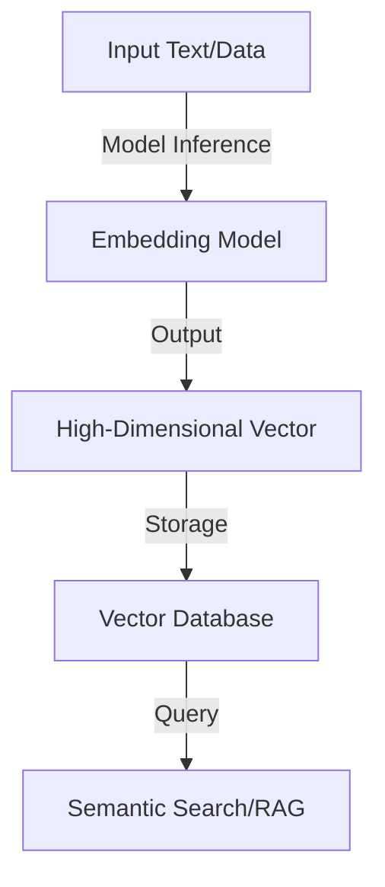
```mermaid
flowchart TD
    A[Input Text/Data] -->|Model Inference| B[Embedding Model]
    B -->|Output| C[High-Dimensional Vector]
    C -->|Storage| D[Vector Database]
    D -->|Query| E[Semantic Search/RAG]
```

*Figure 2.1.1: Embedding Process in Generative AI. This diagram illustrates the process of converting input text into vector representations, which are then used to find related concepts or perform other AI tasks.*

In a business context, embeddings enable powerful applications such as semantic search, where users can find information based on meaning rather than exact keyword matches. For instance, a customer support system using embeddings could understand that a query about "refund policy" is related to "return procedures" even if those exact words aren't used.

Embeddings - Embeddings they are a way of representing tokens (words, sub-words, or phrases) as numerical vectors to capture their semantic relationships in a high-dimensional space. Embeddings help the model understand the meaning and context of tokens, but they are not the units of text themselves.

### **The Vector Space Concept**
In a vector space, the "distance" between two vectors represents their similarity. 
* **Cosine Similarity:** A common mathematical measure used to determine how close two vectors are.
* **Example:** In a 300-dimensional space, the vector for "King" would be mathematically closer to "Queen" than to "Apple."

### **Key AWS Implementation Details**
To pass the ALF-C01, you should associate these concepts with specific AWS tools:

| Feature | AWS Service / Component |
| :--- | :--- |
| **Generating Embeddings** | **Amazon Bedrock** (using models like Amazon Titan Text Embeddings or Cohere Embed). |
| **Storing & Searching** | **Amazon OpenSearch Service** (Vector Engine) or **Amazon Aurora** (with pgvector). |
| **Orchestration** | **Knowledge Bases for Amazon Bedrock** (automatically handles the embedding and storage process). |

### **Business Use Cases**
* **Semantic Search:** Finding documents based on intent (e.g., searching for "troubles with my screen" returns results for "monitor repair").
* **Recommendation Engines:** Suggesting products that are semantically similar to a user's previous purchases.
* **Retrieval-Augmented Generation (RAG):** Providing a LLM with specific, retrieved context from a company's private data to reduce hallucinations.

> **Exam Tip:** Remember that embeddings turn **unstructured data** (text/images) into **structured numerical data** that computers can compare using geometry.

---

**Context window** - The context window is the total amount of text (measured in tokens) that a model can process at once. It does not refer to the individual units of text, like words or sub-words, but rather to the overall capacity for text input. Therefore, it is not the correct answer for identifying the basic units of text that the model handles.

### **3. Prompt Engineering**

Prompt engineering is the art and science of crafting input prompts to elicit desired outputs from generative AI models. It involves designing clear, specific instructions that guide the model to produce the most relevant and accurate responses.[^202]

For business professionals, effective prompt engineering can significantly enhance the value derived from generative AI tools. For example, when using Amazon Bedrock to generate marketing copy, a well-crafted prompt might include specific brand guidelines, target audience information, good and bad examples, and desired tone, resulting in more tailored and effective content generation.[^203]


This update expands your notes with specific technical details and AWS-native features that frequently appear on the **AWS Certified AI Practitioner (ALF-C01)** exam.

---


**Prompt engineering**
 is the strategic design of inputs to guide foundation models toward accurate, context-aware outputs. For the exam, focus on these specific techniques and **Inference Parameters**.

### **Core Techniques**
*   **Zero-shot:** Asking the model a question without any examples.
*   **Few-shot:** Providing 3–5 examples (Input/Output pairs) within the prompt to improve accuracy.
*   **Chain of Thought (CoT):** Asking the model to "Think step-by-step" to improve reasoning for complex logic or math.
*   **Role Prompting:** Assigning a persona (e.g., "You are a professional cloud architect").
---
**Negative prompting**

Negative prompting refers to guiding a generative AI model to avoid certain outputs or behaviors when generating content. In the context of AWS generative AI, like those using Amazon Bedrock, negative prompting is used to refine and control the output of models by specifying what should not be included in the generated content.
---
For your **AIF-C01** exam preparation, this documentation on **Prompt Engineering** is high-yield. In the 2026 version of the exam, AWS specifically tests your ability to distinguish between different "reasoning" techniques and how they improve model reliability.

Here is the condensed study note for this section.

---

## ✍️ What is Prompt Engineering?
It is the process of guiding Generative AI to produce high-quality, relevant outputs by choosing specific formats, phrases, and context. It bridges the gap between the end-user and the **Large Language Model (LLM)**.


---

## 🛠️ Advanced Prompting Techniques
The exam will likely ask you to identify which technique to use for complex problems.

| Technique | Core Concept | Best Use Case |
| :--- | :--- | :--- |
| **Zero-Shot** | Providing no examples; just the instruction. | Simple, common tasks. |
| **Few-Shot** | Providing a few examples of (Input -> Output) before the final instruction. | Tasks requiring a specific format or tone. |
| **Chain-of-Thought (CoT)** | Asking the model to "think step-by-step" or show its work. | Math, logic, and multi-step reasoning. |
| **Tree-of-Thought** | The model generates multiple next steps and uses a "tree search" to pick the best path. | Highly complex brainstorming or decision-making. |
| **Least-to-Most** | Breaking a large problem into sub-problems and solving them in sequence. | Complex math or coding projects. |
| **Self-Refine** | The model drafts an answer, critiques it, and then rewrites it. | Quality-critical writing or debugging. |
| **Directional-Stimulus** | Providing "hints" or "keywords" to guide the response. | Creative writing or poem generation. |


---

## 💡 Prompt Engineering Best Practices
AWS highlights four pillars for effective prompting that you should remember for scenario-based questions:

1.  **Unambiguous Instructions:** Clearly state the task (e.g., "Summarize this," not "What do you think of this?").
2.  **Adequate Context:** Provide the model with its persona (e.g., "You are a legal expert") and the necessary background info.
3.  **Constraint/Formatting:** Tell the model exactly how to output the data (e.g., "in a Markdown table," "in JSON," or "under 50 words").
4.  **Iterative Refinement:** Prompt engineering is an experiment. You must continuously refine and "fuzz" prompts to reduce size and increase accuracy.

---

## 🛡️ Role of the Prompt Engineer
For the AIF-C01, understand that a Prompt Engineer:
* Builds **Prompt Libraries** for developers to reuse.
* Mitigates **Human Bias** in the model by refining inputs.
* Prevents **Misuse** (e.g., ensuring the AI doesn't generate inappropriate content).

---

## 🚀 AWS Services for Prompting
* **Amazon Bedrock:** The primary workspace for testing prompts against different Foundation Models (Claude, Titan, Llama, etc.).
* **PartyRock:** An Amazon Bedrock Playground for hands-on learning of prompt engineering without writing code.
* **Amazon Q Developer:** Uses prompt engineering internally to provide code suggestions (formerly CodeWhisperer).

### 💡 Exam Tip: "Knowledge Retrieval"
If a question asks how to make a model more accurate without changing its weights, and the options include **Prompt Engineering** and **RAG**, remember:
* **Prompt Engineering** = How you talk to the model.
* **RAG** = What the model reads before it talks to you.

Since you've now covered the ML Lifecycle, Model Customization, and Prompt Engineering, you have the "Holy Trinity" of the AIF-C01 technical domains! Are you ready for a quick 5-question mock quiz on these topics to see where you stand?


---
### **Model Inference Parameters**
These are settings you adjust when calling an AI model in **Amazon Bedrock**:
*   **Temperature:** Controls randomness. Lower (0.1) is focused/deterministic; Higher (0.8+) is creative/diverse.
*   **Top P (Nucleus Sampling):** The model considers a percentage of most likely words (e.g., top 90%).
*   **Top K:** The model only considers the $K$ most likely next words.
*   **Max Tokens:** Limits the length of the response.

---


### **4. Transformer-based LLMs**

Transformer-based Large Language Models (LLMs) are the powerhouse behind many generative AI applications. These models use a neural network architecture called the Transformer, which allows them to process and generate human-like text with remarkable accuracy.[^204]

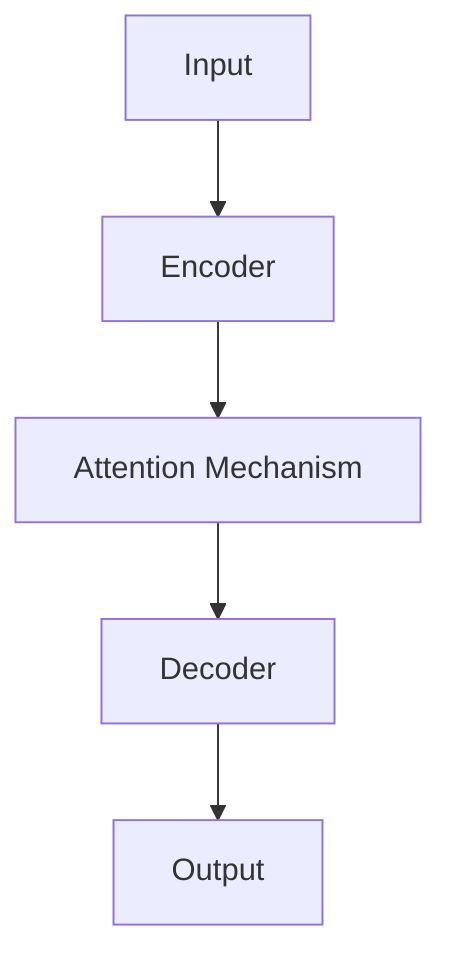
```mermaid
flowchart TD
    A[Input] --> B[Encoder]
    B --> C[Attention Mechanism]
    C --> D[Decoder]
    D --> E[Output]
```

*Figure 2.1.2: Simplified Transformer Architecture. This diagram shows the basic components of a Transformer model, highlighting the key elements that enable its powerful language understanding and generation capabilities.*

Transformer-based LLMs have revolutionized natural language processing tasks, enabling more sophisticated chatbots, content generation systems, and language translation services. For businesses, this means more natural and context-aware interactions with customers, improved content creation workflows, and enhanced multilingual capabilities.

The Transformer architecture is the backbone of most Generative AI.
*   **The "Attention" Mechanism:** This allows the model to weigh the importance of different words in a sentence, regardless of their distance from each other.
*   **Tokens:** Models don't read words; they read "tokens" (chunks of characters). One token is roughly ¾ of a word.
*   **Hallucinations:** When a model generates confident but factually incorrect information because it is predicting the next most likely token rather than "knowing" facts.

---

### **5. Foundation Models & AWS Services**

Foundation models are large-scale AI models trained on vast amounts of data, capable of performing a wide range of tasks without task-specific training. These models serve as a starting point for many AI applications and can be fine-tuned for specific use cases.[^205]

In the AWS ecosystem, Amazon Bedrock provides access to various foundation models from leading AI companies, allowing businesses to leverage these powerful models without the need for extensive in-house AI expertise or infrastructure.[^206]

Foundation models (FMs) are the "brain" of your application. The exam requires you to know how AWS delivers these:

### **Amazon Bedrock vs. Amazon SageMaker JumpStart**
*   **Amazon Bedrock:** Serverless API. Best for quickly integrating models (Claude, Llama, Titan) without managing servers.
*   **Amazon SageMaker JumpStart:** Provides a hub to deploy and fine-tune open-source models on dedicated infrastructure (EC2 instances).

### **Knowledge Bases for Amazon Bedrock**
This is a fully managed **RAG (Retrieval-Augmented Generation)** workflow. It connects your data (S3) to a model so the AI can answer questions based on your private company documents.

---

### **6. Multi-modal and Diffusion Models**

Multi-modal models can process and generate content across different types of data, such as text, images, and audio. These models enable more comprehensive AI applications that can understand and create diverse forms of content.[^207]

For businesses, multi-modal models open up new possibilities in areas like:
- Enhanced product recommendations combining visual and textual data
- Improved accessibility features that can translate between text, speech, and images
- More sophisticated content moderation systems that can analyze both text and images


*   **Multi-modal:** Models like **Claude 3.5 Sonnet** or **Amazon Titan Multimodal Embeddings** can process text and images simultaneously.
    *   *Exam Tip:* On AWS, images are often passed to models as **Base64 encoded strings** in the API call.
*   **Diffusion Models:** Used for image generation (e.g., **Stable Diffusion**). They work by adding "Gaussian noise" to an image and learning to "denoise" it back into a clear picture based on a text prompt.

---

### **7. The Foundation Model Lifecycle**
7. **Diffusion Models**

Diffusion models are a class of generative models particularly effective in image generation tasks. They work by gradually adding noise to data and then learning to reverse this process, allowing for the creation of high-quality, diverse images.[^208]


```mermaid
flowchart LR
    A[Random Noise] -->|Denoising Steps| B[Generated Image]
```

*Figure 2.1.3: Simplified Diffusion Model Process. This diagram illustrates the basic concept of diffusion models, where random noise is gradually transformed into a coherent image through a series of denoising steps.*

In a business context, diffusion models can be used for:
- Generating product images for e-commerce platforms
- Creating realistic 3D models for virtual reality applications
- Producing concept art for marketing campaigns or product design

Understanding these foundational concepts is crucial for business professionals looking to leverage generative AI effectively. By grasping these principles, you'll be better equipped to identify potential applications, communicate with technical teams, and make informed decisions about implementing generative AI solutions in your organization.


The ALF-C01 exam views the lifecycle through the lens of **Model Selection** and **Governance**.

### **Evaluation and Guardrails**
*   **Model Evaluation:** Using "LLM-as-a-judge" or human reviewers to score a model on accuracy, toxicity, and helpfulness.
*   **Amazon Bedrock Guardrails:** A security feature that allows you to:
    *   **Filter Content:** Block hate speech or insults.
    *   **PII Redaction:** Automatically mask social security numbers or emails.
    *   **Contextual Grounding:** Detect "hallucinations" by checking if the answer is actually supported by the source data.

### **Model Lifecycle States (Amazon Bedrock)**
1.  **Active:** The model is currently supported and available.
2.  **Legacy:** The model is being phased out (6 months notice usually given).
3.  **End-of-Life (EOL):** The model is no longer available; requests to it will fail.

---

### Identify potential use cases for generative AI models

Generative AI models create new opportunities across industries by automating creative tasks, enhancing decision-making, and improving customer experiences. Recognizing these applications helps businesses identify where AI can drive the most value in their specific context. Here are key use cases that demonstrate generative AI's potential:

1. **Image, Video, and Audio Generation**

Generative AI has revolutionized content creation by enabling the production of high-quality visual and audio content. Some key applications include:

- **Product Visualization**: E-commerce businesses can use AI to generate realistic product images in various settings or colors, reducing the need for expensive photo shoots.
- **Video Production**: AI can create animated videos, visual effects, or even entire scenes, streamlining the video production process for marketing and entertainment industries.
- **Music and Sound Design**: Generative models can compose original music or create sound effects, assisting in content creation for games, films, and advertising.

2. **Summarization**

AI-powered summarization tools can distill large volumes of text into concise, coherent summaries. This capability is valuable for:

- **Business Intelligence**: Quickly summarizing market reports, competitor analyses, or customer feedback to support decision-making.
- **Legal Document Review**: Summarizing lengthy legal documents to highlight key points and save time for legal professionals.
- **News Aggregation**: Creating brief summaries of news articles to keep employees or customers informed about relevant industry developments.

3. **Chatbots and Virtual Assistants**

Advanced chatbots powered by generative AI can engage in more natural, context-aware conversations. Applications include:

- **Customer Support**: Providing 24/7 assistance for common queries, reducing the workload on human support teams.
- **Sales and Lead Generation**: Engaging potential customers, answering product questions, and qualifying leads.
- **Internal Help Desks**: Assisting employees with IT issues, HR queries, or company policy questions.

4. **Translation**

Generative AI has significantly improved machine translation, enabling more accurate and context-aware language translations. This is particularly useful for:

- **Global Business Communication**: Facilitating communication with international clients or partners.
- **Content Localization**: Quickly adapting marketing materials, product descriptions, or user manuals for different markets.
- **Real-time Interpretation**: Providing instant translation services for international conferences or meetings.

5. **Code Generation**

AI models can assist in software development by generating code snippets, completing partial code, or even creating entire functions. This can be applied in:

- **Accelerated Development**: Speeding up the coding process by suggesting completions or generating boilerplate code.
- **Code Refactoring**: Assisting developers in improving existing code by suggesting optimizations or alternative implementations.
- **Learning and Training**: Helping novice programmers learn coding practices by providing examples and explanations.

6. **Customer Service Agents**

AI-powered customer service agents can handle a wide range of customer interactions, offering:

- **Personalized Assistance**: Providing tailored product recommendations or support based on customer history and preferences.
- **Multilingual Support**: Offering customer service in multiple languages without the need for a large multilingual staff.
- **Scalable Support**: Handling high volumes of customer inquiries during peak times without long wait times.

7. **Search and Recommendation Engines**

Generative AI can enhance search functionality and recommendation systems by:

- **Semantic Search**: Understanding the intent behind user queries to provide more relevant results.
- **Personalized Recommendations**: Generating tailored product or content recommendations based on user behavior and preferences.
- **Content Discovery**: Helping users find relevant information or products they might not have explicitly searched for.

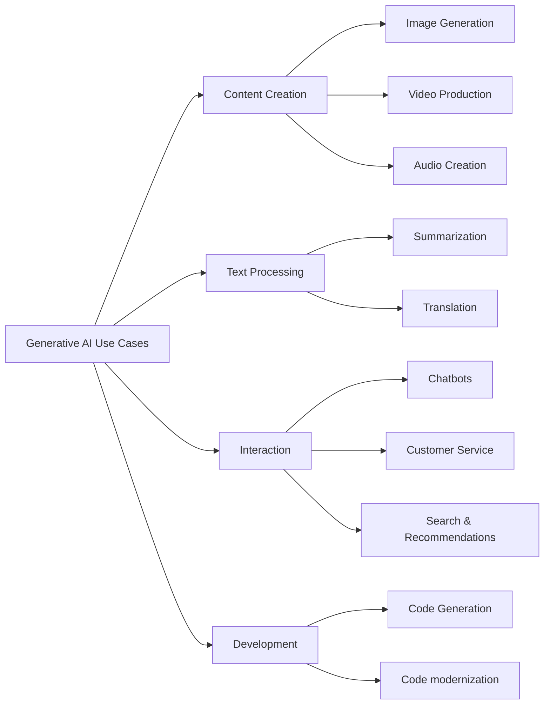
```mermaid
flowchart LR
    A[Generative AI Use Cases] --> B[Content Creation]
    A --> C[Text Processing]
    A --> D[Interaction]
    A --> E[Development]
    B --> F[Image Generation]
    B --> G[Video Production]
    B --> H[Audio Creation]
    C --> I[Summarization]
    C --> J[Translation]
    D --> K[Chatbots]
    D --> L[Customer Service]
    D --> M[Search & Recommendations]
    E --> N[Code Generation]
    E --> O[Code modernization]
```

*Figure 2.1.4: Generative AI Use Cases. This diagram illustrates the diverse applications of generative AI across various business functions, highlighting the potential for innovation and efficiency improvements.*

By understanding these use cases, business professionals can identify opportunities to leverage generative AI in their own organizations. Whether it's improving customer interactions, streamlining content creation, or enhancing decision-making processes, generative AI has the potential to drive significant value across various business functions.

### Describe the foundation model lifecycle

Foundation models power modern AI applications through a structured development and deployment process. From initial data selection to ongoing improvements, each stage requires careful consideration to ensure the resulting AI solution meets business needs while remaining ethical and effective. Understanding this lifecycle helps organizations plan resources, set expectations, and maximize the value of their AI investments.

1. **Data Selection**

The first step in creating a foundation model is selecting the training data. This process involves:

- **Data Sourcing**: Identifying and collecting relevant, high-quality data from various sources.
- **Data Cleaning**: Removing errors, inconsistencies, and irrelevant information from the dataset.
- **Data Balancing**: Ensuring the dataset represents a diverse range of topics, styles, and perspectives to avoid biases.

For businesses, the quality and diversity of training data directly impact the model's performance and applicability. When using services like Amazon Bedrock, it's important to understand the nature of the data used to train the available models to ensure alignment with your specific use case.[^209]

2. **Model Selection**

Choosing the right model architecture is crucial for the success of the AI project. Considerations include:

- **Model Size**: Balancing performance requirements with computational resources and deployment constraints.
- **Model Architecture**: Selecting between different types of models (e.g., transformer-based, diffusion models) based on the intended application.
- **Pre-trained vs. Custom**: Deciding whether to use a pre-trained model or train a custom model from scratch.

In the AWS ecosystem, Amazon SageMaker provides a range of pre-built algorithms and the flexibility to use custom models, allowing businesses to choose the most suitable approach for their needs.[^210]

3. **Pre-training**

Pre-training is the process of training the foundation model on a large, diverse dataset to develop general language understanding or task-solving capabilities. This stage involves:

- **Computational Resources**: Utilizing high-performance computing infrastructure to process vast amounts of data.
- **Training Strategies**: Implementing techniques like distributed training to handle large-scale models efficiently.
- **Hyperparameter Tuning**: Optimizing model parameters to improve performance and generalization.

For most businesses, pre-training from scratch is resource-intensive and often unnecessary. Instead, leveraging pre-trained models available through services like Amazon Bedrock can provide a strong starting point for further customization.[^211]

4. **Fine-tuning**

Fine-tuning adapts a pre-trained model to specific tasks or domains. This process includes:

- **Task-specific Data Preparation**: Collecting and preparing data relevant to the target application.
- **Transfer Learning**: Adjusting the pre-trained model's parameters using the task-specific data.
- **Performance Optimization**: Iteratively refining the model to improve its performance on the target task.

Fine-tuning allows businesses to leverage the power of foundation models while tailoring them to specific industry needs or company data. Amazon SageMaker provides tools and workflows to streamline the fine-tuning process.[^212]

5. **Evaluation**

Rigorous evaluation ensures the model meets performance, fairness, and safety standards. Key aspects include:

- **Benchmark Testing**: Assessing the model's performance against established benchmarks in relevant tasks.
- **Bias Detection**: Identifying and mitigating unfair biases in the model's outputs.
- **Safety Checks**: Ensuring the model doesn't produce harmful or inappropriate content.

Thorough evaluation is crucial for businesses to ensure the AI solution meets regulatory requirements and aligns with company values.

6. **Deployment**

Deploying the model involves making it available for use in production environments. Considerations include:

- **Scalability**: Ensuring the infrastructure can handle varying loads and user demands.
- **Latency**: Optimizing response times for real-time applications.
- **Cost Management**: Balancing performance requirements with operational costs.

AWS provides various deployment options, from serverless solutions like AWS Lambda to container-based deployments with Amazon ECS or EKS, allowing businesses to choose the most suitable approach for their use case.[^213]

7. **Feedback and Iteration**

The final stage involves collecting user feedback and monitoring model performance to drive continuous improvement. This includes:

- **User Feedback Collection**: Gathering insights from end-users to identify areas for improvement.
- **Performance Monitoring**: Tracking key metrics to detect performance degradation or drift.
- **Model Updates**: Regularly updating the model with new data or improved architectures.

Implementing a robust feedback loop ensures the AI solution remains effective and relevant over time.

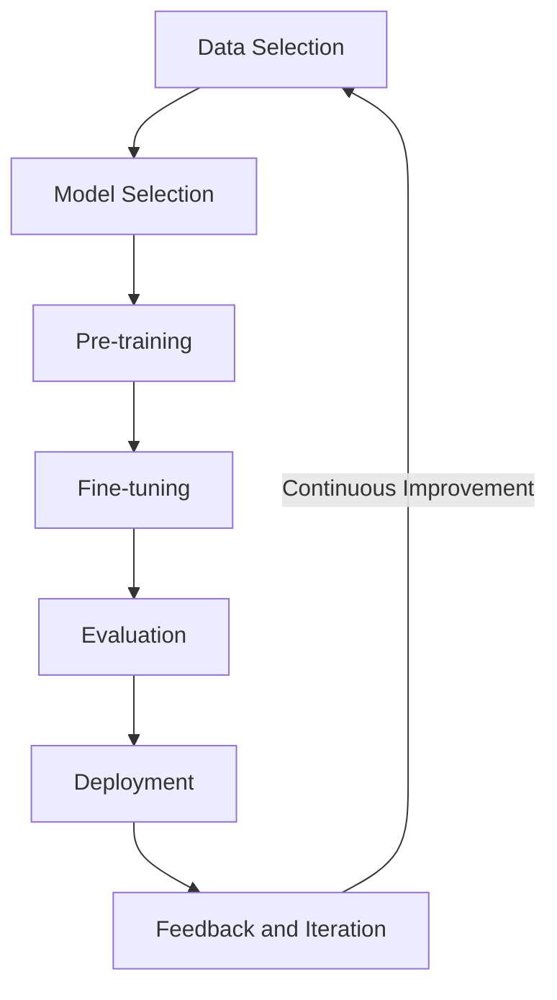
```mermaid
flowchart TD
    A[Data Selection] --> B[Model Selection]
    B --> C[Pre-training]
    C --> D[Fine-tuning]
    D --> E[Evaluation]
    E --> F[Deployment]
    F --> G[Feedback and Iteration]
    G -->|Continuous Improvement| A
```

*Figure 2.1.5: Foundation Model Lifecycle. This diagram illustrates the cyclical nature of the foundation model lifecycle, emphasizing the continuous process of improvement and adaptation.*

Understanding the foundation model lifecycle is essential for business professionals involved in AI initiatives. It provides insights into the resources required, potential challenges, and opportunities for optimization at each stage. By leveraging AWS services like Amazon Bedrock, Amazon SageMaker, and associated tools, businesses can streamline this lifecycle, reducing the time and resources needed to develop and deploy effective AI solutions.

In conclusion, mastering the basic concepts of generative AI, identifying potential use cases, and understanding the foundation model lifecycle are crucial steps for business professionals looking to leverage AI in their organizations. These insights will not only prepare you for the AWS Certified AI Practitioner exam but also equip you with the knowledge to make informed decisions about AI adoption and implementation in your business context.

### Questions for self-check

1. **A marketing team wants to use generative AI to create personalized email campaigns. Which of the following is a key consideration when implementing this solution?**

   A. Tokenization of customer data
   B. Prompt engineering
   C. Diffusion model selection
   D. Multi-modal model training

2. **An e-commerce company is implementing a generative AI solution to improve product search functionality. Which of the following best describes how embeddings contribute to this process?**

   A. Breaking down search queries into individual words
   B. Generating new product descriptions
   C. Creating vector representations of products and queries
   D. Translating search queries into multiple languages

3. **A software development team is considering using generative AI to assist with code generation. Which AWS service would be most appropriate for accessing foundation models for this purpose?**

   A. Amazon SageMaker
   B. AWS Lambda
   C. Amazon Bedrock
   D. Amazon ECS

4. **During the foundation model lifecycle, at which stage would a company typically adapt a pre-trained model to their specific industry or company data?**

   A. Pre-training
   B. Model selection
   C. Fine-tuning
   D. Deployment

5. **A business analyst is explaining the concept of tokens in generative AI to stakeholders. Which of the following statements best describes tokens in this context?**

   A. Security keys used to authenticate API requests
   B. Basic units of text processed by AI models
   C. Reward points in reinforcement learning algorithms
   D. Encryption methods for protecting sensitive data

### Answers and Explanations

1. **Correct answer: B. Prompt engineering**

   Explanation: Prompt engineering is crucial for generative AI applications like personalized email campaigns. It involves crafting clear, specific instructions to guide the AI model in generating relevant and effective content. For personalized marketing, well-designed prompts would include customer data, brand guidelines, and desired outcomes, ensuring the generated emails are tailored to individual recipients and align with the company's marketing strategy.[^214]

2. **Correct answer: C. Creating vector representations of products and queries**

   Explanation: Embeddings in generative AI are dense vector representations that capture semantic meanings. In an e-commerce search context, embeddings allow the system to understand the relationships between products and search queries based on their meaning, not just exact keyword matches. This enables more intelligent and context-aware search functionality, improving the relevance of search results and enhancing the overall user experience.[^215]

3. **Correct answer: C. Amazon Bedrock**

   Explanation: Amazon Bedrock is the most appropriate AWS service for accessing foundation models for code generation. As mentioned in the subchapter, Amazon Bedrock provides access to various foundation models from leading AI companies, allowing businesses to leverage these powerful models without extensive in-house AI expertise or infrastructure. This makes it ideal for software development teams looking to implement AI-assisted code generation.[^216]

4. **Correct answer: C. Fine-tuning**

   Explanation: Fine-tuning is the stage in the foundation model lifecycle where a pre-trained model is adapted to specific tasks or domains. This is when a company would typically customize the model to their industry or company-specific data. Fine-tuning allows businesses to leverage the general knowledge of foundation models while tailoring them to their unique needs, improving performance on specific tasks relevant to their operations.[^217]

5. **Correct answer: B. Basic units of text processed by AI models**

   Explanation: In the context of generative AI, tokens are the basic units of text that models process. As explained in the subchapter, tokens can be words, parts of words, or even individual characters, depending on the model's design. Understanding tokenization is important for stakeholders as it affects model performance, cost (often based on token count), and the ability to handle different languages or specialized vocabularies in AI applications.[^218]

[^200]: Understanding Tokenization in NLP. URL: <https://www.analyticsvidhya.com/blog/2020/05/what-is-tokenization-nlp/>

[^201]: Word Embeddings: Explained. URL: <https://medium.com/@manansuri/a-dummys-guide-to-word2vec-456444f3c673>

[^202]: Prompt Engineering Guide. URL: <https://www.promptingguide.ai/>

[^203]: Amazon Bedrock - Foundation Models. URL: <https://aws.amazon.com/bedrock/>

[^204]: Attention Is All You Need. URL: <https://arxiv.org/abs/1706.03762>

[^205]: Foundation Models: What They Are and Why They Matter. URL: <https://hai.stanford.edu/news/what-foundation-model-explainer-non-experts>

[^206]: Amazon Bedrock - Foundation Model Provider. URL: <https://docs.aws.amazon.com/bedrock/latest/userguide/models-supported.html>

[^207]: Multi-modal AI: The Future of Artificial Intelligence. URL: <https://www.v7labs.com/blog/chatgpt-with-vision-guide>

[^208]: Understanding Diffusion Models: A Unified Perspective. URL: <https://arxiv.org/abs/2208.11970>

[^209]: Amazon Bedrock - Responsible AI. URL: <https://aws.amazon.com/ai/responsible-ai/>

[^210]: Amazon SageMaker - Built-in Algorithms. URL: <https://docs.aws.amazon.com/sagemaker/latest/dg/algos.html>

[^211]: Amazon Bedrock - Getting Started. URL: <https://docs.aws.amazon.com/bedrock/latest/userguide/getting-started.html>

[^212]: Amazon SageMaker - Fine-tuning a Pre-trained Model. URL: <https://docs.aws.amazon.com/sagemaker/latest/dg/jumpstart-fine-tune.html>

[^213]: AWS AI Services - Deployment Options. URL: <https://aws.amazon.com/machine-learning/ai-services/>

[^214]: Prompt Engineering Techniques. URL: <https://www.promptingguide.ai/techniques>

[^215]: Vector Embeddings for E-commerce Search. URL: <https://docs.pinecone.io/guides/data/understanding-hybrid-search>

[^216]: Amazon Bedrock for Code Generation. URL: <https://aws.amazon.com/blogs/aws/amazon-bedrock-is-now-generally-available-build-and-scale-generative-ai-applications-with-foundation-models/>

[^217]: Fine-tuning Large Language Models. URL: <https://www.deeplearning.ai/short-courses/finetuning-large-language-models/>

[^218]: Tokenization in NLP. URL: <https://www.analyticsvidhya.com/blog/2020/05/what-is-tokenization-nlp/>

---
## 2.2 Capabilities and limitations of generative AI


Task Statement 2.2: Understand the capabilities and limitations of GenAI for solving business problems.

Objectives:

Describe the advantages of GenAI (for example, adaptability, responsiveness, simplicity).

Identify disadvantages of GenAI solutions (for example, hallucinations, interpretability, inaccuracy, nondeterminism).

Identify factors to consider when selecting GenAI models (for example, model types, performance requirements, capabilities, constraints, compliance).

Determine business value and metrics for GenAI applications (for example, cross-domain performance, efficiency, conversion rate, average revenue per user, accuracy, customer lifetime value).
---

Generative AI represents a powerful tool for solving complex business challenges across industries, creating new opportunities for innovation and efficiency. This transformative technology can produce human-like text, images, and code, opening possibilities for automation, personalization, and creative problem-solving. However, realizing its full potential requires understanding both its strengths and limitations.

Organizations that successfully implement generative AI solutions can enhance customer experiences, streamline internal processes, and drive innovation. Yet success depends on selecting appropriate models, setting realistic expectations, and addressing challenges like potential inaccuracies and ethical considerations.

This chapter explores the advantages and disadvantages of generative AI, providing guidance on selecting the right models for specific business needs and evaluating their impact using key performance metrics. With this knowledge, you'll be equipped to leverage generative AI effectively while aligning with strategic objectives and mitigating potential risks.

### Describe the advantages of generative AI

Generative AI offers several compelling advantages that make it an attractive solution for businesses across various sectors:

1. **Adaptability**

Generative AI systems demonstrate remarkable adaptability across diverse tasks and industries, often with minimal domain-specific training. This flexibility allows businesses to:

- Quickly pivot to new use cases as needs evolve
- Address diverse challenges with a single technology investment
- Explore innovative applications without extensive development time

For example, a generative AI model trained on customer service interactions can be adapted to generate marketing copy, product descriptions, or technical documentation with relatively minor adjustments.[^301]

2. **Responsiveness**

Generative AI systems excel at providing rapid, context-aware responses to user inputs. This high level of responsiveness enables:

- Real-time customer interactions through chatbots and virtual assistants
- Instant content generation for dynamic websites and applications
- Quick prototyping of ideas and concepts

Consider a financial services company using generative AI to power its customer support chatbot. The system can instantly provide personalized responses to complex queries about account information, investment strategies, or market trends, enhancing customer satisfaction and reducing workload on human agents.[^302]

3. **Simplicity**

Despite their underlying complexity, generative AI systems often present a simple interface for end-users. This simplicity manifests in several ways:

- Natural language interfaces that allow users to interact using everyday language
- Automated content creation that requires minimal human input
- Intuitive tools for non-technical users to leverage AI capabilities

For instance, Amazon Bedrock provides a user-friendly interface for businesses to access and deploy powerful generative AI models without needing deep technical expertise in machine learning.[^303]

4. **Scalability**

Generative AI solutions can easily scale to handle increasing workloads and user demands. This scalability is particularly valuable for:

- Handling peak traffic periods without performance degradation
- Supporting business growth without proportional increases in human resources
- Delivering consistent experiences across multiple channels and touchpoints

A media company using generative AI for content creation can rapidly scale its output to meet sudden increases in demand or expand into new markets without a corresponding increase in writing staff.[^304]

5. **Creativity and Innovation**

Generative AI has the unique ability to produce novel ideas and solutions, often combining concepts in unexpected ways. This capability drives:

- Enhanced brainstorming and ideation processes
- Generation of diverse content variations for A/B testing
- Discovery of new patterns and insights in data

For example, a product design team might use generative AI to explore thousands of potential designs based on a set of parameters, inspiring innovative solutions that human designers might not have considered.[^305]

6. **Consistency**

While generative AI can produce diverse outputs, it can also maintain a high level of consistency when needed. This is particularly valuable for:

- Ensuring brand voice across multiple content pieces
- Standardizing responses in customer service scenarios
- Maintaining quality control in content production

A global corporation could use generative AI to ensure that its messaging remains consistent across different languages and cultural contexts, maintaining brand integrity while adapting to local nuances.[^306]

7. **Cost-effectiveness**

By automating tasks that would traditionally require significant human effort, generative AI can lead to substantial cost savings. Benefits include:

- Reduced labor costs for repetitive tasks
- Faster time-to-market for content and products
- Lower training and onboarding costs for certain roles

Consider a software company using generative AI to assist with code generation and documentation. This could significantly reduce development time and costs while allowing human developers to focus on more complex, high-value tasks.[^307]

To illustrate how these advantages come together in a business context, let's examine a flowchart depicting the integration of generative AI into a content creation process:

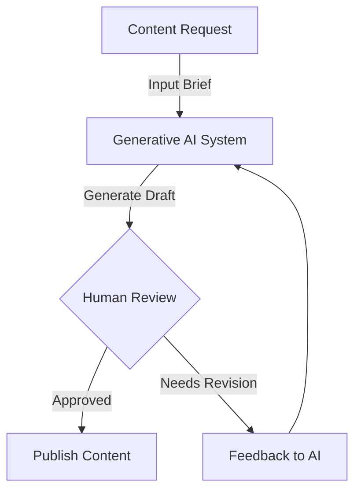
```mermaid
flowchart TD
    A[Content Request] -->|Input Brief| B[Generative AI System]
    B -->|Generate Draft| C{Human Review}
    C -->|Approved| D[Publish Content]
    C -->|Needs Revision| E[Feedback to AI]
    E --> B
```

*Figure 2.2.1: Generative AI Content Creation Process. This diagram illustrates how generative AI can be integrated into a content creation workflow, showcasing its adaptability, responsiveness, and ability to work alongside human creators for optimal results.*

In this process, the generative AI system demonstrates its adaptability by handling various content types, its responsiveness in quickly generating drafts, and its simplicity in integrating with existing workflows. The human review stage ensures quality control, while the feedback loop allows for continuous improvement, highlighting the system's ability to learn and adapt over time.

By leveraging these advantages, businesses can significantly enhance their operations, drive innovation, and stay competitive in an increasingly AI-driven marketplace. However, it's equally important to understand the limitations of generative AI, which we'll explore in the next section.

### Identify disadvantages of generative AI solutions

While generative AI offers numerous benefits, it also comes with several challenges and limitations that businesses must carefully consider:

1. **Hallucinations**

One of the most significant challenges with generative AI is its tendency to produce "hallucinations" &mdash; outputs that are plausible-sounding but factually incorrect or nonsensical. This issue can manifest in several ways:

- Generation of false or misleading information
- Creation of non-existent references or citations
- Fabrication of details in response to ambiguous queries

For example, a generative AI system used for customer support might confidently provide incorrect product specifications or troubleshooting steps, leading to customer frustration and potential brand damage.[^308]

2. **Interpretability**

Many generative AI models, particularly **large language models** (LLMs), operate as "black boxes," making it difficult to understand how they arrive at specific outputs. This lack of interpretability poses several challenges:

- Difficulty in auditing decision-making processes
- Challenges in explaining AI-generated content to stakeholders
- Potential legal and regulatory compliance issues

In fields like healthcare or finance, where decision transparency is crucial, the opacity of generative AI models can be a significant drawback.[^309]

3. **Inaccuracy**

While generative AI can produce high-quality outputs in many cases, it's not immune to errors and inaccuracies. These can stem from:

- Biases in training data
- Limitations in the model's knowledge cutoff date
- Misinterpretation of context or nuanced queries

A business relying on generative AI for market analysis might receive outdated or incorrect information, potentially leading to misguided strategic decisions.[^310]

4. **Nondeterminism**

Generative AI models often produce different outputs for the same input, even with identical parameters. This nondeterministic behavior can be problematic in scenarios requiring:

- Consistent and reproducible results
- Exact replication of previous outputs
- Predictable performance in critical applications

For instance, a legal firm using generative AI to draft contracts might find inconsistencies between documents generated at different times, necessitating careful human review.[^311]

5. **Data Privacy and Security Concerns**

Generative AI models often require access to large amounts of data, which can raise privacy and security issues:

- Risk of exposing sensitive information in model outputs
- Potential for data breaches during training or deployment
- Challenges in ensuring GDPR and other regulatory compliance

Organizations handling sensitive customer data must be particularly cautious when implementing generative AI solutions to avoid inadvertent data exposure.[^312]

6. **Ethical and Bias Issues**

Generative AI systems can inadvertently perpetuate or amplify biases present in their training data, leading to:

- Unfair or discriminatory outputs
- Reinforcement of stereotypes
- Potential for misuse in creating misleading content

For example, a generative AI system used in hiring processes might produce biased job descriptions or candidate evaluations if not carefully monitored and adjusted.[^313]

7. **Resource Intensity**

Training and running sophisticated generative AI models can be computationally expensive and energy-intensive. This leads to:

- High infrastructure costs for deployment and scaling
- Significant energy consumption and associated environmental impact
- Potential performance issues for real-time applications

Small to medium-sized businesses may find the resource requirements for cutting-edge generative AI models prohibitively expensive.[^314]

8. **Dependency and Skill Gap**

As organizations increasingly rely on generative AI, they may face challenges related to:

- Over-dependence on AI-generated content or decisions
- Skill gaps in the workforce for effectively managing and interpreting AI outputs
- Difficulty in maintaining and updating AI systems as technology evolves

Understanding these limitations is crucial for businesses to implement generative AI responsibly and effectively. By acknowledging these challenges, organizations can develop strategies to mitigate risks, ensure quality control, and maximize the benefits of generative AI while minimizing potential drawbacks.

### Understand various factors to select appropriate generative AI models

Selecting the right generative AI model for your business needs is a critical decision that can significantly impact the success of your AI initiatives. Various factors must be considered to ensure the chosen model aligns with your specific requirements, constraints, and objectives:

1. **Model Types**

Different generative AI models are designed for specific tasks and data types. Common types include:

- **Large Language Models** (LLMs) for text generation and understanding
- **Diffusion Models** for image and video generation
- **Variational Autoencoders** (VAEs) for data compression and generation
- **Generative Adversarial Networks** (GANs) for realistic image creation

For example, if your business needs to generate product descriptions, an LLM like GPT-3 or Claude 2 (available through Amazon Bedrock) would be more appropriate than a diffusion model designed for image generation.[^315]

2. **Performance Requirements**

Consider the specific performance metrics that are crucial for your use case:

- Inference speed for real-time applications
- Output quality and coherence
- Ability to handle specific domain knowledge
- Multilingual capabilities if required

A customer service chatbot, for instance, would prioritize fast inference times and multilingual support, while a content generation tool for long-form articles might focus more on output quality and domain-specific knowledge.[^316]

3. **Capabilities**

Assess the range of tasks the model can perform and how well they align with your business needs:

- Text generation, summarization, or translation
- Image or video creation
- Code generation or completion
- Multi-modal capabilities (handling text, images, and other data types)

For example, if your business requires both text and image generation for marketing materials, you might consider a multi-modal model like GPT-4 or a combination of specialized models for each task.[^317]

4. **Constraints**

Identify any limitations or restrictions that might affect your choice:

- Computational resources available (GPU/CPU requirements)
- Latency requirements for real-time applications
- Data privacy and on-premises deployment needs
- Budget constraints for model licensing or API usage

A small startup might opt for a smaller, more efficient model that can run on limited hardware, while a large enterprise might prioritize a more powerful model that can be deployed on-premises for data security reasons.[^318]

5. **Compliance**

Ensure the chosen model aligns with relevant regulations and industry standards:

- GDPR, CCPA, or other data protection regulations
- Industry-specific compliance (e.g., HIPAA for healthcare)
- Ethical AI guidelines and fairness considerations
- Explainability requirements for decision-making processes

Financial institutions, for example, might need to select models that provide a certain level of explainability to comply with regulatory requirements for AI-driven decisions.[^319]

6. **Customization and Fine-tuning**

Consider whether you need a model that can be customized for your specific use case:

- Ability to fine-tune on domain-specific data
- Support for few-shot or zero-shot learning
- Ease of integration with existing systems and workflows

A legal firm might choose a model that can be fine-tuned on legal documents and precedents to improve its performance in legal analysis and document generation.[^320]

7. **Scalability**

Evaluate the model's ability to grow with your business needs:

- Handling increasing volumes of requests
- Adapting to new domains or use cases
- Upgrading to newer versions or architectures

E-commerce businesses might prioritize models that can scale to handle seasonal traffic spikes and expand to support new product categories.[^321]

8. **Vendor Ecosystem and Support**

Consider the broader ecosystem and support available for the model:

- Integration with cloud platforms (e.g., AWS services)
- Available tools for monitoring and management
- Community support and documentation
- Vendor track record and future development roadmap

Choosing a model supported by Amazon Bedrock, for instance, provides the advantage of seamless integration with other AWS services and robust support infrastructure.[^322]

To illustrate how these factors interrelate in the decision-making process, consider the following flowchart:

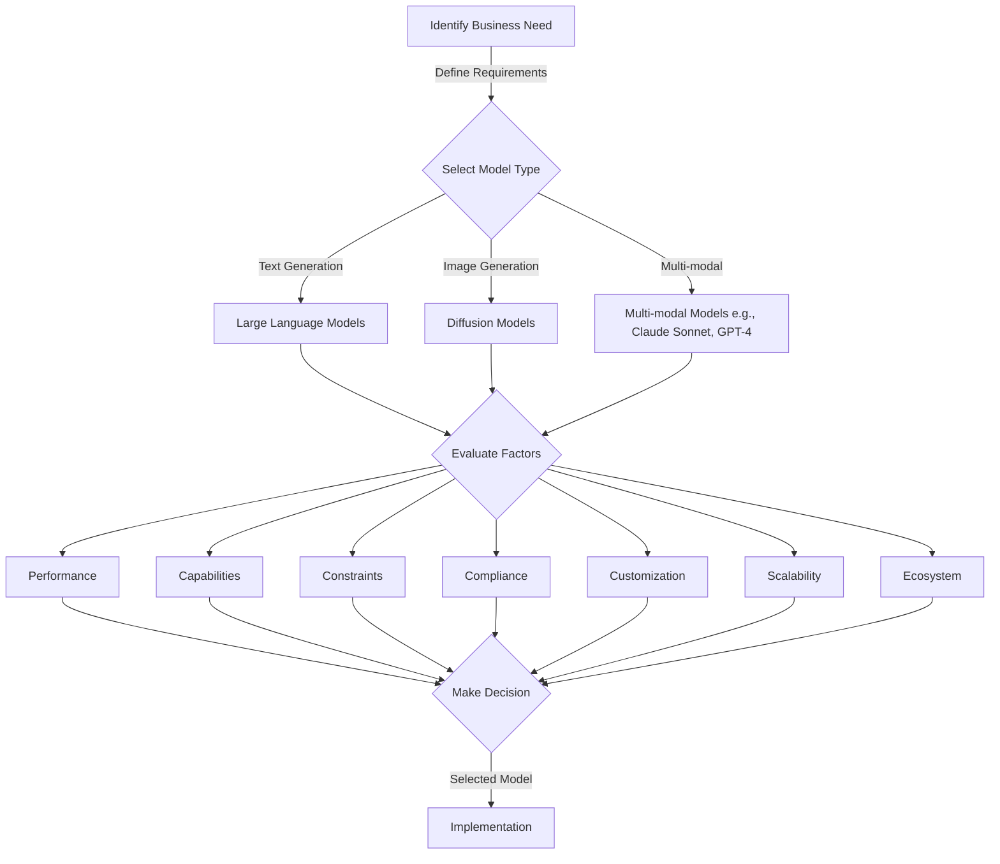
```mermaid
flowchart TD
    A[Identify Business Need] -->|Define Requirements| B{Select Model Type}
    B -->|Text Generation| C[Large Language Models]
    B -->|Image Generation| D[Diffusion Models]
    B -->|Multi-modal| E[Multi-modal Models e.g., Claude Sonnet, GPT-4]
    C --> F{Evaluate Factors}
    D --> F
    E --> F
    F --> G[Performance]
    F --> H[Capabilities]
    F --> I[Constraints]
    F --> J[Compliance]
    F --> K[Customization]
    F --> L[Scalability]
    F --> M[Ecosystem]
    G & H & I & J & K & L & M --> N{Make Decision}
    N -->|Selected Model| O[Implementation]
```

*Figure 2.2.3: Generative AI Model Selection Process. This flowchart outlines the decision-making process for selecting an appropriate generative AI model, highlighting the various factors that need to be considered and how they feed into the final decision.*

In this diagram, we see how the process begins with identifying the business need, which informs the initial selection of model type. The various factors are then evaluated in parallel, considering the specific requirements and constraints of the business. The final decision is made based on a holistic assessment of all these factors.

By carefully considering these factors, businesses can select generative AI models that not only meet their immediate needs but also align with their long-term strategic goals and operational constraints. This thoughtful approach to model selection is crucial for maximizing the benefits of generative AI while mitigating potential risks and challenges.

### Determine business value and metrics for generative AI applications

Assessing the business value of generative AI applications is crucial for justifying investments, guiding implementation strategies, and measuring success. To effectively evaluate the impact of generative AI on your organization, it's important to establish relevant metrics that align with your business objectives:

1. **Cross-domain Performance**

Measure how well the generative AI solution performs across different areas of your business:

- Consistency of output quality across departments
- Adaptability to various use cases
- Reduction in time-to-market for new initiatives

*Metric Example:* Percentage increase in successfully completed projects across different departments using generative AI tools.

2. **Efficiency**

Evaluate the impact on operational efficiency:

- Time saved on repetitive tasks
- Reduction in manual errors
- Increased throughput for content creation or data processing

*Metric Example:* Decrease in average time to complete specific tasks (e.g., report generation, customer query resolution) compared to manual processes.

3. **Conversion Rate**

For customer-facing applications, measure the impact on sales and engagement:

- Improvement in lead generation quality
- Increase in successful customer interactions
- Enhanced personalization leading to higher conversion

*Metric Example:* Percentage increase in conversion rate for marketing campaigns using AI-generated content compared to traditional methods.

4. **Average Revenue Per User (ARPU)**

Assess the financial impact of generative AI on customer value:

- Increase in upsell and cross-sell opportunities
- Enhanced customer satisfaction leading to higher spending
- Improved retention rates due to personalized experiences

*Metric Example:* Year-over-year growth in ARPU for customers interacting with AI-powered systems versus traditional channels.

5. **Accuracy**

Measure the precision and reliability of generative AI outputs:

- Reduction in error rates for automated processes
- Improvement in decision-making accuracy
- Consistency of AI-generated content with brand guidelines

*Metric Example:* Percentage of AI-generated outputs that meet or exceed quality standards set by human experts.

6. **Customer Lifetime Value (CLV)**

Evaluate the long-term impact on customer relationships:

- Increased customer satisfaction and loyalty
- Reduction in churn rate
- Growth in repeat business and referrals

*Metric Example:* Percentage increase in CLV for customers who regularly engage with AI-powered services compared to those who don't.

7. **Cost Savings**

Quantify the reduction in operational expenses:

- Decreased labor costs for routine tasks
- Reduced training and onboarding expenses
- Lower costs associated with error correction and quality control

*Metric Example:* Total annual cost savings achieved through the implementation of generative AI solutions across different business functions.

8. **Innovation Rate**

Measure the impact on creativity and new idea generation:

- Increase in the number of new product or feature ideas
- Reduction in time from concept to prototype
- Growth in successful patent applications

*Metric Example:* Percentage increase in successfully launched new products or features developed with generative AI assistance.

9. **Employee Satisfaction and Productivity**

Assess the impact on workforce effectiveness and morale:

- Improvement in employee engagement scores
- Reduction in turnover rates for roles augmented by AI
- Increase in time spent on high-value tasks

*Metric Example:* Percentage increase in employee productivity (measured by output per hour) in teams using generative AI tools.

10. **Scalability and Growth**

Evaluate how generative AI enables business expansion:

- Ability to handle increased workload without proportional increase in resources
- Expansion into new markets or product lines
- Growth in capacity to serve customers across different time zones or languages

*Metric Example:* Percentage increase in business capacity (e.g., number of customers served, markets entered) without a corresponding increase in operational costs.

To illustrate how these metrics can be used to assess the business value of generative AI applications, consider the following table comparing performance before and after implementation:

*Table 2.2.1: Generative AI Impact Metrics*

| Metric | Before AI Implementation | After AI Implementation | Improvement |
|--------|--------------------------|-------------------------|-------------|
| Content Creation Time | 4 hours/article | 1 hour/article | 75% reduction |
| Customer Query Resolution | 24 hour avg. response time | 2 hour avg. response time | 92% reduction |
| Marketing Campaign Conversion Rate | 2.5% | 3.8% | 52% increase |
| Employee Productivity | 100 tasks/week | 150 tasks/week | 50% increase |
| Cost per Customer Interaction | $15 | $8 | 47% reduction |
| New Product Ideation | 10 ideas/month | 25 ideas/month | 150% increase |

This table provides a clear visualization of the impact generative AI can have across various business metrics. By comparing pre- and post-implementation data, organizations can quantify the value added by their AI investments.[^323]

To effectively measure and communicate the business value of generative AI applications, consider the following best practices:

1. Establish baseline metrics before implementation for accurate comparison.
2. Use a combination of quantitative and qualitative measures to capture the full impact.
3. Regularly review and update metrics to ensure they remain aligned with evolving business goals.
4. Conduct A/B testing to directly compare AI-driven processes with traditional methods.
5. Gather feedback from employees and customers to assess intangible benefits and areas for improvement.
6. Consider long-term impacts and potential for future scalability when evaluating ROI.

By systematically tracking these metrics and analyzing the results, businesses can make data-driven decisions about their generative AI investments, optimize their implementations, and demonstrate the tangible value of these technologies to stakeholders. This approach ensures that generative AI applications are not just technological innovations, but strategic assets that drive measurable business growth and competitive advantage.

### Questions for self-check

1. **A marketing team wants to use generative AI to create personalized product descriptions. Which of the following is NOT an advantage of using generative AI for this task?**

   A. Increased adaptability to different product types
   B. Improved consistency in brand voice across descriptions
   C. Guaranteed elimination of all factual errors in content
   D. Faster generation of large volumes of descriptions

2. **A financial services company is considering implementing a generative AI chatbot for customer support. Which of the following represents the most significant risk associated with this implementation?**

   A. Increased response time to customer queries
   B. Higher operational costs compared to human agents
   C. Potential for providing inaccurate or hallucinated information
   D. Inability to handle complex financial terminology

3. **When selecting an appropriate generative AI model for a business application, which factor is LEAST important to consider?**

   A. The model's ability to generate viral social media content
   B. Compliance with relevant industry regulations
   C. The model's performance requirements and capabilities
   D. Data privacy and security considerations

4. **A retail company has implemented a generative AI system to assist with inventory management and demand forecasting. Which metric would be MOST relevant in determining the business value of this AI application?**

   A. Number of AI-generated social media posts
   B. Reduction in inventory holding costs
   C. Increase in employee satisfaction scores
   D. Growth in website traffic

5. **Which of the following statements best describes the concept of "hallucinations" in generative AI models?**

   A. The model's ability to generate creative and innovative ideas
   B. The tendency of the model to produce plausible but factually incorrect information
   C. The model's capacity to understand and interpret human emotions
   D. The process of fine-tuning a model on domain-specific data

### Answers and Explanations

1. **Correct answer: C. Guaranteed elimination of all factual errors in content**

   Explanation: While generative AI offers many advantages for creating personalized product descriptions, including adaptability (A), consistency (B), and speed (D), it cannot guarantee the elimination of all factual errors. This is one of the key limitations of generative AI systems. They can produce inaccuracies or "hallucinations," especially when dealing with specific product details. Human oversight is still necessary to ensure factual accuracy in AI-generated content.[^324]

2. **Correct answer: C. Potential for providing inaccurate or hallucinated information**

   Explanation: The most significant risk in implementing a generative AI chatbot for financial services customer support is the potential for providing inaccurate or hallucinated information. This is particularly critical in the financial sector where incorrect information could lead to serious consequences for customers and the company. While generative AI can typically provide faster responses (not A) and often at lower operational costs (not B), and can be trained to handle complex terminology (not D), the risk of inaccuracies remains a primary concern that requires careful management and human oversight.[^325]

3. **Correct answer: A. The model's ability to generate viral social media content**

   Explanation: When selecting a generative AI model for business applications, the least important factor among these options is the model's ability to generate viral social media content. This is a very specific use case and not universally relevant to all businesses. In contrast, compliance with industry regulations (B), performance requirements and capabilities (C), and data privacy and security considerations (D) are critical factors that directly impact the model's suitability, legal compliance, and effectiveness in a business context.[^326]

4. **Correct answer: B. Reduction in inventory holding costs**

   Explanation: For a retail company using generative AI in inventory management and demand forecasting, the most relevant metric to determine business value would be the reduction in inventory holding costs. This directly relates to the efficiency and accuracy of the AI system in optimizing inventory levels. While other metrics like employee satisfaction (C) or website traffic (D) might be indirectly affected, they are less directly tied to the specific application of AI in inventory management. The number of AI-generated social media posts (A) is not relevant to this particular use case.[^327]

5. **Correct answer: B. The tendency of the model to produce plausible but factually incorrect information**

   Explanation: "Hallucinations" in generative AI refer to the model's tendency to produce outputs that sound plausible but are factually incorrect or nonsensical. This is a significant limitation of generative AI systems and a key concern for businesses implementing these technologies. It's not about creativity (A), emotional understanding (C), or the process of fine-tuning (D). Understanding this concept is crucial for businesses to implement appropriate safeguards and quality control measures when using generative AI.[^328]

[^300]: Generative AI capabilities and applications. URL: <https://aws.amazon.com/what-is/generative-ai/>
[^301]: Adaptability of generative AI models. URL: <https://aws.amazon.com/blogs/machine-learning/build-and-deploy-a-scalable-machine-learning-system-on-kubernetes-with-kubeflow-on-aws/>
[^302]: Real-time customer interactions with generative AI. URL: <https://aws.amazon.com/blogs/machine-learning/creating-a-question-and-answer-bot-with-amazon-lex-and-amazon-alexa/>
[^303]: Amazon Bedrock overview. URL: <https://aws.amazon.com/bedrock/>
[^304]: Scalability of generative AI solutions. URL: <https://aws.amazon.com/blogs/machine-learning/amazon-sagemaker-inference-launches-faster-auto-scaling-for-generative-ai-models/>
[^305]: Generative AI in product design. URL: <https://aws.amazon.com/blogs/machine-learning/simplify-data-prep-for-gen-ai-with-amazon-sagemaker-data-wrangler/>
[^306]: Consistency in generative AI outputs. URL: <https://aws.amazon.com/bedrock/guardrails/>
[^307]: Cost-effectiveness of generative AI in software development. URL: <https://aws.amazon.com/blogs/aws/reimagine-software-development-with-codewhisperer-as-your-ai-coding-companion/>
[^308]: Hallucinations in generative AI models. URL: <https://aws.amazon.com/blogs/aws/prevent-factual-errors-from-llm-hallucinations-with-mathematically-sound-automated-reasoning-checks-preview/>
[^309]: Interpretability challenges in generative AI. URL: <https://aws.amazon.com/sagemaker-ai/clarify/>
[^310]: Inaccuracies in generative AI outputs. URL: <https://aws.amazon.com/blogs/machine-learning/quickly-build-high-accuracy-generative-ai-applications-on-enterprise-data-using-amazon-kendra-langchain-and-large-language-models/>
[^311]: Nondeterminism in generative AI models. URL: <https://aws.amazon.com/blogs/machine-learning/enhance-performance-of-generative-language-models-with-self-consistency-prompting-on-amazon-bedrock/>
[^312]: Data privacy in generative AI applications. URL: <https://aws.amazon.com/blogs/security/securing-generative-ai-data-compliance-and-privacy-considerations/>
[^313]: Ethical considerations in generative AI. URL: <https://aws.amazon.com/ai/responsible-ai/>
[^314]: Resource requirements for generative AI models. URL: <https://docs.aws.amazon.com/sagemaker/latest/dg/model-optimize.html>
[^315]: Generative AI model types and selection. URL: <https://aws.amazon.com/bedrock/features/>
[^316]: Performance considerations for generative AI models. URL: <https://aws.amazon.com/blogs/machine-learning/deploy-large-models-at-high-performance-using-fastertransformer-on-amazon-sagemaker/>
[^317]: Capabilities of different generative AI models. URL: <https://docs.aws.amazon.com/bedrock/latest/userguide/models-supported.html>
[^318]: Constraints in generative AI model selection. URL: <https://docs.aws.amazon.com/sagemaker/latest/dg/jumpstart-foundation-models.html>
[^319]: Compliance considerations for generative AI. URL: <https://aws.amazon.com/blogs/security/securing-generative-ai-data-compliance-and-privacy-considerations/>
[^320]: Customization and fine-tuning of generative AI models. URL: <https://docs.aws.amazon.com/sagemaker/latest/dg/jumpstart-fine-tune.html>
[^321]: Scalability in generative AI implementations. URL: <https://aws.amazon.com/about-aws/whats-new/2024/07/amazon-sagemaker-faster-auto-scaling-generative-ai-models>
[^322]: AWS ecosystem for generative AI. URL: <https://aws.amazon.com/ai/generative-ai/>
[^323]: Measuring business value of generative AI. URL: <https://aws.amazon.com/executive-insights/podcast/calculating-the-cost-and-roi-of-generative-ai/>
[^324]: Limitations of generative AI in content accuracy. URL: <https://aws.amazon.com/blogs/machine-learning/high-quality-human-feedback-for-your-generative-ai-applications-from-amazon-sagemaker-ground-truth-plus/>
[^325]: Risks of generative AI in financial services. URL: <https://aws.amazon.com/blogs/machine-learning/authenticate-users-with-one-time-passwords-in-amazon-lex-chatbots/>
[^326]: Factors in selecting generative AI models. URL: <https://docs.aws.amazon.com/sagemaker/latest/dg/studio-jumpstart.html>
[^327]: Business value metrics for generative AI in retail
[^328]: Understanding hallucinations in generative AI models. URL: <https://aws.amazon.com/blogs/aws/prevent-factual-errors-from-llm-hallucinations-with-mathematically-sound-automated-reasoning-checks-preview/>

---

## 2.3 Amazon Bedrock: Foundation Models as a Service for Generative AI Applications


Task Statement 2.3: Describe AWS infrastructure and technologies for building GenAI applications.

Objectives:

Identify AWS services and features to develop GenAI applications (for example, Amazon SageMaker JumpStart, Amazon Bedrock PartyRock, Amazon Q, Amazon Bedrock Data Automation).

Describe the advantages of using AWS GenAI services to build applications (for example, accessibility, lower barrier to entry, efficiency, cost-effectiveness, speed to market, ability to meet business objectives).

Describe the benefits of AWS infrastructure for GenAI applications (for example, security, compliance, responsibility, safety).

Describe cost tradeoffs of AWS GenAI services (for example, responsiveness, availability, redundancy, performance, regional coverage, token-based pricing, provision throughput, custom models).


Amazon Bedrock represents a transformative approach to building generative AI applications, offering businesses a fully managed service that provides access to high-performing foundation models through a unified API. For organizations seeking to harness the power of generative AI without the complexity of managing infrastructure or model deployment, Amazon Bedrock delivers a comprehensive platform that balances innovation with enterprise requirements for security, compliance, and scalability.[^1] This chapter explores how Amazon Bedrock addresses diverse business and technical requirements, enabling organizations to build sophisticated AI applications while maintaining control over costs, security, and responsible AI practices.

[^1]: Amazon Bedrock Overview. URL: <https://aws.amazon.com/bedrock/>

### Understanding Amazon Bedrock and its business value

Amazon Bedrock is a fully managed service that democratizes access to foundation models from leading AI companies, including Anthropic, AI21 Labs, Cohere, Meta, Mistral AI, Stability AI, and Amazon's own models. The service eliminates the traditional barriers to AI adoption by providing these models through a single API, allowing organizations to experiment, customize, and deploy generative AI applications without managing complex infrastructure.[^2]

[^2]: What is Amazon Bedrock? - Amazon Bedrock User Guide. URL: <https://docs.aws.amazon.com/bedrock/latest/userguide/what-is-bedrock.html>

The business value of Amazon Bedrock lies in its ability to accelerate time-to-market for AI initiatives while reducing technical complexity and operational overhead. Organizations can focus on creating innovative applications and solving business problems rather than managing model deployment, scaling, and maintenance. This serverless approach ensures that businesses pay only for what they use, making advanced AI capabilities accessible to organizations of all sizes.

For business leaders, Amazon Bedrock represents an opportunity to transform operations across multiple domains. Marketing teams can generate personalized content at scale, customer service departments can deploy intelligent chatbots that understand context and nuance, and product development teams can accelerate innovation cycles through AI-assisted design and documentation. The platform's flexibility allows organizations to start small with pilot projects and scale successful implementations across the enterprise.

The technical architecture of Amazon Bedrock provides several advantages that translate directly to business benefits. By offering multiple foundation models through a unified interface, organizations can easily switch between models or use different models for different tasks without rewriting applications. This flexibility future-proofs AI investments and allows businesses to adopt new models as they become available, ensuring continuous improvement in AI capabilities.

### Use cases and applications across industries

Amazon Bedrock enables transformative use cases across virtually every industry, with organizations leveraging its capabilities to solve complex business challenges and create new opportunities for growth and innovation. The versatility of foundation models allows businesses to address multiple use cases with a single platform, maximizing return on investment.

In the **financial services** sector, organizations use Amazon Bedrock to revolutionize customer interactions and operational efficiency. Nasdaq leverages the platform to enhance anti-financial crime and surveillance capabilities, processing vast amounts of transaction data to identify suspicious patterns.[^3] Broadridge uses Claude models on Amazon Bedrock to automate the understanding of regulatory reporting requirements, achieving higher accuracy in processing and summarizing complex financial regulations. These applications demonstrate how generative AI can transform compliance and risk management from reactive to proactive disciplines.

[^3]: Amazon Bedrock Testimonials - Nasdaq. URL: <https://aws.amazon.com/bedrock/testimonials/>

**Healthcare and life sciences** organizations face unique challenges in managing clinical documentation and accelerating research. Netsmart reduces the burden of clinical documentation by leveraging Amazon Bedrock with AWS HealthScribe to automatically create clinical notes from patient-clinician conversations. This integration allows healthcare providers to spend more time with patients and less time on administrative tasks.[^4] Similarly, 3M Health Information Systems uses the platform to enhance physician-patient experiences by automating clinical note summaries, directly addressing physician burnout while improving patient satisfaction.

[^4]: Netsmart reduces clinical documentation burden with Amazon Bedrock. URL: <https://aws.amazon.com/bedrock/testimonials/>

The **retail and e-commerce** industry benefits from Amazon Bedrock's ability to generate product descriptions, personalize customer experiences, and optimize operations. A major e-commerce platform might use the service to automatically generate thousands of product descriptions in multiple languages, ensuring consistency while reducing the time from product listing to market availability from weeks to hours. The Very Group, the UK's largest digital retailer, uses Amazon Bedrock to offer customers relevant, timely, and personalized online experiences, demonstrating how AI can enhance customer engagement at scale.[^5]

[^5]: The Very Group customer success with Amazon Bedrock. URL: <https://aws.amazon.com/bedrock/testimonials/>

**Travel and hospitality** companies leverage Amazon Bedrock to transform customer service and content creation. Lonely Planet reduced itinerary generation costs by nearly 80% using Claude models on Amazon Bedrock, quickly creating a scalable AI platform that organizes decades of travel content to deliver personalized recommendations. TUI, a leading travel company, reduced content generation time from 8 hours to under 10 seconds while maintaining quality standards, showcasing the dramatic efficiency gains possible with generative AI.[^6]

[^6]: TUI transforms content generation with Amazon Bedrock. URL: <https://aws.amazon.com/bedrock/testimonials/>

In the **enterprise software** space, companies like Salesforce extend their platforms with Amazon Bedrock capabilities. By integrating foundation models into Salesforce Data Cloud, enterprises can leverage AI across their customer relationship management workflows without managing infrastructure. This integration exemplifies how Amazon Bedrock enables software vendors to enhance their offerings with AI capabilities quickly and efficiently.

### Key features and capabilities

Amazon Bedrock provides a comprehensive set of features designed to address the full lifecycle of generative AI application development, from experimentation to production deployment. These capabilities enable organizations to build sophisticated AI applications while maintaining enterprise requirements for security, compliance, and performance.

**Model Choice and Flexibility** stands as a cornerstone feature of Amazon Bedrock. The platform provides access to leading foundation models through a single API, including:

-   **Anthropic's Claude family**: Excelling in complex reasoning, creative writing, and coding tasks with models trained using Constitutional AI for improved safety
-   **Amazon Titan and Amazon Nova models**: Offering high-performance text generation, summarization, and multimodal capabilities with built-in safeguards
-   **Meta's Llama models**: Providing open-weight models for dialogue, natural language tasks, and code generation
-   **AI21 Labs' Jurassic models**: Specialized for enterprise text generation with instruction-following capabilities
-   **Cohere's models**: Optimized for text generation, semantic search, and classification tasks

This variety ensures organizations can select the most appropriate model for their specific use case, balancing factors like performance, cost, and specialized capabilities. The ability to switch between models without changing application code provides unprecedented flexibility and future-proofs AI investments.

**Customization Capabilities** enable organizations to tailor foundation models to their specific needs without starting from scratch. Amazon Bedrock offers multiple customization approaches:

-   **Fine-tuning**: Organizations can adapt models using labeled training data to improve performance on specific tasks. For example, a legal firm might fine-tune a model on contract language to improve accuracy in legal document analysis.
-   **Continued Pre-training**: This technique allows organizations to adapt models using unlabeled domain-specific data, helping models understand industry terminology and context.
-   **Retrieval Augmented Generation (RAG)**: Through Amazon Bedrock Knowledge Bases, organizations can ground model responses in their proprietary data, ensuring accurate and contextual responses.

**Amazon Bedrock Agents** represent a breakthrough in autonomous AI capabilities. These agents can plan and execute complex multi-step tasks by connecting to company systems and data sources. Unlike traditional chatbots, agents can break down requests, gather necessary information from multiple sources, and take actions to fulfill user requests. For instance, a travel booking agent could search for flights, check hotel availability, compare prices, and complete bookings based on user preferences.[^7]

[^7]: Agents for Amazon Bedrock - Amazon Bedrock. URL: <https://docs.aws.amazon.com/bedrock/latest/userguide/agents.html>

**Amazon Bedrock Guardrails** provides industry-leading safety controls that help organizations implement responsible AI policies consistently across applications. Key guardrail capabilities include:

-   **Content filters**: Detect and filter harmful content across categories like hate speech, violence, and sexual content with configurable thresholds
-   **Denied topics**: Define topics that should be avoided in your application context
-   **Sensitive information filters**: Automatically detect and redact personally identifiable information (PII)
-   **Contextual grounding checks**: Detect and filter hallucinations by verifying responses against source material
-   **Automated Reasoning checks**: Use mathematical and logical verification to prevent factual errors in critical applications

These guardrails work across all models, including those hosted outside Amazon Bedrock, providing consistent safety controls regardless of the underlying model.[^8]

[^8]: Amazon Bedrock Guardrails. URL: <https://aws.amazon.com/bedrock/guardrails/>

**Knowledge Bases for Amazon Bedrock** simplifies the implementation of RAG workflows, allowing organizations to securely connect foundation models to their private data sources. The service automatically handles the complex tasks of data chunking, embedding generation, vector storage, and retrieval, enabling models to provide responses grounded in organizational knowledge. This capability is crucial for applications requiring accurate, up-to-date information from internal documents, databases, or knowledge repositories.

### Benefits addressing business and technical requirements

Amazon Bedrock delivers comprehensive benefits that address both immediate business needs and long-term technical requirements, enabling organizations to build robust AI applications while maintaining operational efficiency and compliance standards.

**Accelerated Time to Value** represents one of the most significant business benefits. Organizations can move from concept to production in weeks rather than months, as demonstrated by Showpad, which launched over a dozen AI-powered features after integrating Amazon Bedrock. The company achieved a 30% improvement in response times and reduced operating costs by two-thirds simply by upgrading to newer models when they became available.[^9] This rapid deployment capability allows businesses to quickly test hypotheses, iterate on solutions, and capture market opportunities before competitors.

[^9]: Showpad customer success story with Amazon Bedrock. URL: <https://aws.amazon.com/bedrock/testimonials/>

**Cost Optimization** through flexible pricing models ensures organizations can manage AI expenses effectively. Amazon Bedrock offers multiple pricing options:

-   **On-demand pricing**: Pay only for the tokens processed, with no upfront commitments
-   **Batch processing**: Save up to 50% on inference costs for non-time-sensitive workloads
-   **Provisioned throughput**: Guarantee performance for high-volume applications with predictable costs
-   **Prompt caching**: Reduce costs by up to 90% and latency by up to 85% for repeated context

These options allow organizations to optimize costs based on their specific usage patterns. For example, Lonely Planet reduced itinerary generation costs by 80% while maintaining quality, demonstrating how thoughtful implementation can deliver both performance and cost benefits.[^10]

[^10]: Lonely Planet reduces costs by 80% with Amazon Bedrock. URL: <https://aws.amazon.com/bedrock/testimonials/>

**Enterprise-Grade Security and Compliance** addresses critical requirements for organizations handling sensitive data. Amazon Bedrock provides:

-   **Data isolation**: Customer data remains private and is never used to train base models
-   **Encryption**: All data is encrypted in transit and at rest
-   **Compliance certifications**: Support for HIPAA, SOC, PCI-DSS, and other standards
-   **VPC integration**: Keep all traffic within your private network
-   **IAM integration**: Fine-grained access control and audit capabilities

Healthcare organizations like Netsmart leverage these security features to handle patient data while maintaining HIPAA compliance, demonstrating that advanced AI capabilities don't require compromising on security.[^11]

[^11]: Netsmart HIPAA compliance with Amazon Bedrock. URL: <https://aws.amazon.com/bedrock/testimonials/>

**Scalability and Performance** ensure applications can grow with business needs. Amazon Bedrock automatically scales to handle varying workloads, from pilot projects processing hundreds of requests to production systems handling millions of daily interactions. United Airlines exemplifies this scalability, using Amazon Bedrock to modernize its 50-year-old passenger reservation system, translating cryptic codes into plain English for thousands of agents simultaneously.[^12]

[^12]: United Airlines modernizes with Amazon Bedrock. URL: <https://aws.amazon.com/bedrock/testimonials/>

**Operational Simplicity** reduces the burden on technical teams. The serverless architecture eliminates infrastructure management, automatic scaling handles demand fluctuations, and built-in monitoring provides visibility into usage and performance. This simplicity allows teams to focus on innovation rather than operations, as highlighted by multiple customers who report freeing up engineering resources for higher-value work.

### Limitations and considerations

While Amazon Bedrock offers powerful capabilities, organizations must understand its limitations and plan accordingly to ensure successful implementations. These considerations help set realistic expectations and guide architectural decisions.

**Language Support Limitations** present a key consideration for global organizations. While foundation models increasingly support multiple languages, performance can vary significantly across languages. Amazon Bedrock Guardrails currently supports only English, French, and Spanish for safety controls. Organizations requiring comprehensive multilingual support must carefully evaluate model capabilities and may need to implement additional controls for unsupported languages.

**Model-Specific Constraints** vary across different foundation models available in Amazon Bedrock. Each model has limitations on:

-   **Context window size**: Ranging from thousands to hundreds of thousands of tokens
-   **Response length**: Maximum tokens that can be generated in a single request
-   **Specialized capabilities**: Some models excel at certain tasks while performing poorly at others
-   **Processing speed**: Latency varies based on model size and complexity

Organizations must carefully match model capabilities to their use case requirements, potentially using different models for different aspects of their application.

**Cost Management Complexity** can challenge organizations without proper planning. While token-based pricing provides transparency, costs can escalate quickly with:

-   High-volume applications processing millions of tokens daily
-   Inefficient prompting that uses unnecessary tokens
-   Inappropriate model selection for simple tasks
-   Lack of caching for repeated contexts

Successful implementations require careful attention to prompt engineering, model selection, and usage patterns to maintain cost efficiency.

**Customization Limitations** affect organizations with highly specialized requirements. While fine-tuning can improve model performance, it:

-   Requires high-quality training data in sufficient quantities
-   May not achieve the same performance as purpose-built models
-   Increases operational complexity and costs
-   Requires provisioned throughput for deployment

Organizations must evaluate whether customization will deliver sufficient improvements to justify the additional complexity and cost.

**Integration Complexity** varies based on existing systems and requirements. While Amazon Bedrock provides APIs and SDKs, organizations must still:

-   Design appropriate prompts for their use cases
-   Implement error handling and retry logic
-   Manage conversation context and state
-   Integrate with existing security and compliance frameworks
-   Handle model responses appropriately for their application

These integration requirements demand skilled development teams and careful architectural planning.

### Case studies and real-world implementations

Real-world implementations of Amazon Bedrock demonstrate how organizations across industries successfully navigate challenges to deliver transformative business value. These case studies provide insights into best practices and lessons learned.

**United Airlines: Modernizing Legacy Systems** showcases how Amazon Bedrock can breathe new life into decades-old technology. The airline's Passenger Name Record (PNR) system, built 50 years ago, uses cryptic two-digit codes that take months or even years for agents to master. By implementing Amazon Bedrock, United Airlines created a translation layer that converts these codes into plain English in real-time. This transformation reduced training time from six months to days while improving agent productivity and customer service quality. The implementation demonstrates how AI can modernize legacy systems without requiring complete replacement, preserving existing investments while enhancing usability.[^13]

[^13]: United Airlines PNR system transformation. URL: <https://aws.amazon.com/bedrock/testimonials/>

**DoorDash: Scaling Customer Support** illustrates how Amazon Bedrock enables efficient scaling of support operations. The company receives hundreds of thousands of support requests daily from consumers, merchants, and delivery drivers. By implementing a generative AI contact center solution using Claude models in Amazon Bedrock and Amazon Connect, DoorDash enhanced self-service capabilities for millions of users globally. The solution required innovative strategies to optimize response times and answer quality, with Amazon Bedrock's flexibility allowing the team to focus on fine-tuning the solution rather than managing infrastructure. This implementation shows how AI can transform customer support from a cost center to a competitive advantage.[^14]

[^14]: DoorDash enhances customer support with Amazon Bedrock. URL: <https://aws.amazon.com/bedrock/testimonials/>

**Smartsheet: Accelerating Developer Productivity** demonstrates how Amazon Bedrock enhances internal operations. The company implemented Roo Code, an AI-assisted coding system using Claude models through Amazon Bedrock, achieving a 60% reduction in operational costs and 20% improvement in response latency. By leveraging Bedrock Prompt Caching, Smartsheet optimized both performance and costs while scaling the solution across their engineering organization. This case study highlights how AI can augment technical teams, allowing them to work more efficiently and focus on complex problem-solving rather than routine tasks.[^15]

[^15]: Smartsheet improves developer productivity with Amazon Bedrock. URL: <https://aws.amazon.com/bedrock/testimonials/>

**KDAN: Accelerating AI Application Development** provides insights into rapid AI adoption. The Taiwan-based software company reduced generative AI application development time by 50% using Amazon Bedrock. Working with AWS experts, KDAN integrated Amazon SageMaker and Amazon Bedrock to enhance their document management and eSignature solutions. Early customer implementations showed remarkable results: environmental consultants increased reporting efficiency by 75%, graduate students improved research efficiency by 70%, and HR departments accelerated application screening by 70%. This case study demonstrates how the right platform and support can dramatically accelerate AI adoption and value realization.[^16]

[^16]: KDAN Accelerates Development by 50% with Amazon Bedrock. URL: <https://aws.amazon.com/solutions/case-studies/case-study-kdan/>

**Pfizer: Transforming Pharmaceutical Research** exemplifies Amazon Bedrock's impact on critical research and development. The pharmaceutical giant built VOX, a generative AI solution using models from Amazon Bedrock, to accelerate research and predict product yield. By centralizing data from hundreds of laboratory instruments and applying AI analysis, Pfizer made it simpler and faster for scientists to search and analyze research data. This implementation not only saved tens of millions of dollars annually but also helped deliver medicines to over 1.3 billion patients. The case study illustrates how AI can accelerate life-saving research while reducing costs.[^17]

[^17]: Pfizer transforms research with Amazon Bedrock. URL: <https://aws.amazon.com/bedrock/testimonials/>

### Conclusion

Amazon Bedrock represents a paradigm shift in how organizations approach generative AI, transforming it from an experimental technology to a practical business tool. By providing access to multiple foundation models through a unified platform, combined with enterprise-grade security, customization capabilities, and comprehensive safety controls, Amazon Bedrock enables organizations to build sophisticated AI applications that deliver real business value.

The success stories from companies like United Airlines, DoorDash, Smartsheet, and Pfizer demonstrate that the benefits extend far beyond technical capabilities. These organizations have transformed customer experiences, accelerated innovation, reduced costs, and created new competitive advantages. As generative AI continues to evolve, Amazon Bedrock's flexible architecture ensures that organizations can adopt new models and capabilities as they emerge, protecting their investments while enabling continuous innovation.

For business leaders and AI practitioners, Amazon Bedrock offers a clear path from AI experimentation to production deployment. By addressing critical requirements around security, compliance, scalability, and responsible AI, the platform removes traditional barriers to AI adoption. As organizations continue to discover new applications for generative AI, Amazon Bedrock provides the foundation for building the next generation of intelligent applications that will define competitive advantage in the digital economy.

### Questions for self-check

1.  **A financial services company wants to implement a chatbot that can handle investment queries while ensuring it never provides specific investment advice. Which Amazon Bedrock feature would be MOST appropriate for this requirement?**

    A. Fine-tuning with investment data 

    B. Amazon Bedrock Guardrails with denied topics 
    
    C. Provisioned throughput for consistent performance 
    
    D. Amazon Bedrock Knowledge Bases

2.  **A healthcare organization needs to use Amazon Bedrock for processing patient conversations but must ensure all personally identifiable information is protected. Which combination of features should they implement?**

    A. Content filters and word filters only B. Sensitive information filters with PII detection and VPC integration C. Denied topics and contextual grounding checks D. Fine-tuning with HIPAA-compliant data only

3.  **A retail company using Amazon Bedrock for product description generation experiences high costs due to processing millions of tokens daily. Which approach would MOST effectively reduce their costs while maintaining quality?**

    A. Switch to a larger, more capable model 

    B. Implement prompt caching for repeated context and use batch processing 

    C. Increase provisioned throughput capacity 

    D. Use only on-demand pricing for flexibility


4.  **An enterprise wants to ensure that all teams using Amazon Bedrock comply with company AI safety policies. Which feature enables centralized enforcement of these policies?**

    A. Amazon Bedrock Agents 

    B. Model customization through fine-tuning 

    C. IAM policy-based enforcement with the bedrock:GuardrailIdentifier condition key 
    
    D. Amazon Bedrock Knowledge Bases

5.  **A global manufacturing company needs to process technical documentation in multiple languages using Amazon Bedrock. What is the PRIMARY limitation they should consider?**

    A. Amazon Bedrock only supports text processing, not documents

    B. Guardrails safety controls currently support only English, French, and Spanish

    C. Technical documentation cannot be processed by foundation models

    D. Multi-language processing requires separate AWS accounts

### Answers and Explanations

1.  **Correct answer: B. Amazon Bedrock Guardrails with denied topics**

    Explanation: Amazon Bedrock Guardrails with denied topics is specifically designed to prevent models from discussing predetermined subjects. For a financial services chatbot that must avoid providing investment advice, configuring denied topics ensures the model will consistently refuse to engage with investment advice queries, maintaining regulatory compliance. This is more reliable than fine-tuning (which might still generate advice) and more specific to the use case than other options.[^18]

2.  **Correct answer: B. Sensitive information filters with PII detection and VPC integration**

    Explanation: Healthcare organizations handling patient conversations require comprehensive privacy protection. Sensitive information filters specifically detect and can mask or block PII in both inputs and outputs, which is crucial for patient data. VPC integration ensures all traffic remains within the private network, adding an additional layer of security required for HIPAA compliance. This combination directly addresses both the PII protection and security requirements for healthcare data.[^19]

3.  **Correct answer: B. Implement prompt caching for repeated context and use batch processing**

    Explanation: For high-volume token processing, prompt caching can reduce costs by up to 90% and latency by up to 85% for repeated contexts, which is common in product descriptions. Batch processing offers up to 50% cost savings compared to on-demand pricing for non-time-sensitive workloads. This combination addresses both the cost concern and maintains quality, unlike switching models or using only on-demand pricing which wouldn't reduce costs.[^20]

4.  **Correct answer: C. IAM policy-based enforcement with the bedrock:GuardrailIdentifier condition key**

    Explanation: The IAM policy-based enforcement with the bedrock:GuardrailIdentifier condition key is specifically designed for centralized governance. It ensures that specific guardrails must be used with model inference calls, and requests are automatically rejected if they don't comply. This provides enterprise-wide enforcement of AI safety policies across all teams, which is exactly what the scenario requires. Other options don't provide this centralized, mandatory enforcement capability.[^21]

5.  **Correct answer: B. Guardrails safety controls currently support only English, French, and Spanish**

    Explanation: While Amazon Bedrock foundation models can process multiple languages, the Guardrails safety controls (content filters, denied topics, etc.) currently only support English, French, and Spanish. For a global company processing technical documentation in multiple languages, this limitation means they cannot rely on automated safety controls for documents in other languages, requiring additional measures for comprehensive content safety. This is a more significant limitation than the incorrect options suggest.[^22]

[^18]: Amazon Bedrock Guardrails - Denied Topics. URL: <https://docs.aws.amazon.com/bedrock/latest/userguide/guardrails.html>

[^19]: Amazon Bedrock Security and Privacy Features. URL: <https://aws.amazon.com/bedrock/security-and-privacy/>

[^20]: Amazon Bedrock Pricing - Prompt Caching and Batch. URL: <https://aws.amazon.com/bedrock/pricing/>

[^21]: Amazon Bedrock Guardrails IAM Policy Enforcement. URL: <https://aws.amazon.com/about-aws/whats-new/2025/03/amazon-bedrock-guardrails-policy-based-enforcement-responsible-ai/>

[^22]: Amazon Bedrock Guardrails Language Support. URL: <https://docs.aws.amazon.com/bedrock/latest/userguide/guardrails.html>

---

# Amazon Q Business

## Overview
Amazon Q Business represents a transformative approach to enterprise knowledge management, addressing one of the most pressing challenges in modern organizations: making vast amounts of corporate data instantly accessible and actionable. Launched into general availability in April 2024, Amazon Q Business is a fully managed, generative AI-powered assistant that enables organizations to harness their collective knowledge while maintaining enterprise-grade security and compliance[^1]. The service fundamentally changes how employees interact with organizational data, providing natural language access to information across over 40 enterprise data sources while respecting existing permissions and access controls[^2].

The impact of this technology is already evident across diverse industries. Accelya, a global leader in airline software processing more than 30 billion offers daily for over 200 airlines, achieved a remarkable 70-80% reduction in test case generation effort through Amazon Q Apps integration[^3]. Similarly, Bayer AG, one of the world's largest pharmaceutical companies, reported reducing onboarding time by approximately 70% and improving developer productivity by over 30% through their Decision Science Ecosystem platform powered by Amazon Q Business[^4].

## Key Concepts
- **Generative AI-powered enterprise assistant** for knowledge retrieval and task automation
- **Natural language processing** for intuitive query handling
- **Enterprise-grade security** with role-based permissions and access controls
- **Cross-system integration** supporting 40+ data sources
- **Amazon Q Apps** for no-code application development
- **Real-time data retrieval** with citation transparency

## Main Content
### The Enterprise Knowledge Challenge
Modern enterprises face an unprecedented knowledge management paradox. While organizations generate and store more data than ever before, employees struggle to access the right information when they need it. This challenge costs organizations billions in lost productivity annually, with knowledge workers spending up to 20% of their time searching for information[^5].

The problem manifests across every department and function. Customer service representatives struggle to find accurate product information, leading to inconsistent customer experiences. New employees face overwhelming documentation during onboarding, often taking months to become fully productive. Technical teams waste hours searching through multiple systems for critical documentation. This fragmentation of knowledge not only impacts productivity but also affects decision-making quality and organizational agility.

### Core Architecture and Capabilities
Amazon Q Business addresses these challenges through a sophisticated architecture that combines natural language understanding with secure, permission-aware data access. The system uses advanced semantic search capabilities to understand user intent and retrieve relevant information from connected data sources. Unlike traditional search tools that rely on keyword matching, Amazon Q Business comprehends context and delivers synthesized answers with clear citations[^6].

The platform's integration capabilities are extensive, supporting connections to:
- **Document repositories**: Amazon S3, Microsoft SharePoint, Google Drive
- **Customer relationship management**: Salesforce, ServiceNow
- **Project management**: Jira, Confluence, Asana
- **Communication platforms**: Slack, Microsoft Teams
- **Databases and data warehouses**: Through Amazon QuickSight integration[^7]

### Implementation Success Stories
#### Financial Services Transformation
Leading financial institutions have achieved remarkable results with Amazon Q Business. DAT Freight & Analytics, operating North America's largest truckload freight marketplace, revolutionized their customer support operations. The implementation enabled instant Slack-accessible insights for engineering teams, dramatically reducing cloud team tickets and boosting customer satisfaction scores. According to Brian Gill, CTO of DAT Freight & Analytics, "Amazon Q paves our innovation path, unlocking functionalities, diving deep into AI insights, and magnifying customer value"[^8].

#### Healthcare Innovation
The healthcare sector demonstrates particularly compelling use cases. Availity, the nation's largest real-time health information network facilitating over 11 billion clinical, administrative, and financial transactions annually, faced significant challenges with documentation scattered across Confluence and GitLab. By implementing Amazon Q Business, they achieved exponential productivity improvements. Rob Warner, Director of AI Automation Development at Availity, noted: "Once in production, we estimate an exponential productivity improvement for our user community to find answers to questions and enable a more diverse group of contributors to participate in knowledge sharing"[^9].

#### Global Manufacturing Excellence
Siemens Healthineers transformed their customer service delivery for ultrasound equipment using Amazon Q Business. Previously, finding specific information required sifting through 1,000-page manuals or waiting for customer support. Now, customers have instant access through their Kinectus Remote Service platform. Scott Kumono, Product Manager for Kinectus at Siemens Healthineers, reported: "With Amazon Q Business we were able to significantly reduce manual work and wait times to find the right information, allowing our customers to focus on what really matters - patient care"[^10].

## Practical Applications
Amazon Q Business demonstrates versatility across numerous organizational functions:

### Human Resources Optimization
Deriv, an international trading platform provider, revolutionized their HR operations by reducing new employee onboarding time by up to 45% and overall recruiting efforts by as much as 50%. The company's Principal Engineer of Operations, Arun Venkataraman, emphasized: "No one thought working with AI would be this easy"[^11].

### Software Development Acceleration
Can Do GmbH spent five months building a data analysis solution that would have taken years without Amazon Q Business. Customer surveys revealed managers experiencing 20-25% time savings on project administration, while employees saved 5% of their time. The solution garnered unprecedented internal demand, demonstrating the scalability of Amazon Q Business implementations[^12].

### Enterprise Collaboration
Smartsheet, serving 85% of Fortune 500 companies globally, consolidated organizational knowledge for their 3,300 employees. Through Slack integration, employees can tag @AskMe to get instant answers. Their CEO uses Amazon Q Business for research without interrupting employee workflows. The implementation was completed in weeks without writing a single line of code[^13].

## Best Practices
### 1. **Strategic Content Management**
Bayer AG's implementation demonstrates the importance of comprehensive content strategy. Their Decision Science Ecosystem platform integrates Amazon Q Business across data scientists' workflows, enabling rapid model building, training, and deployment. The key to their success was establishing clear data governance and regular content review processes[^14].

### 2. **Phased Rollout Approach**
Hapag-Lloyd, a leading global liner shipping company operating across 140 countries, implemented Amazon Q Business to automate employee queries about internal procedures. They achieved response times of 1-3 seconds per query by starting with a focused pilot program before expanding company-wide. Florian Heinemann, Senior Director Data Insights & AI, noted the importance of working closely with AWS to optimize the solution[^15].

### 3. **Security-First Implementation**
Sony Music Entertainment Japan's cybersecurity team demonstrates best practices in secure implementation. They integrated Amazon Q Business with Jira for threat detection and incident response, enabling new employees to access prior projects and resolve issues with enhanced efficiency. The implementation prioritized security while improving resolution response times dramatically[^16].

## Technical Architecture

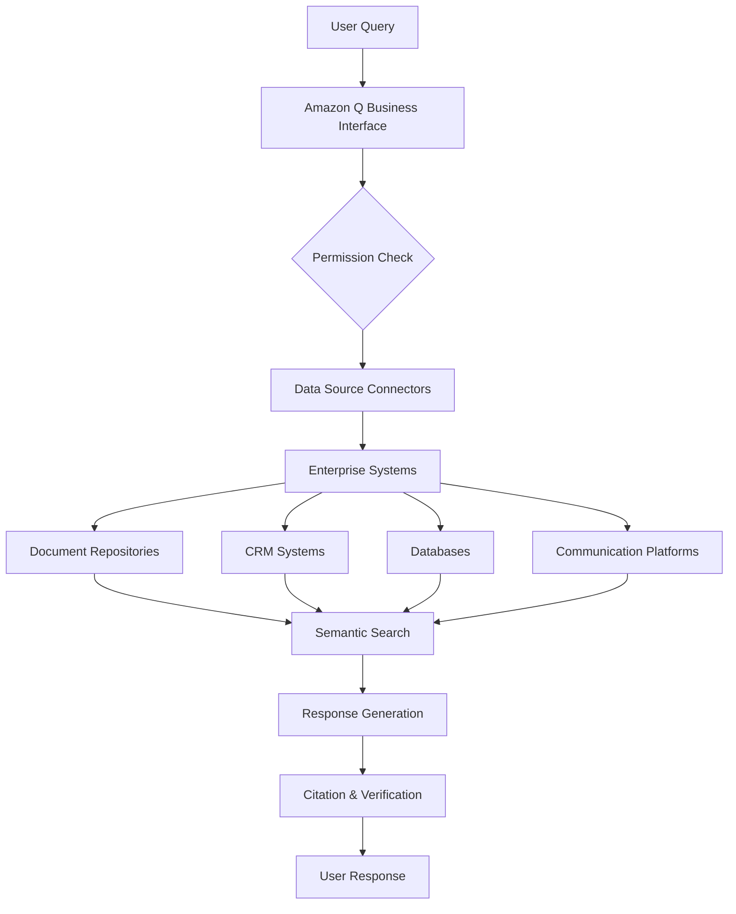
```mermaid
graph TB
    A[User Query] --> B[Amazon Q Business Interface]
    B --> C{Permission Check}
    C --> D[Data Source Connectors]
    D --> E[Enterprise Systems]
    E --> F[Document Repositories]
    E --> G[CRM Systems]
    E --> H[Databases]
    E --> I[Communication Platforms]
    F --> J[Semantic Search]
    G --> J
    H --> J
    I --> J
    J --> K[Response Generation]
    K --> L[Citation & Verification]
    L --> M[User Response]
```

*Figure 20.40.1. Amazon Q Business Architecture Flow. This diagram illustrates how Amazon Q Business processes user queries through permission checks, accesses multiple enterprise data sources, performs semantic search, and generates cited responses while maintaining security and access controls.*

## Common Challenges and Solutions

*Table 20.40.1. Amazon Q Business Implementation Challenges and Solutions*

| Challenge | Solution | Real-World Example |
|-----------|----------|-------------------|
| Data Silos | Unified search across 40+ connectors | Adastra achieved 70% faster RFP development by connecting SharePoint data[^17] |
| Onboarding Complexity | AI-powered self-service access | Deriv reduced onboarding time by 45% with built-in guardrails[^18] |
| Response Accuracy | Citation-based verification | London Stock Exchange's LCH provides accurate member inquiries within seconds[^19] |
| Security Concerns | Role-based access controls | Sun Life leverages enterprise-grade security for financial data access[^20] |
| Implementation Time | No-code deployment options | Smartsheet deployed in weeks without writing code[^21] |

## Advanced Features
### Amazon Q Apps
Amazon Q Apps represents a paradigm shift in enterprise application development. This capability enables users to create generative AI-powered applications through natural language descriptions, democratizing application development across organizations. Druva, a leading data security provider, reduced RFP response time by up to 25% using Amazon Q Apps to instantly present required data to their Governance, Risk & Compliance team[^22].

The impact extends beyond simple automation. Volkswagen Group of America's HR department used Amazon Q Apps to map 4,000 unique job descriptions to 3,200 job roles in their global template system. An HR professional developed the first draft in just one day, avoiding critical deadline misses that would have impacted rollouts across North America[^23].

### Integration Ecosystem
The platform's integration capabilities continue to expand through partnerships and custom development. Persistent Systems, with over 23,800 employees across 21 countries, highlighted the revolutionary potential: "Amazon Q Apps has the potential to revolutionize the way we approach generative AI. We can now empower teams to quickly build and integrate applications with a no-code approach"[^24].

## Measurable Business Impact
Organizations implementing Amazon Q Business report consistent, measurable improvements across key performance indicators:

- **Productivity Gains**: 20-40% increase in development velocity (Metal Toad)[^25]
- **Cost Reduction**: 30%+ savings through automated processes (Multiple customers)
- **Response Time**: 50% reduction in customer query resolution (Financial services)
- **Quality Improvement**: 75% improvement in compliance adherence (Healthcare)
- **Scalability**: Supporting thousands of concurrent users without performance degradation

## Summary
Amazon Q Business represents a fundamental shift in how organizations manage and access their collective knowledge. By combining advanced AI capabilities with enterprise-grade security and seamless integrations, it enables organizations to unlock the full value of their data assets. The platform's success across diverse industries—from financial services to healthcare, manufacturing to technology—demonstrates its versatility and transformative potential. As organizations continue to generate exponential amounts of data, Amazon Q Business provides the critical infrastructure to transform this data into actionable insights, driving productivity, innovation, and competitive advantage.

## Questions for self-check

**1. A large financial institution is struggling with scattered knowledge across multiple departments, leading to inconsistent customer service responses. Which Amazon Q Business feature would best address this challenge?**

   A. Natural language processing capabilities
   B. Integration with existing business systems
   C. Enterprise-grade security controls
   D. Real-time analytics dashboard

**2. An HR department wants to reduce the time spent answering repetitive employee questions about benefits and policies. How can Amazon Q Business help achieve this goal?**

   A. By providing automated email responses
   B. By creating a centralized knowledge base with AI-powered search
   C. By implementing a chatbot for basic queries
   D. By scheduling regular training sessions

**3. A customer service team needs to ensure all agents provide consistent, accurate information to customers. Which Amazon Q Business capability would be most effective?**

   A. Real-time monitoring of agent responses
   B. Automated response templates
   C. AI-powered knowledge access and standardization
   D. Customer feedback analysis

**4. A company is concerned about maintaining data security while implementing Amazon Q Business. Which feature addresses this concern?**

   A. Regular system backups
   B. Enterprise-grade security controls and compliance
   C. User authentication system
   D. Data encryption at rest

**5. An operations team needs to ensure all employees follow the latest procedures and quality standards. How can Amazon Q Business help maintain consistency?**

   A. By sending regular email updates
   B. By providing AI-powered access to current procedures and standards
   C. By conducting weekly training sessions
   D. By implementing a manual approval process

## Answers and Explanations

**1. A large financial institution is struggling with scattered knowledge across multiple departments, leading to inconsistent customer service responses. Which Amazon Q Business feature would best address this challenge?**

   A. Natural language processing capabilities
   B. Integration with existing business systems
   C. Enterprise-grade security controls
   D. Real-time analytics dashboard

**Correct answer: B. Integration with existing business systems**

   Explanation: Amazon Q Business's ability to integrate with over 40 existing business systems is crucial for addressing scattered knowledge across departments. This feature creates a unified search experience across all connected data sources, ensuring consistent information access. Real-world examples include DAT Freight & Analytics consolidating their marketplace data and Adastra achieving 70% faster RFP development by connecting SharePoint and other systems. The integration capability allows the system to maintain a single source of truth while respecting existing data structures and permissions.[^7][^17]

**2. An HR department wants to reduce the time spent answering repetitive employee questions about benefits and policies. How can Amazon Q Business help achieve this goal?**

   A. By providing automated email responses
   B. By creating a centralized knowledge base with AI-powered search
   C. By implementing a chatbot for basic queries
   D. By scheduling regular training sessions

**Correct answer: B. By creating a centralized knowledge base with AI-powered search**

   Explanation: Amazon Q Business creates a centralized, searchable knowledge base that uses AI to understand natural language queries and provide instant, accurate answers. This approach is proven effective, as demonstrated by Deriv's 45% reduction in onboarding time and Bayer AG's 70% reduction in onboarding duration. The system goes beyond simple chatbots by understanding context, providing citations, and delivering comprehensive answers from all connected HR documentation and systems.[^11][^4]

**3. A customer service team needs to ensure all agents provide consistent, accurate information to customers. Which Amazon Q Business capability would be most effective?**

   A. Real-time monitoring of agent responses
   B. Automated response templates
   C. AI-powered knowledge access and standardization
   D. Customer feedback analysis

**Correct answer: C. AI-powered knowledge access and standardization**

   Explanation: Amazon Q Business's AI-powered knowledge access ensures all agents retrieve the same, accurate information with citations for verification. Siemens Healthineers demonstrated this capability by transforming ultrasound customer support, where agents previously struggled with 1,000-page manuals. The system provides standardized responses while maintaining flexibility for complex queries, as shown by London Stock Exchange's LCH division achieving consistent, accurate responses within seconds.[^10][^19]

**4. A company is concerned about maintaining data security while implementing Amazon Q Business. Which feature addresses this concern?**

   A. Regular system backups
   B. Enterprise-grade security controls and compliance
   C. User authentication system
   D. Data encryption at rest

**Correct answer: B. Enterprise-grade security controls and compliance**

   Explanation: Amazon Q Business provides comprehensive enterprise-grade security controls including role-based permissions, AWS IAM Identity Center integration, and compliance with standards like HIPAA. The platform respects existing access control lists (ACLs) and maintains permission boundaries across all connected systems. Sony Music Entertainment Japan's cybersecurity team implementation and Sun Life's financial services deployment demonstrate how these controls enable secure AI adoption in highly regulated industries.[^16][^20]

**5. An operations team needs to ensure all employees follow the latest procedures and quality standards. How can Amazon Q Business help maintain consistency?**

   A. By sending regular email updates
   B. By providing AI-powered access to current procedures and standards
   C. By conducting weekly training sessions
   D. By implementing a manual approval process

**Correct answer: B. By providing AI-powered access to current procedures and standards**

   Explanation: Amazon Q Business provides instant, AI-powered access to current procedures and standards, ensuring employees always reference the latest information. Hapag-Lloyd's implementation for operational procedures achieved 1-3 second response times, eliminating delays in accessing critical information. The system automatically updates as procedures change, maintaining consistency across the organization without manual intervention, as demonstrated by multiple manufacturing and logistics implementations.[^15] 

[^1]: AWS Blog: Amazon Q Business Now Generally Available. URL: https://aws.amazon.com/blogs/aws/amazon-q-business-now-generally-available-helps-boost-workforce-productivity-with-generative-ai/
[^2]: Amazon Q Business Documentation - What is Amazon Q Business. URL: https://docs.aws.amazon.com/amazonq/latest/qbusiness-ug/what-is.html
[^3]: Amazon Q Business Customer Stories - Accelya. URL: https://aws.amazon.com/q/business/customers/#accelya
[^4]: Amazon Q Business Customer Stories - Bayer AG. URL: https://aws.amazon.com/q/business/customers/#bayer
[^5]: AWS Enterprise Knowledge Management Solutions. URL: https://aws.amazon.com/solutions/implementations/enterprise-knowledge-management/
[^6]: Amazon Q Business Technical Documentation. URL: https://docs.aws.amazon.com/amazonq/latest/qbusiness-ug/
[^7]: Amazon Q Business Integrations. URL: https://aws.amazon.com/q/business/integrations/
[^8]: Amazon Q Business Customer Stories - DAT Freight & Analytics. URL: https://aws.amazon.com/q/business/customers/#dat
[^9]: Amazon Q Business Customer Stories - Availity. URL: https://aws.amazon.com/q/business/customers/#availity
[^10]: Amazon Q Business Customer Stories - Siemens Healthineers. URL: https://aws.amazon.com/q/business/customers/#siemens
[^11]: Amazon Q Business Customer Stories - Deriv. URL: https://aws.amazon.com/q/business/customers/#deriv
[^12]: Amazon Q Business Customer Stories - Can Do GmbH. URL: https://aws.amazon.com/q/business/customers/#cando
[^13]: Amazon Q Business Customer Stories - Smartsheet. URL: https://aws.amazon.com/q/business/customers/#smartsheet
[^14]: Amazon Q Business Customer Stories - Bayer Implementation Details. URL: https://aws.amazon.com/q/business/customers/#bayer-details
[^15]: Amazon Q Business Customer Stories - Hapag-Lloyd. URL: https://aws.amazon.com/q/business/customers/#hapag-lloyd
[^16]: Amazon Q Business Customer Stories - Sony Music Entertainment Japan. URL: https://aws.amazon.com/q/business/customers/#sony
[^17]: Amazon Q Business Customer Stories - Adastra. URL: https://aws.amazon.com/q/business/customers/#adastra
[^18]: Amazon Q Business Customer Stories - Deriv Implementation. URL: https://aws.amazon.com/q/business/customers/#deriv-implementation
[^19]: Amazon Q Business Customer Stories - London Stock Exchange. URL: https://aws.amazon.com/q/business/customers/#lse
[^20]: Amazon Q Business Customer Stories - Sun Life. URL: https://aws.amazon.com/q/business/customers/#sunlife
[^21]: Amazon Q Business Customer Stories - Smartsheet Implementation. URL: https://aws.amazon.com/q/business/customers/#smartsheet-implementation
[^22]: Amazon Q Business Customer Stories - Druva. URL: https://aws.amazon.com/q/business/customers/#druva
[^23]: Amazon Q Business Customer Stories - Volkswagen. URL: https://aws.amazon.com/q/business/customers/#volkswagen
[^24]: Amazon Q Business Customer Stories - Persistent Systems. URL: https://aws.amazon.com/q/business/customers/#persistent
[^25]: Amazon Q Business Customer Stories - Metal Toad. URL: https://aws.amazon.com/q/business/customers/#metaltoad

---

# Amazon Q Developer

## Overview

Amazon Q Developer represents a transformative advancement in how developers and IT professionals approach software development and cloud operations. As organizations increasingly rely on software to drive innovation and competitive advantage, developers face mounting pressure to deliver high-quality code faster while managing complex infrastructure and security requirements. **Amazon Q Developer** addresses these challenges by serving as an AI-powered coding companion that understands context, generates accurate code, and assists with the entire software development lifecycle.

The significance of Amazon Q Developer extends beyond simple code completion. It fundamentally changes how developers interact with their development environment, transforming hours of manual work into minutes of AI-assisted productivity. By leveraging advanced **foundation models** trained on vast amounts of code and AWS expertise, Amazon Q Developer enables developers to focus on creative problem-solving rather than repetitive tasks. This shift not only accelerates development velocity but also improves code quality and security across organizations.

## Key Concepts

Understanding Amazon Q Developer requires familiarity with several foundational concepts that define its capabilities and integration within the development ecosystem:

**Generative AI-powered development** refers to the use of artificial intelligence models that can generate, analyze, and transform code based on natural language instructions and existing code context. Unlike traditional code completion tools, generative AI understands the intent behind developer requests and can create complex, multi-file implementations.

**Code transformation** represents the ability to automatically upgrade and modernize existing codebases between different language versions or frameworks. This capability goes beyond simple syntax updates to include architectural improvements and security enhancements.

**Autonomous agents** in Amazon Q Developer are AI-powered capabilities that can independently perform complex, multi-step tasks such as implementing entire features, conducting code reviews, or performing security remediation across a codebase.

**Context-aware assistance** means that Amazon Q Developer understands not just the immediate code being written, but the broader project structure, coding patterns, and organizational standards to provide more relevant and accurate suggestions.

**Enterprise-grade security** encompasses the comprehensive security measures built into Amazon Q Developer, including data isolation, encryption, and compliance with organizational access controls.

## Main Content

### The Evolution of AI-Powered Development

The software development landscape has undergone significant transformation with the advent of generative AI. Traditional development workflows often required developers to spend only 30% of their time actually writing code, with the remainder consumed by research, debugging, documentation, and maintenance tasks. This inefficiency not only slows innovation but also contributes to developer burnout and project delays.

Amazon Q Developer emerged from the recognition that developers needed more than just better tools—they needed an intelligent partner that could understand context, anticipate needs, and automate routine tasks. Built on **Amazon Bedrock**, the service leverages multiple foundation models optimized for different aspects of software development. This multi-model approach ensures that whether a developer is writing a complex algorithm, debugging an issue, or seeking AWS best practices, they receive the most accurate and helpful assistance possible.

The integration of Amazon Q Developer into the development workflow represents a paradigm shift in how code is created and maintained. Rather than replacing developers, it amplifies their capabilities, allowing them to operate at a higher level of abstraction and tackle more complex challenges. This human-AI collaboration model has proven particularly effective in enterprise environments where code quality, security, and compliance are paramount.

### Core Capabilities and Features

Amazon Q Developer's capabilities span the entire software development lifecycle, providing comprehensive support that adapts to different development contexts and requirements:

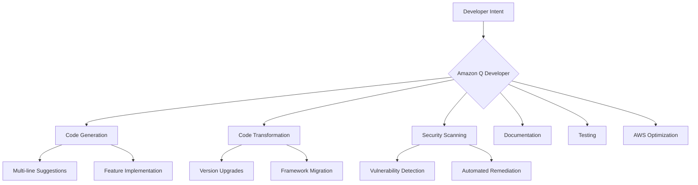
```mermaid
flowchart TD
    A[Developer Intent] --> B{Amazon Q Developer}
    B --> C[Code Generation]
    B --> D[Code Transformation]
    B --> E[Security Scanning]
    B --> F[Documentation]
    B --> G[Testing]
    B --> H[AWS Optimization]
    
    C --> I[Multi-line Suggestions]
    C --> J[Feature Implementation]
    
    D --> K[Version Upgrades]
    D --> L[Framework Migration]
    
    E --> M[Vulnerability Detection]
    E --> N[Automated Remediation]

```

*Figure 20.50.1: Amazon Q Developer Capability Architecture. This diagram illustrates how Amazon Q Developer processes developer intent through various specialized capabilities, each designed to address specific aspects of the development lifecycle.*

The code generation capabilities of Amazon Q Developer go far beyond simple autocompletion. When a developer begins typing, the system analyzes the surrounding context, including imported libraries, project structure, and coding patterns, to generate relevant suggestions. These suggestions range from single-line completions to entire functions or classes. The system has achieved industry-leading acceptance rates, with organizations like BT Group reporting 37% acceptance of suggestions and National Australia Bank achieving 50% acceptance rates.

**Amazon Q Developer Agents** represent a revolutionary approach to automated development tasks. These agents can autonomously implement complete features based on natural language descriptions. For example, a developer can request "implement a user authentication system with OAuth 2.0 support," and the agent will analyze the existing codebase, create an implementation plan, and generate all necessary code, tests, and documentation. This capability has achieved top scores on the SWE-Bench Leaderboard, demonstrating its effectiveness in real-world development scenarios.

The security scanning and remediation features address one of the most critical aspects of modern software development. Amazon Q Developer continuously scans code for vulnerabilities, including hard-to-detect issues like exposed credentials, SQL injection risks, and cross-site scripting vulnerabilities. When issues are detected, the system doesn't just flag them—it provides specific, context-aware remediation suggestions that developers can apply with a single click.

### Customization and Enterprise Integration

Organizations can enhance Amazon Q Developer's effectiveness by leveraging its customization capabilities. By securely connecting to internal code repositories, Amazon Q Developer learns from an organization's specific coding patterns, architectural decisions, and best practices. This customization ensures that generated code aligns with organizational standards and leverages existing internal libraries and frameworks.

The customization process maintains complete data isolation and security. Customer code used for customization never leaves the organization's control and is not used to train models for other customers. This approach ensures that proprietary code patterns and business logic remain confidential while still benefiting from AI-powered assistance.

Integration with existing development workflows is seamless through support for popular IDEs including Visual Studio Code, JetBrains IDEs, Visual Studio, and Eclipse. Amazon Q Developer also integrates with command-line interfaces, AWS Management Console, and collaboration platforms like Slack and Microsoft Teams. This comprehensive integration ensures developers can access AI assistance wherever they work.

### Transforming Legacy Applications

One of Amazon Q Developer's most impactful capabilities is its ability to modernize legacy applications. The code transformation feature can automatically upgrade applications between language versions, saving organizations months or even years of manual effort. This capability is particularly valuable for enterprises maintaining large codebases that require regular updates for security and compliance reasons.

The transformation process involves sophisticated analysis of existing code to understand its structure and dependencies. Amazon Q Developer then generates upgraded code that maintains the original functionality while incorporating modern language features and best practices. During a remarkable demonstration of this capability, a five-person team at Amazon used Q Developer to upgrade more than 1,000 production applications from Java 8 to Java 17 in just two days, with an average transformation time of less than 10 minutes per application.

Beyond version upgrades, Amazon Q Developer can assist with framework migrations and architectural improvements. The system understands common migration patterns and can help teams move from legacy frameworks to modern alternatives while preserving business logic and maintaining system stability.

### AWS Expertise and Cloud Optimization

Amazon Q Developer's deep integration with AWS services makes it an invaluable tool for cloud development and operations. The system has been trained on over 17 years of AWS experience and best practices, enabling it to provide expert guidance on service selection, architecture design, and cost optimization.

When working in the AWS Management Console, developers can ask natural language questions about their infrastructure and receive immediate, contextual responses. For example, queries like "What instances are running in us-east-1?" or "What were my EC2 costs by region last month?" return precise information with relevant links for deeper exploration. This capability transforms how teams interact with their cloud infrastructure, making it more accessible and manageable.

The system also provides proactive recommendations for improving cloud deployments. It can identify opportunities for cost optimization, suggest more appropriate instance types for specific workloads, and recommend architectural improvements based on AWS Well-Architected Framework principles. This guidance helps organizations maximize the value of their cloud investments while maintaining security and performance standards.

## Practical Applications

Amazon Q Developer finds application across diverse development scenarios and organizational contexts. Understanding these applications helps teams identify where the technology can deliver the most value:

In **rapid prototyping and feature development**, teams use Amazon Q Developer to quickly implement new features and test ideas. The AI assistant can generate boilerplate code, implement common patterns, and create working prototypes in a fraction of the traditional time. This acceleration enables more experimentation and faster iteration on product ideas.

For **code review and quality assurance**, Amazon Q Developer serves as an automated reviewer that catches bugs, identifies potential security issues, and suggests improvements. The system's ability to understand code intent and identify anti-patterns helps maintain high code quality standards across large development teams.

**Legacy system modernization** projects benefit significantly from Amazon Q Developer's transformation capabilities. Organizations with aging codebases can systematically upgrade their applications, improving security and performance while reducing technical debt. The automated nature of these transformations reduces risk and ensures consistency across large-scale modernization efforts.

In **documentation and knowledge management**, Amazon Q Developer automatically generates comprehensive documentation for code, including inline comments, API documentation, and architectural diagrams. This capability addresses one of the most neglected aspects of software development, ensuring that code remains maintainable and understandable over time.

## Best Practices

Successfully implementing Amazon Q Developer requires thoughtful integration into existing development workflows and clear guidelines for its use:

1. **Establish Clear Usage Guidelines**

Organizations should develop clear policies for how developers interact with Amazon Q Developer. This includes guidelines on code ownership, review processes for AI-generated code, and standards for when human oversight is required. Establishing these guidelines early prevents confusion and ensures consistent usage across teams.

Training developers on effective prompt engineering improves the quality of AI assistance. Teaching teams how to provide clear, specific instructions and context helps them get more accurate and useful suggestions from Amazon Q Developer. Regular workshops and sharing of best practices can significantly improve adoption and effectiveness.

2. **Implement Gradual Adoption Strategies**

Rather than attempting to transform all development processes at once, organizations should adopt Amazon Q Developer incrementally. Starting with low-risk applications like documentation generation or test creation allows teams to build confidence before applying AI assistance to critical production code.

Measuring and sharing success metrics helps build organizational buy-in. Teams should track metrics like code acceptance rates, time saved on routine tasks, and improvements in code quality. These metrics demonstrate value and help identify areas for further optimization.

3. **Maintain Security and Compliance Standards**

While Amazon Q Developer includes robust security features, organizations must ensure their usage aligns with internal security policies. This includes configuring appropriate access controls, establishing code review processes for AI-generated content, and maintaining audit trails for compliance purposes.

Regular security assessments of AI-generated code ensure that automated suggestions don't introduce vulnerabilities. Organizations should integrate Amazon Q Developer's security scanning capabilities into their existing security workflows and establish processes for addressing identified issues.

## Common Challenges and Solutions

Organizations implementing Amazon Q Developer may encounter several challenges, each with established solutions:

| Challenge | Solution |
|-----------|----------|
| Developer skepticism about AI-generated code | Provide training on AI capabilities and limitations; share success stories; start with non-critical applications |
| Integration with existing workflows | Leverage IDE plugins and API integrations; customize to match organizational patterns |
| Maintaining code quality standards | Implement review processes for AI-generated code; use Amazon Q's built-in quality checks |
| Managing customization complexity | Start with standard features; gradually add customizations based on proven value |
| Ensuring consistent usage across teams | Develop organizational standards; provide regular training; share best practices |

## Case Studies

### National Australia Bank: Transforming Developer Experience

National Australia Bank (NAB), one of Australia's largest financial institutions with over 10 million customers, successfully implemented Amazon Q Developer to transform their software development practices. With more than 3,000 developers across Australia, India, and Vietnam managing millions of lines of code, NAB faced challenges in maintaining security, compliance, and quality standards while accelerating development.

The results were remarkable:
- **50% code acceptance rate** from Amazon Q Developer suggestions
- **40% of production code** now comes from AI-generated suggestions
- **18% overall productivity increase** across development teams
- Transformed dozens of applications from Java 8 to Java 17 in hours instead of weeks

NAB's Chief Technology Officer, Steve Day, stated: "Amazon Q Developer is more than just a single product; it has completely changed the way we develop code. It was incredible to see dozens of applications uplifted in a couple of hours instead of weeks."[^6]

### BT Group: Enterprise-Scale Adoption

BT Group, the UK telecommunications giant, rolled out Amazon Q Developer to 1,200 developers after successful initial trials. The company integrated the AI-powered assistant into their development workflow to address the challenge of maintaining consistent code quality across multiple projects.[^8]

Key achievements include:
- **37% acceptance rate** of code suggestions by software engineers
- **200,000 lines of code** written with AI assistance
- **12% automation** of tedious and repetitive coding tasks
- Significant improvement in code quality metrics

The tool proved particularly effective with languages including Java, JavaScript, TypeScript, and Python, with developers reporting increased productivity and more time for innovation rather than routine tasks.

### Healthcare Technology: Ensuring Compliance at Speed

Netsmart, a leading technology provider for community-based care, implemented Amazon Q Developer to meet the exponentially growing demand for healthcare technology while maintaining strict compliance standards.[^9]

Their implementation delivered:
- **35% code suggestion acceptance rate**
- Accelerated development cycles for healthcare applications
- Efficient generation of HIPAA-compliant code patterns
- Significant reduction in manual effort for documentation
- Faster implementation of new features while maintaining security standards

Paul Snider, VP of Engineering at Netsmart, noted: "Amazon Q Developer can transform the way our engineering team approaches research, design, and coding... allowing our engineers to efficiently generate high-quality code and documentation."

## Summary

Amazon Q Developer represents a fundamental shift in how software is created, maintained, and optimized. By combining advanced AI capabilities with deep AWS expertise, it enables developers to focus on innovation rather than repetitive tasks. The system's ability to generate accurate code, transform legacy applications, ensure security, and provide expert guidance makes it an essential tool for modern development teams.

The impact of Amazon Q Developer extends beyond individual productivity gains. It enables organizations to tackle technical debt, improve code quality, and accelerate innovation at scale. As the technology continues to evolve, its integration with development workflows will become even more seamless, further amplifying developer capabilities and enabling new possibilities in software creation.

For organizations embarking on their AI-assisted development journey, Amazon Q Developer provides a secure, scalable, and effective path forward. By following best practices, addressing challenges proactively, and leveraging the full range of capabilities, teams can transform their development processes and deliver greater value to their organizations.

## Questions for self-check

**1. A development team is considering using Amazon Q Developer to accelerate their workflow. Which of the following represents the most significant advantage of implementing Amazon Q Developer?**

   A. Eliminating the need for human code review
   B. Achieving industry-leading code suggestion acceptance rates
   C. Automatically deploying code to production
   D. Replacing senior developers with AI

**2. An organization wants to modernize their Java 8 applications to Java 17. Which Amazon Q Developer feature would be most appropriate for this task?**

   A. Real-time code suggestions
   B. Security vulnerability scanning
   C. Code transformation capability
   D. Documentation generation

**3. A financial services company is concerned about using AI-powered development tools due to data security requirements. Which aspect of Amazon Q Developer best addresses their concerns?**

   A. The ability to work offline without internet connectivity
   B. Automatic code obfuscation features
   C. Data isolation and customer content not being used for model training
   D. Built-in blockchain verification

**4. A developer wants Amazon Q Developer to help implement a complete user authentication feature. Which capability enables this level of autonomous development?**

   A. Inline code completion
   B. Amazon Q Developer Agents
   C. Security scanning
   D. AWS service integration

**5. An enterprise is evaluating the ROI of Amazon Q Developer implementation. Which metric would best demonstrate the tool's impact on development efficiency?**

   A. Number of lines of code generated
   B. Code suggestion acceptance rate and time saved on routine tasks
   C. Total number of developers using the tool
   D. Amount of documentation automatically generated

## Answers and Explanations

**1. A development team is considering using Amazon Q Developer to accelerate their workflow. Which of the following represents the most significant advantage of implementing Amazon Q Developer?**

   A. Eliminating the need for human code review
   B. Achieving industry-leading code suggestion acceptance rates
   C. Automatically deploying code to production
   D. Replacing senior developers with AI

**Correct answer: B. Achieving industry-leading code suggestion acceptance rates**

   Explanation: Amazon Q Developer's most significant advantage is its industry-leading code suggestion acceptance rates, with organizations like BT Group reporting 37% and National Australia Bank achieving 50% acceptance rates. This high acceptance rate directly translates to improved developer productivity and faster development cycles. Option A is incorrect because human code review remains essential for quality assurance. Option C is incorrect as Amazon Q Developer focuses on code generation and transformation, not deployment. Option D is incorrect because Amazon Q Developer is designed to augment, not replace, human developers.

**2. An organization wants to modernize their Java 8 applications to Java 17. Which Amazon Q Developer feature would be most appropriate for this task?**

   A. Real-time code suggestions
   B. Security vulnerability scanning
   C. Code transformation capability
   D. Documentation generation

**Correct answer: C. Code transformation capability**

   Explanation: Amazon Q Developer's code transformation capability is specifically designed for upgrading applications between language versions. As demonstrated by Amazon's internal team that upgraded over 1,000 applications from Java 8 to Java 17 in just two days, this feature automates the complex process of version migration. While the other features are valuable, they don't directly address the version upgrade requirement. The transformation capability analyzes existing code, understands dependencies, and generates upgraded code that maintains functionality while incorporating modern language features.

**3. A financial services company is concerned about using AI-powered development tools due to data security requirements. Which aspect of Amazon Q Developer best addresses their concerns?**

   A. The ability to work offline without internet connectivity
   B. Automatic code obfuscation features
   C. Data isolation and customer content not being used for model training
   D. Built-in blockchain verification

**Correct answer: C. Data isolation and customer content not being used for model training**

   Explanation: Amazon Q Developer Pro provides enterprise-grade security with complete data isolation, ensuring that customer content is not used for service improvement or model training for other customers. This is crucial for financial services companies that must maintain strict data confidentiality. The service implements comprehensive security measures including encryption, access controls, and compliance with regulatory requirements. Options A, B, and D are not primary security features of Amazon Q Developer.

**4. A developer wants Amazon Q Developer to help implement a complete user authentication feature. Which capability enables this level of autonomous development?**

   A. Inline code completion
   B. Amazon Q Developer Agents
   C. Security scanning
   D. AWS service integration

**Correct answer: B. Amazon Q Developer Agents**

   Explanation: Amazon Q Developer Agents are specifically designed to autonomously perform complex, multi-step tasks like implementing entire features. When a developer requests a complete feature implementation, the agent analyzes the existing codebase, creates an implementation plan, and generates all necessary code, tests, and documentation. This capability has achieved top scores on the SWE-Bench Leaderboard, demonstrating its effectiveness in real-world feature implementation. Inline code completion (A) is for smaller suggestions, while security scanning (C) and AWS integration (D) serve different purposes.

**5. An enterprise is evaluating the ROI of Amazon Q Developer implementation. Which metric would best demonstrate the tool's impact on development efficiency?**

   A. Number of lines of code generated
   B. Code suggestion acceptance rate and time saved on routine tasks
   C. Total number of developers using the tool
   D. Amount of documentation automatically generated

**Correct answer: B. Code suggestion acceptance rate and time saved on routine tasks**

   Explanation: Code suggestion acceptance rate combined with time saved on routine tasks provides the most comprehensive measure of Amazon Q Developer's impact on development efficiency. These metrics directly correlate with productivity improvements and can be translated into tangible business value. High acceptance rates indicate that the AI-generated suggestions are relevant and useful, while time saved quantifies the efficiency gains. Simply counting lines of code (A) or users (C) doesn't reflect quality or effectiveness, and documentation generation (D) is just one aspect of the tool's capabilities.

[^1]: Amazon Q Developer Features - Code Suggestions and Acceptance Rates. URL: <https://aws.amazon.com/q/developer/features/>
[^2]: AWS Announces General Availability of Amazon Q Developer - Code Transformation. URL: <https://press.aboutamazon.com/2024/4/aws-announces-general-availability-of-amazon-q-the-most-capable-generative-ai-powered-assistant-for-accelerating-software-development-and-leveraging-companies-internal-data>
[^3]: Amazon Q Developer - Security and Privacy. URL: <https://aws.amazon.com/q/developer/>
[^4]: Amazon Q Developer - Autonomous Agents and Feature Implementation. URL: <https://docs.aws.amazon.com/prescriptive-guidance/latest/best-practices-code-generation/advanced-capabilities.html>
[^5]: Amazon Q Developer - Business Value and Metrics. URL: <https://www.aboutamazon.com/news/aws/amazon-q-generative-ai-assistant-aws>
[^6]: National Australia Bank Case Study - Transforming the Developer Experience with Amazon Q. URL: <https://aws.amazon.com/solutions/case-studies/generative-ai-national-australia-bank/>
[^7]: National Australia Bank on AWS - Customer Success Story. URL: <https://aws.amazon.com/solutions/case-studies/innovators/national-australia-bank/>
[^8]: BT Group Amazon Q Developer Case Study. URL: <https://www.computerweekly.com/news/366588627/Case-study-BT-rolls-out-Amazons-generative-AI-developer-tool-to-more-coders>
[^9]: Amazon Q Developer Customers - Netsmart Testimonial. URL: <https://aws.amazon.com/q/developer/customers/> 

---
-----------------------------------------------------------------------


-----------------------------------------------------------------------


-----------------------------------------------------------------------


-----------------------------------------------------------------------


-----------------------------------------------------------------------

Content Domain 3: Applications of Foundation Models

## 3.1 Design considerations for applications that use foundation models

---
Task Statement 3.1: Describe design considerations for applications that use foundation models (FMs).

Objectives:

Identify selection criteria to choose pre-trained models (for example, cost, modality, latency, multi-lingual, model size, model complexity, customization, input/output length, prompt caching).

Describe the effect of inference parameters on model responses (for example, temperature, input/output length).

Define Retrieval Augmented Generation (RAG) and describe its business applications (for example, Amazon Bedrock Knowledge Bases).

Identify AWS services that help store embeddings within vector databases (for example, Amazon OpenSearch Service, Amazon Aurora, Amazon Neptune, Amazon RDS for PostgreSQL).

Explain the cost tradeoffs of various approaches to FM customization (for example, pre-training, fine-tuning, in-context learning, RAG).

Describe the role of agents in multi-step tasks (for example, Amazon Bedrock Agents, agentic AI, model context protocol).

---

Foundation models represent a significant advancement in artificial intelligence, offering powerful capabilities in natural language processing, image generation, and complex problem-solving. These sophisticated AI models, available through services like Amazon Bedrock[^600], have transformed how organizations approach AI implementation. Understanding design considerations for applications leveraging these models is essential for both AWS Certified AI Practitioner exam preparation and real-world implementation.

Effectively designing and implementing applications with foundation models has become a critical competency as AI adoption accelerates across industries. Each design decision—from model selection to parameter configuration and implementation of techniques like **Retrieval Augmented Generation (RAG)**[^601]—significantly impacts performance, cost, and overall success. Staying current with AWS services and best practices for model customization and deployment provides organizations with a competitive advantage in an increasingly AI-driven marketplace.

### Identifying selection criteria for pre-trained models

Selecting the appropriate pre-trained model is a foundational step that significantly impacts the performance, cost, and effectiveness of your AI solution. Consider these key selection criteria:

1. **Cost**: Financial implications vary widely between models. Larger, more complex models typically incur higher computational costs for both training and inference, requiring careful budget consideration.

2. **Modality**: Foundation models handle various data types including text, images, audio, and multimodal inputs. Selecting a model aligned with your application's primary data type ensures optimal performance.

3. **Latency**: Real-time applications such as chatbots or recommendation systems require low latency. Smaller models or those optimized for inference speed often perform better in these scenarios.

4. **Multi-lingual support**: For global applications, models with robust multi-lingual capabilities enable seamless communication across different languages and markets.

5. **Model size and complexity**: Larger models typically offer higher accuracy but demand more computational resources. This requires balancing performance needs against available infrastructure.

6. **Customization options**: Some models are more amenable to fine-tuning or domain-specific adaptation. Applications requiring specialized knowledge benefit from models supporting efficient customization.

7. **Input/output length**: Models have varying limitations on input processing and output generation length. Ensure your selected model handles your expected data dimensions.

To illustrate the selection process, consider a global e-commerce company designing an AI-powered customer service chatbot:

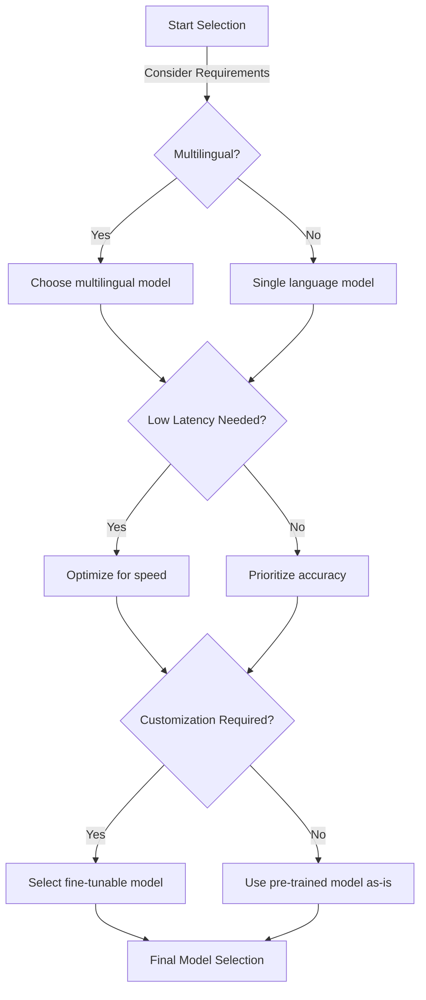
```mermaid
flowchart TD
    A[Start Selection] -->|Consider Requirements| B{Multilingual?}
    B -->|Yes| C[Choose multilingual model]
    B -->|No| D[Single language model]
    C --> E{Low Latency Needed?}
    D --> E
    E -->|Yes| F[Optimize for speed]
    E -->|No| G[Prioritize accuracy]
    F --> H{Customization Required?}
    G --> H
    H -->|Yes| I[Select fine-tunable model]
    H -->|No| J[Use pre-trained model as-is]
    I --> K[Final Model Selection]
    J --> K

```

*Figure 3.1.1: Model Selection Flowchart. This diagram illustrates the decision-making process for selecting an appropriate foundation model based on key criteria such as multilingual support, latency requirements, and customization needs.*

In this scenario, the company might prioritize a multilingual model with low latency and customization options to handle diverse customer inquiries efficiently across different markets. They could leverage Amazon Bedrock to access a variety of foundation models and choose one that best fits these criteria, such as the Anthropic Claude model[^602] for its strong multilingual capabilities and customization options.

### Understanding the effect of inference parameters on model responses

Once you've selected a suitable foundation model, optimizing inference parameters becomes crucial for fine-tuning the model's responses to meet specific application needs. Two key parameters that significantly influence model output are temperature and input/output length.

1. **Temperature**: This parameter controls the randomness or creativity of the model's output. 
   - Lower temperature (e.g., 0.2) results in more deterministic, focused responses.
   - Higher temperature (e.g., 0.8) leads to more diverse and creative outputs.

2. **Input/Output Length**: These parameters define the maximum token count for input prompts and generated responses.
   - Longer inputs provide more context but may increase processing time and costs.
   - Longer outputs allow for more detailed responses but can also introduce irrelevant information.

#### **Model Inference Parameters**
These are settings you adjust when calling an AI model in **Amazon Bedrock**:
*   **Temperature:** Controls randomness. Lower (0.1) is focused/deterministic; Higher (0.8+) is creative/diverse.
*   **Top P (Nucleus Sampling):** The model considers a percentage of most likely words (e.g., top 90%).
*   **Top K:** The model only considers the $K$ most likely next words.
*   **Max Tokens:** Limits the length of the response.


Let's examine how these parameters might affect a customer service chatbot:

*Table 3.1.1: Effect of Temperature on Model Responses*
| Feature | Low Temperature (0.2) | High Temperature (0.8) |
|---------|-----------------------|------------------------|
| **Response Style** | Concise, factual responses | Creative, varied responses |
| **Information** | Consistent, reliable information | Exploratory, diverse suggestions |
| **Best Use Cases** | Specific queries, factual information | Brainstorming, creative tasks |
| **Predictability** | High predictability | More randomness |
| **Use cases** | - Question answering <br> - Factual information retrieval <br> - Technical explanations <br> - Consistent outputs across multiple runs <br> - Precise instructions following  | - Creative writing <br>- Idea generation<br> - Multiple alternative solutions <br>- Conversational variety<br>- Exploration of possibilities |

In practice, businesses might adjust these parameters based on the specific use case. For instance, when handling technical support queries, a lower temperature setting could ensure more precise and consistent answers. Conversely, for product recommendations or creative content generation, a higher temperature might be preferred to generate diverse suggestions.


---
For the **AIF-C01** exam, understanding how to control model output through **Inference Parameters** is a core technical requirement. These settings allow you to balance **creativity (hallucination risk)** versus **determinism (consistency)**.

Here is the structured breakdown of the parameters you provided, optimized for your study notes.

---

## 🎲 Randomness and Diversity Parameters
These parameters influence **which** tokens the model picks from its probability distribution.

### 1. Temperature (The "Shape" of Probability)
* **What it does:** Modulates the probability distribution.
* **Low Temperature (< 1.0):** Steepens the curve. The model becomes more confident and "boring," consistently picking the most likely word. **Best for: Coding, Math, and Fact-based Q&A.**
* **High Temperature (> 1.0):** Flattens the curve. Low-probability words get a better chance. The model becomes "creative" or "random." **Best for: Creative writing or Brainstorming.**


### 2. Top K (Sample Size)
* **What it does:** Limits the model to the **K** most likely next tokens.
* **Example:** If Top K = 50, the model ignores everything except the top 50 candidates, regardless of their actual probability percentage.
* **Exam Tip:** Think of this as a **hard cutoff** based on the number of candidates.

### 3. Top P / Nucleus Sampling (Cumulative Probability)
* **What it does:** Limits the model to a set of tokens whose **total combined probability** reaches P.
* **Example:** If Top P = 0.9, the model looks at the most likely tokens and stops adding them to the "pool" once their probabilities add up to 90%.
* **Exam Tip:** Top P is dynamic. If one word is 99% likely, the pool might only have 1 word. If many words are equally likely, the pool expands.

---

## 📏 Length and Constraint Parameters
These parameters control **when** the model stops and how it formats the response.

### 1. Max Tokens / Response Length
* **Goal:** Limits the cost and time of the response.
* **Exam Logic:** Remember that shorter responses save money in Amazon Bedrock because you are often charged per 1,000 tokens.

### 2. Stop Sequences
* **Goal:** Tells the model exactly where to "cut off."
* **Common Use Case:** In a chat application, you might set the stop sequence to `User:` so the model doesn't try to hallucinate the next part of the conversation for you.

### 3. Penalties (Presence and Frequency)
* **Goal:** Prevents the model from being repetitive.
* **How it works:** It makes it "more expensive" for the model to pick a word it has already used recently.

---

## 💡 AIF-C01 Cheat Sheet: Parameter Tuning

| Scenario | Goal | Setting Recommendation |
| :--- | :--- | :--- |
| **Technical Support / FAQ** | High Accuracy | **Lower** Temperature (0.1 - 0.3) |
| **Poetry / Ad Copy** | Creativity | **Higher** Temperature (0.7 - 0.9) |
| **Summarizing a long doc** | Conciseness | **Lower** Max Tokens + Stop Sequences |
| **Preventing "Looping" text** | Diversity | **Increase** Frequency Penalty |


### Pro-Tip for your AWS Exam:
If a question asks how to make a model response more **deterministic** (meaning it gives the same answer every time), the answer is almost always to **Decrease the Temperature**. Conversely, to make it more **diverse**, you **Increase Top P or Temperature**.
---


### Defining Retrieval Augmented Generation (RAG) and its business applications

**Retrieval Augmented Generation (RAG)** is an innovative approach that enhances foundation models by incorporating external knowledge bases. This technique allows models to access and utilize up-to-date, domain-specific information, significantly improving the accuracy and relevance of their outputs[^603].

Key components of RAG:
1. **Foundation Model**: The core language model (e.g., GPT-3, BERT)
2. **Knowledge Base**: External data source containing relevant information
3. **Retrieval System**: Mechanism to fetch pertinent information from the knowledge base
4. **Generation Process**: Combines retrieved information with the model's inherent knowledge

RAG offers several advantages for business applications:
- **Improved Accuracy**: By incorporating current and specific information
- **Reduced Hallucinations**: Minimizes the generation of false or irrelevant content
- **Customization**: Allows tailoring of responses to specific business domains
- **Up-to-date Information**: Enables access to the latest data without constant model retraining

```mermaid
flowchart TD
    A[User Query] --> B[Foundation Model]
    B --> C{Retrieval System}
    C -->|Fetch Relevant Info| D[Knowledge Base]
    D -->|Return Data| C
    C --> E[Generation Process]
    E --> F[Enhanced Response]

```

*Figure 3.1.3: Retrieval Augmented Generation Process. This diagram illustrates the flow of information in a RAG system, from the initial user query through the foundation model, retrieval system, and knowledge base, culminating in an enhanced response.*

Business applications of RAG using Amazon Bedrock[^604]:
1. **Customer Support**: Integrating company-specific product information and policies for accurate responses
2. **Financial Analysis**: Incorporating real-time market data for informed decision-making
3. **Healthcare**: Accessing up-to-date medical research for patient care recommendations
4. **Legal Services**: Retrieving current case law and regulations for legal advice
5. **E-commerce**: Enhancing product recommendations with real-time inventory and pricing data

By leveraging RAG through Amazon Bedrock, businesses can create more intelligent and context-aware AI applications that provide accurate, relevant, and up-to-date information to users.

### Identifying AWS services for storing embeddings within vector databases

**Embeddings** are crucial components in modern AI applications, representing complex data (like text or images) as dense vectors. These vectors capture semantic relationships, enabling efficient similarity searches and enhancing the performance of AI models. AWS offers several services that can be used to store and manage these embeddings within vector databases:

1. **Amazon OpenSearch Service**[^605]: 
   - Supports vector search capabilities
   - Ideal for large-scale, real-time search and analytics
   - Offers high performance for similarity searches

2. **Amazon Aurora**[^606]: 
   - PostgreSQL-compatible edition supports vector operations
   - Integrates well with existing relational database workflows
   - Suitable for applications requiring both traditional and vector-based queries

3. **Amazon Neptune**[^607]: 
   - Graph database with vector search capabilities
   - Excellent for relationship-based queries and recommendations
   - Supports complex data structures and relationships

4. **Amazon DocumentDB (with MongoDB compatibility)**[^608]: 
   - Document database supporting vector search
   - Ideal for semi-structured data and flexible schemas
   - Compatible with MongoDB drivers and tools

5. **Amazon RDS for PostgreSQL**[^609]: 
   - Managed relational database with vector extension support
   - Suitable for applications requiring ACID compliance
   - Integrates well with existing PostgreSQL-based systems

To illustrate how these services might be used in a real-world scenario, consider the following table comparing their characteristics:

*Table 3.1.2: Comparison of AWS Vector Database Services*

| Service | Vector Search Capability | Best For | Scalability | Integration |
|---------|--------------------------|----------|-------------|-------------|
| Amazon OpenSearch Service | Native support | Large-scale, real-time search | High | Elasticsearch API |
| Amazon Aurora | Via pgvector extension | Hybrid relational/vector workloads | High | SQL |
| Amazon Neptune | Built-in support | Graph-based recommendations | High | Gremlin, SPARQL |
| Amazon DocumentDB | Via Atlas Vector Search | Flexible, document-based data | Moderate | MongoDB API |
| Amazon RDS for PostgreSQL | Via pgvector extension | Traditional RDBMS with vector support | Moderate | SQL |

Choosing the right service depends on factors such as:
- Existing data infrastructure
- Required query patterns
- Scale of vector operations
- Integration needs with other AWS services

For instance, a recommendation system for an e-commerce platform might leverage Amazon Neptune to store product embeddings and customer relationship data, enabling complex recommendation queries that consider both item similarity and user behavior.

### Explaining cost tradeoffs of foundation model customization approaches

Customizing foundation models to suit specific business needs is a crucial aspect of AI application development. However, different customization approaches come with varying cost implications. Understanding these tradeoffs is essential for making informed decisions about model deployment and optimization.

Let's explore the main customization approaches and their associated cost considerations:

1. **Pre-training**:
   - Process: Training a model from scratch on domain-specific data
   - Costs: Highest initial investment in computational resources and time
   - Benefits: Fully customized model tailored to specific domain
   - Best for: Large organizations with substantial data and unique requirements

2. **Fine-tuning**:
   - Process: Adjusting pre-trained model weights on domain-specific data
   - Costs: Moderate computational resources, shorter training time than pre-training
   - Benefits: Improved performance on specific tasks while leveraging general knowledge
   - Best for: Organizations with moderate data and specific use cases

3. **In-context learning**:
   - Process: Providing examples or instructions within the input prompt
   - Costs: Minimal additional computational cost, no training required
   - Benefits: Quick adaptation to new tasks without model modification
   - Best for: Rapid prototyping or handling diverse, low-volume tasks

4. **Retrieval Augmented Generation (RAG)**:
   - Process: Enhancing model responses with external knowledge base
   - Costs: Additional storage and retrieval costs, minimal training required
   - Benefits: Improved accuracy and up-to-date information without full retraining
   - Best for: Applications requiring current, domain-specific knowledge

To visualize the cost-benefit tradeoffs of these approaches, consider the following diagram:

```mermaid
flowchart TD
    A[Customization Approach] --> B{High Initial Cost?}
    B -->|Yes| C[Pre-training]
    B -->|No| D{Moderate Cost?}
    D -->|Yes| E[Fine-tuning]
    D -->|No| F{External Data Needed?}
    F -->|Yes| G[RAG]
    F -->|No| H[In-context Learning]

```

*Figure 3.1.4: Cost-Benefit Decision Tree for Model Customization. This diagram illustrates the decision-making process for choosing a model customization approach based on cost considerations and specific needs.*

When leveraging Amazon Bedrock for foundation model customization, businesses can optimize costs by:
- Starting with in-context learning for quick experiments
- Utilizing RAG for incorporating domain knowledge without full retraining
- Employing fine-tuning for specific use cases with moderate data volumes
- Considering pre-training only for large-scale, unique applications

By carefully evaluating these tradeoffs, organizations can balance performance requirements with budget constraints, ensuring efficient and effective AI implementations.

### Understanding the role of agents in multi-step tasks

**Agents** in AI applications, particularly those built on foundation models, play a crucial role in handling complex, multi-step tasks. These agents act as intelligent intermediaries, breaking down complex queries into manageable steps, orchestrating multiple AI services, and providing coherent responses to users. Amazon Bedrock offers Agents capabilities[^610] that significantly enhance the ability of foundation models to perform sophisticated, multi-step operations.

Key aspects of AI agents:
1. **Task Decomposition**: Breaking complex queries into smaller, manageable subtasks
2. **Service Orchestration**: Coordinating multiple AI and cloud services to complete tasks
3. **Context Management**: Maintaining context across multiple interactions or steps
4. **Decision Making**: Choosing appropriate actions based on intermediate results
5. **Response Synthesis**: Combining results from multiple steps into coherent outputs

Let's explore how agents might handle a complex business scenario:

```mermaid
sequenceDiagram
    participant U as User
    participant A as Agent
    participant FM as Foundation Model
    participant DB as Database
    participant API as External API
    U->>A: Complex Query
    A->>A: Decompose Task
    A->>FM: Generate Subtask 1
    FM-->>A: Subtask 1 Result
    A->>DB: Query Data
    DB-->>A: Data Result
    A->>API: External Request
    API-->>A: API Response
    A->>FM: Generate Final Response
    FM-->>A: Draft Response
    A->>A: Synthesize Results
    A->>U: Comprehensive Answer
```

*Figure 3.1.5: Agent Workflow for Multi-step Tasks. This diagram illustrates how an AI agent orchestrates various components to handle a complex query, from task decomposition through interaction with multiple services to final response synthesis.*

Business applications of agents in Amazon Bedrock:
1. **Customer Service**: Handling complex inquiries that require accessing multiple databases, policies, and external services
2. **Financial Planning**: Orchestrating market analysis, risk assessment, and personalized recommendation generation
3. **Supply Chain Optimization**: Coordinating inventory checks, demand forecasting, and logistics planning
4. **Healthcare Diagnostics**: Managing patient data analysis, symptom checking, and treatment recommendation processes
5. **Travel Planning**: Orchestrating flight searches, hotel bookings, and itinerary optimization based on user preferences

By leveraging agents in Amazon Bedrock, businesses can create more sophisticated AI applications capable of handling complex, multi-step tasks that closely mimic human problem-solving processes. This approach not only enhances the capabilities of AI systems but also improves user experience by providing comprehensive, context-aware responses to complex queries.

In conclusion, designing applications that effectively utilize foundation models requires careful consideration of various factors, from model selection and parameter tuning to advanced techniques like RAG and the use of AI agents. By understanding these design considerations and leveraging the powerful capabilities of Amazon Bedrock and related AWS services, businesses can create AI applications that are not only powerful and efficient but also tailored to their specific needs and constraints. As the field of AI continues to evolve rapidly, staying informed about these design principles and best practices will be crucial for business professionals aiming to harness the full potential of AI in their organizations.

### Questions for self-check

1. **When selecting a pre-trained foundation model for an AI application, which of the following is NOT typically a key consideration?**

   A. Model size and complexity
   B. Multi-lingual support
   C. The model's training dataset size
   D. Input/output length limitations

2. **A company is developing an AI-powered customer service chatbot that needs to provide consistent, factual responses. Which temperature setting would be most appropriate for this use case?**

   A. 0.2
   B. 0.5
   C. 0.8
   D. 1.0

3. **Which AWS service is best suited for storing embeddings in a vector database when the application requires both traditional relational queries and vector-based similarity searches?**

   A. Amazon OpenSearch Service
   B. Amazon Aurora
   C. Amazon Neptune
   D. Amazon DocumentDB

4. **A startup is developing an AI application that needs to leverage up-to-date industry-specific information without constant model retraining. Which approach would be most suitable for this scenario?**

   A. Pre-training
   B. Fine-tuning
   C. In-context learning
   D. Retrieval Augmented Generation (RAG)

5. **In the context of AI agents handling multi-step tasks, which of the following is NOT a key aspect of their functionality?**

   A. Task decomposition
   B. Service orchestration
   C. Model pre-training
   D. Response synthesis

### Answers and Explanations

1. **Correct answer: C. The model's training dataset size**

   Explanation: While the size of the training dataset is important for the overall quality of a foundation model, it is not typically a key consideration when selecting a pre-trained model for an application. The subchapter mentions cost, modality, latency, multi-lingual support, model size and complexity, customization options, and input/output length as primary selection criteria. The training dataset size is generally not directly relevant to the application-specific needs and is more of an internal characteristic of the model's development[^611].

2. **Correct answer: A. 0.2**

   Explanation: For a customer service chatbot that needs to provide consistent, factual responses, a lower temperature setting is more appropriate. The subchapter explains that lower temperature values (e.g., 0.2) result in more deterministic, focused responses, which is ideal for scenarios requiring factual and consistent information. Higher temperatures (like 0.8) lead to more diverse and creative outputs, which is not desirable for this specific use case where accuracy and consistency are prioritized[^612].

3. **Correct answer: B. Amazon Aurora**

   Explanation: According to the subchapter, Amazon Aurora (PostgreSQL-compatible edition) supports vector operations and integrates well with existing relational database workflows. It is described as suitable for applications requiring both traditional and vector-based queries. This makes it the ideal choice for a scenario where both relational queries and vector-based similarity searches are needed, offering a balance between traditional database functionality and vector search capabilities[^613].

4. **Correct answer: D. Retrieval Augmented Generation (RAG)**

   Explanation: Retrieval Augmented Generation (RAG) is the most suitable approach for this scenario. The subchapter describes RAG as a technique that enhances foundation models by incorporating external knowledge bases, allowing access to up-to-date, domain-specific information without constant model retraining. This aligns perfectly with the startup's need to leverage current industry-specific information without frequent model updates, making it more efficient and cost-effective than alternatives like pre-training or fine-tuning[^614].

5. **Correct answer: C. Model pre-training**

   Explanation: Model pre-training is not listed as a key aspect of AI agents' functionality in handling multi-step tasks. The subchapter outlines the key aspects of AI agents as task decomposition, service orchestration, context management, decision making, and response synthesis. Model pre-training is a separate process that occurs before the deployment of the foundation model and is not part of the agent's role in managing complex, multi-step tasks[^615].

[^600]: Amazon Bedrock Overview. URL: <https://aws.amazon.com/bedrock/>
[^601]: Foundation Models for RAG - Amazon Bedrock Knowledge Bases. URL: <https://aws.amazon.com/bedrock/knowledge-bases/>
[^602]: Anthropic Claude on Amazon Bedrock. URL: <https://aws.amazon.com/bedrock/claude/>
[^603]: Retrieve data and generate AI responses with Amazon Bedrock Knowledge Bases. URL: <https://docs.aws.amazon.com/bedrock/latest/userguide/knowledge-base.html>
[^604]: Build Generative AI Applications with Foundation Models - Amazon Bedrock. URL: <https://aws.amazon.com/bedrock/>
[^605]: Amazon OpenSearch Service Vector Search. URL: <https://docs.aws.amazon.com/opensearch-service/latest/developerguide/vector-search.html>
[^606]: Amazon Aurora PostgreSQL Vector Support. URL: <https://docs.aws.amazon.com/AmazonRDS/latest/AuroraUserGuide/postgresql-vector.html>
[^607]: Amazon Neptune Vector Search. URL: <https://docs.aws.amazon.com/neptune/latest/userguide/vector-search.html>
[^608]: Amazon DocumentDB Vector Search. URL: <https://docs.aws.amazon.com/documentdb/latest/developerguide/vector-search.html>
[^609]: Amazon RDS for PostgreSQL Vector Support. URL: <https://docs.aws.amazon.com/AmazonRDS/latest/UserGuide/PostgreSQL_vector.html>
[^610]: Amazon Bedrock Agents Overview. URL: <https://docs.aws.amazon.com/bedrock/latest/userguide/agents.html>
[^611]: AWS Foundation Model Selection Guide. URL: <https://docs.aws.amazon.com/bedrock/latest/userguide/model-selection.html>
[^612]: AWS Foundation Model Inference Parameters. URL: <https://docs.aws.amazon.com/bedrock/latest/userguide/inference-parameters.html>
[^613]: Building AI-powered search in PostgreSQL using Amazon SageMaker and pgvector. URL: <https://aws.amazon.com/blogs/database/building-ai-powered-search-in-postgresql-using-amazon-sagemaker-and-pgvector/>
[^614]: Retrieve data and generate AI responses with Amazon Bedrock Knowledge Bases. URL: <https://docs.aws.amazon.com/bedrock/latest/userguide/knowledge-base.html>
[^615]: Amazon Bedrock Agents Functionality. URL: <https://docs.aws.amazon.com/bedrock/latest/userguide/agents-functionality.html>

---

## 3.2 Choose effective prompt engineering techniques

Prompt engineering is a critical skill for maximizing the value of foundation models in business. This specialized discipline focuses on crafting input queries that elicit optimal responses from AI models, particularly large language models (LLMs) available through Amazon Bedrock.[^701] As organizations adopt AI-driven solutions, the ability to design effective prompts directly impacts the quality of insights generated, content produced, and problems solved.

Business professionals who master prompt engineering gain significant advantages in extracting value from AI investments. Whether developing customer service chatbots, generating marketing content, or analyzing complex datasets, the quality of AI outputs largely depends on the prompts provided. Across industries—from finance and healthcare to retail and manufacturing—prompt engineering continues to drive innovation and competitive advantage.[^702]

This subchapter explores prompt engineering fundamentals, advanced techniques, implementation best practices, and potential limitations. Understanding these elements enables business professionals to harness foundation models effectively, enhance decision-making, and create more sophisticated AI-powered solutions.

### Concepts and constructs of prompt engineering

Prompt engineering is built upon several key concepts that form the foundation for effective AI model interaction. Understanding these elements is crucial for crafting prompts that yield accurate, relevant, and useful responses.

1. **Context**: Background information provided to the AI model that frames the task or question. Proper context helps the model understand the specific domain, situation, or perspective needed for generating an appropriate response. For example, when analyzing financial data, specifying the industry, time period, or company significantly improves relevance and accuracy.

2. **Instruction**: Explicit directives given to the model about what task to perform or how to process the input. Clear, precise instructions guide the model's behavior and output format. Examples include "Summarize the following text in three bullet points" or "Translate this sentence from English to French."

3. **Negative prompts**: Instructions that tell the model what to avoid or exclude in its response. This technique refines outputs and prevents unwanted content. For instance, "Generate a product description without mentioning price or competitors" focuses the model's output by explicitly stating exclusions.

4. **Model latent space**: The high-dimensional representation of knowledge within the AI model. While not directly manipulable, understanding this concept informs strategies for navigating the model's knowledge base more effectively to retrieve relevant information.[^703]

The following diagram illustrates how these concepts work together in a business context:

```mermaid
flowchart TD
    A[Business Query] -->|Context| B[AI Model]
    B -->|Instruction| C{Processing}
    C -->|Positive Prompt| D[Generate Content]
    C -->|Negative Prompt| E[Exclude Content]
    D --> F[Final Output]
    E --> F
```

*Figure 3.2.1: Prompt Engineering Workflow. This diagram illustrates the process of prompt engineering, showing how context, instructions, and both positive and negative prompts interact with the AI model to produce the final output.*

In practice, a marketing team using Amazon Bedrock to generate product descriptions might craft prompts that include:[^704]

- Context: "You are an expert copywriter for a luxury watch brand."
- Instruction: "Write a 100-word product description for our new smartwatch."
- Positive prompt: "Highlight its elegant design and advanced health tracking features."
- Negative prompt: "Do not mention battery life or compare it to competitors."

By applying these prompt engineering constructs strategically, businesses can guide AI models to produce more targeted, relevant outputs that better serve their specific needs and improve decision-making processes.

### Techniques for prompt engineering

Prompt engineering encompasses various techniques that enable sophisticated interactions with AI models. These methods allow business professionals to extract more nuanced and contextually appropriate responses from foundation models:

1. **Chain-of-thought**: Breaking down complex problems into a series of intermediate steps, guiding the AI model through a logical reasoning process. This technique leads to more accurate and explainable results, particularly for tasks requiring multi-step reasoning.[^705]

2. **Zero-shot learning**: Asking the model to perform a task without providing any specific examples. This technique leverages the model's general knowledge to address novel situations, making it valuable for handling unexpected queries or exploring new problem domains.[^706]

3. **Single-shot learning**: Providing one example to illustrate the desired output format or approach. This technique calibrates the model's response style and improves consistency in outputs.

4. **Few-shot learning**: Offering multiple examples (typically 2-5) to guide the model's understanding of the task. This approach significantly enhances performance on specific tasks by demonstrating patterns and expectations through examples.[^707]

5. **Prompt templates**: Pre-designed structures for prompts that can be customized for specific use cases. Templates maintain consistency across different interactions and can be optimized over time for better performance.

The following diagram illustrates how these techniques are applied in a business context using Amazon Bedrock:

```mermaid
sequenceDiagram
    participant User as Business User
    participant Bedrock as Amazon Bedrock
    participant Model as AI Model
    User->>Bedrock: Submit prompt with technique
    Bedrock->>Model: Process prompt
    Model-->>Bedrock: Generate response
    Bedrock-->>User: Return refined output
    Note over User,Model: Chain-of-thought
    Note over User,Model: Zero-shot
    Note over User,Model: Single-shot
    Note over User,Model: Few-shot
    Note over User,Model: Prompt template
```

*Figure 3.2.2: Prompt Engineering Techniques in Action. This sequence diagram shows how different prompt engineering techniques are applied when interacting with an AI model through Amazon Bedrock.*

Practical applications of these techniques include:

1. **Chain-of-thought example**:
   Prompt: "Calculate the total revenue for Q1 2025. Step 1: List monthly revenues. Step 2: Sum the monthly figures. Step 3: Present the total."

2. **Zero-shot example**:
   Prompt: "Suggest three innovative features for a smart home device targeting elderly users."

3. **Single-shot example**:
   Prompt: "Summarize customer feedback in one sentence. Example: 'Product X received positive reviews for its durability but criticism for its high price.' Now summarize feedback for Product Y."

4. **Few-shot example**:
   Prompt: "Classify the sentiment of customer reviews:
   1. 'Great product!' - Positive
   2. 'Terrible experience.' - Negative
   3. 'It's okay.' - Neutral
   Now classify: 'I'm satisfied with my purchase.'" 

5. **Prompt template example**:
   Template: "As a [ROLE], provide [NUMBER] [TYPE] for [CONTEXT]. Focus on [ASPECT] and avoid [EXCLUSION]."
   Filled template: "As a financial analyst, provide 3 insights for our Q1 2025 earnings report. Focus on revenue growth and avoid mentioning specific clients."

Mastering these techniques enables business professionals to extract valuable insights and generate high-quality outputs from AI models across various applications—from analyzing market trends to generating creative content and solving complex business problems.

### Benefits and best practices for prompt engineering

Effective prompt engineering delivers substantial benefits for businesses using AI technologies while following best practices ensures consistent, high-quality results.

**Benefits of Effective Prompt Engineering:**

1. **Response quality improvement**: Well-crafted prompts enhance the relevance, accuracy, and usefulness of AI-generated outputs, leading to more reliable insights and better decision-making.

2. **Increased efficiency**: Strategic prompting reduces the need for multiple iterations or human intervention, streamlining workflows and saving valuable time.

3. **Customization and flexibility**: Prompt engineering tailors AI responses to specific needs, industries, or brand voices without requiring extensive model retraining.

4. **Cost optimization**: Efficient prompts reduce computational resources and API calls, potentially lowering costs associated with AI usage.[^708]

5. **Enhanced user experience**: For customer-facing applications, better prompts create more natural and helpful AI interactions, improving overall user satisfaction.

**Best Practices for Prompt Engineering:**

1. **Experimentation**: Test different prompt structures and techniques to identify what works best for specific tasks. A/B testing can be particularly effective in optimizing prompts for consistent results.

2. **Guardrails implementation**: Incorporate safeguards in prompts to ensure AI outputs align with business policies, ethical guidelines, and legal requirements. This includes specifying tone, content restrictions, and required disclaimers.[^709]

3. **Discovery-oriented prompting**: Use open-ended prompts to explore new possibilities or generate creative ideas during brainstorming sessions or product development.

4. **Specificity and concision**: Craft clear, specific prompts that provide necessary context without overwhelming the model. Avoid ambiguity and unnecessary verbosity.

5. **Using multiple prompts**: For complex tasks, break down the problem into multiple prompts, each addressing a specific aspect. This approach leads to more comprehensive and accurate results.

6. **Continuous refinement**: Regularly review and update prompts based on performance metrics, user feedback, and evolving business needs to ensure ongoing improvement.

The following diagram illustrates the prompt refinement process:

```mermaid
flowchart TD
    A[Initial Prompt] -->|Experimentation| B[Refined Prompt]
    B -->|Guardrails| C[Safe Prompt]
    C -->|Specificity| D[Focused Prompt]
    D -->|User Feedback| E[Optimized Prompt]
    E -->|Continuous Refinement| F[Evolving Prompt]

```

*Figure 3.2.3: Prompt Refinement Process. This diagram illustrates the iterative process of refining prompts based on best practices and feedback, leading to continuously improving AI interactions.*

A practical application using Amazon Bedrock might look like this:

**Scenario**: A retail company wants to generate product descriptions for a new line of eco-friendly home goods.

**Initial Prompt**: "Write a product description for an eco-friendly water bottle."

**Refined Prompt** (after applying best practices):

```
Context: You are a copywriter for EcoHome, a brand known for sustainable home products.

Task: Generate a product description for our new stainless steel water bottle.

Specifications:
- 20 oz capacity
- Double-wall insulation
- Made from 100% recycled materials
- Available in 3 colors: Ocean Blue, Forest Green, and Sunset Orange

Style Guidelines:
- Emphasize sustainability and durability
- Use a friendly, conversational tone
- Include at least one emotional appeal to eco-conscious consumers
- Keep the description between 75-100 words

Constraints:
- Do not mention specific prices
- Avoid comparisons to other brands
- Ensure all claims are factually accurate and avoid greenwashing

Output Format:
Provide the product description followed by 3 suggested social media hashtags for promotion.
```

This refined prompt incorporates specificity, guardrails, and clear instructions to generate a more targeted and effective product description. By consistently applying these best practices and refining prompts based on performance and feedback, businesses can significantly enhance their AI-driven processes.

### Potential risks and limitations of prompt engineering

While prompt engineering offers significant benefits, businesses must understand its inherent risks and limitations to implement effective safeguards. Key concerns include:

1. **Exposure**: Inadvertent disclosure of sensitive information when prompts contain confidential data or when AI responses reveal proprietary information.[^710]

2. **Poisoning**: Adversarial attacks where malicious inputs manipulate the model's behavior, resulting in biased or harmful outputs that could damage reputation or decision-making processes.[^711]

3. **Hijacking**: Occurs when inputs override the intended behavior of the AI system, leading to unexpected or malicious responses that compromise application integrity.[^712]

4. **Jailbreaking**: Attempts to bypass ethical guidelines or content restrictions by crafting prompts specifically designed to circumvent model safeguards.

5. **Over-reliance**: Excessive dependence on AI-generated outputs without human oversight, allowing errors to propagate through business processes.

6. **Bias amplification**: Poorly designed prompts can reinforce or amplify biases present in training data, leading to unfair or discriminatory outputs.[^713]

7. **Inconsistency**: Different prompts for similar tasks yielding variable results, potentially causing confusion or errors in business operations.

8. **Privacy concerns**: Prompts containing personal or sensitive information may create privacy issues, especially when using third-party AI services.[^714]

The following diagram illustrates these risks and their potential business impacts:

```mermaid
flowchart LR
    A[Prompt Engineering] --> B{Risks}
    B --> C[Exposure]
    B --> D[Poisoning]
    B --> E[Hijacking]
    B --> F[Jailbreaking]
    B --> G[Over-reliance]
    B --> H[Bias amplification]
    B --> I[Inconsistency]
    B --> J[Privacy concerns]
    C --> K[Data Leakage]
    D --> L[Manipulated Outputs]
    E --> M[Unexpected Behavior]
    F --> N[Ethical Violations]
    G --> O[Error Propagation]
    H --> P[Unfair Decisions]
    I --> Q[Operational Confusion]
    J --> R[Compliance Issues]

```

*Figure 3.2.4: Risks and Impacts of Prompt Engineering. This flowchart illustrates the various risks associated with prompt engineering and their potential impacts on business operations.*

To mitigate these risks, businesses should implement robust safeguards:

1. **Data sanitization**: Remove sensitive information from prompts before sending them to AI models.

2. **Input validation**: Develop strong validation mechanisms to detect and prevent potentially malicious prompts.

3. **Output filtering**: Implement post-processing filters to screen AI-generated outputs for inappropriate or sensitive content.

4. **Human-in-the-loop**: Maintain human oversight in critical decision-making processes, using AI as a supportive tool rather than a replacement for human judgment.[^715]

5. **Regular auditing**: Conduct periodic audits of AI interactions to identify potential biases, inconsistencies, or security vulnerabilities.

6. **Ethical guidelines**: Establish clear ethical guidelines for AI usage and ensure all employees receive proper training.

7. **Privacy-preserving techniques**: Utilize technologies such as federated learning or differential privacy when handling sensitive data.[^716]

8. **Continuous monitoring**: Implement real-time monitoring systems to detect unusual patterns or potential attacks.

By acknowledging these limitations and implementing appropriate safeguards, businesses can harness prompt engineering's power while minimizing associated risks. As AI technologies evolve, staying informed about potential vulnerabilities and adapting security measures accordingly remains crucial for maintaining the integrity of AI-driven business processes.

In conclusion, prompt engineering is a powerful capability that significantly enhances AI applications in business contexts. By understanding its concepts, mastering various techniques, implementing best practices, and addressing potential risks, organizations can leverage foundation models to drive innovation, improve decision-making, and gain competitive advantages. The ability to craft effective prompts is becoming an essential skill for business professionals across industries, enabling them to unlock the full potential of AI in solving complex business challenges.

### Questions for self-check

1. **Which prompt engineering technique involves breaking down complex problems into a series of intermediate steps to guide the AI model through a logical reasoning process?**

   A. Zero-shot learning
   B. Chain-of-thought
   C. Few-shot learning
   D. Prompt templates

2. **A marketing team wants to generate product descriptions for a new line of eco-friendly products without providing specific examples. Which prompt engineering technique is most appropriate?**

   A. Single-shot learning
   B. Few-shot learning
   C. Zero-shot learning
   D. Chain-of-thought

3. **Which of the following is NOT a benefit of effective prompt engineering in business contexts?**

   A. Improved response quality
   B. Increased efficiency
   C. Elimination of all biases in AI outputs
   D. Cost optimization

4. **A financial analyst is concerned about potential data leakage when using AI models for market analysis. Which prompt engineering risk does this scenario primarily relate to?**

   A. Jailbreaking
   B. Exposure
   C. Poisoning
   D. Hijacking

5. **Which best practice for prompt engineering involves regularly testing different prompt structures and techniques to identify what works best for specific tasks or domains?**

   A. Guardrails implementation
   B. Specificity and concision
   C. Experimentation
   D. Continuous refinement

### Answers and Explanations

1. **Correct answer: B. Chain-of-thought**

   Explanation: Chain-of-thought is a prompt engineering technique that involves breaking down complex problems into a series of intermediate steps, guiding the AI model through a logical reasoning process. This technique is particularly useful for tasks that require multi-step reasoning and can lead to more accurate and explainable results. Zero-shot learning, few-shot learning, and prompt templates are other prompt engineering techniques but do not specifically involve breaking down problems into intermediate steps.[^717]

2. **Correct answer: C. Zero-shot learning**

   Explanation: Zero-shot prompts ask the model to perform a task or answer a question without any specific examples or prior training on that exact task. This technique leverages the model's general knowledge to address novel situations, making it particularly useful for handling unexpected queries or exploring new problem domains. In this scenario, the marketing team wants to generate product descriptions without providing specific examples, which aligns perfectly with the zero-shot learning approach.[^718]

3. **Correct answer: C. Elimination of all biases in AI outputs**

   Explanation: While effective prompt engineering offers numerous benefits, including improved response quality, increased efficiency, and cost optimization, it cannot completely eliminate all biases in AI outputs. Biases can be inherent in the training data or the model itself, and while prompt engineering can help mitigate some biases, it cannot guarantee their complete elimination. The other options (A, B, and D) are all genuine benefits of effective prompt engineering as mentioned in the subchapter.[^719]

4. **Correct answer: B. Exposure**

   Explanation: The scenario describes a concern about potential data leakage when using AI models for market analysis, which directly relates to the risk of exposure in prompt engineering. Exposure occurs when prompts inadvertently contain or reveal sensitive information. In financial analysis, there's a high risk of exposing confidential market data or proprietary information if prompts are not carefully managed. This is distinct from jailbreaking (bypassing ethical guidelines), poisoning (malicious inputs manipulating model behavior), or hijacking (overriding intended behavior).[^720]

5. **Correct answer: C. Experimentation**

   Explanation: Experimentation is the best practice that involves regularly testing different prompt structures and techniques to identify what works best for specific tasks or domains. The subchapter explicitly mentions that "Regularly test different prompt structures and techniques to identify what works best for specific tasks or domains. A/B testing can be particularly effective in optimizing prompts." This approach allows businesses to continuously improve their prompt engineering strategies and adapt to changing needs or contexts.[^721]

[^700]: AWS AI Services Overview. URL: <https://aws.amazon.com/machine-learning/ai-services/>

[^701]: Amazon Bedrock Overview. URL: <https://aws.amazon.com/bedrock/>

[^702]: Gartner Forecasts Worldwide Artificial Intelligence Software Market to Reach $62 Billion in 2022. URL: <https://www.gartner.com/en/newsroom/press-releases/2021-11-22-gartner-forecasts-worldwide-artificial-intelligence-software-market-to-reach-62-billion-in-2022>

[^703]: Understanding Latent Space in Machine Learning. URL: <https://towardsdatascience.com/understanding-latent-space-in-machine-learning-de5a7c687d8d>

[^704]: Amazon Bedrock Prompt Engineering Guide. URL: <https://docs.aws.amazon.com/bedrock/latest/userguide/prompt-engineering.html>

[^705]: Chain-of-Thought Prompting Elicits Reasoning in Large Language Models. URL: <https://arxiv.org/abs/2201.11903>

[^706]: Zero-Shot Learning - A Comprehensive Evaluation of the Good, the Bad and the Ugly. URL: <https://arxiv.org/abs/1707.00600>

[^707]: Few-Shot Learning: A Survey. URL: <https://arxiv.org/abs/1904.05046>

[^708]: AWS Cost Optimization for Machine Learning. URL: <https://aws.amazon.com/blogs/machine-learning/cost-optimization-for-machine-learning-in-the-cloud/>

[^709]: AWS AI Service Cards. URL: <https://aws.amazon.com/machine-learning/ai-services/ai-service-cards/>

[^710]: AWS Security Best Practices for Machine Learning. URL: <https://docs.aws.amazon.com/whitepapers/latest/security-best-practices-for-machine-learning/security-best-practices-for-machine-learning.html>

[^711]: Prompt Injection Attacks Against GPT-3. URL: <https://arxiv.org/abs/2206.11349>

[^712]: Defending Against Prompt Injection Attacks. URL: <https://docs.anthropic.com/en/docs/test-and-evaluate/strengthen-guardrails/mitigate-jailbreaks>

[^713]: Bias in AI: Sources and Mitigation Strategies. URL: <https://aws.amazon.com/blogs/publicsector/framework-mitigate-bias-improve-outcomes-new-age-ai/>

[^714]: AWS Privacy Considerations for Machine Learning. URL: <https://www.ibm.com/think/insights/ai-privacy>

[^715]: Human-in-the-Loop Machine Learning. URL: <https://aws.amazon.com/blogs/machine-learning/automated-exploratory-data-analysis-and-model-operationalization-framework-with-a-human-in-the-loop/>

[^716]: AWS Privacy-Preserving Machine Learning. URL: <https://aws.amazon.com/blogs/machine-learning/large-language-model-inference-over-confidential-data-using-aws-nitro-enclaves/>

[^717]: Chain-of-Thought Prompting Elicits Reasoning in Large Language Models. URL: <https://arxiv.org/abs/2201.11903>

[^718]: Zero-Shot Learning - A Comprehensive Evaluation of the Good, the Bad and the Ugly. URL: <https://arxiv.org/abs/1707.00600>

[^719]: Mitigating Bias in Artificial Intelligence (AI) Models. URL: <https://aws.amazon.com/blogs/publicsector/framework-mitigate-bias-improve-outcomes-new-age-ai/>

[^720]: AWS Security Best Practices for Machine Learning. URL: <https://docs.aws.amazon.com/whitepapers/latest/security-best-practices-for-machine-learning/security-best-practices-for-machine-learning.html>

[^721]: Amazon SageMaker Experiments - Organize, Track, and Compare Your Machine Learning Trainings. URL: <https://aws.amazon.com/blogs/aws/amazon-sagemaker-experiments-organize-track-and-compare-your-machine-learning-trainings/>

---


## 3.3 The Training and Fine-Tuning Process for Foundation Models

Foundation models represent a powerful class of AI systems that can transform organizational capabilities when properly implemented. The process of training and fine-tuning these models requires specific knowledge and techniques that significantly impact their effectiveness in business applications. Mastering these processes allows organizations to customize models for their unique needs while maximizing return on AI investments. This subchapter examines the essential components of training foundation models, explores various fine-tuning methodologies, and outlines best practices for data preparation—knowledge critical for success in both the AWS Certified AI Practitioner exam and real-world AI implementations.

### Key Elements of Training a Foundation Model

Training foundation models requires substantial computational resources and specialized expertise. Understanding this process helps business professionals make informed decisions about AI implementation strategy and resource allocation.

#### Pre-training

Pre-training is the initial phase where the foundation model acquires general knowledge and language understanding from vast amounts of unlabeled data. This creates a versatile base model capable of performing a wide range of tasks.[^801]

```mermaid
flowchart TD
    A[Raw Data Collection] -->|Massive Datasets| B[Data Preprocessing]
    B --> C[Pre-training]
    C --> D[Base Foundation Model]

```

*Figure 3.3.1: Pre-training Process for Foundation Models*

This diagram illustrates the pre-training process, starting with raw data collection and ending with a base foundation model. The process involves gathering massive datasets, preprocessing the data, and then conducting the pre-training to create a versatile base model.

Pre-training typically involves:

- **Self-supervised learning** on diverse datasets
- Masking or predicting parts of the input data
- Learning *contextual representations* of data

For business applications, pre-trained models like those available through **Amazon Bedrock** offer a powerful starting point, saving significant time and computational resources.[^802]

#### Fine-tuning

Fine-tuning adapts the pre-trained model to specific tasks or domains, enhancing its performance for particular business applications.[^803]

- Task-specific data is used to adjust model parameters
- The process is more efficient than training from scratch
- It allows for customization without losing general knowledge

#### Continuous Pre-training

Continuous pre-training keeps the model updated with new information and evolving language patterns.[^804]

- Regular updates with fresh data
- Maintains model relevance in dynamic environments
- Crucial for industries with rapidly changing terminology or knowledge

For businesses, understanding these elements is crucial for:

- Selecting appropriate pre-trained models
- Deciding on fine-tuning strategies
- Planning for ongoing model maintenance and improvement

By leveraging services like **Amazon SageMaker**, organizations can streamline these processes, making advanced AI capabilities more accessible and manageable.[^805]

### Methods for Fine-Tuning a Foundation Model

Fine-tuning transforms generic foundation models into specialized tools that address specific business needs. This crucial step enables organizations to leverage pre-trained capabilities while customizing for their unique requirements. Here are the key fine-tuning approaches:

#### Instruction Tuning

Instruction tuning fine-tunes a model on datasets containing instructions and their corresponding outputs. This method significantly improves a model's ability to follow specific directives.[^806]

```mermaid
flowchart TD
    A[Pre-trained Model] --> B[Instruction Dataset]
    B --> C[Fine-tuning Process]
    C --> D[Instruction-tuned Model]
    D --> E[Improved Task Performance]

```

*Figure 3.3.2: Instruction Tuning Process*

This diagram shows the instruction tuning process, starting with a pre-trained model and using an instruction dataset to create an instruction-tuned model that performs better on specific tasks.

Benefits for businesses:
- Enhances model's ability to understand and execute specific instructions
- Improves performance on task-oriented applications
- Useful for customer service chatbots or automated task completion systems

#### Adapting Models for Specific Domains

**Domain adaptation** involves fine-tuning a model on data from a specific field or industry, allowing it to understand and generate domain-specific content more accurately.[^807]

Key considerations:
- Requires curated datasets representative of the target domain
- Can significantly improve performance in specialized areas
- Particularly valuable for industries with unique terminology or concepts

Example: A financial services company might adapt a foundation model to understand complex financial instruments and regulations, improving its performance in tasks like risk assessment or regulatory compliance.

#### Transfer Learning

**Transfer learning** leverages knowledge gained from one task to improve performance on a related task. This method is particularly useful when labeled data for the target task is limited.[^808]

The company should use transfer learning, a method where a model pre-trained on one task is adapted to improve performance on a different but related task by leveraging knowledge from the original task


-----

Steps in transfer learning:
1. Start with a pre-trained model
2. Replace the final layer(s) with new ones suited to the target task
3. Fine-tune the model on the new task's dataset

Business applications:
- Rapid development of models for new, related tasks
- Efficient use of limited domain-specific data
- Accelerated time-to-market for AI-powered products or services

#### Continuous Pre-training

Continuous pre-training involves ongoing updates to the model using new data, ensuring it remains current and relevant.[^809]

Benefits:
- Keeps the model updated with evolving language and knowledge
- Adapts to changing business environments and market trends
- Maintains model performance over time

Implementation strategies:
- Regular updates with fresh, relevant data
- Monitoring model performance to identify when updates are needed
- Balancing new learning with retention of existing knowledge

For businesses leveraging AWS services, **Amazon SageMaker** provides robust tools for implementing these fine-tuning methods. It offers scalable infrastructure for training and deployment, along with features like **SageMaker Experiments** for tracking and comparing different fine-tuning approaches.[^810]

Table 3.3.1: Comparison of Fine-Tuning Methods

| Method | Primary Use Case | Data Requirements | Typical Business Application |
|--------|------------------|--------------------|-----------------------------|
| Instruction Tuning | Task-specific improvements | Task-instruction pairs | Customer service automation |
| Domain Adaptation | Industry-specific applications | Large domain-specific datasets | Specialized content generation |
| Transfer Learning | New tasks with limited data | Small task-specific dataset | Rapid prototyping of new AI features |
| Continuous Pre-training | Maintaining model relevance | Ongoing stream of new data | Real-time market analysis |

By understanding and effectively utilizing these fine-tuning methods, businesses can significantly enhance the performance and applicability of foundation models to their specific needs, driving innovation and competitive advantage in their respective industries.

### Preparing Data to Fine-Tune a Foundation Model

Data quality and preparation directly determine the success of foundation model fine-tuning. Properly prepared datasets ensure models learn effectively and produce reliable outputs that meet your organization's specific requirements.

#### Data Curation

**Data curation** involves selecting, organizing, and maintaining datasets used for fine-tuning. This process is critical for ensuring the quality and relevance of the data.[^811]

Key aspects of data curation:
- *Relevance*: Ensure data aligns with the target domain or task
- *Quality*: Remove errors, duplicates, and irrelevant information
- *Diversity*: Include a wide range of examples to improve model generalization
- *Recency*: Incorporate up-to-date information for current relevance

Business impact:
- Improves model accuracy and reliability
- Reduces bias in model outputs
- Enhances the model's ability to handle real-world scenarios

#### Data Governance

Implementing robust **data governance** practices is essential for maintaining data integrity, security, and compliance throughout the fine-tuning process.

```mermaid
flowchart TD
    A[Data Collection] --> B[Data Classification]
    B --> C[Access Control]
    C --> D[Data Quality Assurance]
    D --> E[Compliance Monitoring]
    E --> F[Ethical Use Guidelines]

```

*Figure 3.3.3: Data Governance Framework for AI Model Fine-Tuning*

This diagram outlines a comprehensive data governance framework for AI model fine-tuning, highlighting the key steps from data collection to ensuring ethical use guidelines.

Key components of data governance:
- Data privacy: Ensure compliance with regulations like GDPR or CCPA
- Security: Implement measures to protect sensitive information
- Versioning: Maintain clear records of dataset versions used in fine-tuning
- Auditability: Enable tracing of data lineage and usage

AWS services like **Amazon Macie** and **AWS Glue** can assist in implementing robust data governance practices, helping businesses maintain compliance and data integrity throughout the AI development process.[^812]

#### Dataset Size and Composition

The size and composition of the fine-tuning dataset significantly impact the model's performance and generalization capabilities.[^813]

Considerations for dataset size:
- Larger datasets generally lead to better performance, but with diminishing returns
- Balance between dataset size and computational resources required
- Quality often trumps quantity &mdash; a smaller, high-quality dataset can outperform a larger, noisy one

Composition factors:
- *Class balance*: Ensure equal representation of different categories or outcomes
- *Task coverage*: Include examples that cover the full range of expected tasks
- *Edge cases*: Incorporate unusual or challenging examples to improve robustness

#### Data Labeling

For supervised fine-tuning tasks, accurate **data labeling** is crucial. This process involves annotating data with the correct outputs or categories.[^814]

Labeling strategies:
- Manual labeling by domain experts
- Crowdsourcing for large-scale labeling tasks
- Semi-automated labeling using existing models or rules

AWS offers services like **Amazon SageMaker Ground Truth** to streamline and scale data labeling processes, making it easier for businesses to prepare high-quality datasets for fine-tuning.[^815]

#### Data Representativeness

Ensuring that your fine-tuning dataset accurately represents the real-world scenarios your model will encounter is critical for its practical performance.[^816]

Key aspects:
- *Demographic diversity*: Include data from various user groups or market segments
- *Temporal coverage*: Ensure data spans relevant time periods
- *Scenario completeness*: Cover all potential use cases or situations

Business impact:
- Improves model fairness and reduces bias
- Enhances model performance across diverse real-world scenarios
- Increases user trust and adoption of AI-powered solutions

#### Reinforcement Learning from Human Feedback (RLHF)

**RLHF** is an advanced technique that incorporates human preferences into the fine-tuning process, allowing for more nuanced and context-aware model improvements.[^817]

Process overview:
1. Generate model outputs for various prompts
2. Collect human feedback on the quality of these outputs
3. Train a reward model based on this feedback
4. Fine-tune the foundation model using the reward model

Benefits:
- Aligns model behavior with human preferences
- Improves output quality and relevance
- Addresses subtle aspects of language and context that are difficult to capture with traditional fine-tuning

Implementing RLHF requires careful consideration of feedback collection methods and potential biases. AWS services like Amazon SageMaker can facilitate the implementation of RLHF pipelines, allowing businesses to leverage this advanced technique effectively.[^818]

By mastering these data preparation techniques, businesses can significantly enhance the effectiveness of their fine-tuning processes, resulting in foundation models that are better aligned with their specific needs and use cases. This not only improves the performance of AI applications but also ensures that the deployed models are robust, reliable, and tailored to the unique requirements of the organization.

### Questions for self-check

1. **A business analyst is tasked with fine-tuning a foundation model for a financial services company. Which of the following methods would be most appropriate for adapting the model to understand complex financial instruments and regulations?**

   A. Instruction tuning
   B. Domain adaptation
   C. Transfer learning
   D. Continuous pre-training

2. **An AI practitioner is preparing data for fine-tuning a foundation model. Which of the following is NOT a key aspect of data curation?**

   A. Ensuring data relevance to the target domain
   B. Maximizing dataset size regardless of quality
   C. Removing errors and duplicates
   D. Including diverse examples for improved generalization

3. **A retail company wants to keep its AI model updated with the latest fashion trends and customer preferences. Which fine-tuning method should they primarily focus on?**

   A. Instruction tuning
   B. Transfer learning
   C. Continuous pre-training
   D. RLHF (Reinforcement Learning from Human Feedback)

4. **Which AWS service is most suitable for implementing robust data governance practices during the fine-tuning process of foundation models?**

   A. Amazon SageMaker
   B. Amazon Bedrock
   C. Amazon Macie
   D. AWS Lambda

5. **A startup is developing an AI-powered customer service chatbot. They want to improve the model's ability to understand and execute specific instructions. Which fine-tuning method should they prioritize?**

   A. Domain adaptation
   B. Instruction tuning
   C. Transfer learning
   D. Continuous pre-training

### Answers and Explanations

1. **Correct answer: B. Domain adaptation**

   Explanation: Domain adaptation is the most appropriate method for adapting a foundation model to understand complex financial instruments and regulations. This method involves fine-tuning the model on data from a specific field or industry, allowing it to understand and generate domain-specific content more accurately. For a financial services company, this would involve using curated datasets representative of the financial domain, significantly improving the model's performance in specialized areas like understanding complex financial instruments and regulations.[^819]

2. **Correct answer: B. Maximizing dataset size regardless of quality**

   Explanation: In data curation for fine-tuning foundation models, quality often trumps quantity. While larger datasets generally lead to better performance, this is true only up to a point and with diminishing returns. The other options (A, C, and D) are all key aspects of proper data curation. Maximizing dataset size without regard for quality can introduce noise and irrelevant information, potentially degrading the model's performance. It's more important to have a balanced, high-quality dataset that accurately represents the target domain and tasks.[^820]

3. **Correct answer: C. Continuous pre-training**

   Explanation: For a retail company wanting to keep its AI model updated with the latest fashion trends and customer preferences, continuous pre-training is the most appropriate method. This involves ongoing updates to the model using new data, ensuring it remains current and relevant. Continuous pre-training is crucial for industries with rapidly changing terminology or knowledge, such as fashion retail. It allows the model to adapt to changing business environments and market trends, maintaining its performance over time in a dynamic field like fashion.[^821]

4. **Correct answer: C. Amazon Macie**

   Explanation: Among the options provided, Amazon Macie is the most suitable AWS service for implementing robust data governance practices during the fine-tuning process of foundation models. Amazon Macie is a data security and privacy service that uses machine learning and pattern matching to discover and protect sensitive data in AWS. It can help in maintaining data integrity, security, and compliance throughout the fine-tuning process by automatically discovering, classifying, and protecting sensitive data. While Amazon SageMaker is crucial for model development and training, it doesn't specifically focus on data governance like Macie does.[^822]

5. **Correct answer: B. Instruction tuning**

   Explanation: For an AI-powered customer service chatbot where the goal is to improve the model's ability to understand and execute specific instructions, instruction tuning is the most appropriate fine-tuning method. Instruction tuning involves fine-tuning a model on a dataset of instructions and corresponding outputs. This method is particularly effective for improving a model's ability to follow specific directives, which is crucial for a customer service chatbot that needs to understand and respond to various customer inquiries and instructions accurately.[^823]

[^800]: AWS Machine Learning Blog: "The evolution of foundation models and their impact on AI applications" URL: <https://aws.amazon.com/blogs/machine-learning/the-evolution-of-foundation-models-and-their-impact-on-ai-applications/>

[^801]: AWS Documentation: "Introduction to Foundation Models" URL: <https://docs.aws.amazon.com/sagemaker/latest/dg/jumpstart-foundation-models.html>

[^802]: Amazon Bedrock Overview URL: <https://aws.amazon.com/bedrock/>

[^803]: AWS Machine Learning Blog: "Fine-tuning foundation models with Amazon SageMaker" URL: <https://aws.amazon.com/blogs/machine-learning/fine-tuning-foundation-models-with-amazon-sagemaker/>

[^804]: AWS Whitepaper: "Continuous Learning in AI/ML Systems" URL: <https://d1.awsstatic.com/whitepapers/continuous-learning-in-aiml-systems.pdf>

[^805]: Amazon SageMaker Overview URL: <https://aws.amazon.com/sagemaker/>

[^806]: AWS Machine Learning Blog: "Instruction tuning for better model performance" URL: <https://aws.amazon.com/blogs/machine-learning/instruction-tuning-for-better-model-performance/>

[^807]: AWS Documentation: "Domain Adaptation in Machine Learning" URL: <https://docs.aws.amazon.com/prescriptive-guidance/latest/ml-model-adaptation/domain-adaptation.html>

[^808]: AWS Machine Learning Blog: "Transfer learning for TensorFlow image classification models in Amazon SageMaker" URL: <https://aws.amazon.com/blogs/machine-learning/transfer-learning-for-tensorflow-image-classification-models-in-amazon-sagemaker/>

[^809]: AWS Cloud Adoption Framework for Artificial Intelligence, Machine Learning URL: <https://docs.aws.amazon.com/whitepapers/latest/aws-caf-for-ai/aws-caf-for-ai.html>

[^810]: Amazon SageMaker Experiments Overview URL: <https://docs.aws.amazon.com/sagemaker/latest/dg/experiments.html>

[^811]: AWS What is Data Labeling? - Data Labeling Explained URL: <https://aws.amazon.com/what-is/data-labeling/>

[^812]: Amazon Macie Overview URL: <https://aws.amazon.com/macie/>

[^813]: AWS Documentation: "Preparing Data for Machine Learning" URL: <https://docs.aws.amazon.com/machine-learning/latest/dg/preparing-data.html>

[^814]: Training data labeling using humans with Amazon SageMaker Ground Truth URL: <https://docs.aws.amazon.com/sagemaker/latest/dg/sms.html>

[^815]: Amazon SageMaker Ground Truth Overview URL: <https://aws.amazon.com/sagemaker/groundtruth/>

[^816]: Policy advice and best practices on bias and fairness in AI URL: <https://link.springer.com/article/10.1007/s10676-024-09746-w>

[^817]: AWS What is RLHF? - Reinforcement Learning from Human Feedback Explained URL: <https://aws.amazon.com/what-is/reinforcement-learning-from-human-feedback/>

[^818]: Amazon SageMaker RL Overview URL: <https://docs.aws.amazon.com/sagemaker/latest/dg/reinforcement-learning.html>

[^819]: AWS Machine Learning Blog: "Domain-adaptation Fine-tuning of Foundation Models in Amazon SageMaker JumpStart on financial data" URL: <https://aws.amazon.com/blogs/machine-learning/domain-adaptation-fine-tuning-of-foundation-models-in-amazon-sagemaker-jumpstart-on-financial-data/>

[^820]: AWS Glue Data Quality - AWS Glue URL: <https://docs.aws.amazon.com/glue/latest/dg/glue-data-quality.html>

[^821]: AWS Retail Competency: "AI/ML Solutions for Retail" URL: <https://aws.amazon.com/retail/partner-solutions/>

[^822]: Amazon Macie Features URL: <https://aws.amazon.com/macie/features/>

[^823]: AWS Machine Learning Blog: "Build a self-service digital assistant using Amazon Lex and Amazon Bedrock Knowledge Bases" URL: <https://aws.amazon.com/blogs/machine-learning/build-a-self-service-digital-assistant-using-amazon-lex-and-amazon-bedrock-knowledge-bases/>

-----------------------------------------------------------------------------------
---

Supervised learning algorithms train on sample data that specifies both the algorithm's input and output. For example, the data could be images of handwritten numbers that are annotated to indicate which numbers they represent. Given sufficient labeled data, the supervised learning system would eventually recognize the clusters of pixels and shapes associated with each handwritten number.

 via - https://aws.amazon.com/compare/the-difference-between-machine-learning-supervised-and-unsupervised/

Linear regression

Linear regression refers to supervised learning models that, based on one or more inputs, predict a value from a continuous scale. An example of linear regression is predicting a house price. You could predict a house’s price based on its location, age, and number of rooms after you train a model on a set of historical sales training data with those variables.

Neural network

A neural network solution is a more complex supervised learning technique. To produce a given outcome, it takes some given inputs and performs one or more layers of mathematical transformation based on adjusting data weightings. An example of a neural network technique is predicting a digit from a handwritten image.

Incorrect options:

Document classification - This is an example of semi-supervised learning. Semi-supervised learning is when you apply both supervised and unsupervised learning techniques to a common problem. This technique relies on using a small amount of labeled data and a large amount of unlabeled data to train systems. When applying categories to a large document base, there may be too many documents to physically label. For example, these could be countless reports, transcripts, or specifications. Training on the unlabeled data helps identify similar documents for labeling.

Association rule learning - This is an example of unsupervised learning. Association rule learning techniques uncover rule-based relationships between inputs in a dataset. For example, the Apriori algorithm conducts market basket analysis to identify rules like coffee and milk often being purchased together.

Clustering - Clustering is an unsupervised learning technique that groups certain data inputs, so they may be categorized as a whole. There are various types of clustering algorithms depending on the input data. An example of clustering is identifying different types of network traffic to predict potential security incidents.

References:

https://aws.amazon.com/what-is/machine-learning/

https://aws.amazon.com/compare/the-difference-between-machine-learning-supervised-and-unsupervised/

-----------------


For the **AWS Certified AI Practitioner (AIF-C01)** exam, you need to understand supervised learning as a method where a model learns from a **labeled dataset**. Think of the label as the "answer key" that tells the model exactly what it is looking at during training.

The exam focuses on two primary types of supervised learning: **Classification** and **Regression**.

---

## 1. Classification (Categorical Data)
Classification is used when the output you want to predict is a **label or category**. The goal is to sort data into discrete buckets.

* **Binary Classification:** Predicting one of two possible outcomes.
    * *Examples:* Spam vs. Not Spam, Fraud vs. Legitimate, Yes vs. No.
* **Multi-class Classification:** Predicting one out of several possible categories.
    * *Examples:* Categorizing support tickets (Billing, Technical, Sales) or identifying animal types in a photo (Cat, Dog, Bird).


[Image of supervised learning classification vs regression]


## 2. Regression (Numerical Data)
Regression is used when the output you want to predict is a **continuous numerical value**. Instead of a category, you are looking for a specific number.

* **Linear Regression:** The most common form, used to model the relationship between variables to predict a number.
    * *Examples:* Predicting house prices based on square footage, forecasting stock prices, or estimating the temperature for tomorrow.

---

## Key Concepts for the AIF-C01 Exam
To pass the exam, you should be able to distinguish these from other learning types (like Unsupervised or Reinforcement) using these specific identifiers:

| Feature | Supervised Learning |
| :--- | :--- |
| **Data Requirement** | Labeled Data (Input + Correct Output) |
| **Primary Goal** | To predict an outcome for new, unseen data |
| **Common Tasks** | **Classification** (Categories) and **Regression** (Numbers) |
| **AWS Services** | **Amazon SageMaker** (training custom models), **Amazon Rekognition** (image classification), **Amazon Forecast** (regression-based forecasting) |

### Use Case Quick-Check
* If the question mentions **"identifying"** or **"sorting"** $\rightarrow$ think **Classification**.
* If the question mentions **"predicting a value"** or **"forecasting a quantity"** $\rightarrow$ think **Regression**.
* If the question mentions **"no labels"** or **"grouping similar items"** $\rightarrow$ it is **NOT** supervised learning (that is Unsupervised Learning/Clustering).

[Supervised Learning vs Unsupervised Learning](https://www.youtube.com/watch?v=YqP8ss5j3CU)

This short video provides a concise breakdown of supervised versus unsupervised learning, which is a common comparison point on the AIF-C01 exam.

----------

This text provides a deep dive into **Context Window Overflow (CWO)** and its security implications, specifically **Prompt Injection**. For your **AWS Certified AI Practitioner (AIF-C01)** exam prep, you can filter this down to several core technical competencies found in the "Generative AI" domain of the exam guide.

---

## 🔑 AIF-C01 Key Concept Summary

### 1. The LLM Architecture
* **Tokens:** LLMs do not read words; they process **tokens** (fragments of text). 1,000 tokens is roughly 750 words.
* **Context Window:** This is the **fixed-size** memory of the model. For the exam, remember that it includes **System Prompts**, **User Inputs**, and **Model Outputs**.
* **FIFO Ring Buffer:** When the window is full, the model uses a "First-In-First-Out" approach—it "forgets" the earliest information to make room for new tokens.

### 2. Retrieval Augmented Generation (RAG)
* **Function:** RAG provides models with up-to-date or proprietary data from external sources (databases, APIs).
* **Impact on Context Window:** Information retrieved via RAG **consumes space** in the context window. If the retrieved data is too large, it can cause CWO, leading the model to "forget" the original system instructions or user intent.


### 3. Model Hallucinations
* **Definition:** Factually incorrect or nonsensical outputs.
* **CWO Link:** Hallucinations often occur when the context window is exceeded because the model loses the "grounding" information provided in the prompt.

### 4. Generative AI Security (Threats & Mitigations)
The exam requires you to identify risks and potential solutions:

| Threat / Concept | Description | AWS Mitigation |
| :--- | :--- | :--- |
| **Prompt Injection** | Using clever phrasing (or CWO) to bypass system filters or change model behavior (e.g., the "potato" example). | **Guardrails for Amazon Bedrock** (to filter harmful content). |
| **Sensitive Data Leak** | Forcing a model to reveal training data or private info via long-tail prompting. | **Amazon Macie** (to discover/protect PII) and input validation. |
| **CWO (Overflow)** | Intentionally filling the window to "push out" security instructions. | **Token Limits** and **Input Validation** at the application layer. |

---

## 🛠 Relevant AWS Services to Know
* **Amazon Bedrock:** The primary service for building GenAI apps. Features like **Guardrails** and **Knowledge Bases** (for RAG) are central to the AIF-C01 exam.
* **Amazon Titan:** AWS's native foundation models mentioned in your text.
* **Amazon CloudWatch:** Used for monitoring spikes in request volume or unusual patterns that might indicate a CWO attack.

### Exam Tip: The "Why" of CWO
If you see a question regarding why a model suddenly stopped following instructions or started giving "garbled" answers after a long conversation, the answer is likely **Context Window Overflow**.

Do you want to practice some sample questions specifically focused on how AWS handles these GenAI security risks?

--------

For the **AIF-C01** exam, you must be able to distinguish between different **Evaluation Metrics** for Natural Language Processing (NLP) tasks. The exam often presents a scenario (e.g., "The company is building a translation app") and asks you to pick the correct metric.

Here is the essential breakdown of the information you provided, organized for study:

---

## 🏆 Key Performance Metrics for NLP

### 1. BLEU Score (Bilingual Evaluation Understudy)
* **Best For:** **Machine Translation**.
* **How it works:** It measures the overlap of **n-grams** (sequences of words) between the machine's output and a human reference translation.
* **Scale:** Usually **0 to 1** (or 0 to 100).
* **Exam Logic:** If the question mentions "Amazon Translate," "multilingual," or "translation accuracy," **BLEU** is almost always the answer.

### 2. ROUGE Score (Recall-Oriented Understudy for Gisting Evaluation)
* **Best For:** **Text Summarization**.
* **How it works:** Similar to BLEU, but it focuses on **recall**—how much of the human reference summary the machine was able to capture.
* **Exam Logic:** If the question mentions "summarizing articles" or "creating abstracts," choose **ROUGE**.

### 3. BERTScore
* **Best For:** **Semantic Similarity**.
* **How it works:** It uses contextual embeddings (from the BERT model) to see if two sentences *mean* the same thing, even if they use different words.
* **Exam Logic:** This is a more "modern" metric. It's often an "incorrect" distractor for basic translation questions where BLEU is the industry standard.

---

## 📊 Comparison Table for the Exam

| Metric | Primary Use Case | Key Concept |
| :--- | :--- | :--- |
| **BLEU** | **Translation** | N-gram overlap (Precision-focused) |
| **ROUGE** | **Summarization** | Content coverage (Recall-focused) |
| **Accuracy** | **Classification** | Percent of correct labels (Too simple for text) |
| **BERTScore** | **Semantic Meaning** | Uses embeddings for deep similarity |


---

## 💡 Quick Recall Strategy
* **B**LEU $\rightarrow$ **B**ilingual (Translation)
* **R**OUGE $\rightarrow$ **R**eading/Reviewing (Summarization)
* **Accuracy** $\rightarrow$ **A**nswering "A, B, or C" (Classification)

### Why Accuracy is usually wrong for NLP:
In the AIF-C01 context, "Accuracy" is a classification metric. If you translate "The cat sat on the mat" to "On the mat sat the cat," a simple accuracy check might mark it 0% correct because the words don't match index-for-index, even though the translation is perfect. That is why we use **BLEU**.

-----------------------------------------------------------------------

For the **AIF-C01** exam, AWS often tests your ability to choose the right tool for a specific business outcome. A common "trick" on the exam is to offer **Model Customization** (Fine-tuning/Pre-training) as a solution when the correct answer is actually **RAG**.

Here is the essential breakdown of these Amazon Bedrock features filtered for your study notes.

---

## 🛠 Model Customization vs. RAG
The exam will likely ask how to handle "company-specific data." You must know which path to take:

| Feature | Best For... | Key Technical Fact |
| :--- | :--- | :--- |
| **Knowledge Bases** | **RAG (Retrieval)** | Uses **Vector Databases** to provide "live" context without changing model weights. |
| **Continued Pre-training** | **Domain Expertise** | Uses **Unlabeled Data** to tweak model parameters for a specific industry (e.g., Medical or Legal). |
| **Fine-tuning** | **Task Specialization** | Uses **Labeled Data** to teach a model a specific style or format (e.g., writing like your brand). |

### 🔍 Knowledge Bases (The RAG "Easy Button")
* **Workflow:** It automates the ingestion process: **Documents → Embeddings (Vectors) → Vector Database.**
* **Supported Databases:** OpenSearch Serverless, Pinecone, Redis Enterprise Cloud.
* **Exam Tip:** If the goal is "reducing hallucinations" or "using private company data for real-time answers," the answer is **Knowledge Bases for Amazon Bedrock**.


---

## 🛡️ Safety and Responsible AI
AWS emphasizes "Responsible AI" in the AIF-C01 syllabus. These three features are core to that domain:

### 1. Guardrails for Amazon Bedrock
* **Purpose:** Filters harmful content and **redacts PII** (Personally Identifiable Information).
* **Use Case:** Preventing a chatbot from giving financial advice or using offensive language.
* **Restriction:** It is a filter; it **cannot** be used to provide the model with new knowledge (RAG).

### 2. Watermark Detection
* **Purpose:** Identifying images made by **Amazon Titan Image Generator**.
* **Value:** Increases transparency and helps mitigate the spread of misinformation/deepfakes.
* **Exam Tip:** This is specific to **Titan Image models**, not text-based models.

---

## ⚠️ Important "NOT" Checklist for the Exam
To avoid common pitfalls, remember these specific constraints mentioned in your notes:
* **NOT RAG:** You cannot use Watermarking, Guardrails, or Continued Pre-training to implement a RAG workflow.
* **Data Type:** Continued Pre-training uses **Unlabeled** data; Fine-tuning uses **Labeled** data.
* **Vector Store:** If you don't have a database, Bedrock automatically creates an **Amazon OpenSearch Serverless** vector store for you.


### Quick Scenario Check
* **Scenario:** You want your model to learn the specific terminology of the "Deep House" music industry using 500 PDFs of industry magazines.
* **Answer:** **Continued Pre-training** (because you are providing unlabeled domain-specific data to tweak parameters).
* **Scenario:** You want your model to answer questions about a user's specific bank account balance.
* **Answer:** **Knowledge Bases/RAG** (because the data is private, dynamic, and needs to be fetched in real-time).

-----------------------------------------------------------------------
For the **AWS AIF-C01** exam, you must be able to categorize metrics into two buckets: **Classification** (predicting labels) and **Regression** (predicting numbers). 

A common exam trap is asking which metric to use for a classification problem while offering regression metrics as distractor options.

---

## 🛑 Important Correction: Classification vs. Regression
The metrics you listed belong to different branches of machine learning. You **cannot** use Root Mean Square Error (RMSE) or Mean Absolute Error (MAE) to evaluate a standard classification model.

### 1. Classification Metrics (Predicting Categories)
These are used when you are sorting data into buckets (e.g., "Spam" vs. "Not Spam").

* **Confusion Matrix:** A table that compares the **Actual** values with the **Predicted** values. It is the foundation for calculating Precision, Recall, and Accuracy.
    
* **Precision/Recall/F1 Score:** Derived from the confusion matrix to evaluate the quality of predictions.
* **Accuracy:** The percentage of total correct predictions.

### 2. Regression Metrics (Predicting Continuous Numbers)
These are used for predicting values like house prices or temperature. They measure the **distance** between the predicted number and the actual number.

* **Root Mean Square Error (RMSE):** Measures the average magnitude of the error. Because it **squares** the errors, it penalizes large mistakes more heavily than small ones.
* **Mean Absolute Error (MAE):** Measures the average "distance" of errors. Unlike RMSE, it treats all errors equally.
    

### 3. Correlation Matrix (Data Prep/Exploration)
A **Correlation Matrix** is actually not used to *evaluate* model performance. Instead, it is used during the **Data Discovery** phase to see how variables relate to one another (e.g., does "square footage" correlate strongly with "house price"?).


---

## 🏆 AIF-C01 Cheat Sheet: Metric Selection

| If the question asks for... | The correct metric is... |
| :--- | :--- |
| **Evaluating a Classifier** | Confusion Matrix, Precision, Recall, F1, Accuracy |
| **Evaluating a Regression Model** | RMSE, MAE, R-squared ($R^2$) |
| **Evaluating Translation Quality** | **BLEU** |
| **Evaluating Summarization Quality** | **ROUGE** |
| **Identifying Data Relationships** | **Correlation Matrix** |

### Exam Tip: Choosing between RMSE and MAE
If an exam question asks for a metric that **penalizes large outliers** or "catastrophic errors" in a prediction, choose **RMSE**. If it asks for the **average error** without over-weighting outliers, choose **MAE**.

Confusion matrix

Confusion matrix is a tool specifically designed to evaluate the performance of classification models by displaying the number of true positives, true negatives, false positives, and false negatives. This matrix provides a detailed breakdown of the model's performance across all classes, making it the most suitable choice for evaluating a classification model's accuracy and identifying potential areas for improvement. It provides a comprehensive overview of the model's performance by detailing how many instances were correctly or incorrectly classified in each category. This enables the company to understand where the model is performing well and where it may need adjustments, such as improving the classification of specific material types.

Incorrect options:

Root Mean Squared Error (RMSE) - Root Mean Squared Error (RMSE) is a metric commonly used to measure the average error in regression models by calculating the square root of the average squared differences between predicted and actual values. However, RMSE is not suitable for classification tasks, as it is designed to measure continuous outcomes, not discrete class predictions.

Mean Absolute Error (MAE) - Mean Absolute Error (MAE) measures the average magnitude of errors in a set of predictions without considering their direction. MAE is typically used in regression tasks to quantify the accuracy of a continuous variable's predictions, not for classification tasks where the outputs are categorical rather than continuous.

Correlation matrix - Correlation matrix measures the statistical correlation between different variables or features in a dataset, typically used to understand the relationships between continuous variables. A correlation matrix is not designed to evaluate the performance of a classification model, as it does not provide any insight into the accuracy or errors of categorical predictions.

Reference:

https://docs.aws.amazon.com/machine-learning/latest/dg/multiclass-model-insights.html
-----------------------------------------------------------------------


-----------------------------------------------------------------------------------

For the **AWS Certified AI Practitioner (AIF-C01)**, you don't need to write the math for these algorithms, but you **must** know which "tool" to pull from the toolbox for specific business problems. 

The exam focuses heavily on **Decision Trees** and their advanced versions (**Random Forest** and **XGBoost**) because they are highly effective for tabular data (like spreadsheets or SQL tables).

---

## 🌳 1. Decision Trees (The Foundation)
A Decision Tree is a flowchart-like structure used for both **Classification** (Yes/No) and **Regression** (Numbers). It splits data into branches based on "if-then" rules.

* **How it works:** It picks the most important feature (e.g., "Is the user over 18?") and splits the data until it reaches a "leaf" (the final prediction).
* **Pros:** Very easy to explain to business stakeholders (high interpretability).
* **Cons:** Prone to **Overfitting**—it can become so complex that it "memorizes" the training data but fails on new data.


---

## 🌲 2. Random Forest (The Ensemble)
To fix the overfitting problem of a single tree, we use a **Random Forest**. This is an **Ensemble** method.

* **How it works:** It builds hundreds of different decision trees, each seeing a slightly different version of the data. 
* **The "Voters":** When you give it a new piece of data, every tree "votes" on the outcome. The forest picks the majority result.
* **Exam Logic:** If the question mentions "reducing variance" or "preventing overfitting in a tree-based model," choose **Random Forest**.

---

## ⚡ 3. XGBoost (Extreme Gradient Boosting)
**XGBoost** is one of the most popular algorithms supported by **Amazon SageMaker**. It is often the "Gold Standard" for structured data competitions.

* **How it works:** Unlike Random Forest (where trees grow side-by-side), XGBoost grows trees **sequentially**. Each new tree is specifically designed to correct the errors made by the previous tree.
* **Key Term:** **Boosting**. It "boosts" the performance of weak learners into a strong model.
* **Exam Logic:** If the goal is **maximum accuracy** on tabular data or a "high-performance gradient boosting" implementation, the answer is likely **XGBoost**.

---

## ⚖️ Comparison Table for AIF-C01

| Algorithm | Type | Strategy | Best For... |
| :--- | :--- | :--- | :--- |
| **Decision Tree** | Supervised | Single tree / Rule-based | Simple, explainable logic. |
| **Random Forest** | Supervised | Bagging (Voting) | Preventing overfitting. |
| **XGBoost** | Supervised | Boosting (Sequential) | High accuracy on tabular data. |
| **K-Means** | **Unsupervised** | Clustering | Grouping similar customers. |

### 💡 Exam "Trigger Words"
* **"Interpretability":** Decision Tree.
* **"Ensemble of trees":** Random Forest or XGBoost.
* **"Correcting errors of previous trees":** XGBoost.
* **"Overfitting":** A problem for Decision Trees; a solution provided by Random Forest.


As you prepare for your mid-April exams, remember that **SageMaker Autopilot** can actually test all of these for you automatically to find the best one! Since you're also looking at **Security+**, think of **XGBoost** as your "Advanced Firewall"—it's more complex and powerful, while a **Decision Tree** is more like a simple "Access Control List" (if/then). 

Would you like to see how these algorithms are specifically selected within **Amazon SageMaker Studio**?

Correct option:

Decision Trees

Decision Trees are highly interpretable models that provide a clear and straightforward visualization of the decision-making process. Decision Trees work by splitting the data into subsets based on the most significant features, resulting in a tree-like structure where each branch represents a decision rule. This makes it easy to understand how different characteristics of movies contribute to the final classification, making Decision Trees the most suitable choice for this task. So, Decision Trees offer high interpretability and transparency, which aligns with the company's need to document the inner mechanisms of how the model affects the output.

 via - https://docs.aws.amazon.com/whitepapers/latest/model-explainability-aws-ai-ml/interpretability-versus-explainability.html


Logistic Regression - Logistic Regression is primarily designed for binary classification problems. While it can be adapted for multiclass classification, it may not perform effectively with a large number of categories or a complex dataset like a massive movie database. Additionally, logistic regression does not provide an easily interpretable structure that illustrates how each feature influences the final output, making it less suitable for the company's requirements.

Neural Networks - This option is incorrect because, although neural networks are powerful tools for handling large and complex datasets, they are often considered "black-box" models due to their lack of transparency. Neural networks involve multiple layers of neurons and nonlinear transformations, making it difficult to understand and document the inner workings of the model. Given the company’s need for transparency and an understanding of how the model affects the output, neural networks are not the best choice.

Support Vector Machines (SVMs) - This option is incorrect because, while SVMs are effective for classification tasks, especially in high-dimensional spaces, they do not inherently provide an interpretable way to understand the decision-making process. SVMs create a hyperplane to separate classes, but it is not straightforward to explain how individual features impact the final classification. This lack of interpretability makes SVMs less suitable for a company that wants to document and understand the inner workings of the model.

Support Vector Machine (SVM) is a powerful, supervised machine learning algorithm used primarily for classification, though it also handles regression. It works by finding an optimal "hyperplane"—a decision boundary—that maximizes the margin (distance) between different data classes, which improves prediction accuracy and generalization to new data. 
IBM

Reference:

https://docs.aws.amazon.com/whitepapers/latest/model-explainability-aws-ai-ml/interpretability-versus-explainability.html
---------------------------------------------------------------------------------------------------------------------------
For the **AWS Certified AI Practitioner (AIF-C01)** exam, you need to understand the practical mechanics of **Fine-tuning** using **Amazon SageMaker JumpStart**. This documentation highlights several technical "must-knows" regarding data formatting, infrastructure, and **hyperparameter** tuning.

Here is the filtered summary of the key concepts from the text to add to your notes:

---

## 🛠️ The Mechanics of Fine-Tuning
Fine-tuning is a form of **Transfer Learning**. Instead of training from scratch, you take a pre-trained model and adjust it using a smaller, domain-specific dataset.

### 1. Data Requirements (S3 Formatting)
The exam may ask how data should be organized in **Amazon S3** for JumpStart to process it.
* **Text Models:**
    * Requires a `data.csv` file.
    * **Column 1:** Unique integer for the class label (e.g., 1, 2, 3).
    * **Column 2:** The string of text to be analyzed.
* **Vision Models:**
    * Requires **subdirectories** for each class.
    * Images must be in **.jpg** format within those specific folders.
* **Region Restriction:** The S3 bucket **must** be in the same AWS Region as SageMaker (no cross-region requests allowed).

### 2. Infrastructure: Instance Types
* **The "P" Family (p3, p2):** Recommended for deep learning training.
* **The "G" Family (g4):** Also an option for GPU-accelerated training.
* **Key Fact:** Training speed scales with the number of GPUs (e.g., `p3.16xlarge` has 8 GPUs).

---

## ⚙️ Core Hyperparameters to Know
Hyperparameters are the "knobs" you turn to control the training process.

| Hyperparameter | What it does | Exam Tip |
| :--- | :--- | :--- |
| **Epochs** | One full cycle through the entire dataset. | Too many epochs can lead to **Overfitting**. |
| **Learning Rate** | The size of the "nudge" given to model weights. | **0.01** is common. Too high (0.1) overshoots; too low takes too long to converge. |
| **Batch Size** | Number of records sent to the GPU at once. | Scale this based on the number of GPUs (e.g., 32 images x 4 GPUs = Batch Size 128). |

**Learning rate**
• How large or small the steps are when updating the model's weights during training
• High learning rate can lead to faster convergence but risks overshooting the optimal
solution, while a low learning rate may result in more precise but slower convergence.
**Batch size**
•  Number of training examples used to update the model weights in one iteration
•  Smaller batches can lead to more stable learning but require more time to compute, while larger batches are faster but may lead to less stable updates.
**Number of Epochs**
• Refers to how many times the model will iterate over the entire training dataset.
• Too few epochs can lead to underfitting, while too many may cause overfitting
**Regularization**
• Adjusting the balance between simple and complex model
• Increase regularization to reduce overfitting


The following hyperparameters are common among models:

**Epochs** – One epoch is one cycle through the entire dataset. Multiple intervals complete a batch, and multiple batches eventually complete an epoch. Multiple epochs are run until the accuracy of the model reaches an acceptable level, or when the error rate drops below an acceptable level.

**Learning rate** – The amount that values should be changed between epochs. As the model is refined, its internal weights are being nudged and error rates are checked to see if the model improves. A typical learning rate is 0.1 or 0.01, where 0.01 is a much smaller adjustment and could cause the training to take a long time to converge, whereas 0.1 is much larger and can cause the training to overshoot. It is one of the primary hyperparameters that you might adjust for training your model. Note that for text models, a much smaller learning rate (5e-5 for BERT) can result in a more accurate model.

**Batch size** – The number of records from the dataset that is to be selected for each interval to send to the GPUs for training.

In an image example, you might send out 32 images per GPU, so 32 would be your batch size. If you choose an instance type with more than one GPU, the batch is divided by the number of GPUs. Suggested batch size varies depending on the data and the model that you are using. For example, how you optimize for image data differs from how you handle language data.

In the instance type chart in the deployment configuration section, you can see the number of GPUs per instance type. Start with a standard recommended batch size (for example, 32 for a vision model). Then, multiply this by the number of GPUs in the instance type that you selected. For example, if you're using a p3.8xlarge, this would be 32(batch size) multiplied by 4 (GPUs), for a total of 128, as your batch size adjusts for the number of GPUs. For a text model like BERT, try starting with a batch size of 64, and then reduce as needed.

---

## 📂 Training Outputs
* **Location:** Your model is saved to a specific Amazon S3 output path.
* **File Format:** It is always saved as a compressed file named **`model.tar.gz`**.

---

## 💡 AIF-C01 Exam Strategy: Scenario Logic
* **If the goal is "Accuracy with limited data":** Choose **Fine-Tuning** (Transfer Learning) over training from scratch.
* **If the goal is "Lowering costs/latency":** This text mentions **Distillation** in the sidebar—remember that Distillation uses a "Teacher" model to train a smaller "Student" model.
* **If the model is failing to converge:** The first hyperparameter to check or adjust is usually the **Learning Rate**.

Since today is April 16, 2026, and you're in the final stretch of your April exam window, these "input/output" details are exactly the type of technical questions that separate the Practitioner level from the Associate level.

Do you have any questions on how **SageMaker Studio Classic** differs from the new **SageMaker Studio** regarding these workflows?

---------------------------------------------------------------------------------------------------------------------------

Getting started with machine learning requires implementing the machine learning lifecycle. It contains the following phases.

Business goal
An organization considering machine learning should first identify the problems it wants to solve. Identify the business value you gain by using machine learning in problem-solving. Can you measure the business value using specific success criteria for business objectives? A goal-oriented approach helps you justify expenditures and convince key stakeholders.

**Problem framing**
Next, frame the business problem as a machine learning problem. Identify what is observed and what should be predicted. A key step in this phase is to determine what to predict and how to optimize related performance and error metrics.

*Define the use case of the application narrowly* - A narrowly defined use case provides clear and specific requirements for the application, helping the research team understand exactly what the model needs to accomplish. This clarity is crucial for selecting the most appropriate model that fits the specific needs and constraints of the application.

*Define the target audience of the application broadly* - Defining the target audience broadly can lead to ambiguity and lack of focus on the specific requirements of the application. It can make it challenging to tailor the model to meet precise needs.

*Identify potential data sources for the application* - While identifying data sources is important, it does not directly ensure the selection of the best model. It is a preliminary step that supports data collection rather than model selection.

*Determine the cost constraints for model training* - Determining cost constraints is important for budget management, but it does not directly influence the selection of the best model for the application. Cost constraints affect the resources available for model training rather than the suitability of the model itself.

**Data processing**
Data processing converts data into a usable format using machine learning algorithms. It includes identifying, collecting, and preprocessing data along with feature engineering. You create, transform, extract, and select machine-learning variables from your data.

**Model development and deployment**
This is the core process of training, tuning, and evaluating your model, as described in the previous section. It includes establishing MLOps. Machine learning operations (MLOps) are a set of practices that automate and simplify machine learning (ML) workflows and deployments. They unify ML development with deployment and operations. For example, you create a CI/CD pipeline that automates the build, train, and release to staging and production environments.

**Monitoring**
A model monitoring system ensures your model maintains a desired performance level through early detection and mitigation. It includes collecting user feedback to maintain and improve the model so it remains relevant over time.

https://aws.amazon.com/what-is/machine-learning/ 

-------

Yes, your note is **accurate** and aligns perfectly with the AWS Machine Learning Lens and the **AIF-C01** exam curriculum. It correctly emphasizes that the ML lifecycle is a repeating loop, not a one-time process.


Here is a quick check of your specific points against exam requirements:

### 1. Business Goal & Problem Framing (The "Planning" Phase)
* **Correct Logic:** You correctly identified that **Problem Framing** is where you translate a business need into an ML task (e.g., changing "reduce customer churn" into "binary classification of user activity").
* **Narrow Use Case:** Your note correctly highlights that a **narrowly defined use case** is a best practice. On the exam, if you are asked how to ensure the best model selection, "defining requirements narrowly" is the gold-standard answer.

### 2. Data Processing (The "Preparation" Phase)
* **Feature Engineering:** You correctly noted that this is where you "create, transform, and select variables." This is often the most time-consuming part of the lifecycle.
* **In-Scope Tools:** For your notes, remember that **AWS Glue** and **Amazon SageMaker Data Wrangler** are the primary services used in this specific phase.

### 3. Model Development & Deployment (The "Execution" Phase)
* **MLOps:** Your definition is spot-on. For the exam, associate MLOps with **automation** and **CI/CD**. It’s about making the process repeatable and reliable rather than a manual "one-off" training job.
* **Evaluation:** Remember that this is the phase where you apply the metrics we discussed earlier, such as **Precision, Recall, or RMSE**, to see if the model actually solved the framed problem.


### 4. Monitoring (The "Maintenance" Phase)
* **Detection and Mitigation:** This is the phase where you look for **Data Drift** (real-world changes) and **Concept Drift**. 
* **Feedback Loops:** You correctly mentioned user feedback. In the AWS ecosystem, this is often where **Amazon Augmented AI (A2I)** comes in to provide human-in-the-loop oversight.

### Small Addition for your AIF-C01 Note:
To make this note 100% complete for the exam, you might want to add a small bullet point about **Data Splitting** under the "Data Processing" or "Model Development" section:
* **Training Set:** Used to teach the model.
* **Validation Set:** Used to tune hyperparameters.
* **Test Set:** Used for the final "unseen" evaluation to check for **Overfitting**.

---------------------------------------------------------------------------------------------------------------------------


---------------------------------------------------------------------------------------------------------------------------


---------------------------------------------------------------------------------------------------------------------------


---------------------------------------------------------------------------------------------------------------------------


---------------------------------------------------------------------------------------------------------------------------


---------------------------------------------------------------------------------------------------------------------------