Content Domain 4: Guidelines for Responsible AI
Domain 4 covers guidelines for responsible AI and represents 14% of the scored content on the exam.

Task Statement 4.1: Explain the development of AI systems that are responsible.

Objectives:

Identify features of responsible AI (for example, bias, fairness, inclusivity, robustness, safety, veracity).

Explain how to use tools to identify features of responsible AI (for example, Amazon Bedrock Guardrails).

Define responsible practices to select a model (for example, environmental considerations, sustainability).

Identify legal risks of working with GenAI (for example, intellectual property infringement claims, biased model outputs, loss of customer trust, end user risk, hallucinations).

Identify characteristics of datasets (for example, inclusivity, diversity, curated data sources, balanced datasets).

Describe effects of bias and variance (for example, effects on demographic groups, inaccuracy, overfitting, underfitting).

Describe tools to detect and monitor bias, trustworthiness, and truthfulness (for example, analyzing label quality, human audits, subgroup analysis, Amazon SageMaker Clarify, SageMaker Model Monitor, Amazon Augmented AI [Amazon A2I]).

---------------------------

## 4.1 Responsible_AI_Systems

Responsible AI development has become a strategic imperative for organizations across all sectors. AI technologies continue to transform industries, requiring business professionals to understand the principles and practices that ensure these powerful tools are deployed ethically, safely, and in alignment with societal values. Responsible AI is not just a moral obligation; it's a **strategic necessity** that enhances brand reputation, mitigates risks, and fosters trust among stakeholders.[^1100] For business leaders preparing for the AWS Certified AI Practitioner exam, understanding responsible AI development enables informed decision-making about AI implementation, helps navigate potential pitfalls, and leverages AI's full potential while maintaining ethical integrity.

### Identifying Features of Responsible AI

Responsible AI systems incorporate several critical features that ensure ethical, fair, and beneficial development and deployment. These features build trust in AI technologies while mitigating potential risks associated with their use.

1. **Bias**: Responsible AI systems minimize bias in decision-making processes by carefully examining training data, algorithms, and outputs to prevent unfair discrimination against certain groups or perpetuation of existing societal biases.[^1101]

2. **Fairness**: AI systems should treat all individuals and groups equitably, providing equal opportunities and outcomes regardless of personal characteristics such as race, gender, or socioeconomic status.

3. **Inclusivity**: Responsible AI development considers diverse perspectives and ensures AI systems are accessible and beneficial to a wide range of users, including those with disabilities or from underrepresented communities.

4. **Robustness**: AI systems must perform consistently across various scenarios, including edge cases and unexpected inputs, requiring thorough testing and validation processes.

5. **Safety**: Ensuring AI system safety is paramount, particularly in critical applications such as healthcare or autonomous vehicles. This includes implementing safeguards against potential harm and considering long-term consequences.

6. **Veracity**: AI systems should provide accurate and truthful information, with mechanisms to detect and mitigate false or misleading outputs, especially in generative AI applications.[^1102]

To illustrate the interplay of these features in responsible AI development, consider the following diagram:

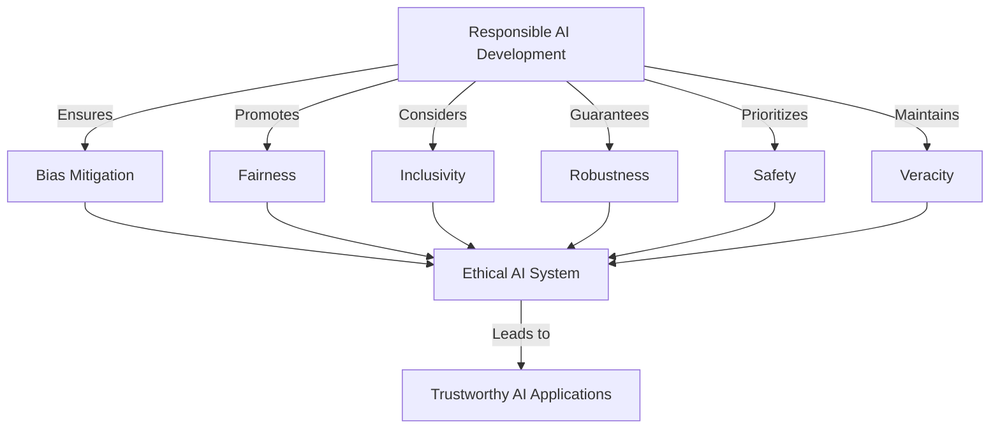
```mermaid
flowchart TD
    A[Responsible AI Development] -->|Ensures| B[Bias Mitigation]
    A -->|Promotes| C[Fairness]
    A -->|Considers| D[Inclusivity]
    A -->|Guarantees| E[Robustness]
    A -->|Prioritizes| F[Safety]
    A -->|Maintains| G[Veracity]
    B --> H[Ethical AI System]
    C --> H
    D --> H
    E --> H
    F --> H
    G --> H
    H -->|Leads to| I[Trustworthy AI Applications]
```

In practice, implementing these features requires a multifaceted approach. To address bias, companies might employ diverse data collection methods and use algorithmic fairness techniques. For inclusivity, they might conduct user research with various demographics and design accessible AI interfaces.

Robustness and safety can be enhanced through rigorous testing protocols, including adversarial testing to identify vulnerabilities. Veracity, particularly crucial in generative AI applications, might involve implementing fact-checking mechanisms or clearly labeling AI-generated content.

By prioritizing these features, businesses develop AI systems that not only perform well but also align with ethical standards and societal expectations, building trust with customers and stakeholders.

### Tools for Identifying Features of Responsible AI

AWS provides specialized tools that help organizations implement responsible AI practices effectively. **Guardrails for Amazon Bedrock** stands out as a powerful solution that ensures generative AI applications operate within predefined ethical and operational boundaries.[^1103]

Guardrails for Amazon Bedrock provides a structured approach to implementing responsible AI features:

1. **Content Filtering**: Prevents the generation of inappropriate or harmful content, addressing safety and veracity concerns.

2. **Input Validation**: Ensures user inputs meet specific criteria, enhancing robustness and safety.

3. **Output Formatting**: Structures AI-generated responses in a consistent format, improving inclusivity and usability.

4. **Prompt Engineering**: Allows fine-tuning of AI prompts to reduce bias and improve fairness in responses.

Here's a simplified diagram illustrating how Guardrails for Amazon Bedrock integrates into the AI development process:

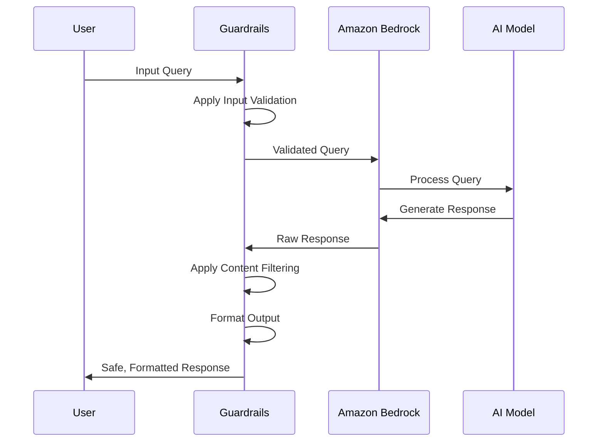
```mermaid
sequenceDiagram
    participant U as User
    participant G as Guardrails
    participant B as Amazon Bedrock
    participant AI as AI Model
    U->>G: Input Query
    G->>G: Apply Input Validation
    G->>B: Validated Query
    B->>AI: Process Query
    AI->>B: Generate Response
    B->>G: Raw Response
    G->>G: Apply Content Filtering
    G->>G: Format Output
    G->>U: Safe, Formatted Response
```

This diagram shows how Guardrails acts as an intermediary layer, ensuring both inputs and outputs adhere to responsible AI principles.

In practice, businesses might use Guardrails to:

- Set up content filters that prevent the AI from generating offensive language or sensitive information
- Implement input validation rules that ensure user queries are within acceptable parameters
- Define output formats that present information clearly and consistently across different user interactions

By utilizing tools like Guardrails, businesses can more easily identify and implement features of responsible AI, ensuring their AI applications meet ethical standards and regulatory requirements.

### Responsible Practices for Model Selection

Model selection represents a critical decision point in responsible AI development that affects not only performance but also environmental impact and sustainability. Making informed choices in this area demonstrates commitment to both technical excellence and corporate responsibility.

**Environmental Considerations**:
- **Energy Efficiency**: Choose models that require less computational power and energy to train and run.[^1104]
- **Carbon Footprint**: Consider the carbon emissions associated with model training and deployment.
- **Hardware Requirements**: Opt for models that operate effectively on existing infrastructure to minimize the need for additional, energy-intensive hardware.

**Sustainability Practices**:
- **Model Reusability**: Select models that can be fine-tuned for multiple tasks, reducing the need for training new models from scratch.
- **Efficient Data Usage**: Prioritize models that learn effectively from smaller datasets, reducing data storage and processing requirements.
- **Longevity**: Choose model architectures likely to remain relevant, reducing the frequency of resource-intensive model replacements.

To illustrate the decision-making process for responsible model selection, consider the following flowchart:

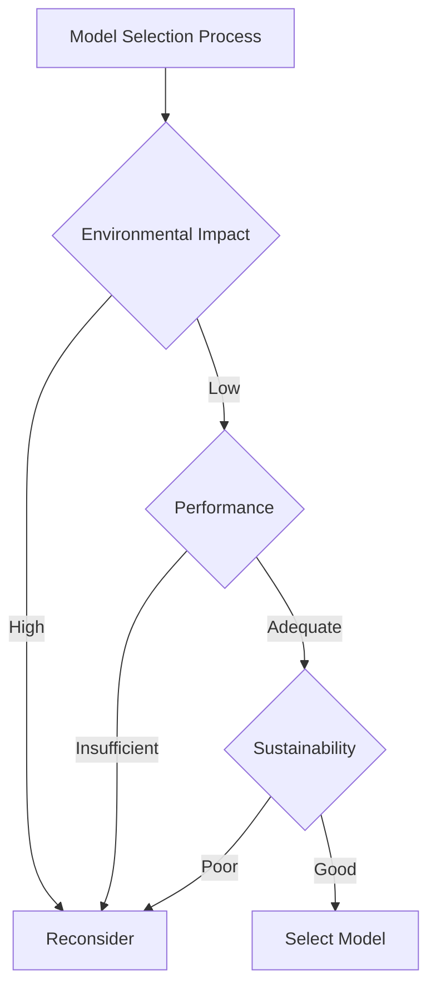
```mermaid
flowchart TD
    A[Model Selection Process] --> B{Environmental Impact}
    B -->|High| C[Reconsider]
    B -->|Low| D{Performance}
    D -->|Insufficient| C
    D -->|Adequate| E{Sustainability}
    E -->|Poor| C
    E -->|Good| F[Select Model]
```

This diagram outlines a decision-making process that prioritizes both environmental impact and sustainability alongside performance when selecting an AI model.

In practice, businesses might implement these responsible practices by:

1. Conducting energy consumption analyses of different model architectures
2. Utilizing cloud services like AWS that offer carbon-neutral computing options[^1105]
3. Implementing model compression techniques to reduce computational requirements
4. Regularly reviewing and updating model selection criteria to align with the latest sustainability standards

By adopting these responsible practices, businesses ensure their AI initiatives meet performance goals while contributing to broader sustainability objectives.

### Legal Risks of Working with Generative AI

Generative AI adoption brings significant legal and compliance challenges that organizations must proactively address. Understanding these risks is essential for implementing appropriate safeguards and maintaining legal compliance throughout the AI lifecycle.

Key legal risks include:

1. **Intellectual Property Infringement Claims**: Generative AI models trained on copyrighted material may produce outputs that infringe on existing intellectual property rights.[^1106]

2. **Biased Model Outputs**: AI systems producing biased results could lead to discrimination claims and regulatory violations.

3. **Loss of Customer Trust**: Misuse or mishandling of customer data in AI training or deployment can erode trust and potentially violate data protection laws.

4. **End User Risk**: AI-generated content or decisions that cause harm to end users could result in liability for the business.

5. **Hallucinations**: AI models producing false or misleading information (*hallucinations*) could lead to misinformation claims or reputational damage.[^1107]

To illustrate the interconnected nature of these risks, consider the following diagram:

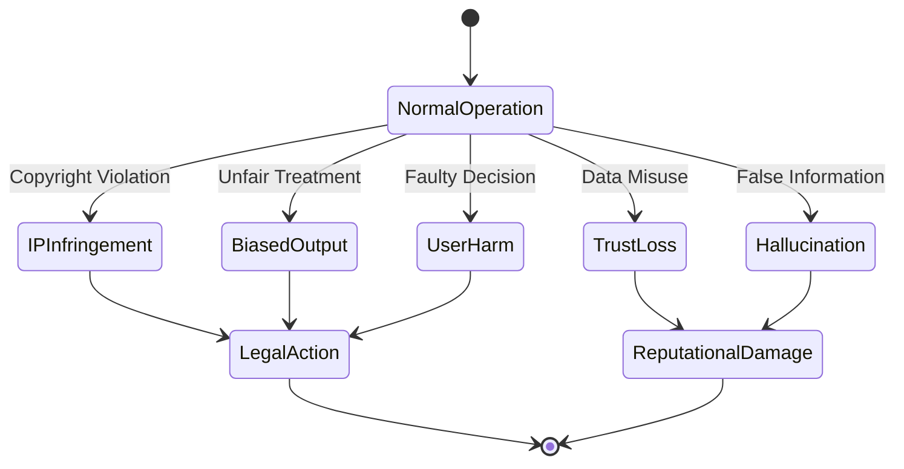
```mermaid
stateDiagram-v2
    [*] --> NormalOperation
    NormalOperation --> IPInfringement: Copyright Violation
    NormalOperation --> BiasedOutput: Unfair Treatment
    NormalOperation --> TrustLoss: Data Misuse
    NormalOperation --> UserHarm: Faulty Decision
    NormalOperation --> Hallucination: False Information
    IPInfringement --> LegalAction
    BiasedOutput --> LegalAction
    TrustLoss --> ReputationalDamage
    UserHarm --> LegalAction
    Hallucination --> ReputationalDamage
    LegalAction --> [*]
    ReputationalDamage --> [*]
```

This state diagram shows how various risks can lead to legal action or reputational damage, emphasizing the importance of proactive risk management in generative AI deployments.

To mitigate these risks, businesses can:

1. Implement robust content filtering and output validation processes
2. Conduct regular audits of AI model outputs for bias and accuracy
3. Establish clear data governance policies and obtain necessary permissions for training data
4. Develop transparent AI use policies and communicate them clearly to end users
5. Implement human oversight mechanisms for critical AI-driven decisions

By understanding and addressing these legal risks, businesses can harness generative AI's power while maintaining legal compliance and preserving stakeholder trust.

### Characteristics of High-Quality Datasets

Data quality forms the foundation of responsible AI systems. High-quality datasets exhibit specific characteristics that directly impact the fairness, accuracy, and reliability of AI models trained on them.

**Key Characteristics**:

1. **Inclusivity**: Datasets should represent diverse populations, ensuring the AI model performs equitably across different demographic groups.

2. **Diversity**: A wide range of scenarios, use cases, and data types enhances the model's ability to generalize.

3. **Curated Data Sources**: Data collected from reputable and verified sources ensures accuracy and reliability.

4. **Balanced Datasets**: The distribution of data across different categories should be balanced to prevent bias toward overrepresented groups.

5. **Relevance**: Data should be pertinent to the specific problem or domain the AI model addresses.

6. **Currency**: Datasets should be up-to-date and regularly refreshed to reflect current trends and information.

7. **Cleanliness**: Data should be free from errors, duplicates, and inconsistencies that could negatively impact model performance.[^1108]

To illustrate the interplay of these characteristics in creating high-quality datasets, consider the following diagram:

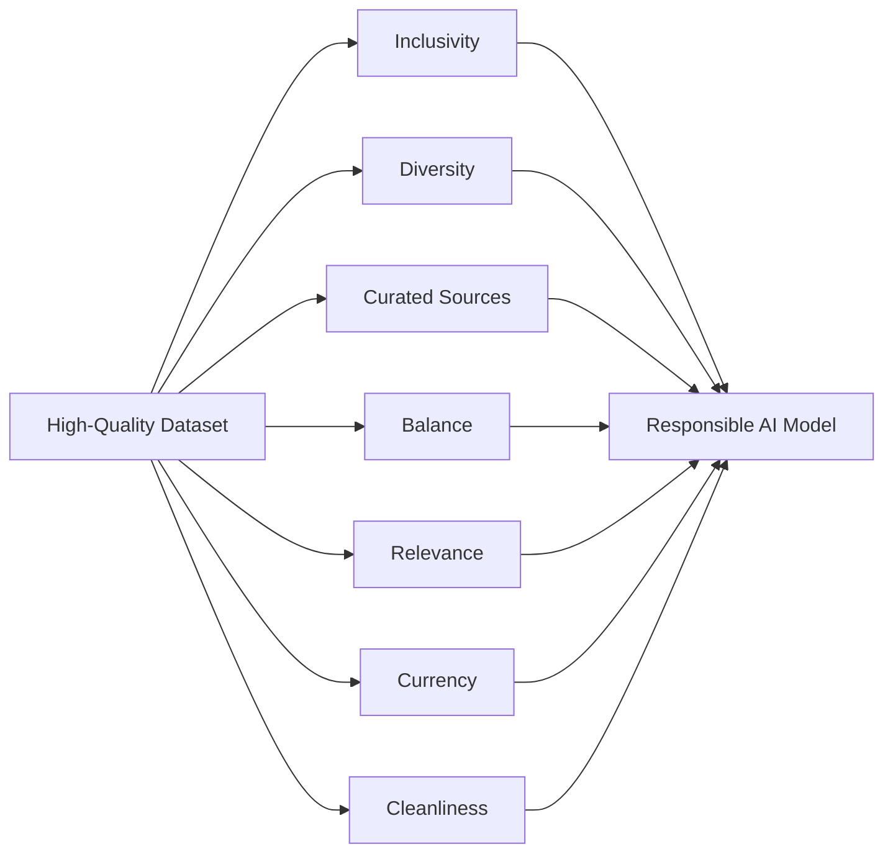
```mermaid
flowchart LR
    A[High-Quality Dataset] --> B[Inclusivity]
    A --> C[Diversity]
    A --> D[Curated Sources]
    A --> E[Balance]
    A --> F[Relevance]
    A --> G[Currency]
    A --> H[Cleanliness]
    B & C & D & E & F & G & H --> I[Responsible AI Model]
```

In practice, businesses can ensure dataset quality by:

1. Implementing data collection strategies that capture diverse perspectives and experiences
2. Regularly auditing datasets for balance and representation across different categories
3. Establishing partnerships with reputable data providers or curating in-house data collection processes
4. Developing data cleaning and preprocessing pipelines to maintain data integrity
5. Implementing version control for datasets to track changes and ensure currency

By prioritizing these characteristics in dataset creation and curation, businesses lay a strong foundation for developing AI models that are accurate, fair, and aligned with responsible AI principles.

### Understanding Effects of Bias and Variance

Bias and variance represent fundamental machine learning concepts that significantly affect AI model performance, fairness, and reliability. Understanding these concepts helps practitioners develop models that perform consistently across different scenarios and demographic groups.

**Bias**:
- **Definition**: Bias occurs when a model consistently underestimates or overestimates the true value, leading to systematic errors.
- **Effects on Demographic Groups**: Biased models can disproportionately affect certain demographic groups, leading to unfair or discriminatory outcomes.
- **Impact on Accuracy**: High bias can result in *underfitting*, where the model fails to capture the underlying patterns in the data.

**Variance**:
- **Definition**: Variance refers to the model's sensitivity to fluctuations in the training data.
- **Overfitting**: High variance can lead to *overfitting*, where the model performs well on training data but poorly on new, unseen data.
- **Underfitting**: Low variance (coupled with high bias) can result in underfitting, where the model is too simplistic to capture the data's complexity.[^1109]

**hallucination**, where the model generates seemingly accurate information that is, in fact, incorrect or fabricated
The term "hallucination" refers to a phenomenon in which a language model generates responses that sound plausible and appear factual but are actually false or unsupported by any underlying data. Hallucinations occur because the model relies on patterns learned during training rather than verified knowledge. This is a known limitation of LLMs, which can create convincing text that may mislead users if not carefully monitored or verified against reliable sources.

data drift, where the statistical properties of the input data change over time, causing the model's predictions to become less accurate - Data drift occurs when the distribution or characteristics of the input data change over time, which can cause the model’s performance to degrade. However, data drift does not explain why an LLM would produce plausible but incorrect responses; it is more related to changes in the data environment rather than the inherent behavior of the model in generating misleading information.

overfitting, where the model performs exceptionally well on the training data but fails to generalize to new, unseen data - Overfitting occurs when a model learns the training data too well, capturing noise or irrelevant details, which results in poor performance on new data. However, overfitting does not specifically describe the generation of plausible but incorrect responses; rather, it is about the model's failure to generalize beyond the examples it has been trained on.

underfitting, where the model fails to capture the underlying patterns in the data, resulting in poor performance on both training and new data - Underfitting happens when a model is too simple to learn the complexities of the data, leading to poor performance on both training and unseen datasets. While underfitting does cause incorrect responses, it is due to the model's inability to learn from data, not because it is generating fabricated or misleadingly plausible information.

References:

https://aws.amazon.com/blogs/machine-learning/best-practices-to-build-generative-ai-applications-on-aws/

To illustrate the relationship between bias, variance, and model performance, consider the following diagram:

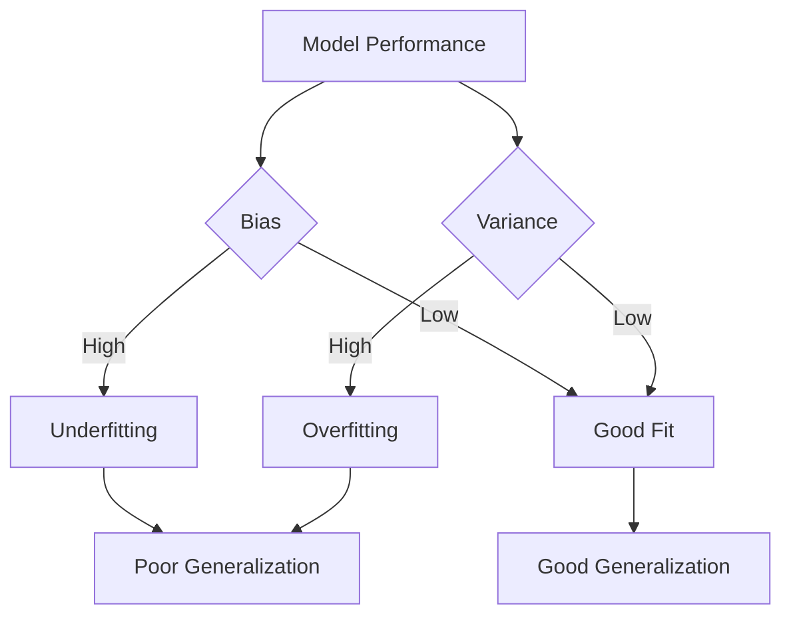
```mermaid
flowchart TD
    A[Model Performance] --> B{Bias}
    A --> C{Variance}
    B -->|High| D[Underfitting]
    B -->|Low| E[Good Fit]
    C -->|High| F[Overfitting]
    C -->|Low| E
    D --> G[Poor Generalization]
    F --> G
    E --> H[Good Generalization]
```

This diagram shows how different combinations of bias and variance affect model performance and generalization ability.

In practice, businesses can address bias and variance issues by:

1. **Regularization**: Implementing techniques like L1/L2 regularization to prevent overfitting
2. **Cross-validation**: Using k-fold cross-validation to assess model performance across different data subsets
3. **Ensemble Methods**: Combining multiple models to reduce both bias and variance
4. **Feature Engineering**: Carefully selecting and creating features that are representative and non-discriminatory
5. **Data Augmentation**: Expanding the dataset with synthetic examples to improve representation and reduce bias

By understanding and addressing bias and variance effects, businesses can develop AI models that are more accurate, fair, and generalizable across different scenarios and demographic groups.

### Tools for Detecting and Monitoring Bias, Trustworthiness, and Truthfulness

Maintaining AI system integrity requires continuous monitoring throughout the model lifecycle. AWS provides specialized tools that help organizations detect and address issues related to bias, trustworthiness, and truthfulness in their AI solutions.

1. **Amazon SageMaker Clarify**:
   - Detects potential bias in training data and model predictions
   - Provides explanations for model predictions to enhance transparency
   - Generates reports on feature importance and bias metrics[^1110]

2. **SageMaker Model Monitor**:
   - Continuously monitors model performance in production
   - Detects data drift and concept drift that could impact model accuracy
   - Alerts teams to potential issues before they affect business outcomes[^1111]

3. **Amazon Augmented AI (Amazon A2I)**:
   - Implements human review workflows for sensitive AI predictions
   - Helps validate model outputs and identify potential biases or errors
   - Improves model accuracy through human feedback loops[^1112]

In addition to these AWS-specific tools, businesses can employ other techniques to enhance the trustworthiness and truthfulness of their AI systems:

1. **Analyzing Label Quality**:
   - Implement rigorous quality control processes for data labeling
   - Use consensus labeling with multiple annotators for critical datasets

2. **Human Audits**:
   - Conduct regular human audits of model outputs, especially for high-stakes decisions
   - Establish clear criteria for what constitutes acceptable model performance

3. **Subgroup Analysis**:
   - Perform detailed analyses of model performance across different demographic subgroups
   - Identify and address any disparities in model accuracy or fairness

By leveraging these tools and techniques, businesses can:
- Proactively identify and mitigate biases in their AI systems
- Enhance the transparency and explainability of AI decision-making processes
- Maintain ongoing monitoring to ensure AI models remain accurate and fair over time
- Build trust with stakeholders by demonstrating a commitment to responsible AI practices

Implementing a comprehensive approach to detecting and monitoring bias, trustworthiness, and truthfulness is essential for businesses aiming to develop and maintain responsible AI systems that align with ethical standards and regulatory requirements.

### Questions for self-check

1. **A company is implementing responsible AI practices and wants to ensure their AI models are fair and unbiased. Which of the following tools would be most appropriate for detecting potential bias in their training data and model predictions?**

   A. Amazon SageMaker Model Monitor
   B. Amazon SageMaker Clarify
   C. Amazon Augmented AI (A2I)
   D. Amazon SageMaker Feature Store

2. **An AI development team is concerned about the environmental impact of their large language models. Which of the following practices would be most effective in reducing the carbon footprint of their AI systems?**

   A. Increasing the size of training datasets
   B. Using more powerful GPUs for training
   C. Selecting models that require less computational power
   D. Implementing real-time inferencing for all applications

3. **A financial services company is developing an AI system to approve loan applications. Which of the following represents the greatest legal risk associated with using generative AI in this context?**

   A. Intellectual property infringement
   B. Biased model outputs leading to discrimination
   C. Loss of customer trust due to data misuse
   D. AI-generated content causing reputational damage

4. **In the context of responsible AI development, what does the term "hallucination" refer to?**

   A. AI models producing false or misleading information
   B. Users misinterpreting AI-generated content
   C. AI systems consuming excessive computational resources
   D. Unexpected patterns emerging in training data

5. **A data scientist is evaluating the performance of an AI model and notices that it performs well on the training data but poorly on new, unseen data. What does this scenario most likely indicate?**

   A. The model has high bias and low variance
   B. The model has low bias and high variance
   C. The model has achieved optimal performance
   D. The model requires more training data

### Answers and Explanations

1. **Correct answer: B. Amazon SageMaker Clarify**

   Explanation: Amazon SageMaker Clarify is specifically designed to detect potential bias in training data and model predictions, which aligns with the company's goal of ensuring fair and unbiased AI models.[^1113] It provides reports on feature importance and bias metrics, making it the most appropriate tool for this task. While SageMaker Model Monitor is useful for ongoing monitoring, and A2I helps with human review, they don't specifically focus on bias detection in training data and model predictions.

2. **Correct answer: C. Selecting models that require less computational power**

   Explanation: To reduce the carbon footprint of AI systems, selecting models that require less computational power is the most effective approach. This directly addresses the energy efficiency aspect of responsible AI practices.[^1114] Increasing dataset size or using more powerful GPUs would likely increase energy consumption, while real-time inferencing isn't necessarily related to reducing environmental impact.

3. **Correct answer: B. Biased model outputs leading to discrimination**

   Explanation: In the context of loan approval, biased model outputs that lead to discrimination represent the greatest legal risk. This could result in unfair treatment of certain demographic groups, potentially violating anti-discrimination laws and exposing the company to significant legal liabilities.[^1115] While the other options are concerns, they are less directly tied to the specific use case of loan approval and the legal risks associated with financial services.

4. **Correct answer: A. AI models producing false or misleading information**

   Explanation: In the context of responsible AI, "hallucination" refers to AI models, particularly large language models, producing false or misleading information.[^1116] This is a critical concern in responsible AI development as it can lead to misinformation and erode trust in AI systems. The other options, while potentially problematic, do not accurately describe the concept of hallucination in AI.

5. **Correct answer: B. The model has low bias and high variance**

   Explanation: This scenario describes a classic case of overfitting, which is characterized by low bias and high variance.[^1117] The model performs well on the training data (indicating low bias) but poorly on new, unseen data (indicating high variance). This suggests that the model has learned the noise in the training data too well, rather than generalizing the underlying patterns. It's a key concept in understanding the effects of bias and variance in machine learning models.

[^1100]: AWS Responsible AI. URL: <https://aws.amazon.com/machine-learning/responsible-ai/>

[^1101]: Amazon SageMaker Clarify - Detect bias in ML models. URL: <https://aws.amazon.com/sagemaker/clarify/>

[^1102]: AWS AI & ML Blog - Responsible AI: Trustworthy, Ethical, and Unbiased AI. URL: <https://aws.amazon.com/ai/responsible-ai/>

[^1103]: Amazon Bedrock - Guardrails for responsible AI. URL: <https://aws.amazon.com/bedrock/guardrails/>

[^1104]: AWS Sustainability - Carbon Footprint Tool. URL: <https://aws.amazon.com/aws-cost-management/aws-customer-carbon-footprint-tool/>

[^1105]: AWS Sustainability - 100% Renewable Energy by 2025. URL: <https://sustainability.aboutamazon.com/products-services/aws-cloud>

[^1106]: AWS Machine Learning Blog - Mitigating AI/ML Risks. URL: <https://aws.amazon.com/blogs/machine-learning/learn-how-to-assess-risk-of-ai-systems/>

[^1107]: AWS AI & ML Blog - Addressing AI/ML Model Hallucinations. URL: <https://aws.amazon.com/blogs/machine-learning/reducing-hallucinations-in-large-language-models-with-custom-intervention-using-amazon-bedrock-agents/>

[^1108]: Amazon SageMaker Data Wrangler - Clean and prepare ML data. URL: <https://aws.amazon.com/sagemaker/data-wrangler/>

[^1109]: AWS Machine Learning Blog - Understanding Bias-Variance Tradeoff. URL: <https://docs.aws.amazon.com/wellarchitected/latest/machine-learning-lens/mlper-09.html>

[^1110]: Amazon SageMaker Clarify Documentation. URL: <https://docs.aws.amazon.com/sagemaker/latest/dg/clarify-configure-processing-jobs.html>

[^1111]: Amazon SageMaker Model Monitor Documentation. URL: <https://docs.aws.amazon.com/sagemaker/latest/dg/model-monitor.html>

[^1112]: Amazon Augmented AI (A2I) Documentation. URL: <https://docs.aws.amazon.com/sagemaker/latest/dg/a2i-use-augmented-ai-a2i-human-review-loops.html>

[^1113]: Amazon SageMaker Clarify - Detect bias in ML models. URL: <https://aws.amazon.com/sagemaker/clarify/>

[^1114]: AWS Sustainability - Reducing Carbon Footprint in AI/ML. URL: <https://www.aboutamazon.com/news/aws/aws-carbon-footprint-ai-workload>

[^1115]: AWS Financial Services Blog - Responsible AI in Finance. URL: <https://aws.amazon.com/financial-services/generative-ai/>

[^1116]: AWS AI & ML Blog - Addressing AI/ML Model Hallucinations. URL: <https://aws.amazon.com/blogs/machine-learning/reducing-hallucinations-in-large-language-models-with-custom-intervention-using-amazon-bedrock-agents/>

[^1117]: AWS Machine Learning Blog - Understanding Bias-Variance Tradeoff. URL: <https://docs.aws.amazon.com/wellarchitected/latest/machine-learning-lens/mlper-09.html>

--------------------------

Task Statement 4.2: Recognize the importance of transparent and explainable models.

Objectives:

Describe the differences between models that are transparent and explainable and models that are not transparent and explainable.

Describe tools to identify transparent and explainable models (for example, SageMaker Model Cards, open source models, data, licensing).

Identify tradeoffs between model safety and transparency (for example, measure interpretability and performance).

Describe principles of human-centered design for explainable AI.

## 4.2 Transparent and Explainable Models: Building Trust in AI Systems

Transparency and explainability are foundational elements of responsible AI implementation. As organizations deploy AI systems for critical decision-making, understanding how these systems arrive at their conclusions becomes essential for stakeholder trust, regulatory compliance, and risk management. **Transparent and explainable AI** enables organizations to validate model behavior, identify potential biases, and justify AI-driven decisions to customers, regulators, and internal teams. Business professionals preparing for the AWS Certified AI Practitioner exam need to understand these concepts beyond theory—they must recognize how transparency affects AI deployment across industries like finance, healthcare, retail, and manufacturing. This chapter explores the distinctions between transparent and opaque models, examines tools for identifying explainable models, discusses the balance between model safety and transparency, and introduces human-centered design principles for creating AI systems that users can understand and trust.

### Understanding the differences between transparent and explainable models and opaque models

**Transparent and explainable models**, often called "white box" models, provide visibility into their decision-making processes, revealing how inputs lead to specific outputs. In contrast, **opaque models**, or "black box" models, offer minimal insight into their internal operations. This distinction significantly impacts AI implementation across regulatory compliance, user trust, and operational effectiveness.

Transparent models typically feature simpler architectures with interpretable algorithms such as decision trees, linear regression, or rule-based systems. These models allow direct examination of their logic and decision boundaries. For example, a decision tree used in customer churn prediction can be visualized to show exactly which features and thresholds determine specific classifications.

Explainable models may incorporate more complex structures but provide methods to interpret their decisions after they're made. These approaches include techniques like SHAP (SHapley Additive exPlanations) values or LIME (Local Interpretable Model-agnostic Explanations) that reveal feature importance and local decision boundaries.[^1200]

Opaque models, including deep neural networks and ensemble methods like random forests, often deliver superior performance at the expense of interpretability. While these models excel at capturing complex, non-linear relationships in data, their decision-making processes remain difficult for humans to comprehend.

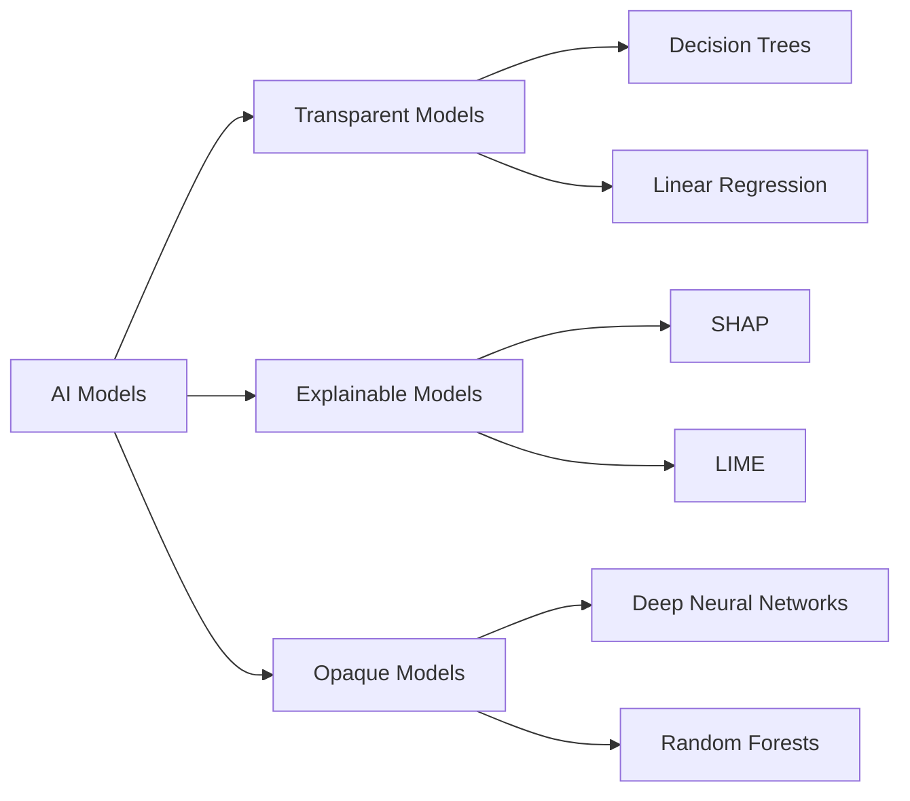
```mermaid
flowchart LR
    A[AI Models] --> B[Transparent Models]
    A --> C[Explainable Models]
    A --> D[Opaque Models]
    B --> E[Decision Trees]
    B --> F[Linear Regression]
    C --> G[SHAP]
    C --> H[LIME]
    D --> I[Deep Neural Networks]
    D --> J[Random Forests]
```

*Figure 4.2.1. AI Model Types and Examples. This diagram illustrates the categorization of AI models into transparent, explainable, and opaque types, along with examples of each category.*

The selection between transparent, explainable, and opaque models depends on specific use cases and regulatory environments. Highly regulated industries such as finance or healthcare often require transparent or explainable models to ensure compliance and auditability. For instance, financial institutions using AI for credit scoring need to provide clear explanations for loan rejections to comply with fair lending laws.[^1201]

In applications where performance is paramount and explainability is less critical, such as image recognition or natural language processing, opaque models might be preferred. However, even in these scenarios, post-hoc explanation techniques are increasingly employed to provide some level of interpretability.

For business professionals, understanding these model differences matters for several reasons:

1. **Risk Management**: Transparent and explainable models enable better risk assessment and mitigation
2. **Regulatory Compliance**: Many industries mandate explainable AI decisions, particularly for impacts on individual rights or significant business outcomes
3. **Stakeholder Trust**: Explainable models build confidence with customers, employees, and partners by clarifying decision processes
4. **Model Improvement**: Understanding model logic facilitates effective debugging and iterative enhancement
5. **Ethical Considerations**: Transparent models simplify detection and correction of biases or unfair practices

As AI systems become increasingly central to business operations, the ability to distinguish between and appropriately apply transparent, explainable, and opaque models becomes a critical skill for AI practitioners and business leaders.

### Understanding tools to identify transparent and explainable models

Implementing transparent and explainable AI models requires familiarity with specialized tools and techniques. AWS offers several services that support model transparency and explainability, which serve both compliance requirements and trust-building initiatives.

**Amazon SageMaker Model Cards** provides a standardized framework for documenting essential machine learning model information.[^1202] These cards capture critical details that help users understand a model's behavior and potential biases.

Key components of Amazon SageMaker Model Cards include:

- Model details (architecture, training data, etc.)
- Intended uses and limitations
- Performance metrics across different subgroups
- Ethical considerations and potential biases
- Testing results and model behavior in various scenarios

By implementing Model Cards, organizations ensure all stakeholders have clear visibility into a model's capabilities and constraints, promoting responsible AI deployment.

**Open source models** represent another important aspect of model transparency. These models provide complete visibility into their architecture and training process, enabling thorough examination and customization. AWS supports deployment and management of diverse open source models through services like Amazon SageMaker and Amazon Bedrock.[^1203]

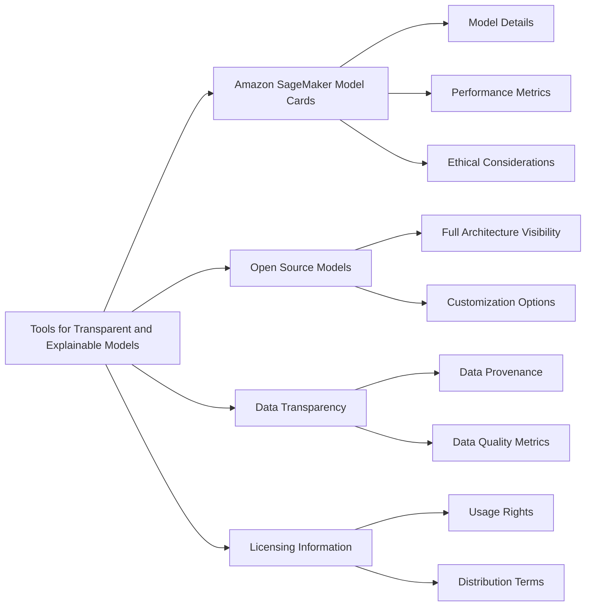
```mermaid
flowchart LR
    A[Tools for Transparent and Explainable Models] --> B[Amazon SageMaker Model Cards]
    A --> C[Open Source Models]
    A --> D[Data Transparency]
    A --> E[Licensing Information]
    B --> F[Model Details]
    B --> G[Performance Metrics]
    B --> H[Ethical Considerations]
    C --> I[Full Architecture Visibility]
    C --> J[Customization Options]
    D --> K[Data Provenance]
    D --> L[Data Quality Metrics]
    E --> M[Usage Rights]
    E --> N[Distribution Terms]
```

*Figure 4.2.2. Tools for Transparent and Explainable Models. This diagram illustrates various tools and components that contribute to model transparency and explainability, including Amazon SageMaker Model Cards, open source models, data transparency, and licensing information.*

**Data transparency** forms a critical foundation for model explainability. AWS provides specialized tools for tracking data lineage and provenance, ensuring that training and validation data is thoroughly documented and understood:

- **Amazon SageMaker Data Wrangler** for data preparation and feature engineering[^1204]
- **Amazon SageMaker Feature Store** for feature management and versioning[^1205]
- **AWS Glue Data Catalog** for maintaining a centralized metadata repository[^1206]

**Proper licensing** is also essential for transparent and explainable models. AWS provides clear licensing information for its AI services and supports various open source licenses. Understanding licensing terms helps organizations:

- Ensure compliance with usage restrictions
- Determine rights for model modification and distribution
- Assess potential legal risks associated with model deployment

For business professionals, these tools and practices offer significant advantages:

1. **Enhanced Compliance**: Detailed model documentation and transparent data practices satisfy regulatory requirements
2. **Improved Decision-Making**: Understanding model behavior enables more informed business decisions based on AI outputs
3. **Easier Troubleshooting**: Transparent models and clear data lineage simplify issue identification and resolution
4. **Stakeholder Communication**: Comprehensive documentation facilitates clear communication about AI capabilities and limitations to both technical and non-technical stakeholders
5. **Risk Mitigation**: Transparency in model architecture and data usage helps identify potential biases or ethical concerns early in development

By leveraging these AWS tools and prioritizing transparency in model selection, data handling, and licensing, organizations can build AI systems that deliver both performance and trustworthiness while maintaining regulatory compliance.

### Identifying tradeoffs between model safety and transparency

Organizations implementing responsible AI practices often encounter a fundamental tension between model safety and transparency. This tradeoff represents a critical consideration that impacts performance, trustworthiness, and regulatory compliance of AI systems.

**Model safety** encompasses the reliability, robustness, and security of an AI model, including:

- Accuracy and consistency of predictions
- Resilience against adversarial attacks
- Protection of sensitive information
- Stability across diverse input distributions

**Transparency** refers to the interpretability and explainability of the model's decision-making process, including:

- Clear understanding of feature importance
- Visibility into the model's internal logic
- Ability to trace specific outputs back to inputs
- Comprehensible explanations for model decisions

This tradeoff often manifests in choosing between simple, interpretable models and complex, high-performing ones. For example, a linear regression model offers high transparency but may lack the predictive power of a deep neural network, which typically provides less visibility into its operations.

To navigate this tradeoff effectively, organizations should consider several factors:

1. **Regulatory Requirements**: Some industries mandate explainable AI decisions, necessitating transparency even at the cost of performance
2. **Use Case Criticality**: High-stakes decisions may require more transparent models to ensure proper oversight and accountability
3. **Model Complexity**: More complex models often deliver better performance but reduced interpretability
4. **Data Sensitivity**: Models handling sensitive data may prioritize safety over transparency to protect privacy
5. **Stakeholder Trust**: In customer-facing applications, transparency may be crucial for building user trust

Organizations can employ various techniques to measure and balance these tradeoffs:

- **Interpretability Metrics**: Tools like SHAP values or LIME quantify how well a model's decisions can be explained[^1207]
- **Performance Metrics**: Traditional measures like accuracy, precision, and recall assess model effectiveness
- **Robustness Tests**: Techniques such as adversarial testing evaluate a model's resilience to unusual or malicious inputs
- **Fairness Assessments**: Metrics measuring bias across different subgroups help ensure ethical model behavior

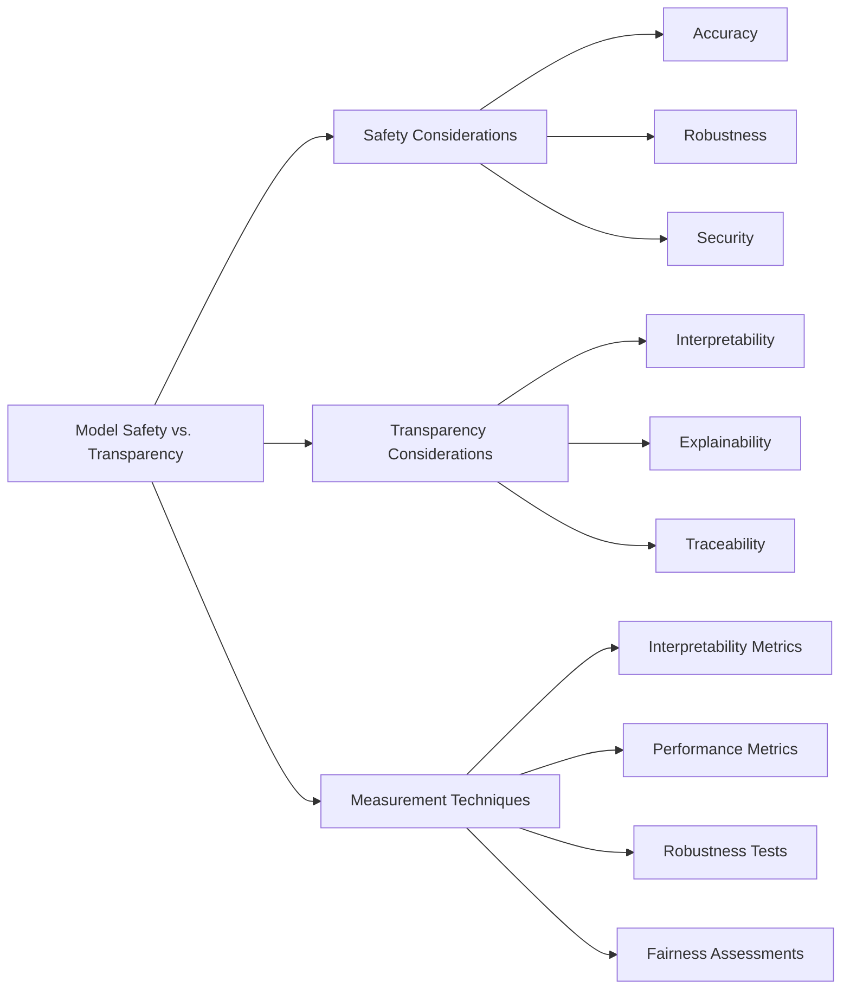
```mermaid
flowchart LR
    A[Model Safety vs. Transparency] --> B[Safety Considerations]
    A --> C[Transparency Considerations]
    B --> D[Accuracy]
    B --> E[Robustness]
    B --> F[Security]
    C --> G[Interpretability]
    C --> H[Explainability]
    C --> I[Traceability]
    A --> J
    J[Measurement Techniques] --> K[Interpretability Metrics]
    J --> L[Performance Metrics]
    J --> M[Robustness Tests]
    J --> N[Fairness Assessments]
```

*Figure 4.2.3. Model Safety vs. Transparency Tradeoffs. This diagram illustrates the key considerations in balancing model safety and transparency, along with techniques for measuring these aspects.*

AWS provides several tools to help organizations navigate these tradeoffs:

- **Amazon SageMaker Clarify**: Offers bias detection and explainability features to enhance transparency without compromising performance[^1208]
- **Amazon SageMaker Model Monitor**: Enables continuous performance monitoring and drift detection, balancing safety and transparency over time[^1209]
- **AWS Security Hub**: Provides comprehensive security and compliance visibility, ensuring model safety in deployment[^1210]

For business professionals, understanding and managing these tradeoffs delivers several benefits:

1. **Risk Management**: Balancing safety and transparency allows for better assessment and mitigation of AI-related risks
2. **Regulatory Compliance**: Many industries require specific levels of model explainability alongside performance standards
3. **Ethical AI Practices**: Transparent models facilitate ethical review and adjustment, essential for responsible AI deployment
4. **Stakeholder Communication**: Understanding model tradeoffs enables clearer communication about AI capabilities and limitations
5. **Continuous Improvement**: Recognizing the balance between safety and transparency guides ongoing model refinement efforts

By thoughtfully addressing these tradeoffs and leveraging appropriate tools and metrics, organizations can develop AI systems that deliver both high performance and responsible operation, meeting diverse requirements for performance, explainability, and ethical standards.

### Understanding principles of human-centered design for explainable AI

**Human-centered design** (HCD) for explainable AI focuses on creating systems that aren't just technically robust but also intuitive, accessible, and meaningful to human users. This approach ensures AI explanations provide genuine value to diverse stakeholders, from data scientists to business decision-makers and end-users.

Key principles of human-centered design for explainable AI include:

1. **User-Centric Explanations**: Tailoring explanations to match the specific needs, knowledge levels, and contexts of different user groups
2. **Cognitive Load Management**: Presenting information in ways that avoid overwhelming users with unnecessary complexity
3. **Interactive Exploration**: Enabling users to investigate deeper into explanations and examine different aspects of model decisions
4. **Multimodal Communication**: Using various formats (text, visuals, interactive elements) to effectively convey explanations
5. **Contextual Relevance**: Ensuring explanations are meaningful within specific business or operational contexts
6. **Actionable Insights**: Providing explanations that guide users toward informed decisions or concrete actions
7. **Continuous Feedback Loop**: Incorporating user input to iteratively improve the explainability of AI systems

Implementing these principles significantly enhances AI system effectiveness and adoption. For example, a credit scoring model might provide different explanation levels for a loan officer (detailed risk factors) versus a loan applicant (simplified, actionable feedback).

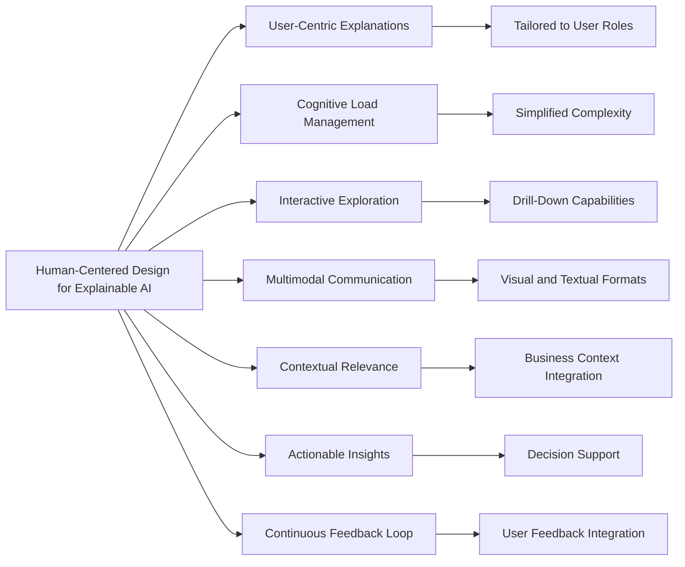
```mermaid
flowchart LR
    A[Human-Centered Design for Explainable AI] --> B[User-Centric Explanations]
    A --> C[Cognitive Load Management]
    A --> D[Interactive Exploration]
    A --> E[Multimodal Communication]
    A --> F[Contextual Relevance]
    A --> G[Actionable Insights]
    A --> H[Continuous Feedback Loop]
    B --> I[Tailored to User Roles]
    C --> J[Simplified Complexity]
    D --> K[Drill-Down Capabilities]
    E --> L[Visual and Textual Formats]
    F --> M[Business Context Integration]
    G --> N[Decision Support]
    H --> O[User Feedback Integration]
```

*Figure 4.2.4. Human-Centered Design Principles for Explainable AI. This diagram illustrates the key principles of human-centered design in the context of explainable AI, highlighting how these principles contribute to more effective and user-friendly AI explanations.*

AWS provides several tools and services supporting human-centered explainable AI:

- **Amazon SageMaker Canvas**: Offers a visual interface for creating and understanding ML models, making AI more accessible to non-technical users[^1211]
- **Amazon QuickSight Q**: Provides natural language querying capabilities, allowing users to explore data and AI insights intuitively[^1212]
- **Amazon Augmented AI (A2I)**: Facilitates human review of ML predictions, incorporating human judgment into AI systems[^1213]

For business professionals, applying these principles delivers substantial benefits:

1. **Enhanced User Adoption**: AI systems designed with human needs in mind are more likely to be accepted and effectively utilized
2. **Improved Decision-Making**: Clear, contextual explanations enable stakeholders to make more informed decisions based on AI outputs
3. **Increased Trust**: Transparent, user-friendly AI explanations build confidence in AI systems among internal and external stakeholders
4. **Regulatory Compliance**: Human-centered explainable AI helps satisfy regulatory requirements for AI transparency and fairness
5. **Efficient Problem-Solving**: When users understand AI decisions, they can more quickly identify and address issues or biases

Practical applications of human-centered explainable AI include:

- **Customer Service**: AI chatbots providing clear explanation for their responses, allowing human agents to understand and verify AI-generated information
- **Financial Services**: Risk assessment models offering interactive, visual explanations of credit decisions, helping both analysts and customers understand contributing factors
- **Healthcare**: Diagnostic AI systems presenting findings in ways that support, rather than replace, physician decision-making
- **Manufacturing**: Predictive maintenance systems providing actionable insights to technicians, explaining not just what might fail, but why and how to prevent it

By incorporating human-centered design principles, organizations create AI systems that are not only powerful and accurate but also understandable and valuable to human users. This approach bridges the gap between advanced AI capabilities and practical, real-world application, ensuring AI truly serves and empowers its users.

In conclusion, transparent and explainable models form the foundation of responsible AI implementation. By understanding different model types, leveraging appropriate tools, balancing safety and transparency, and applying human-centered design principles, organizations can develop AI systems that deliver both effectiveness and trustworthiness. As AI transforms business operations across industries, the ability to build and deploy explainable AI systems will differentiate organizations committed to ethical standards and regulatory compliance while maximizing AI's business value.

### Questions for self-check

1. **Which of the following best describes the difference between transparent and opaque AI models?**

   A. Transparent models are always more accurate than opaque models
   B. Opaque models provide clearer explanations of their decision-making process
   C. Transparent models allow for direct examination of their logic and decision boundaries
   D. Opaque models are required for compliance in highly regulated industries

2. **A financial institution is implementing an AI system for credit scoring. Which AWS tool would be most appropriate for documenting the model's intended use, performance characteristics, and limitations?**

   A. Amazon SageMaker Clarify
   B. Amazon SageMaker Model Cards
   C. AWS Security Hub
   D. Amazon QuickSight Q

3. **In the context of explainable AI, what does the principle of "cognitive load management" refer to?**

   A. Maximizing the amount of information presented to users
   B. Presenting information in a way that doesn't overwhelm users with unnecessary complexity
   C. Focusing solely on technical explanations for data scientists
   D. Avoiding visual representations of model decisions

4. **A company is developing an AI system for medical diagnosis. They want to balance model performance with the need for transparency. Which of the following statements best describes an appropriate approach?**

   A. Always choose the most complex model for highest accuracy
   B. Use only simple, fully transparent models to ensure explainability
   C. Consider regulatory requirements and use case criticality when balancing performance and transparency
   D. Prioritize model safety over transparency in all medical applications

5. **Which AWS service facilitates human review of machine learning predictions, supporting the human-centered design principle of continuous feedback loop in explainable AI?**

   A. Amazon SageMaker Canvas
   B. Amazon QuickSight Q
   C. Amazon Augmented AI (A2I)
   D. AWS Glue Data Catalog

### Answers and Explanations

1. **Correct answer: C. Transparent models allow for direct examination of their logic and decision boundaries**

   Explanation: Transparent models, often referred to as "white box" models, provide insight into their decision-making processes. They typically have simpler architectures that allow users to directly examine their logic and decision boundaries. This is in contrast to opaque or "black box" models, which offer little visibility into their internal workings. The other options are incorrect: accuracy is not inherently tied to transparency (A), opaque models by definition do not provide clearer explanations (B), and while transparent models may be preferred in regulated industries, opaque models are not universally required (D).[^1214]

2. **Correct answer: B. Amazon SageMaker Model Cards**

   Explanation: Amazon SageMaker Model Cards is specifically designed to provide a standardized way to document essential information about machine learning models, including their intended use, performance characteristics, and limitations. This tool is crucial for understanding a model's behavior and potential biases, making it ideal for the scenario described. While Amazon SageMaker Clarify (A) offers bias detection and explainability features, it doesn't provide comprehensive documentation like Model Cards. AWS Security Hub (C) is focused on security and compliance, not model documentation. Amazon QuickSight Q (D) is a business intelligence tool and not directly related to model documentation.[^1215]

3. **Correct answer: B. Presenting information in a way that doesn't overwhelm users with unnecessary complexity**

   Explanation: In the context of explainable AI, cognitive load management refers to the principle of presenting information in a way that is easily digestible and doesn't overwhelm users with unnecessary complexity. This is crucial for ensuring that AI explanations are meaningful and actionable for various stakeholders. The other options are incorrect: maximizing information (A) would likely increase cognitive load, focusing solely on technical explanations (C) doesn't consider different user needs, and avoiding visual representations (D) could actually increase cognitive load for many users.[^1216]

4. **Correct answer: C. Consider regulatory requirements and use case criticality when balancing performance and transparency**

   Explanation: When developing AI systems, especially for critical applications like medical diagnosis, it's important to balance model performance with the need for transparency. The appropriate approach is to consider factors such as regulatory requirements and use case criticality. This allows for a nuanced decision that may involve using more complex, high-performing models where necessary, while ensuring sufficient explainability to meet regulatory and ethical standards. The other options are too extreme: always choosing the most complex model (A) or only using simple models (B) doesn't allow for this balance, and while safety is important, categorically prioritizing it over transparency (D) may not meet all regulatory and ethical requirements in medical AI applications.[^1217]

5. **Correct answer: C. Amazon Augmented AI (A2I)**

   Explanation: Amazon Augmented AI (A2I) is specifically designed to facilitate human review of machine learning predictions. This service supports the human-centered design principle of continuous feedback loop in explainable AI by allowing human judgment to be incorporated into AI systems. This enables ongoing improvement and validation of AI outputs. The other options, while useful AWS services, do not directly facilitate human review of ML predictions: Amazon SageMaker Canvas (A) is a visual interface for creating ML models, Amazon QuickSight Q (B) provides natural language querying for data exploration, and AWS Glue Data Catalog (C) is a centralized metadata repository.[^1218]

[^1200]: Explainable AI: ML Explainability with Amazon SageMaker Debugger. URL: <https://aws.amazon.com/blogs/machine-learning/ml-explainability-with-amazon-sagemaker-debugger/>

[^1201]: Responsible AI: AWS Responsible AI Policy. URL: <https://aws.amazon.com/ai/responsible-ai/policy/>

[^1202]: Amazon SageMaker Model Cards. URL: <https://docs.aws.amazon.com/sagemaker/latest/dg/model-cards.html>

[^1203]: Amazon Bedrock. URL: <https://aws.amazon.com/bedrock/>

[^1204]: Amazon SageMaker Data Wrangler. URL: <https://aws.amazon.com/sagemaker/data-wrangler/>

[^1205]: Amazon SageMaker Feature Store. URL: <https://aws.amazon.com/sagemaker/feature-store/>

[^1206]: AWS Glue Data Catalog. URL: <https://docs.aws.amazon.com/glue/latest/dg/components-overview.html#data-catalog-intro>

[^1207]: Interpretable Machine Learning: Interpreting Machine Learning Models With SHAP. URL: <https://mindfulmodeler.substack.com/p/interpreting-machine-learning-models>

[^1208]: Amazon SageMaker Clarify. URL: <https://aws.amazon.com/sagemaker/clarify/>

[^1209]: Amazon SageMaker Model Monitor. URL: <https://docs.aws.amazon.com/sagemaker/latest/dg/model-monitor.html>

[^1210]: AWS Security Hub. URL: <https://aws.amazon.com/security-hub/>

[^1211]: Amazon SageMaker Canvas. URL: <https://aws.amazon.com/sagemaker/canvas/>

[^1212]: Amazon QuickSight Q. URL: <https://aws.amazon.com/quicksight/q/>

[^1213]: Amazon Augmented AI. URL: <https://docs.aws.amazon.com/sagemaker/latest/dg/a2i-api-references.html>

[^1214]: AWS Machine Learning: Model Explainability. URL: <https://docs.aws.amazon.com/sagemaker/latest/dg/clarify-model-explainability.html>

[^1215]: Amazon SageMaker Model Cards Documentation. URL: <https://docs.aws.amazon.com/sagemaker/latest/dg/model-cards.html>

[^1216]: AWS Responsible AI. URL: <https://aws.amazon.com/ai/responsible-ai/>

[^1217]: AWS for Healthcare & Life Sciences. URL: <https://aws.amazon.com/health/>

[^1218]: Use APIs in Amazon Augmented AI. URL: <https://docs.aws.amazon.com/sagemaker/latest/dg/a2i-api-references.html>

------------------------------

Task Statement 5.1: Explain methods to secure AI systems.

Objectives:

Identify AWS services and features to secure AI systems (for example, IAM roles, policies, and permissions; encryption; Amazon Macie; AWS PrivateLink; AWS shared responsibility model).

Describe the concept of source citation and documenting data origins (for example, data lineage, data cataloging, Amazon SageMaker Model Cards).

Describe best practices for secure data engineering (for example, assessing data quality, implementing privacy-enhancing technologies, data access control, data integrity).

Describe security and privacy considerations for AI systems (for example, application security, threat detection, vulnerability management, infrastructure protection, prompt injection, encryption at rest and in transit).

## 5.1 Methods to secure AI systems

Securing AI systems is a critical challenge for organizations leveraging machine learning technologies. As AI becomes embedded in core business processes, it introduces unique vulnerabilities that traditional security approaches may not address. For business professionals preparing for the AWS Certified AI Practitioner exam, understanding AI security methods is essential for building robust solutions that maintain data integrity, confidentiality, and availability.

The security landscape for AI encompasses multiple domains – from protecting sensitive training data to safeguarding model integrity and ensuring responsible deployment. A compromised AI system can lead to serious consequences, including data breaches, biased decisions, or manipulation of critical business processes. Implementing comprehensive security measures is therefore vital for regulatory compliance, customer trust, and organizational reputation.

This subchapter explores the multifaceted approach to securing AI systems on AWS, covering essential services, best practices, and key considerations. From AWS's robust identity management features to advanced data protection techniques, you'll gain practical knowledge of tools and strategies to secure your AI initiatives. These concepts will equip you to address security challenges and contribute to developing trustworthy, resilient AI solutions in your organization.

### Identify AWS services and features to secure AI systems

AWS provides a comprehensive suite of services designed to secure AI systems across all layers of the technology stack. Understanding these tools enables business professionals to protect their AI initiatives against potential threats and vulnerabilities effectively.

#### Identity and Access Management (IAM)

**IAM**[^1400] forms the foundation of AWS security by controlling access to AWS services and resources. For AI systems, IAM ensures that only authorized users and processes can interact with sensitive data and models.

Key IAM features for securing AI systems include:

- **IAM Roles**: Allow you to delegate permissions to AWS services without sharing long-term access keys. For example, you can create a role granting an Amazon **SageMaker**[^1401] notebook instance access to specific S3 buckets containing training data.

- **IAM Policies**: JSON documents defining permissions. You can create custom policies to fine-tune access to AI resources, such as allowing data scientists to train models while restricting production deployment capabilities.

- **IAM Permissions Boundaries**: Set maximum permissions an IAM entity can have, particularly useful in large organizations to prevent privilege escalation in AI projects.

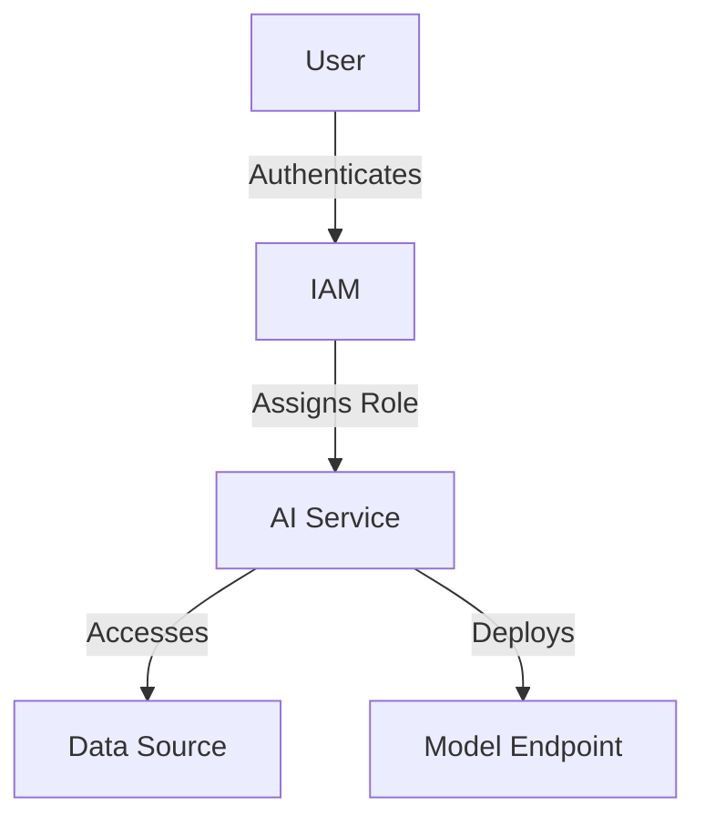
```mermaid
flowchart TD
    A[User] -->|Authenticates| B[IAM]
    B -->|Assigns Role| C[AI Service]
    C -->|Accesses| D[Data Source]
    C -->|Deploys| E[Model Endpoint]
```

*Figure 5.1.1: IAM Role-based Access Control for AI Services*

This diagram illustrates how IAM roles and policies control access to AI services and resources, ensuring that only authorized entities can interact with sensitive components of your AI system.

#### Encryption and Key Management

Protecting data at rest and in transit is crucial for AI systems that handle sensitive information. AWS provides several services for robust encryption:

- **AWS Key Management Service (KMS)**[^1402]: Creates and manages cryptographic keys used to encrypt your data. For AI workloads, KMS can encrypt training datasets, model artifacts, and inference results.

- **Amazon Macie**[^1403]: A data security service that uses machine learning to automatically discover, classify, and protect sensitive data. Particularly valuable for identifying personally identifiable information (PII) in datasets used for AI training.

- **AWS PrivateLink**[^1404]: Enables private access to AWS services without exposing traffic to the public internet. For AI systems, PrivateLink can securely connect your VPC to SageMaker endpoints or other AI services.

#### AWS Shared Responsibility Model

Understanding the **AWS Shared Responsibility Model**[^1405] is essential for securing AI systems in the cloud. This model clearly defines security responsibilities between AWS and customers:

- AWS is responsible for securing the underlying infrastructure running all AWS Cloud services.
- Customers are responsible for security "in" the cloud, including data encryption, access management, and application security.

For AI systems, while AWS secures the underlying compute resources and network infrastructure, you remain responsible for securing your AI models, training data, and applications consuming AI services.

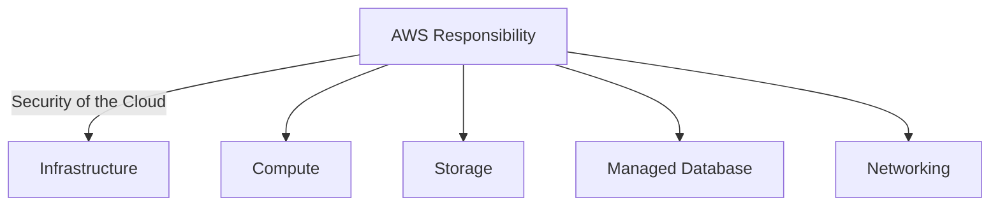
```mermaid
flowchart TD
    A[AWS Responsibility] -->|Security of the Cloud| B[Infrastructure]
    A --> C[Compute]
    A --> D[Storage]
    A --> E[Managed Database]
    A --> F[Networking]
```
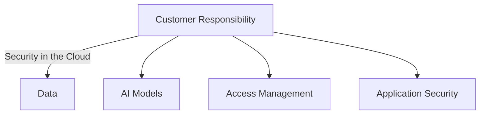
```mermaid
flowchart TD
    G[Customer Responsibility] -->|Security in the Cloud| H[Data]
    G --> I[AI Models]
    G --> J[Access Management]
    G --> K[Application Security]    
```
*Figure 5.1.2: AWS Shared Responsibility Model for AI Systems*

This diagram illustrates the division of security responsibilities between AWS and the customer for AI systems, highlighting where each party should focus their security efforts.

By leveraging these AWS services and features, organizations can build a robust security foundation for their AI systems. Remember that security is an ongoing process requiring continuous monitoring and adaptation to emerging threats and vulnerabilities.

### Understand the concept of source citation and documenting data origins

Data integrity and provenance are fundamental to trustworthy AI systems. Documenting the origins of data used in AI development—known as *data lineage* or *source citation*—has become not just a best practice but increasingly a regulatory requirement across industries. This documentation ensures transparency, reproducibility, and accountability in AI models.

#### Data Lineage

**Data lineage** refers to the complete lifecycle of data, including its origins, movements, transformations, and destinations. For AI systems, proper data lineage helps:

- Trace the source of training data
- Document how data has been processed or transformed
- Identify potential biases or quality issues
- Ensure compliance with data usage regulations

AWS provides several tools to maintain data lineage:

- **AWS Glue Data Catalog**[^1406]: A fully managed metadata repository for storing, annotating, and sharing metadata about datasets used in AI projects.

- **Amazon SageMaker Data Wrangler**[^1407]: Provides visibility into data flows and transformations, helping data scientists document preprocessing steps applied to their datasets.

#### Data Cataloging

**Data cataloging** creates an organized inventory of data assets within an organization. For AI systems, a comprehensive data catalog:

- Facilitates data discovery for AI projects
- Provides context about data quality and relevance
- Enables governance and access control

AWS offers services that support data cataloging:

- **AWS Lake Formation**[^1408]: Helps build, secure, and manage data lakes, including a central catalog where you can register data and define access policies.

- **Amazon Athena**[^1409]: An interactive query service that works with the AWS Glue Data Catalog to query metadata about your datasets.

#### SageMaker Model Cards

**Amazon SageMaker Model Cards**[^1410] allows you to document essential information about machine learning models in a standardized format, including:

- Model purpose and intended use cases
- Training data sources and characteristics
- Model performance metrics
- Ethical considerations and potential biases

Model cards promote transparency and responsible AI practices by providing a clear record of a model's lineage and characteristics.

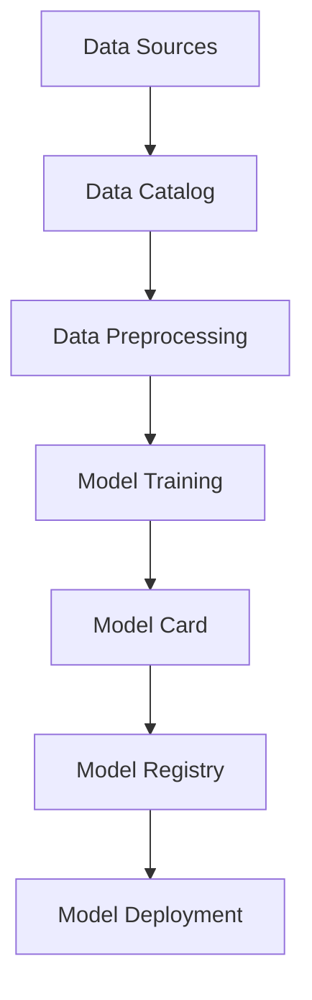
```mermaid
flowchart TD
    A[Data Sources] --> B[Data Catalog]
    B --> C[Data Preprocessing]
    C --> D[Model Training]
    D --> E[Model Card]
    E --> F[Model Registry]
    F --> G[Model Deployment]

```

*Figure 5.1.3: Data and Model Lineage in AI Systems*

This diagram illustrates the flow of data and model information in an AI system, highlighting the role of data catalogs and model cards in documenting origins and characteristics.

Implementing robust source citation and data origin documentation practices is essential for:

1. **Regulatory Compliance**: Many industries require detailed records of data usage and model development processes.
2. **Model Governance**: Understanding data origins helps manage model versions and updates.
3. **Ethical AI**: Documenting data sources aids in identifying and mitigating potential biases.
4. **Reproducibility**: Detailed documentation enables model recreation and result validation.
5. **Trust and Transparency**: Clear documentation of data origins builds confidence among stakeholders and end-users.

By leveraging AWS tools and following best practices for source citation, organizations can build more trustworthy and compliant AI systems.

### Describe best practices for secure data engineering

Secure data engineering forms the critical foundation of robust AI systems. It encompasses practices designed to protect data integrity, ensure privacy, and maintain security throughout the data pipeline. For business professionals implementing AI on AWS, these best practices are essential for creating secure, compliant solutions.

#### Assessing Data Quality

Data quality directly affects AI model performance and reliability. Key practices for quality assessment include:

1. **Data Profiling**: Use **AWS Glue DataBrew**[^1411] to analyze data characteristics, identify anomalies, and understand distributions.

2. **Data Validation**: Implement checks to verify data accuracy, completeness, and consistency. SageMaker Data Wrangler provides features for validation and transformation.

3. **Data Cleansing**: Remove or correct inaccurate, incomplete, or irrelevant data. AWS Glue offers ETL capabilities for large-scale data cleansing.

4. **Monitoring Data Drift**: Continuously track changes in data distributions that could affect model performance. **Amazon SageMaker Model Monitor**[^1412] can detect data drift in production environments.

#### Implementing Privacy-Enhancing Technologies

Protecting sensitive information within datasets is crucial for maintaining privacy and compliance. AWS offers several privacy-enhancing technologies:

- **Amazon Macie**: Automatically discovers and protects sensitive data in AWS.
- **AWS Glue DataBrew**: Provides built-in transformations for data anonymization and pseudonymization.
- **AWS Encryption SDK**[^1413]: Enables easy encryption using industry-standard algorithms.

Best practices for implementing privacy-enhancing technologies include:

1. **Data Minimization**: Collect and retain only the data necessary for the specific AI task.
2. **Data Masking**: Use tokenization or hashing to protect sensitive fields.
3. **Differential Privacy**: Implement algorithms that add noise to data or query results to protect individual privacy while maintaining statistical accuracy.

#### Data Access Control

Implementing strict access controls ensures that only authorized personnel can interact with sensitive data:

1. **Principle of Least Privilege**: Grant users only the minimum permissions necessary to perform their tasks.
2. **Role-Based Access Control (RBAC)**: Use IAM roles to manage access based on job functions.
3. **Attribute-Based Access Control (ABAC)**: Implement fine-grained control using tags or other attributes.
4. **Data Encryption**: Use AWS KMS to manage encryption keys and encrypt data at rest and in transit.

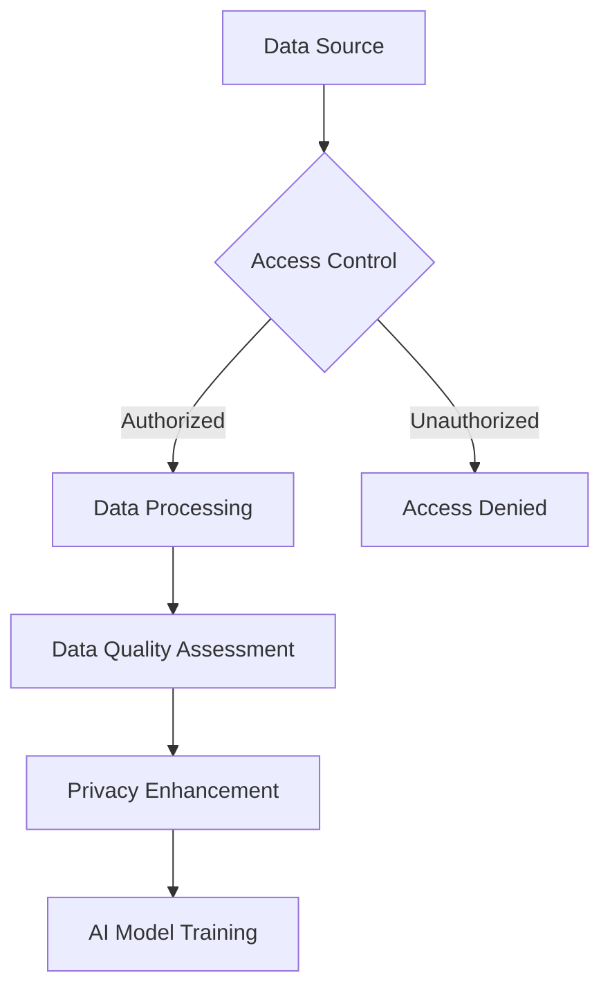
```mermaid
flowchart TD
    A[Data Source] --> B{Access Control}
    B -->|Authorized| C[Data Processing]
    B -->|Unauthorized| D[Access Denied]
    C --> E[Data Quality Assessment]
    E --> F[Privacy Enhancement]
    F --> G[AI Model Training]

```

*Figure 5.1.4: Secure Data Engineering Flow for AI Systems*

This diagram illustrates the key steps in secure data engineering for AI systems, highlighting access control, quality assessment, and privacy enhancement.

#### Ensuring Data Integrity

Maintaining data integrity throughout the AI pipeline is crucial for producing reliable models:

1. **Version Control**: Use **AWS CodeCommit**[^1414] or Amazon S3 versioning to track changes in datasets and code.
2. **Data Lineage Tracking**: Implement systems to record data transformations and processing steps.
3. **Checksums and Digital Signatures**: Verify data hasn't been tampered with during transfer or storage.
4. **Audit Trails**: Implement logging and monitoring using **AWS CloudTrail**[^1415] to track data access and modifications.

By implementing these best practices, organizations build a strong foundation for their AI initiatives, ensuring data quality, privacy, and integrity throughout the AI lifecycle.

### Understand security and privacy considerations for AI systems

AI systems present unique security and privacy challenges that extend beyond traditional IT security measures. A comprehensive approach is required to address the specific vulnerabilities associated with machine learning technologies and the sensitive data they process.

#### Application Security for AI Systems

Securing AI applications requires protecting both the model and its infrastructure:

1. **Model Integrity**: Ensure deployed models haven't been tampered with using **AWS SageMaker Model Registry**[^1416] to version and track models.

2. **Input Validation**: Implement robust validation to prevent *adversarial attacks* that manipulate model behavior, especially for models exposed through APIs.

3. **Output Sanitization**: Sanitize model outputs to prevent information leakage or injection attacks in downstream applications.

4. **API Security**: Use **Amazon API Gateway**[^1417] with **AWS WAF**[^1418] to protect AI model endpoints from common web exploits.

5. **Container Security**: For containerized AI applications, use **Amazon ECR**[^1419] scanning to detect vulnerabilities in container images.

#### Threat Detection and Vulnerability Management

Proactive security monitoring is essential for AI systems:

1. **Continuous Monitoring**: Use **Amazon GuardDuty**[^1420] to detect malicious activity and unauthorized behavior in your AWS environment.

2. **Vulnerability Scanning**: Regularly scan AI infrastructure with tools like **Amazon Inspector**[^1421].

3. **Penetration Testing**: Conduct regular tests to identify potential weaknesses, following AWS penetration testing policies.

4. **Incident Response**: Develop an AI-specific incident response plan. Use **AWS Security Hub**[^1422] to centralize security alerts and automate security checks.

#### Infrastructure Protection

Protecting the underlying infrastructure supporting AI systems is crucial:

1. **Network Segmentation**: Use **Amazon VPC**[^1423] to isolate AI workloads and implement network access controls.

2. **DDoS Protection**: Implement **AWS Shield**[^1424] to protect against Distributed Denial of Service attacks on AI model endpoints.

3. **Secure Communication**: Use AWS PrivateLink to establish private connectivity between VPCs and AWS services without exposing data to the public internet.

#### Prompt Injection Protection

*Prompt injection* represents a unique security concern for large language models (LLMs) and other generative AI systems:

1. **Input Sanitization**: Implement strict validation to prevent malicious prompts from being processed.

2. **Context Boundaries**: Establish clear boundaries between user inputs and system prompts to prevent unauthorized manipulation.

3. **Output Filtering**: Implement filters to detect and block potentially harmful outputs.

4. **Rate Limiting**: Use Amazon API Gateway to implement rate limiting and prevent abuse of AI endpoints.

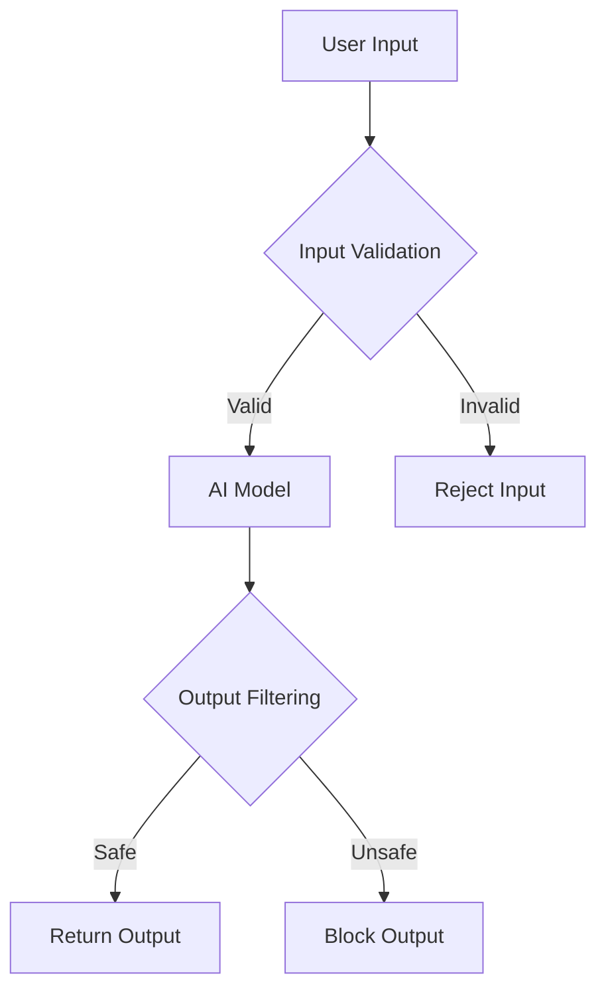
```mermaid
flowchart TD
    A[User Input] --> B{Input Validation}
    B -->|Valid| C[AI Model]
    B -->|Invalid| D[Reject Input]
    C --> E{Output Filtering}
    E -->|Safe| F[Return Output]
    E -->|Unsafe| G[Block Output]

```

*Figure 5.1.5: Prompt Injection Protection Flow*

This diagram illustrates the process of protecting against prompt injection attacks in AI systems, highlighting the importance of input validation and output filtering.

#### Encryption at Rest and in Transit

Protecting data confidentiality requires comprehensive encryption:

1. **Encryption at Rest**: Use AWS KMS to manage encryption keys for data stored in Amazon S3, Amazon EBS volumes, and other storage services.

2. **Encryption in Transit**: Implement TLS for all communications between AI system components. Use **AWS Certificate Manager**[^1425] to provision and manage SSL/TLS certificates.

3. **Client-Side Encryption**: For highly sensitive data, implement client-side encryption before uploading to AWS.

4. **Key Rotation**: Regularly rotate encryption keys to minimize the impact of potential key compromises.

By addressing these security and privacy considerations, organizations can build more resilient and trustworthy AI systems. Security in AI is an evolving field that requires staying informed about emerging threats and best practices to maintain a strong security posture.

Securing AI systems requires a multifaceted approach encompassing data protection, application security, infrastructure hardening, and ongoing vigilance. By leveraging AWS services and following best practices, business professionals can ensure their AI initiatives are not only innovative but also secure and compliant with regulatory requirements.

### Questions for self-check

1. **Which AWS service is most appropriate for implementing fine-grained access control to AI resources based on attributes such as user role, project, or data sensitivity?**

   A. AWS Key Management Service (KMS)
   B. Amazon Macie
   C. AWS Identity and Access Management (IAM)
   D. Amazon GuardDuty

2. **A data scientist is working on a machine learning project using sensitive customer data. Which of the following is NOT a recommended best practice for secure data engineering in this scenario?**

   A. Implementing data minimization techniques
   B. Using AWS Glue DataBrew for data anonymization
   C. Storing all data in a single Amazon S3 bucket for ease of access
   D. Encrypting data at rest using AWS KMS

3. **An AI team is concerned about potential prompt injection attacks on their large language model deployed on AWS. Which of the following is the MOST effective measure to mitigate this risk?**

   A. Implementing AWS Shield for DDoS protection
   B. Using Amazon SageMaker Model Monitor for data drift detection
   C. Applying strict input validation and sanitization
   D. Enabling versioning in Amazon S3 for model artifacts

4. **A company wants to ensure the integrity and provenance of data used in their AI models. Which AWS service would be MOST helpful in documenting the lifecycle and transformations of their datasets?**

   A. Amazon SageMaker Data Wrangler
   B. AWS Glue Data Catalog
   C. Amazon Athena
   D. AWS Lake Formation

5. **In the context of AI security on AWS, what is the primary purpose of Amazon SageMaker Model Cards?**

   A. To encrypt AI models during training and inference
   B. To detect vulnerabilities in containerized AI applications
   C. To document essential information about machine learning models
   D. To implement role-based access control for model deployment

### Answers and Explanations

1. **Correct answer: C. AWS Identity and Access Management (IAM)**

   Explanation: AWS IAM is the most appropriate service for implementing fine-grained access control to AI resources. It allows for the creation of detailed policies based on various attributes, including user roles, projects, and data sensitivity. While AWS KMS is crucial for encryption, Macie for data discovery, and GuardDuty for threat detection, IAM specifically handles the access control aspect, which is key to the question.[^1426]

2. **Correct answer: C. Storing all data in a single Amazon S3 bucket for ease of access**

   Explanation: Storing all data, especially sensitive customer data, in a single S3 bucket for ease of access is not a recommended best practice for secure data engineering. This approach violates the principle of least privilege and increases the risk of unauthorized access. The other options - data minimization, anonymization with AWS Glue DataBrew, and encryption with AWS KMS - are all recommended practices for handling sensitive data securely.[^1427]

3. **Correct answer: C. Applying strict input validation and sanitization**

   Explanation: To mitigate prompt injection attacks on large language models, applying strict input validation and sanitization is the most effective measure. This directly addresses the risk by preventing malicious prompts from being processed by the model. While the other options are important security measures, they don't specifically target prompt injection risks. AWS Shield protects against DDoS attacks, SageMaker Model Monitor detects data drift, and S3 versioning helps with model version control.[^1428]

4. **Correct answer: A. Amazon SageMaker Data Wrangler**

   Explanation: Amazon SageMaker Data Wrangler is the most helpful service for documenting the lifecycle and transformations of datasets used in AI models. It provides visibility into data flows and transformations, helping data scientists document the preprocessing steps applied to their datasets. While AWS Glue Data Catalog is useful for metadata storage, Athena for querying, and Lake Formation for data lake management, Data Wrangler specifically focuses on the data preparation and transformation process, which is key to maintaining data lineage.[^1429]

5. **Correct answer: C. To document essential information about machine learning models**

   Explanation: The primary purpose of Amazon SageMaker Model Cards is to document essential information about machine learning models. This includes details such as the model's purpose, intended use cases, training data sources, performance metrics, and ethical considerations. Model Cards play a crucial role in promoting transparency and responsible AI practices by providing a clear record of a model's lineage and characteristics. The other options, while important aspects of AI security, are not the primary functions of SageMaker Model Cards.[^1430]

[^1400]: AWS Identity and Access Management (IAM) Overview. URL: <https://aws.amazon.com/iam/>
[^1401]: Amazon SageMaker Overview. URL: <https://aws.amazon.com/sagemaker/>
[^1402]: AWS Key Management Service (KMS) Overview. URL: <https://aws.amazon.com/kms/>
[^1403]: Amazon Macie Overview. URL: <https://aws.amazon.com/macie/>
[^1404]: AWS PrivateLink Overview. URL: <https://aws.amazon.com/privatelink/>
[^1405]: AWS Shared Responsibility Model. URL: <https://aws.amazon.com/compliance/shared-responsibility-model/>
[^1406]: AWS Glue Data Catalog Overview. URL: <https://docs.aws.amazon.com/glue/latest/dg/components-overview.html#data-catalog-intro>
[^1407]: Amazon SageMaker Data Wrangler Overview. URL: <https://docs.aws.amazon.com/sagemaker/latest/dg/data-wrangler.html>
[^1408]: AWS Lake Formation Overview. URL: <https://aws.amazon.com/lake-formation/>
[^1409]: Amazon Athena Overview. URL: <https://aws.amazon.com/athena/>
[^1410]: Amazon SageMaker Model Cards Overview. URL: <https://docs.aws.amazon.com/sagemaker/latest/dg/model-cards.html>
[^1411]: AWS Glue DataBrew Overview. URL: <https://aws.amazon.com/glue/features/databrew/>
[^1412]: Amazon SageMaker Model Monitor Overview. URL: <https://docs.aws.amazon.com/sagemaker/latest/dg/model-monitor.html>
[^1413]: AWS Encryption SDK Overview. URL: <https://docs.aws.amazon.com/encryption-sdk/latest/developer-guide/introduction.html>
[^1414]: AWS CodeCommit Overview. URL: <https://aws.amazon.com/codecommit/>
[^1415]: AWS CloudTrail Overview. URL: <https://aws.amazon.com/cloudtrail/>
[^1416]: AWS SageMaker Model Registry Overview. URL: <https://docs.aws.amazon.com/sagemaker/latest/dg/model-registry.html>
[^1417]: Amazon API Gateway Overview. URL: <https://aws.amazon.com/api-gateway/>
[^1418]: AWS WAF (Web Application Firewall) Overview. URL: <https://aws.amazon.com/waf/>
[^1419]: Amazon Elastic Container Registry (ECR) Overview. URL: <https://aws.amazon.com/ecr/>
[^1420]: Amazon GuardDuty Overview. URL: <https://aws.amazon.com/guardduty/>
[^1421]: Amazon Inspector Overview. URL: <https://aws.amazon.com/inspector/>
[^1422]: AWS Security Hub Overview. URL: <https://aws.amazon.com/security-hub/>
[^1423]: Amazon Virtual Private Cloud (VPC) Overview. URL: <https://aws.amazon.com/vpc/>
[^1424]: AWS Shield Overview. URL: <https://aws.amazon.com/shield/>
[^1425]: AWS Certificate Manager Overview. URL: <https://aws.amazon.com/certificate-manager/>
[^1426]: AWS IAM Best Practices. URL: <https://docs.aws.amazon.com/IAM/latest/UserGuide/best-practices.html>
[^1427]: AWS Security Best Practices for S3. URL: <https://docs.aws.amazon.com/AmazonS3/latest/userguide/security-best-practices.html>
[^1428]: AWS Security Best Practices for AI/ML. URL: <https://docs.aws.amazon.com/whitepapers/latest/ml-best-practices-public-sector-organizations/security-and-compliance.html>
[^1429]: Amazon SageMaker Data Wrangler. URL: <https://docs.aws.amazon.com/sagemaker/latest/dg/data-wrangler.html>
[^1430]: Amazon SageMaker Model Cards Documentation. URL: <https://docs.aws.amazon.com/sagemaker/latest/dg/model-cards.html>

-----------------------------------------

Task Statement 5.2: Recognize governance and compliance regulations for AI systems.

Objectives:

Identify AWS services and features to assist with governance and regulation compliance (for example, AWS Config, Amazon Inspector, AWS Audit Manager, AWS Artifact, AWS CloudTrail, AWS Trusted Advisor).

Describe data governance strategies (for example, data lifecycles, logging, residency, monitoring, observation, retention).

Describe processes to follow governance protocols (for example, policies, review cadence, review strategies, governance frameworks such as the Generative AI Security Scoping Matrix, transparency standards, team training requirements).

## 5.2 Governance and compliance regulations for AI systems

Governance and compliance regulations form the foundation of responsible AI implementation. Organizations deploying AI systems must navigate regulatory requirements, ethical considerations, and industry standards to ensure their AI solutions operate within appropriate legal and ethical boundaries. **Regulatory frameworks** and **compliance protocols** protect sensitive data, ensure fair decision-making, and establish accountability for AI outcomes.

Understanding these regulations is essential not only for legal compliance but also for building stakeholder trust. Organizations demonstrating responsible AI practices gain competitive advantage through enhanced reputation and reduced regulatory risk. This knowledge represents a critical component for business professionals preparing for the AWS Certified AI Practitioner exam and implementing enterprise AI solutions.

### Identify regulatory compliance standards for AI systems

AI systems increasingly fall under various regulatory standards and compliance requirements designed to ensure responsible development and deployment with proper consideration for privacy, security, and ethics.

#### International Organization for Standardization (ISO)

ISO has developed several standards relevant to AI systems:

- ISO/IEC 27001: Information security management[^1500]
- ISO/IEC 38500: IT governance[^1501]
- ISO/IEC 23894: Artificial Intelligence &mdash; Risk Management[^1502]

These standards provide frameworks for managing information security, IT governance, and AI-specific risks. They help organizations establish **best practices** for AI development and deployment, ensuring that systems are secure, well-governed, and aligned with business objectives.

#### System and Organization Controls (SOC)

SOC reports, developed by the American Institute of Certified Public Accountants (AICPA), demonstrate the effectiveness of an organization's internal controls. For AI systems, **SOC 2 reports** are particularly relevant, focusing on security, availability, processing integrity, confidentiality, and privacy.[^1503]

- SOC 2 Type I: Assesses the design of controls at a specific point in time
- SOC 2 Type II: Evaluates the effectiveness of controls over a period (usually 6-12 months)

Organizations developing or using AI systems should consider obtaining SOC 2 certification to demonstrate their commitment to data protection and system integrity.

#### Algorithm Accountability Laws

Various jurisdictions are introducing laws specifically targeting the accountability of AI algorithms:

- EU Artificial Intelligence Act: Proposes a risk-based approach to regulating AI systems[^1504]
- US Algorithmic Accountability Act: Aims to increase transparency and accountability in automated decision systems[^1505]
- New York City's AI hiring law: Requires bias audits for AI-powered hiring tools[^1506]

These laws typically require organizations to:

- Conduct impact assessments for high-risk AI systems
- Ensure transparency in AI decision-making processes
- Implement measures to prevent bias and discrimination
- Provide mechanisms for human oversight and intervention

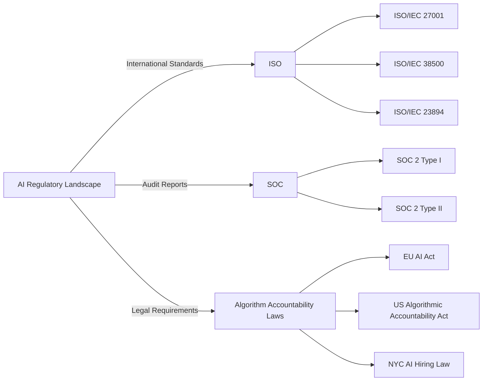
```mermaid
flowchart LR
    A[AI Regulatory Landscape] -->|International Standards| B[ISO]
    A -->|Audit Reports| C[SOC]
    A -->|Legal Requirements| D[Algorithm Accountability Laws]
    B --> E[ISO/IEC 27001]
    B --> F[ISO/IEC 38500]
    B --> G[ISO/IEC 23894]
    C --> H[SOC 2 Type I]
    C --> I[SOC 2 Type II]
    D --> J[EU AI Act]
    D --> K[US Algorithmic Accountability Act]
    D --> L[NYC AI Hiring Law]

```

*Figure 5.2.1: AI Regulatory Landscape. This diagram illustrates the key components of the AI regulatory landscape, including international standards, audit reports, and legal requirements. It shows how these elements are interconnected and form a comprehensive framework for AI governance and compliance.*

To comply with these standards and laws, organizations must implement robust governance frameworks, conduct regular audits, and maintain comprehensive documentation of their AI systems. This includes detailing the data used for training, the decision-making processes, and the potential impacts on individuals and society.

### Identify AWS services and features to assist with governance and regulation compliance

AWS offers a comprehensive suite of services and features designed to help organizations meet governance and compliance obligations for AI systems. These tools streamline the implementation and maintenance of compliant AI solutions.

#### AWS Config

**AWS Config**[^1507] enables assessment, auditing, and evaluation of AWS resource configurations. For AI systems, it can:

- Monitor configuration changes in AI/ML resources
- Ensure resources meet predefined compliance rules
- Generate reports for auditing purposes

Example use case: Set up AWS Config rules to ensure that all Amazon SageMaker notebooks are encrypted and have proper access controls in place.

#### Amazon Inspector

**Amazon Inspector**[^1508] provides automated security assessment to improve security and compliance of applications deployed on AWS. For AI systems, it:

- Identifies security vulnerabilities in EC2 instances running AI workloads
- Checks for compliance with security best practices
- Provides detailed reports on findings and remediation steps

Example use case: Use Amazon Inspector to regularly scan the infrastructure hosting your AI models for vulnerabilities and compliance issues.

#### AWS Audit Manager

**AWS Audit Manager**[^1509] helps continuously audit AWS usage to simplify risk assessment and compliance with regulations and industry standards. For AI governance, it can:

- Map AWS resources to specific compliance requirements
- Automate evidence collection for audits
- Provide a centralized dashboard for compliance monitoring

Example use case: Create an Audit Manager assessment framework for AI systems that aligns with ISO/IEC 27001 requirements.

#### AWS Artifact

**AWS Artifact**[^1510] provides on-demand access to AWS security and compliance reports and select online agreements. For AI compliance, it offers:

- Access to AWS compliance reports (e.g., SOC reports, ISO certifications)
- Self-service access to AWS agreements
- A centralized repository for compliance documentation

Example use case: Use AWS Artifact to obtain the necessary compliance reports when undergoing a third-party audit of your AI systems.

#### AWS CloudTrail

**AWS CloudTrail**[^1511] records actions taken by users, roles, or AWS services in your account. For AI governance, it:

- Logs all API calls related to AI/ML resources
- Provides an audit trail for compliance and operational audits
- Enables security analysis and troubleshooting

Example use case: Set up CloudTrail to monitor and log all actions performed on your SageMaker resources, ensuring traceability of model development and deployment activities.

#### AWS Trusted Advisor

**AWS Trusted Advisor**[^1512] offers recommendations that help you follow AWS best practices. For AI systems, it can:

- Provide cost optimization suggestions for AI/ML workloads
- Identify security vulnerabilities in your AI infrastructure
- Offer performance improvement recommendations

Example use case: Use Trusted Advisor to optimize the cost and performance of your AI workloads running on Amazon EC2 instances.

By leveraging these AWS services, organizations can create a comprehensive governance and compliance framework for their AI systems. This approach not only helps meet regulatory requirements but also builds trust with stakeholders by demonstrating commitment to responsible AI practices.

### Describe data governance strategies

Effective data governance ensures the integrity, security, and compliance of AI systems. A robust data governance strategy encompasses multiple aspects of data management throughout its lifecycle.

#### Data Lifecycles

The **data lifecycle** in AI systems typically includes the following stages:

1. Data Collection: Gathering raw data from various sources
2. Data Preparation: Cleaning, transforming, and labeling data
3. Data Storage: Securely storing data in appropriate formats and locations
4. Data Usage: Utilizing data for model training and inference
5. Data Archival: Long-term storage of historical data
6. Data Deletion: Securely removing data when no longer needed

Implementing governance at each stage ensures data quality, security, and compliance throughout the AI system's lifecycle.

#### Logging

Comprehensive logging maintains an audit trail and ensures accountability in AI systems. Key aspects include:

- **Activity Logging**: Recording all actions performed on data and models
- **Access Logging**: Tracking who accessed data and when
- **Model Performance Logging**: Monitoring model predictions and outcomes

Tools like AWS CloudTrail and Amazon CloudWatch[^1513] implement robust logging practices for AI workloads on AWS.

#### Data Residency

**Data residency** refers to the geographic location where data is stored and processed. Considerations include:

- Compliance with local data protection laws (e.g., GDPR in the EU)
- Use of AWS Regions and Availability Zones to control data location
- Implementation of data transfer mechanisms that comply with regulations

Example: Use Amazon S3 Object Lock[^1514] to enforce data residency requirements by preventing data from being transferred out of specific AWS Regions.

#### Monitoring and Observation

Continuous monitoring of AI systems is crucial for maintaining governance and compliance. Key areas to monitor include:

- **Model Performance**: Tracking accuracy, bias, and drift
- **Data Quality**: Monitoring incoming data for anomalies or quality issues
- **System Health**: Observing infrastructure metrics and logs

AWS services like Amazon SageMaker Model Monitor[^1515] can automate the monitoring of production ML models.

#### Data Retention

Establishing clear data retention policies is essential for compliance and resource management:

- Define retention periods based on legal requirements and business needs
- Implement automated data lifecycle management using services like Amazon S3 Lifecycle policies[^1516]
- Ensure secure deletion of data at the end of its retention period

Example: Set up an S3 Lifecycle rule to automatically move data to Amazon S3 Glacier Deep Archive after a specified period and delete it after the required retention period.

Implementing these data governance strategies helps organizations maintain control over their data assets, ensure compliance with regulations, and build trust in their AI systems. Regular review and updating of these strategies keeps pace with evolving regulatory requirements and technological advancements.

### Describe processes to follow governance protocols

Implementing and following governance protocols ensures AI systems are developed and deployed responsibly. These processes help organizations maintain compliance, manage risks, and build stakeholder trust.

#### Policies

Developing comprehensive AI governance policies forms the foundation of responsible AI practices:

- **Ethical AI Policy**: Outlining principles for fair and unbiased AI development
- **Data Usage Policy**: Defining rules for data collection, storage, and processing
- **Model Development Policy**: Establishing standards for model creation and validation
- **Deployment Policy**: Setting guidelines for putting AI models into production

Example: Create an AI Ethics Board to oversee policy development and enforcement across the organization.

#### Review Cadence

Regular reviews maintain effective governance:

- Quarterly Policy Reviews: Assess and update governance policies
- Monthly Compliance Checks: Ensure ongoing adherence to regulations
- Weekly Model Performance Reviews: Monitor AI system outputs and impacts

Implement automated review processes using AWS services like Amazon SageMaker Model Monitor for continuous model evaluation.

#### Review Strategies

Effective review strategies ensure comprehensive governance:

- **Cross-functional Reviews**: Involve stakeholders from various departments
- **External Audits**: Engage third-party experts for unbiased assessments
- **Automated Monitoring**: Use tools to continuously track compliance metrics

Example: Implement a multi-stage review process for high-risk AI models, including technical, ethical, and legal assessments before deployment.

#### Governance Frameworks

Adopting established governance frameworks provides structure to AI governance efforts:

- **NIST AI Risk Management Framework**[^1517]: Provides guidelines for managing AI risks
- **Generative AI Security Scoping Matrix**[^1518]: Helps identify security considerations for generative AI systems
- **AWS Well-Architected Framework**[^1519]: Offers best practices for designing and operating reliable, secure, efficient, and cost-effective systems

Customize these frameworks to fit your organization's specific needs and AI use cases.

#### Transparency Standards

Implementing transparency standards builds trust and facilitates compliance:

- **Model Documentation**: Create detailed records of model architecture, training data, and performance metrics
- **Decision Explainability**: Implement techniques to make AI decisions interpretable
- **Public Disclosures**: Communicate AI usage and impacts to relevant stakeholders

Use tools like Amazon SageMaker Model Cards[^1520] to document and share information about your ML models.

#### Team Training Requirements

Ensuring team competency is crucial for effective governance:

- **AI Ethics Training**: Educate teams on ethical considerations in AI development
- **Compliance Workshops**: Conduct regular sessions on regulatory requirements
- **Technical Skills Development**: Provide ongoing training on AI technologies and best practices

Leverage AWS Training and Certification programs[^1521] to enhance your team's AI and ML skills.

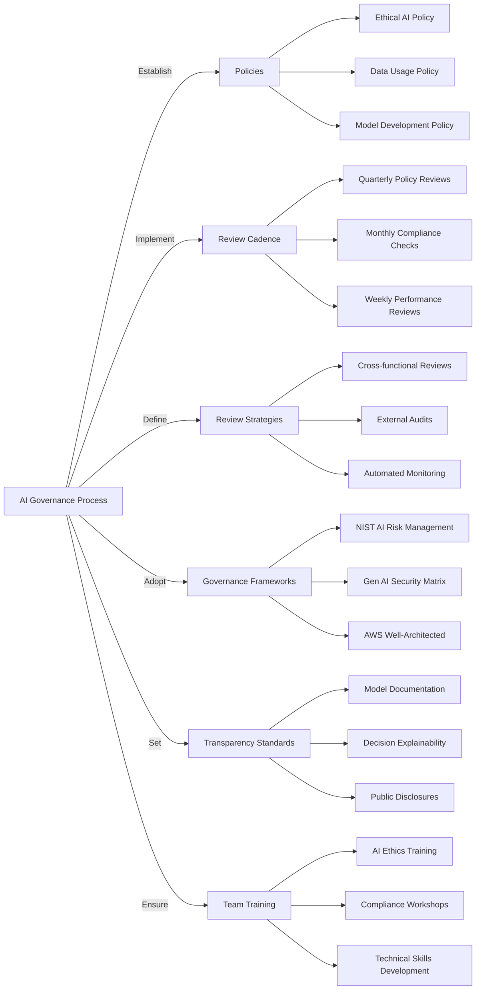
```mermaid
flowchart LR
    A[AI Governance Process] -->|Establish| B[Policies]
    A -->|Implement| C[Review Cadence]
    A -->|Define| D[Review Strategies]
    A -->|Adopt| E[Governance Frameworks]
    A -->|Set| F[Transparency Standards]
    A -->|Ensure| G[Team Training]
    B --> H[Ethical AI Policy]
    B --> I[Data Usage Policy]
    B --> J[Model Development Policy]
    C --> K[Quarterly Policy Reviews]
    C --> L[Monthly Compliance Checks]
    C --> M[Weekly Performance Reviews]
    D --> N[Cross-functional Reviews]
    D --> O[External Audits]
    D --> P[Automated Monitoring]
    E --> Q[NIST AI Risk Management]
    E --> R[Gen AI Security Matrix]
    E --> S[AWS Well-Architected]
    F --> T[Model Documentation]
    F --> U[Decision Explainability]
    F --> V[Public Disclosures]
    G --> W[AI Ethics Training]
    G --> X[Compliance Workshops]
    G --> Y[Technical Skills Development]
```

*Figure 5.2.4: AI Governance Processes in Organization. This diagram illustrates the key components of an AI governance process. It shows how policies, review processes, governance frameworks, transparency standards, and team training requirements are interconnected to form a comprehensive governance strategy.*

By implementing these governance protocols, organizations ensure their AI systems are developed and deployed responsibly, in compliance with regulations, and aligned with ethical principles. Regular review and adaptation of these processes are essential to keep pace with the rapidly evolving AI landscape and regulatory environment.

In conclusion, recognizing and implementing governance and compliance regulations for AI systems is crucial for organizations leveraging AI technologies responsibly. By understanding regulatory standards, utilizing AWS services for compliance assistance, implementing robust data governance strategies, and following comprehensive governance protocols, businesses can build trust, mitigate risks, and unlock the full potential of AI while maintaining ethical and legal integrity.

### Questions for self-check

1. **Which AWS service provides automated security assessments to help improve the security and compliance of applications deployed on AWS?**

   A. AWS Config
   B. Amazon Inspector
   C. AWS Audit Manager
   D. AWS CloudTrail

2. **A company is implementing a data governance strategy for its AI systems. Which of the following is NOT typically considered a stage in the data lifecycle?**

   A. Data Collection
   B. Data Preparation
   C. Data Encryption
   D. Data Archival

3. **An organization wants to ensure that its AI models are developed and deployed responsibly. Which of the following is a key component of an effective AI governance process?**

   A. Maximizing model complexity
   B. Implementing transparency standards
   C. Avoiding external audits
   D. Limiting cross-functional reviews

4. **A financial services company needs to demonstrate compliance with industry standards for its AI systems. Which AWS service provides on-demand access to AWS security and compliance reports?**

   A. AWS Trusted Advisor
   B. Amazon SageMaker
   C. AWS Artifact
   D. AWS Config

5. **Which of the following best describes the purpose of the NIST AI Risk Management Framework in the context of AI governance?**

   A. It provides guidelines for optimizing AI model performance
   B. It offers best practices for designing cost-effective AI systems
   C. It helps identify security considerations for generative AI systems
   D. It provides guidelines for managing AI risks

### Answers and Explanations

1. **Correct answer: B. Amazon Inspector**

   Explanation: Amazon Inspector is an automated security assessment service that helps improve the security and compliance of applications deployed on AWS. It can identify security vulnerabilities in EC2 instances running AI workloads, check for compliance with security best practices, and provide detailed reports on findings and remediation steps.[^1522] AWS Config, AWS Audit Manager, and AWS CloudTrail serve different purposes in governance and compliance but do not provide automated security assessments like Amazon Inspector.

2. **Correct answer: C. Data Encryption**

   Explanation: While data encryption is an important aspect of data security, it is not typically considered a distinct stage in the data lifecycle for AI systems. The data lifecycle usually includes stages such as Data Collection, Data Preparation, Data Storage, Data Usage, Data Archival, and Data Deletion.[^1523] Data encryption is a security measure that can be applied across various stages of the lifecycle, rather than being a stage itself.

3. **Correct answer: B. Implementing transparency standards**

   Explanation: Implementing transparency standards is a key component of effective AI governance. It involves creating detailed documentation of model architecture, training data, and performance metrics, as well as implementing techniques to make AI decisions interpretable.[^1524] This builds trust and facilitates compliance. The other options are either incorrect (maximizing model complexity is not a governance goal) or contrary to good governance practices (avoiding external audits and limiting cross-functional reviews would hinder effective governance).

4. **Correct answer: C. AWS Artifact**

   Explanation: AWS Artifact provides on-demand access to AWS security and compliance reports and select online agreements. It offers a centralized repository for compliance documentation, including access to AWS compliance reports such as SOC reports and ISO certifications.[^1525] This makes it the ideal service for a financial services company needing to demonstrate compliance with industry standards. The other services mentioned do not provide this specific functionality.

5. **Correct answer: D. It provides guidelines for managing AI risks**

   Explanation: The NIST AI Risk Management Framework provides guidelines for managing AI risks. It offers a structured approach to identifying, assessing, and mitigating risks associated with the development and use of AI systems.[^1526] While the other options may be related to AI governance, they do not accurately describe the primary purpose of the NIST AI Risk Management Framework. This framework is crucial for organizations looking to implement responsible AI practices and ensure compliance with governance protocols.

[^1500]: ISO/IEC 27001 Information Security Management. URL: <https://www.iso.org/isoiec-27001-information-security.html>
[^1501]: ISO/IEC 38500 IT Governance. URL: <https://www.iso.org/standard/62816.html>
[^1502]: ISO/IEC 23894 Artificial Intelligence � Risk Management. URL: <https://www.iso.org/standard/77304.html>
[^1503]: AICPA SOC 2 - SOC for Service Organizations: Trust Services Criteria. URL: <https://us.aicpa.org/interestareas/frc/assuranceadvisoryservices/aicpasoc2report>
[^1504]: European Commission: Proposal for a Regulation on Artificial Intelligence. URL: <https://digital-strategy.ec.europa.eu/en/policies/regulatory-framework-ai>
[^1505]: US Algorithmic Accountability Act of 2022. URL: <https://www.congress.gov/bill/117th-congress/house-bill/6580>
[^1506]: New York City's AI hiring law. URL: <https://www.nyc.gov/site/dca/about/automated-employment-decision-tools.page>
[^1507]: AWS Config. URL: <https://aws.amazon.com/config/>
[^1508]: Amazon Inspector. URL: <https://aws.amazon.com/inspector/>
[^1509]: AWS Audit Manager. URL: <https://aws.amazon.com/audit-manager/>
[^1510]: AWS Artifact. URL: <https://aws.amazon.com/artifact/>
[^1511]: AWS CloudTrail. URL: <https://aws.amazon.com/cloudtrail/>
[^1512]: AWS Trusted Advisor. URL: <https://aws.amazon.com/premiumsupport/technology/trusted-advisor/>
[^1513]: Amazon CloudWatch. URL: <https://aws.amazon.com/cloudwatch/>
[^1514]: Amazon S3 Object Lock. URL: <https://docs.aws.amazon.com/AmazonS3/latest/userguide/object-lock.html>
[^1515]: Amazon SageMaker Model Monitor. URL: <https://docs.aws.amazon.com/sagemaker/latest/dg/model-monitor.html>
[^1516]: Amazon S3 Lifecycle policies. URL: <https://docs.aws.amazon.com/AmazonS3/latest/userguide/object-lifecycle-mgmt.html>
[^1517]: NIST AI Risk Management Framework. URL: <https://www.nist.gov/itl/ai-risk-management-framework>
[^1518]: AWS Generative AI Security Scoping Matrix. URL: <https://aws.amazon.com/ai/generative-ai/security/scoping-matrix/>
[^1519]: AWS Well-Architected Framework. URL: <https://aws.amazon.com/architecture/well-architected/>
[^1520]: Amazon SageMaker Model Cards. URL: <https://docs.aws.amazon.com/sagemaker/latest/dg/model-cards.html>
[^1521]: AWS Training and Certification. URL: <https://aws.amazon.com/training/>
[^1522]: Amazon Inspector Features. URL: <https://aws.amazon.com/inspector/features/>
[^1523]: AWS Machine Learning Lifecycle. URL: <https://docs.aws.amazon.com/wellarchitected/latest/machine-learning-lens/machine-learning-lifecycle.html>
[^1524]: AWS AI/ML Governance Best Practices. URL: <https://aws.amazon.com/blogs/enterprise-strategy/responsible-ai-best-practices-promoting-responsible-and-trustworthy-ai-systems/>
[^1525]: AWS Artifact Overview. URL: <https://aws.amazon.com/artifact/>
[^1526]: NIST AI Risk Management Framework Overview. URL: <https://www.nist.gov/itl/ai-risk-management-framework>

---------------------------------------------------------

## 5.3 AI Safety: Addressing Risks in AWS Solutions in the Era of AI

AI safety and security have become critical considerations as artificial intelligence capabilities continue to advance. Organizations implementing AI solutions must understand potential risks, navigate evolving regulations, and implement appropriate safeguards. This chapter examines key risks, regulatory approaches, and practical security measures for AWS-based AI systems.

### Understanding AI Risks

Recent discussions among AI safety experts, including Roman Yampolskiy[^1551], highlight several significant risks associated with advanced AI systems:

1. **Existential risk**: The possibility that superintelligent AI could pose a threat to human existence if its goals misalign with human values.

2. **Malicious use**: The potential for AI systems to be exploited by bad actors for harmful purposes.

3. **Unintended consequences**: The risk of AI systems optimizing for incorrect objectives, leading to unexpected and potentially harmful outcomes.

4. **Loss of human agency**: The gradual ceding of decision-making power from humans to AI systems in critical domains.

5. **Scalability of impact**: The ability of AI systems to affect large-scale changes more rapidly than traditional technologies.

These risks necessitate robust safety measures and governance frameworks as AI capabilities continue to advance.

### Regulatory Frameworks: The EU AI Act[^1552]

The European Union's AI Act represents one of the most comprehensive regulatory approaches to AI governance. Key provisions include:

1. **Risk-based classification**: AI systems are categorized based on their potential risk, with stricter requirements for high-risk applications.

2. **Prohibited AI practices**: Certain AI applications deemed to pose unacceptable risks are explicitly prohibited.

3. **Transparency requirements**: Specific AI applications must meet transparency standards to ensure users are aware they are interacting with an AI system.

4. **Governance structure**: The Act establishes a European Artificial Intelligence Board to facilitate implementation and ensure consistent application across member states.

5. **Penalties for non-compliance**: Significant fines can be imposed for violations—up to €30 million or 6% of global annual turnover, whichever is higher.

6. **Extraterritorial applicability**: The EU AI Act requires security and safety measures even for services hosted outside the EU, as long as the service has customers within the EU, significantly extending its global impact.

### U.S. Regulatory Landscape

Unlike the EU's centralized approach, the United States has a more fragmented and industry-specific regulatory landscape for AI. Several key initiatives include:

1. **AI Bill of Rights (Blueprint)**[^1553]: Released by the White House Office of Science and Technology Policy in 2022, providing a framework focused on five principles:
   - Safe and effective systems
   - Algorithmic discrimination protections
   - Data privacy
   - Notice and explanation
   - Human alternatives, consideration, and fallback

2. **NIST AI Risk Management Framework**[^1554]: Developed by the National Institute of Standards and Technology, providing guidelines through four core functions:
   - Govern
   - Map
   - Measure
   - Manage

3. **FTC AI Guidance**[^1555]: The Federal Trade Commission has issued guidelines focusing on:
   - Transparency
   - Fairness
   - Accountability
   - Robust and empirically sound AI

4. **Algorithmic Accountability Act**[^1556]: This proposed bill aims to ensure transparency and fairness in AI applications, particularly in sensitive areas like healthcare, housing, education, and employment.

5. **Sector-Specific Regulations**: In various industries, existing laws are being applied to AI-specific concerns:
   - Healthcare: HIPAA governs protected health information processed by AI systems
   - Finance: The Fair Credit Reporting Act applies to AI systems used in credit scoring
   - Employment: Equal Employment Opportunity laws prohibit discrimination in AI-based hiring decisions

Organizations operating in or serving U.S. customers must navigate this complex regulatory landscape, often needing to comply with multiple, overlapping frameworks.

### Cloud Providers and AI Safety Resources

Major cloud providers have developed tools to support organizations in building secure and responsible AI solutions. AWS offers particularly comprehensive resources:

#### AWS Machine Learning Lens[^1557]

As part of its Well-Architected Framework, AWS has released a Machine Learning (ML) Lens providing detailed guidance on designing secure, reliable, and efficient ML workloads. Key principles include:

1. **Access Control and Encryption**:
   - Implementing fine-grained IAM policies for ML resources
   - Using AWS KMS for encryption of data at rest and in transit
   - Securing inter-node communications in distributed training environments

2. **Data Privacy and Lineage**:
   - Utilizing Amazon Macie for sensitive data discovery and classification
   - Implementing data lineage tracking with AWS Glue Data Catalog
   - Using Amazon SageMaker Feature Store for consistent feature management

3. **Model Monitoring and Governance**:
   - Leveraging Amazon SageMaker Model Monitor for detecting data and model drift
   - Implementing model explainability with Amazon SageMaker Clarify
   - Using Amazon SageMaker Model Registry for version control and lineage tracking

4. **MLOps Automation**:
   - Implementing CI/CD pipelines with AWS CodePipeline and Amazon SageMaker Pipelines
   - Using AWS Step Functions for orchestrating ML workflows
   - Leveraging Amazon SageMaker Projects for standardizing MLOps practices

These resources provide organizations with a framework for implementing best practices in AI/ML security and governance.

### Applying Cybersecurity Principles to AI Safety

A key insight in addressing AI safety is recognizing that many existing cybersecurity principles can be extended to AI systems. By treating artificial intelligence as another form of potentially high-impact intelligence, organizations can leverage established security practices to enhance AI safety.

#### Key Principles for AI Security:

1. **Authentication and Authorization**: 
   - Implement strong identity and access management for AI systems
   - Use principle of least privilege for AI model access and operations, and do the same for AI Agents

2. **Encryption and Data Protection**:
   - Encrypt sensitive data and model parameters at rest and in transit
   - Implement secure enclaves for highly sensitive AI computations
   - Implement rate-limiting and input validation on your APIs to prevent model overexposure

3. **Continuous Monitoring**:
   - Monitor AI system behaviors and outputs for anomalies
   - Implement automated alerting for unexpected model behaviors

4. **Audit Trails and Explainability**:
   - Maintain comprehensive logs of AI decision-making processes
   - Implement explainable AI techniques to understand model outputs

5. **Fail-safe Mechanisms and Human Oversight**:
   - Design AI systems with built-in safeguards and kill switches
   - Implement human-in-the-loop processes for critical AI applications
   - Train employees to recognize social engineering attacks and AI hallucinations

By applying these principles, organizations can create a robust security framework for their AI systems that builds upon decades of cybersecurity expertise.

### Conclusion

The advancement of AI capabilities demands an equal advancement in our approaches to AI safety and security. Organizations can build more responsible AI systems by applying established cybersecurity practices while also addressing AI's unique characteristics and potential impacts.

AWS resources like the Machine Learning Lens provide valuable guidance for implementing AI responsibly within cloud environments. As AI evolves, collaboration between researchers, industry leaders, and policymakers will remain essential for refining approaches to AI safety.

By implementing comprehensive security frameworks that address both traditional and AI-specific vulnerabilities, organizations can work toward realizing AI's benefits while effectively managing its risks.

[^1551]: Lex Fridman Podcast #431 – Roman Yampolskiy: Dangers of Superintelligent AI. URL: <https://lexfridman.com/roman-yampolskiy/>

[^1552]: The EU Artificial Intelligence Act. URL: <https://artificialintelligenceact.eu/>

[^1553]: Blueprint for an AI Bill of Rights, White House Office of Science and Technology Policy (October 2022). URL: <https://bidenwhitehouse.archives.gov/ostp/ai-bill-of-rights/>

[^1554]: NIST AI Risk Management Framework (AI RMF 1.0), National Institute of Standards and Technology (January 2023). URL: <https://www.nist.gov/itl/ai-risk-management-framework>

[^1555]: Aiming for truth, fairness, and equity in your company's use of AI, Federal Trade Commission (April 2021). URL: <https://www.ftc.gov/business-guidance/blog/2021/04/aiming-truth-fairness-equity-your-companys-use-ai>

[^1556]: Algorithmic Accountability Act of 2022, H.R.6580, 117th Congress (2021-2022). URL: <https://www.congress.gov/bill/117th-congress/house-bill/6580/text>

[^1557]: AWS Machine Learning Lens - AWS Well-Architected Framework. URL: <https://docs.aws.amazon.com/wellarchitected/latest/machine-learning-lens/welcome.html>

--------------------------------------

 # Chapter 6. Additional Important Topics

AI and machine learning are transforming how organizations operate and compete in today's business landscape. Beyond implementing the core technologies, success with AI on AWS requires understanding three critical supporting elements: the global infrastructure that powers your applications, strategies for managing costs, and architectural best practices that ensure robustness and efficiency.

AWS's **global infrastructure** provides the foundation for AI and ML services, enabling scalable, reliable, and responsive applications worldwide.[^1600] Understanding **Regions**, **Availability Zones**, and **edge locations** helps you make strategic decisions about where to deploy AI workloads to meet performance needs and compliance requirements.[^1601] This knowledge is essential for creating resilient systems that serve global users effectively while adhering to data residency regulations.

Cost management directly impacts the success of AI initiatives. AWS offers flexible pricing models for its AI services that can be tailored to your organization's needs.[^1602] By implementing effective cost optimization strategies, you can maximize return on AI investments while maintaining budget control. Tools like **AWS Cost Explorer** and **AWS Budgets** provide visibility into current spending and help forecast future expenses, enabling proactive financial management of your AI projects.[^1603]

The **AWS Well-Architected Framework** offers a comprehensive approach to building robust infrastructure for AI and ML workloads.[^1604] By applying its six pillars—*operational excellence*, *security*, *reliability*, *performance efficiency*, *cost optimization*, and *sustainability*—you can create AI solutions built on strong architectural foundations. The **AWS Well-Architected Tool** helps assess your architecture against established best practices and identify areas for improvement.[^1605]

This chapter will guide you through selecting the appropriate AWS Region for AI projects based on factors like data sovereignty, latency, and service availability. You'll learn practical strategies for optimizing AI and ML costs, including resource right-sizing, using **spot instances**, and implementing automated scaling.[^1606] Additionally, we'll explore how to apply the Well-Architected Framework specifically to AI and ML implementations to ensure they can perform reliably at enterprise scale.

Mastering these topics provides business professionals with the comprehensive knowledge needed to make strategic decisions about AI deployments on AWS. You'll be able to leverage AWS's global capabilities to build solutions that meet both performance and compliance requirements, develop compelling business cases with sound financial controls, and create architecturally sound solutions that withstand enterprise demands.

This holistic understanding extends beyond technical considerations to address the business, financial, and operational aspects of AI implementation—knowledge essential for anyone planning, implementing, or managing AI initiatives on AWS. By the end of this chapter, you'll be well-equipped to deploy AI solutions globally with optimal cost-efficiency and architectural excellence.

[^1600]: AWS Global Infrastructure Overview. URL: <https://aws.amazon.com/about-aws/global-infrastructure/>
[^1601]: AWS Regions and Availability Zones. URL: <https://aws.amazon.com/about-aws/global-infrastructure/regions_az/>
[^1602]: AWS AI Services Pricing. URL: <https://aws.amazon.com/machine-learning/pricing/>
[^1603]: AWS Cost Management Tools. URL: <https://aws.amazon.com/aws-cost-management/>
[^1604]: AWS Well-Architected Framework. URL: <https://aws.amazon.com/architecture/well-architected/>
[^1605]: AWS Well-Architected Tool. URL: <https://aws.amazon.com/well-architected-tool/>
[^1606]: AWS Cost Optimization for Generative AI. URL: <https://aws.amazon.com/blogs/machine-learning/optimizing-costs-of-generative-ai-applications-on-aws/>

------------------------------------------

## 6.1 AWS Global Infrastructure

AWS Global Infrastructure serves as the foundation for delivering AI and machine learning solutions with global reach, high performance, and robust reliability. This worldwide network of computing resources enables organizations of all sizes to build, train, and deploy AI/ML workloads at scale, regardless of geographic location.[^1700] For business professionals implementing AI initiatives, understanding this infrastructure directly impacts application performance, regulatory compliance, and cost efficiency. Knowledge of AWS Global Infrastructure is also a core component of the AWS Certified AI Practitioner exam.

AWS's worldwide network empowers diverse AI implementations—from innovative startups creating new AI applications to global enterprises deploying organization-wide ML solutions. By leveraging this infrastructure, businesses can build resilient, compliant, and high-performing AI/ML solutions that operate efficiently across international boundaries, gaining competitive advantage in increasingly AI-driven markets.

### Understanding AWS Regions, Availability Zones, and Edge Locations

AWS Global Infrastructure consists of three key components that work together to provide a resilient environment for AI and ML workloads:

**AWS Regions** are discrete geographic areas containing multiple, isolated, and physically separate Availability Zones. Each Region functions independently of other Regions, enhancing fault tolerance and stability. AWS continues to expand its Region footprint worldwide, particularly in emerging markets where AI adoption is accelerating.[^1701]

**Availability Zones** (AZs) are distinct locations within a Region engineered to isolate failures from other AZs. These zones connect to each other through low-latency network links while maintaining physical separation. This architecture enables highly available, fault-tolerant applications and databases that surpass what a single data center could achieve.[^1702]

**Edge Locations** are sites used by Amazon CloudFront to cache content closer to end users, dramatically reducing latency.[^1703] Separate from Regions and AZs, Edge Locations typically operate in major cities and population centers. These locations are particularly valuable for AI/ML applications requiring low-latency processing, such as real-time image recognition or natural language processing services.

The relationship between these components is illustrated in the following diagram:

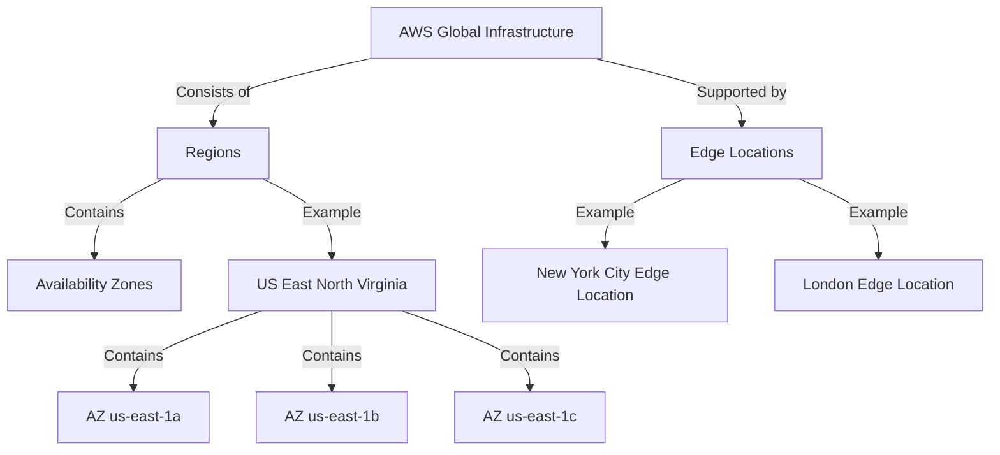
```mermaid
flowchart TD
    A[AWS Global Infrastructure] -->|Consists of| B[Regions]
    B -->|Contains| C[Availability Zones]
    A -->|Supported by| D[Edge Locations]
    
    B -->|Example| E[US East North Virginia]
    E -->|Contains| F[AZ us-east-1a]
    E -->|Contains| G[AZ us-east-1b]
    E -->|Contains| H[AZ us-east-1c]
    
    D -->|Example| I[New York City Edge Location]
    D -->|Example| J[London Edge Location]
```

*Figure 6.1.1. AWS Global Infrastructure Components. This diagram illustrates the hierarchical structure of AWS Global Infrastructure, showing the relationship between Regions, Availability Zones, and Edge Locations.*

For AI and ML workloads, this infrastructure offers several critical advantages:

1. **High Availability**: Distributing AI applications across multiple AZs ensures operational continuity even if one zone experiences disruption.

2. **Low Latency**: Edge Locations enable faster content delivery for AI applications requiring real-time processing, such as voice assistants or recommendation engines.

3. **Data Sovereignty**: Multiple Region options allow organizations to keep data and AI processing within specific geographic boundaries to meet data residency requirements.

4. **Scalability**: The extensive network of Regions and AZs enables seamless scaling of AI and ML workloads globally as demand increases.

5. **Disaster Recovery**: The isolation between Regions facilitates robust disaster recovery strategies for mission-critical AI systems.

Understanding these components is essential for designing resilient AI architectures and effectively using services like Amazon SageMaker, which can operate across multiple AZs for enhanced reliability.[^1704]

### Benefits of AWS's Global Infrastructure for AI/ML Workloads

AWS's global infrastructure delivers specific advantages for AI and ML workloads that enable businesses to build, train, and deploy models with unprecedented efficiency and scale:

1. **Global Reach and Low Latency**

   The extensive network of Regions and Edge Locations allows deployment of AI services closer to end-users, reducing latency and improving experience. Multinational companies can train ML models in one Region and deploy inference endpoints in multiple Regions to serve global customers with minimal delay.[^1705]

2. **High Availability and Fault Tolerance**

   By leveraging multiple Availability Zones, AI applications achieve robust availability. Critical components—from model training pipelines to inference services—can be distributed across AZs to ensure continuous operation despite hardware failures or network issues.

3. **Scalability and Elasticity**

   The global infrastructure supports seamless scaling of AI workloads. Organizations can begin in one Region and expand to others as user bases grow—particularly beneficial for AI startups experiencing rapid adoption.

4. **Data Residency and Compliance**

   Multiple Regions give businesses control over where data is stored and processed, ensuring compliance with regulations like GDPR in Europe or CCPA in California. This capability is essential for AI applications handling sensitive personal information.[^1706]

5. **Cost Optimization**

   The global infrastructure enables cost optimization by selecting Regions with favorable pricing for specific AI/ML workloads. Services like Amazon EC2 Spot Instances can be leveraged across different AZs to significantly reduce the cost of training large ML models.[^1707]

6. **Access to Specialized Hardware**

   Certain Regions offer specialized hardware accelerators like GPUs and TPUs, critical for efficiently training and running complex AI models. The global infrastructure ensures these resources are accessible wherever needed.[^1708]

7. **Edge Computing Capabilities**

   AWS Edge Locations and services like AWS Outposts enable AI inference at the edge, closer to data sources. This capability is particularly valuable for IoT applications and scenarios requiring real-time processing with minimal latency.[^1709]

8. **Disaster Recovery and Business Continuity**

   The isolation between AWS Regions supports robust disaster recovery strategies. AI systems can be designed to fail over to different Regions during major outages, maintaining business continuity for critical AI applications.

The following diagram illustrates a global AI application architecture leveraging these benefits:

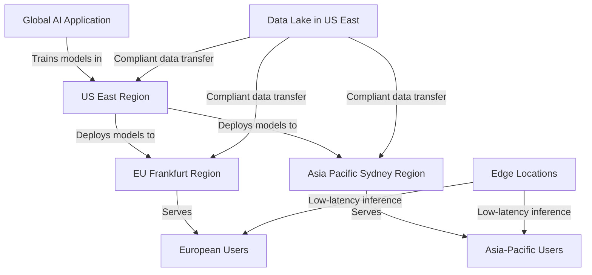
```mermaid
flowchart TD
    A[Global AI Application] -->|Trains models in| B[US East Region]
    B -->|Deploys models to| C[EU Frankfurt Region]
    B -->|Deploys models to| D[Asia Pacific Sydney Region]
    
    C -->|Serves| E[European Users]
    D -->|Serves| F[Asia-Pacific Users]
    
    G[Edge Locations] -->|Low-latency inference| E
    G -->|Low-latency inference| F
    
    H[Data Lake in US East] -->|Compliant data transfer| B
    H -->|Compliant data transfer| C
    H -->|Compliant data transfer| D
    
```

*Figure 6.1.2. Global AI Application Architecture. This diagram shows how a global AI application leverages AWS's infrastructure to train models centrally and deploy them globally, while maintaining data compliance and low-latency user experiences.*

In this architecture, AI models are trained in the US East Region (potentially using cost-effective GPU instances) and deployed to multiple Regions for low-latency user access. Edge Locations provide even faster inference for specific use cases. The data lake in US East ensures centralized data management with compliant transfer mechanisms to other Regions.

This global approach delivers multiple benefits:
- Centralized model training for consistency
- Distributed inference for low latency
- Edge computing for real-time processing
- Data residency compliance across regions
- High availability through multi-region deployment
- Cost optimization by selecting economical Regions for specific workloads

By leveraging AWS's global infrastructure this way, businesses create AI solutions that are truly global in scale yet locally optimized for performance and compliance.

### Choosing the Right AWS Region for AI/ML Projects

Selecting the appropriate AWS Region for AI/ML projects significantly impacts performance, compliance, and cost-effectiveness. Consider these key factors when making this decision:

1. **Data Residency and Compliance**

   For organizations handling sensitive information, regulatory compliance is paramount. Select a Region that aligns with your data residency requirements. If processing European citizens' data, for example, consider an EU Region to ensure GDPR compliance.[^1710]

2. **Latency and Performance**

   Choose Regions geographically close to your end-users or data sources to minimize latency. For global applications, implement a multi-region strategy using services like Amazon SageMaker Multi-Region Endpoints to deploy models closer to worldwide users.[^1711]

3. **Service Availability**

   Not all AWS services are available in every Region, especially newer or specialized AI/ML services. Verify that your chosen Region supports all required services for your project. Some cutting-edge AI services may initially launch in select Regions only.

4. **Pricing**

   Costs vary between Regions. Analyze pricing for services you'll use, particularly for compute-intensive workloads like training large language models. Sometimes less obvious Region choices can yield significant savings.[^1712]

5. **Disaster Recovery and High Availability**

   For business-critical AI/ML applications, consider multi-region architectures for disaster recovery. Select geographically diverse Regions that still comply with your data residency requirements.

6. **Ecosystem and Data Transfer**

   Consider locations of existing data stores and your service ecosystem. Choosing a Region where most data already resides reduces data transfer costs and latency.

7. **Specialized Hardware Availability**

   For projects requiring specific hardware accelerators (e.g., high-performance GPUs or quantum computing resources), check their availability across different Regions.[^1713]

8. **Sustainability**

   AWS continues to increase renewable energy usage across many Regions. If sustainability is important to your organization, consider Regions with higher percentages of renewable energy.[^1714]

This flowchart visualizes the decision-making process:

```mermaid
flowchart TD
    A[Start Region Selection] --> B{Data Residency Requirements?}
    B -->|Yes| C[Choose Compliant Region]
    B -->|No| D{Latency Critical?}
    C --> E{Required Services Available?}
    D -->|Yes| F[Choose Region Near Users]
    D -->|No| G{Cost Priority?}
    F --> E
    G -->|Yes| H[Compare Regional Pricing]
    G -->|No| E
    H --> E
    E -->|Yes| I[Finalize Region Choice]
    E -->|No| J[Reconsider Requirements]
    J --> A

```

*Figure 6.1.3. AWS Region Selection Flowchart for AI/ML Projects. This flowchart illustrates the decision-making process for selecting an AWS Region, considering factors such as data residency, latency, service availability, and cost.*

This comparison table helps evaluate key factors across selected AWS Regions (note: this is a hypothetical comparison for illustration purposes):

*Table 6.1.1. AWS Region Comparison for AI/ML Workloads*

| Factor | US East (N. Virginia) | EU (Frankfurt) | Asia Pacific (Tokyo) | 
|--------|----------------------|-----------------|----------------------|
| Data Residency | US regulations | EU/GDPR compliant | Japan/APAC regulations |
| Latency to Major Markets | Low for North America | Low for Europe | Low for Asia |
| AI/ML Service Availability | Full suite available | Most services available | Most services available |
| Relative Compute Pricing | Moderate | Higher | Higher |
| Specialized AI Hardware | Latest GPUs, Quantum | Latest GPUs | Latest GPUs |
| Renewable Energy Usage | High | Very High | Moderate |

In practice, Region selection typically involves balancing multiple considerations:

- A fintech startup creating an AI fraud detection system might choose US East for comprehensive service availability and competitive pricing, while ensuring compliant data transfer to EU Regions for European customers.

- A healthcare AI research project handling sensitive patient data might select a Region within their country of operation, despite higher costs or fewer available services, to ensure strict compliance with local healthcare data regulations.

- A global e-commerce platform might train recommendation models in a cost-effective Region with high-performance computing resources, then deploy inference endpoints across multiple Regions for low-latency predictions worldwide.

By carefully weighing these factors against your project requirements, you can make informed decisions about the optimal AWS Region(s) for your AI/ML workloads. This foundational choice establishes a scalable, compliant, and efficient AI infrastructure that can evolve with your business needs.

### Questions for self-check

1. **A global AI company is designing its infrastructure on AWS. Which component of the AWS Global Infrastructure would be most suitable for caching AI model results to reduce latency for users worldwide?**

   A. Availability Zones
   B. AWS Regions
   C. Edge Locations
   D. Data Centers

2. **An AI startup is developing a machine learning model that processes sensitive healthcare data. Which factor should be their PRIMARY consideration when choosing an AWS Region for this project?**

   A. Latency to end-users
   B. Cost of compute resources
   C. Data residency and compliance requirements
   D. Availability of the latest GPU instances

3. **A multinational corporation wants to deploy its AI-powered customer service chatbot globally with minimal latency. Which AWS Global Infrastructure strategy would best achieve this goal?**

   A. Deploy the chatbot in a single centralized Region
   B. Use multiple Availability Zones within one Region
   C. Leverage Edge Locations for content delivery only
   D. Deploy the chatbot across multiple Regions and use Edge Locations

4. **An AI researcher is training a large language model and needs to ensure high availability and fault tolerance. How should they leverage AWS Availability Zones?**

   A. Train the model using instances in a single Availability Zone
   B. Distribute the training across multiple Availability Zones in different Regions
   C. Use instances in multiple Availability Zones within the same Region
   D. Rely solely on Edge Locations for distributed training

5. **A company is migrating its AI workloads to AWS and wants to optimize costs while maintaining performance. Which of the following is NOT a valid strategy for achieving this goal using AWS Global Infrastructure?**

   A. Choose Regions with lower pricing for compute resources
   B. Use Amazon EC2 Spot Instances across different Availability Zones
   C. Deploy all AI models to every available AWS Region
   D. Leverage Edge Locations for low-latency inference

### Answers and Explanations

1. **Correct answer: C. Edge Locations**

   Explanation: Edge Locations are specifically designed to cache content and reduce latency for end-users worldwide. They are part of Amazon CloudFront, AWS's content delivery network, and are ideal for caching AI model results or serving low-latency inference globally.[^1715] Availability Zones and Regions are more suited for hosting primary infrastructure, while Data Centers are the physical facilities that make up AZs.

2. **Correct answer: C. Data residency and compliance requirements**

   Explanation: When dealing with sensitive healthcare data, ensuring compliance with data protection regulations is paramount. The subchapter emphasizes that data residency and compliance should be the primary consideration when choosing a Region for projects involving sensitive data. While factors like latency, cost, and hardware availability are important, they are secondary to meeting legal and regulatory requirements in the healthcare sector.[^1716]

3. **Correct answer: D. Deploy the chatbot across multiple Regions and use Edge Locations**

   Explanation: To achieve global deployment with minimal latency, the best strategy is to leverage multiple AWS Regions and Edge Locations. This approach allows the chatbot to be hosted closer to users in different geographic areas (using Regions) while also utilizing Edge Locations for even faster content delivery and potentially for running inference at the edge. This strategy aligns with the global reach and low latency benefits discussed in the subchapter.[^1717]

4. **Correct answer: C. Use instances in multiple Availability Zones within the same Region**

   Explanation: To ensure high availability and fault tolerance, the best practice is to distribute resources across multiple Availability Zones within the same Region. This approach, as described in the subchapter, allows for continued operation even if one AZ experiences issues. Using multiple Regions would be unnecessary and potentially complicate data consistency, while using a single AZ or relying solely on Edge Locations would not provide the desired fault tolerance.[^1718]

5. **Correct answer: C. Deploy all AI models to every available AWS Region**

   Explanation: Deploying all AI models to every available AWS Region is not a cost-effective strategy. The subchapter emphasizes choosing the right Regions based on factors like user location, data residency, and specific service needs. Deploying everywhere would lead to unnecessary costs and complexity. The other options are valid cost-optimization strategies mentioned in the subchapter: choosing Regions with favorable pricing, using EC2 Spot Instances for training, and leveraging Edge Locations for low-latency inference are all recommended approaches.[^1719]

[^1700]: AWS Global Infrastructure Overview. URL: <https://aws.amazon.com/about-aws/global-infrastructure/>
[^1701]: AWS Global Infrastructure Regions & AZs. URL: <https://aws.amazon.com/about-aws/global-infrastructure/regions_az/>
[^1702]: AWS Availability Zones. URL: <https://docs.aws.amazon.com/AWSEC2/latest/UserGuide/using-regions-availability-zones.html>
[^1703]: Amazon CloudFront Key Features. URL: <https://aws.amazon.com/cloudfront/features/>
[^1704]: Amazon SageMaker Features. URL: <https://aws.amazon.com/sagemaker/features/>
[^1705]: AWS Global Infrastructure for AI/ML Workloads. URL: <https://aws.amazon.com/machine-learning/infrastructure/>
[^1706]: AWS Compliance Programs. URL: <https://aws.amazon.com/compliance/programs/>
[^1707]: Amazon EC2 Spot Instances. URL: <https://aws.amazon.com/ec2/spot/>
[^1708]: AWS Accelerated Computing. URL: <https://aws.amazon.com/ec2/instance-types/#Accelerated_Computing>
[^1709]: AWS Outposts. URL: <https://aws.amazon.com/outposts/>
[^1710]: AWS Compliance Resources. URL: <https://aws.amazon.com/compliance/resources/>
[^1711]: Amazon SageMaker Multi-Region Endpoints. URL: <https://docs.aws.amazon.com/sagemaker/latest/dg/multi-region-endpoints.html>
[^1712]: AWS Pricing Calculator. URL: <https://calculator.aws/#/>
[^1713]: AWS High Performance Computing. URL: <https://aws.amazon.com/hpc/>
[^1714]: AWS Sustainability. URL: <https://sustainability.aboutamazon.com/environment/the-cloud>
[^1715]: Amazon CloudFront Features. URL: <https://aws.amazon.com/cloudfront/features/>
[^1716]: AWS Healthcare & Life Sciences. URL: <https://aws.amazon.com/health/>
[^1717]: Creating a Multi-Region Application with AWS Services. URL: <https://aws.amazon.com/blogs/architecture/creating-a-multi-region-application-with-aws-services-part-1-compute-and-security/>
[^1718]: AWS Well-Architected Framework. URL: <https://aws.amazon.com/architecture/well-architected/>
[^1719]: AWS Cost Optimization. URL: <https://aws.amazon.com/aws-cost-management/>

-------------------

## 6.2 AWS Pricing and Cost Optimization for AI/ML

Leveraging artificial intelligence and machine learning (AI/ML) technologies gives organizations a competitive advantage, but these powerful capabilities come with significant financial considerations. Understanding AWS pricing models and implementing effective cost optimization strategies for AI/ML projects is essential for maximizing return on investment while maintaining budget control. This knowledge forms a critical component of the AWS Certified AI Practitioner exam, as it addresses the important balance between technological capabilities and financial prudence.

AI/ML workloads are inherently resource-intensive and potentially costly. Mastering AWS pricing structures and cost optimization techniques enables professionals to make informed decisions, allocate resources efficiently, and justify AI investments to stakeholders. With the rapid advancement of technologies like large language models and generative AI, the ability to manage and optimize costs will become increasingly crucial for sustainable AI adoption and scaling within organizations by 2025. According to Statista, the global AI market is projected to reach $243.72 billion by 2025 and $826.73 billion by 2030, with a CAGR of 27.67% from 2025-2030.[^1800]

### Understanding AWS Pricing Models for AI/ML Services

AWS offers diverse pricing models for its AI/ML services, each designed to accommodate different usage patterns and business requirements. Understanding these models can significantly impact the overall cost of AI/ML projects.

#### Pay-as-you-go Model

The pay-as-you-go approach is the most common pricing model for AWS AI/ML services. This model eliminates upfront costs or long-term commitments, allowing businesses to pay only for the resources they consume. For variable and unpredictable AI/ML workloads, this model offers key advantages:

- **Flexibility** to scale resources up or down based on demand
- No risk of over-provisioning or under-utilization
- Ability to experiment with different AI/ML services without significant financial commitment

For example, Amazon SageMaker charges based on the compute instances, storage, and data processing used.[^1801] Similarly, Amazon Comprehend bills based on the volume of text analyzed.[^1802]

```mermaid
flowchart TD
    A[AI/ML Workload] -->|Usage| B{Pay-as-you-go Model}
    B -->|Compute| C[Instance Hours]
    B -->|Storage| D[GB-months]
    B -->|Processing| E[Data Volume]
```

*Figure 6.2.1: Pay-as-you-go Model for AI/ML Services. This diagram illustrates the components of the pay-as-you-go pricing model for AI/ML services on AWS, showing how costs are incurred based on compute usage, storage, and data processing volumes.*

#### Savings Plans

For organizations with predictable AI/ML workloads, AWS Savings Plans provide significant discounts in exchange for a commitment to a consistent amount of usage (measured in dollars per hour) for a 1 or 3-year term. Two types of Savings Plans are particularly relevant to AI/ML workloads:

1. **Compute Savings Plans**: These offer maximum flexibility, applying to EC2 instances, Fargate, and SageMaker, regardless of instance family, size, OS, or region.[^1803]

2. **SageMaker Savings Plans**: Specifically for SageMaker usage, providing up to 64% savings compared to on-demand pricing.[^1804]

Savings Plans are particularly valuable for businesses running continuous AI/ML workloads, such as production inference endpoints or long-running training jobs.

#### Reserved Instances

Reserved Instances (RIs) provide a significant discount (up to 72%) compared to on-demand pricing in exchange for a 1 or 3-year commitment to a specific instance type in a particular region.[^1805] While less common for AI/ML workloads due to their often dynamic nature, RIs can be valuable for:

- Baseline AI/ML infrastructure that runs continuously
- Predictable, steady-state workloads like scheduled batch processing jobs
- Long-running model training tasks on dedicated instances

#### Spot Instances

Spot Instances leverage unused EC2 capacity at steep discounts (up to 90% off on-demand prices). Though they can be interrupted with short notice, Spot Instances are well-suited for certain AI/ML tasks:[^1806]

- Distributed training jobs that can handle interruptions
- Batch inference workloads with flexible completion times
- Exploratory data analysis and feature engineering tasks

Amazon SageMaker supports Spot Instances for training jobs, potentially leading to significant cost savings for non-time-sensitive workloads.[^1807]

```mermaid
flowchart TD
    A[AWS AI/ML Pricing Models] --> B[Pay-as-you-go]
    A --> C[Savings Plans]
    A --> D[Reserved Instances]
    A --> E[Spot Instances]
    B -->|Flexible| F[Variable Workloads]
    C -->|Committed Usage| G[Predictable Workloads]
    D -->|Long-term Commitment| H[Steady-state Workloads]
    E -->|Interruptible| I[Cost-sensitive Tasks]

```

*Figure 6.2.2: AWS AI/ML Pricing Models Overview. This diagram showcases the different pricing models available for AI/ML services on AWS, highlighting their characteristics and suitable use cases.*

By choosing the right pricing model or combination of models for different workloads, businesses can significantly reduce their AI/ML expenses while maintaining the flexibility to scale and innovate.

### Strategies for Optimizing Costs in AI/ML Projects on AWS

Effective cost optimization strategies not only reduce expenses but also improve the overall efficiency of AI/ML workloads on AWS. These practical approaches help maximize the value of your AI investments.

#### Right-sizing Resources

One of the most impactful strategies for cost optimization is ensuring that resources allocated to AI/ML workloads are appropriately sized. This involves:

- Analyzing performance metrics to identify over-provisioned resources
- Choosing the right instance types for specific AI/ML tasks
- Utilizing auto-scaling to match resource allocation with workload demands

For example, when training machine learning models on Amazon SageMaker, selecting the optimal EC2 instance type based on the model's computational requirements can lead to significant cost savings. Similarly, for inference workloads, using Amazon SageMaker Neo to optimize models for specific hardware can reduce compute costs.[^1808]

#### Leveraging Spot Instances

Spot Instances can offer substantial cost savings for interruptible AI/ML workloads. To effectively use Spot Instances:

- Design workloads to be **fault-tolerant** and able to handle interruptions
- Use Amazon SageMaker Managed Spot Training for model training jobs
- Implement checkpointing to save progress and resume from the last saved state

By leveraging Spot Instances for suitable workloads, organizations can reduce their AI/ML compute costs by up to 90%.[^1809]

#### Optimizing Data Storage and Transfer

Data is a crucial component of AI/ML workloads, and optimizing its storage and transfer can lead to significant cost savings:

- Use Amazon S3 storage classes (e.g., S3 Intelligent-Tiering, S3 Glacier) for cost-effective storage of training data and model artifacts[^1810]
- Compress data before transfer to reduce data transfer costs
- Utilize Amazon FSx for Lustre for high-performance file systems in ML workflows[^1811]

#### Implementing Lifecycle Management

Proper lifecycle management of AI/ML resources prevents unnecessary costs:

- Automatically shut down idle resources (e.g., SageMaker notebooks, EC2 instances)
- Implement tagging strategies to track resource usage and ownership
- Use AWS Lambda functions to schedule the starting and stopping of resources based on usage patterns[^1812]

#### Optimizing Model Deployment

Efficient model deployment strategies can significantly reduce inference costs:

- Use Amazon SageMaker multi-model endpoints to host multiple models on a single endpoint[^1813]
- Implement Amazon SageMaker serverless inference for workloads with unpredictable or infrequent traffic[^1814]
- Utilize Amazon SageMaker Edge Manager for optimizing and deploying models to edge devices[^1815]

#### Leveraging AWS-Managed Services

AWS-managed services can often be more cost-effective than self-managed solutions:

- Use Amazon SageMaker for end-to-end ML workflows instead of managing your own infrastructure
- Leverage pre-trained AI services like Amazon Rekognition, Amazon Comprehend, or Amazon Bedrock for common AI tasks[^1816]
- Utilize Amazon EMR for big data processing tasks related to AI/ML workflows[^1817]

```mermaid
flowchart LR
    A[Cost Optimization Strategies] --> B[Right-sizing Resources]
    A --> C[Leveraging Spot Instances]
    A --> D[Optimizing Data Storage/Transfer]
    A --> E[Implementing Lifecycle Management]
    A --> F[Optimizing Model Deployment]
    A --> G[Using AWS-Managed Services]
    B --> H[Instance Type Selection]
    B --> I[Auto-scaling]
    C --> J[Fault-tolerant Design]
    C --> K[Managed Spot Training]
    D --> L[S3 Storage Classes]
    D --> M[Data Compression]
    E --> N[Resource Tagging]
    E --> O[Automated Shutdown]
    F --> P[Multi-model Endpoints]
    F --> Q[Serverless Inference]
    G --> R[SageMaker]
    G --> S[Pre-trained AI Services]
```

*Figure 6.2.3: AI/ML Cost Optimization Strategies on AWS. This diagram illustrates various strategies for optimizing costs in AI/ML projects on AWS, showcasing the interconnected nature of different approaches and their specific implementations.*

By implementing these strategies, organizations can significantly reduce their AI/ML costs on AWS while maintaining or even improving the performance and scalability of their workloads. Regular review and adjustment of these strategies is essential as AI/ML workloads evolve and new AWS services become available.

### Using AWS Cost Explorer and AWS Budgets for Managing AI/ML Expenses

Effective cost management for AI/ML projects requires continuous monitoring and analysis of expenses. AWS provides powerful tools like AWS Cost Explorer and AWS Budgets to help organizations gain visibility into their AI/ML costs and proactively manage their spending.

#### AWS Cost Explorer

AWS Cost Explorer enables you to visualize, understand, and manage your AWS costs and usage over time. For AI/ML projects, it offers several key features:[^1818]

1. **Detailed Cost Breakdowns**: View costs segmented by services, instance types, or custom tags. This is particularly useful for understanding the cost distribution across different components of your AI/ML pipeline (e.g., data preparation, model training, inference).

2. **Resource-level Granularity**: Drill down to see costs associated with specific resources, such as individual SageMaker notebooks or training jobs.

3. **Cost Allocation Tags**: Use tags to categorize and track costs for different AI/ML projects, teams, or environments.

4. **Forecasting**: Leverage AWS-generated cost forecasts to anticipate future AI/ML expenses based on historical usage patterns.

5. **Reserved Instance Recommendations**: Receive recommendations for Reserved Instance purchases that could optimize costs for steady-state AI/ML workloads.

To effectively use Cost Explorer for AI/ML projects:

- Set up detailed tagging strategies to accurately allocate costs to specific projects or teams
- Regularly review cost trends to identify unexpected spikes or opportunities for optimization
- Use the forecasting feature to budget for future AI/ML initiatives

```mermaid
flowchart LR
    A[AWS Cost Explorer] --> B[Detailed Cost Breakdowns]
    A --> C[Resource-level Granularity]
    A --> D[Cost Allocation Tags]
    A --> E[Forecasting]
    A --> F[RI Recommendations]
    B --> G[Service-wise Costs]
    B --> H[Instance Type Costs]
    C --> I[SageMaker Notebook Costs]
    C --> J[Training Job Costs]
    D --> K[Project-based Tracking]
    D --> L[Team-based Tracking]
    E --> M[Future Cost Estimation]
    F --> N[Optimize Steady Workloads]
```

*Figure 6.2.4: AWS Cost Explorer Features for AI/ML Projects. This diagram illustrates the key features of AWS Cost Explorer that are particularly useful for managing and analyzing costs in AI/ML projects on AWS.*

#### AWS Budgets

AWS Budgets allows you to set custom budgets and receive alerts when your costs or usage exceed (or are forecasted to exceed) your budgeted amount. For AI/ML projects, AWS Budgets offers several benefits:[^1819]

1. **Proactive Cost Management**: Set budgets for specific AI/ML services (e.g., SageMaker, Comprehend) or projects to prevent overspending.

2. **Usage-based Budgets**: Create budgets based on usage metrics relevant to AI/ML, such as the number of training hours or the amount of data processed.

3. **Automated Actions**: Configure actions to be taken automatically when a budget threshold is reached, such as stopping non-critical resources or applying restrictive IAM policies.

4. **Forecasted Budget Alerts**: Receive notifications when your AI/ML costs are projected to exceed the budget, allowing for preemptive action.

To effectively use AWS Budgets for AI/ML cost management:

- Set up separate budgets for development, testing, and production AI/ML environments
- Create budgets for individual AI/ML projects or initiatives to track their costs independently
- Configure alerts at different thresholds (e.g., 50%, 80%, 100% of budget) to provide early warnings
- Use automated actions to enforce cost controls on non-critical AI/ML resources

```mermaid
flowchart LR
    A[AWS Budgets] --> B[Cost Budgets]
    A --> C[Usage Budgets]
    A --> D[Automated Actions]
    A --> E[Forecasted Alerts]
    B --> F[Service-specific Budgets]
    B --> G[Project-based Budgets]
    C --> H[Training Hours Budget]
    C --> I[Data Processing Budget]
    D --> J[Stop Non-critical Resources]
    D --> K[Apply Restrictive IAM Policies]
    E --> L[Preemptive Cost Control]

```

*Figure 6.2.5: AWS Budgets Features for AI/ML Cost Management. This diagram showcases the key features of AWS Budgets that are particularly useful for managing and controlling costs in AI/ML projects on AWS.*

By leveraging both AWS Cost Explorer and AWS Budgets, organizations can gain comprehensive visibility into their AI/ML expenses, set up proactive cost controls, and make data-driven decisions to optimize their AI/ML investments on AWS.

Mastering AWS pricing models, implementing cost optimization strategies, and effectively using cost management tools are crucial skills for professionals working with AI/ML on AWS. These competencies help control expenses while maximizing the value derived from AI/ML investments. As AI technologies continue to evolve, efficient cost management will remain a critical factor in successful AI/ML adoption and scaling.

### Questions for self-check

1. **A company is running continuous AI/ML workloads on AWS and wants to optimize costs. Which pricing model would be most appropriate for this scenario?**

   A. Pay-as-you-go
   B. Savings Plans
   C. Spot Instances
   D. On-demand pricing

2. **An organization wants to reduce costs for its SageMaker training jobs that can handle interruptions. Which AWS feature should they consider using?**

   A. Reserved Instances
   B. Savings Plans
   C. Spot Instances
   D. On-demand pricing

3. **A data scientist wants to visualize the cost breakdown of different AI/ML projects across teams. Which AWS tool is most suitable for this task?**

   A. Amazon SageMaker
   B. AWS Cost Explorer
   C. AWS Budgets
   D. Amazon CloudWatch

4. **Which of the following is NOT a recommended strategy for optimizing costs in AI/ML projects on AWS?**

   A. Right-sizing resources
   B. Implementing lifecycle management
   C. Always using the largest instance types available
   D. Leveraging AWS-managed services

5. **A company wants to set up automated actions to stop non-critical AI/ML resources when a budget threshold is reached. Which AWS service should they use?**

   A. AWS Cost Explorer
   B. Amazon SageMaker
   C. AWS Budgets
   D. Amazon EC2 Auto Scaling

### Answers and Explanations

1. **Correct answer: B. Savings Plans**

   Explanation: For continuous AI/ML workloads, Savings Plans offer the most cost-effective option. They provide significant discounts (up to 72%) in exchange for a commitment to a consistent amount of usage over a 1 or 3-year term.[^1820] This is ideal for predictable, ongoing workloads. Pay-as-you-go and on-demand pricing are less cost-effective for continuous use, while Spot Instances are not suitable for workloads that require constant availability.

2. **Correct answer: C. Spot Instances**

   Explanation: Spot Instances are ideal for reducing costs on interruptible workloads, such as SageMaker training jobs that can handle interruptions. They offer discounts of up to 90% compared to on-demand pricing.[^1821] Reserved Instances and Savings Plans require longer-term commitments and are better suited for steady-state workloads. On-demand pricing doesn't provide cost savings for interruptible workloads.

3. **Correct answer: B. AWS Cost Explorer**

   Explanation: AWS Cost Explorer is the most suitable tool for visualizing cost breakdowns across different projects and teams. It provides detailed cost analysis, including the ability to use cost allocation tags to categorize expenses by project or team.[^1822] Amazon SageMaker is a machine learning platform, not a cost management tool. AWS Budgets is for setting cost limits and alerts, while Amazon CloudWatch is primarily for monitoring and observability.

4. **Correct answer: C. Always using the largest instance types available**

   Explanation: Always using the largest instance types available is not a recommended cost optimization strategy. In fact, it can lead to significant overspending. The correct approach is to right-size resources, matching the instance type to the specific requirements of each AI/ML task.[^1823] Other listed strategies - right-sizing resources, implementing lifecycle management, and leveraging AWS-managed services - are all recommended for optimizing costs in AI/ML projects.

5. **Correct answer: C. AWS Budgets**

   Explanation: AWS Budgets is the correct service for setting up automated actions based on budget thresholds. It allows users to configure actions to be taken automatically when a budget threshold is reached, such as stopping non-critical resources.[^1824] AWS Cost Explorer is for analyzing costs, not setting up automated actions. Amazon SageMaker is a machine learning platform, and Amazon EC2 Auto Scaling is for automatically adjusting compute capacity, not for budget-based actions.

[^1800]: Artificial Intelligence - Worldwide | Market Forecast. URL: <https://www.statista.com/outlook/tmo/artificial-intelligence/worldwide>

[^1801]: Amazon SageMaker Pricing. URL: <https://aws.amazon.com/sagemaker/pricing/>

[^1802]: Amazon Comprehend Pricing. URL: <https://aws.amazon.com/comprehend/pricing/>

[^1803]: AWS Savings Plans. URL: <https://aws.amazon.com/savingsplans/>

[^1804]: Amazon SageMaker Savings Plans. URL: <https://aws.amazon.com/sagemaker/pricing/#Amazon_SageMaker_Savings_Plans>

[^1805]: Amazon EC2 Reserved Instances. URL: <https://aws.amazon.com/ec2/pricing/reserved-instances/>

[^1806]: Amazon EC2 Spot Instances. URL: <https://aws.amazon.com/ec2/spot/>

[^1807]: Amazon SageMaker Managed Spot Training. URL: <https://docs.aws.amazon.com/sagemaker/latest/dg/model-managed-spot-training.html>

[^1808]: Amazon SageMaker Neo. URL: <https://aws.amazon.com/sagemaker/neo/>

[^1809]: Amazon EC2 Spot Instances Pricing. URL: <https://aws.amazon.com/ec2/spot/pricing/>

[^1810]: Amazon S3 Storage Classes. URL: <https://aws.amazon.com/s3/storage-classes/>

[^1811]: Amazon FSx for Lustre. URL: <https://aws.amazon.com/fsx/lustre/>

[^1812]: AWS Lambda. URL: <https://aws.amazon.com/lambda/>

[^1813]: Amazon SageMaker Multi-Model Endpoints. URL: <https://docs.aws.amazon.com/sagemaker/latest/dg/multi-model-endpoints.html>

[^1814]: Amazon SageMaker Serverless Inference. URL: <https://docs.aws.amazon.com/sagemaker/latest/dg/serverless-endpoints.html>

[^1815]: Amazon SageMaker Edge Manager. URL: <https://aws.amazon.com/sagemaker/edge-manager/>

[^1816]: AWS AI Services. URL: <https://aws.amazon.com/machine-learning/ai-services/>

[^1817]: Amazon EMR. URL: <https://aws.amazon.com/emr/>

[^1818]: AWS Cost Explorer. URL: <https://aws.amazon.com/aws-cost-management/aws-cost-explorer/>

[^1819]: AWS Budgets. URL: <https://aws.amazon.com/aws-cost-management/aws-budgets/>

[^1820]: AWS Savings Plans Pricing. URL: <https://aws.amazon.com/savingsplans/pricing/>

[^1821]: Amazon EC2 Spot Instances Savings. URL: <https://aws.amazon.com/ec2/spot/pricing/>

[^1822]: AWS Cost Explorer Features. URL: <https://aws.amazon.com/aws-cost-management/aws-cost-explorer/features/>

[^1823]: AWS Well-Architected Framework - Cost Optimization Pillar. URL: <https://docs.aws.amazon.com/wellarchitected/latest/cost-optimization-pillar/welcome.html>

[^1824]: AWS Budgets Actions. URL: <https://docs.aws.amazon.com/cost-management/latest/userguide/budgets-controls.html>

---------------------------------------------------------------

## 6.3 AWS Well-Architected Framework for AI/ML

The AWS Well-Architected Framework provides essential guidance for building robust, secure, and efficient cloud architectures. For organizations implementing artificial intelligence and machine learning (AI/ML) workloads on AWS, this framework addresses the unique challenges these systems present. AI/ML workloads typically involve complex computations, large datasets, and mission-critical decision-making processes that require special architectural considerations. Applying well-architected principles ensures these systems remain performant, reliable, secure, and cost-effective while addressing specialized concerns like model governance and data privacy. By 2025, as AI becomes more deeply integrated into business operations, organizations that design well-architected AI/ML solutions will gain significant competitive advantages.[^1900]

### Understanding the Six Pillars of the AWS Well-Architected Framework

The AWS Well-Architected Framework comprises six pillars that address critical aspects of cloud architecture. Each pillar has specific applications to AI/ML solutions that help organizations build robust systems.[^1901]

1. **Operational Excellence**

Operational Excellence for AI/ML focuses on efficiently running and monitoring systems to deliver business value while continuously improving processes. Key considerations include:

- Automating model training, deployment, and monitoring processes
- Implementing CI/CD pipelines for ML models
- Establishing clear procedures for model versioning and rollback
- Ensuring reproducibility of ML experiments and results

2. **Security**

The Security pillar protects information, systems, and assets through risk assessments and mitigation strategies. For AI/ML workloads, this includes:

- Securing sensitive training data and model artifacts
- Implementing fine-grained access controls for ML resources
- Encrypting data in transit and at rest
- Monitoring for and preventing adversarial attacks on ML models

3. **Reliability**

Reliability ensures systems can recover from disruptions, scale to meet demand, and mitigate service interruptions. AI/ML-specific considerations include:

- Designing fault-tolerant model training and inference pipelines
- Implementing automatic scaling for ML workloads
- Ensuring data integrity throughout the ML lifecycle
- Developing strategies for model performance degradation and drift

4. **Performance Efficiency**

Performance Efficiency involves using computing resources efficiently to meet requirements and maintain that efficiency as demand changes. For AI/ML, this means:

- Selecting appropriate instance types for training and inference
- Optimizing data preprocessing and feature engineering pipelines
- Leveraging distributed training for large models
- Implementing efficient model serving strategies (e.g., batch inference, caching)

5. **Cost Optimization**

Cost Optimization focuses on eliminating unnecessary expenses while maintaining business value. This is particularly important for AI/ML workloads due to their potential for high compute and storage costs:

- Right-sizing compute resources for training and inference
- Utilizing spot instances for non-critical ML workloads
- Implementing automated scaling based on demand
- Optimizing data storage and transfer costs

6. **Sustainability**

The Sustainability pillar aims to minimize the environmental impact of cloud workloads. For AI/ML, this includes:

- Selecting energy-efficient instance types for ML tasks
- Optimizing model architectures to reduce computational requirements
- Implementing strategies to reduce data transfer and storage
- Leveraging AWS's carbon-neutral regions for ML workloads[^1902]

```mermaid
flowchart LR
    A[AWS Well-Architected Framework for AI/ML] -->|Pillars| B[Operational Excellence]
    A -->|Pillars| C[Security]
    A -->|Pillars| D[Reliability]
    A -->|Pillars| E[Performance Efficiency]
    A -->|Pillars| F[Cost Optimization]
    A -->|Pillars| G[Sustainability]
    
    B -->|Implements| H[Automated ML Pipelines]
    C -->|Ensures| I[Data and Model Protection]
    D -->|Provides| J[Fault-Tolerant ML Systems]
    E -->|Optimizes| K[Efficient Resource Utilization]
    F -->|Manages| L[ML-Related Costs]
    G -->|Promotes| M[Eco-Friendly ML Practices]

```

*Figure 6.3.1. AWS Well-Architected Framework for AI/ML. This diagram illustrates the six pillars of the AWS Well-Architected Framework and their specific implementations in AI/ML contexts. Each pillar contributes to a well-architected AI/ML solution, addressing key aspects such as automation, security, reliability, efficiency, cost management, and sustainability.*

### Applying the Well-Architected Framework to AI/ML Solutions

Implementing the Well-Architected Framework for AI/ML requires consideration of machine learning's unique workflow characteristics. Here's how to apply each pillar effectively:

1. **Operational Excellence in AI/ML**

To achieve operational excellence in AI/ML, organizations should:

- Implement MLOps practices using services like AWS SageMaker MLOps[^1903]
- Automate model retraining and deployment using AWS Step Functions[^1904]
- Monitor model performance with Amazon CloudWatch and SageMaker Model Monitor[^1905]
- Document ML processes and maintain experiment tracking with tools like MLflow on AWS[^1906]

**Example application:** A retail company uses AWS SageMaker Pipelines to create an automated workflow for their product recommendation model. This pipeline includes data preprocessing, model training, evaluation, and deployment stages, all triggered automatically when new data becomes available.[^1907]

2. **Security in AI/ML**

Securing AI/ML workloads involves:

- Using AWS Identity and Access Management (IAM) for fine-grained access control to ML resources[^1908]
- Encrypting sensitive data with AWS Key Management Service (KMS)[^1909]
- Implementing network isolation for training jobs with Amazon VPC[^1910]
- Monitoring for unusual access patterns or potential data breaches using Amazon GuardDuty[^1911]

**Example application:** A healthcare company uses AWS Macie to automatically discover and protect sensitive patient data used in their disease prediction models, ensuring compliance with HIPAA regulations.[^1912]

3. **Reliability in AI/ML**

To build reliable AI/ML systems:

- Implement multi-AZ deployments for critical ML inference endpoints[^1913]
- Use AWS Auto Scaling to handle varying inference loads[^1914]
- Implement circuit breakers and fallback mechanisms for ML services
- Regularly backup training data and model artifacts to Amazon S3 with versioning enabled[^1915]

**Example application:** A financial services company deploys their fraud detection model across multiple Availability Zones using Amazon SageMaker Multi-Model Endpoints, ensuring high availability and fault tolerance.[^1916]

4. **Performance Efficiency in AI/ML**

Optimizing performance in AI/ML involves:

- Selecting appropriate instance types (e.g., GPU instances for deep learning) using Amazon EC2 Instance Explorer[^1917]
- Implementing distributed training for large models with SageMaker's distributed training libraries[^1918]
- Optimizing data access patterns using Amazon S3 Select for efficient data retrieval[^1919]
- Leveraging model compression techniques and quantization for faster inference

**Example application:** An autonomous vehicle company uses Amazon SageMaker Distributed Training to efficiently train large computer vision models across multiple GPU instances, significantly reducing training time.[^1920]

5. **Cost Optimization in AI/ML**

To optimize costs in AI/ML projects:

- Use Amazon SageMaker Managed Spot Training for non-time-critical training jobs[^1921]
- Implement automatic shutdown of idle notebook instances
- Optimize storage costs by using Amazon S3 Intelligent-Tiering for infrequently accessed datasets[^1922]
- Leverage Amazon Elastic Inference for cost-effective GPU acceleration during inference[^1923]

**Example application:** A startup uses Amazon SageMaker Managed Spot Training to reduce the cost of their daily model retraining jobs by up to 70%, allowing them to experiment with more complex models within their budget constraints.[^1924]

6. **Sustainability in AI/ML**

To promote sustainability in AI/ML:

- Choose AWS Regions with a lower carbon footprint for non-latency-sensitive workloads[^1925]
- Optimize model architectures to reduce computational requirements, using techniques like pruning and knowledge distillation
- Implement efficient data management practices to reduce storage and transfer needs
- Use AWS Graviton processors for ML inference tasks, which offer better performance per watt[^1926]

**Example application:** An e-commerce company optimizes their recommendation model using knowledge distillation, reducing the model size by 50% while maintaining similar accuracy. They deploy this model to AWS Graviton-based instances, significantly reducing energy consumption for inference.[^1927]

### Using the AWS Well-Architected Tool for Assessing AI/ML Architectures

The AWS Well-Architected Tool provides a systematic approach to evaluating AI/ML workloads against best practices and generating targeted improvement recommendations. Here's how to effectively use this tool for AI/ML projects:[^1928]

1. **Workload Definition**

Begin by defining your AI/ML workload in the AWS Well-Architected Tool:

- Specify the workload name (e.g., "Customer Churn Prediction Model")
- Select the industry type and relevant AWS Regions
- Identify the workload owner and key stakeholders

2. **Answer AI/ML-Specific Questions**

The tool provides questions for each pillar. For AI/ML workloads, focus on questions related to:

- Data management and preprocessing
- Model training and evaluation processes
- Inference deployment and scaling strategies
- ML-specific security and compliance requirements

3. **Review Recommendations**

Based on your answers, the tool generates improvement recommendations. For AI/ML workloads, these might include:

- Implementing automated model retraining pipelines
- Enhancing data encryption and access controls
- Optimizing instance selection for training and inference
- Implementing cost allocation tags for ML resources

4. **Prioritize Improvements**

Prioritize recommendations based on their impact and feasibility:

- **High Impact, Low Effort:** Implement these improvements first (e.g., enabling encryption for ML data stores)
- **High Impact, High Effort:** Plan these as part of your long-term strategy (e.g., refactoring ML pipelines for better scalability)
- **Low Impact:** Consider these improvements if they align with specific project goals

5. **Implement and Iterate**

Implement the prioritized improvements and re-assess your workload regularly:

- Use AWS CloudFormation or AWS CDK to implement infrastructure changes[^1929]
- Leverage AWS managed services like Amazon SageMaker to simplify ML operations[^1930]
- Continuously monitor and optimize your AI/ML workloads

**Example application:** A team developing a natural language processing (NLP) model for customer service automation uses the AWS Well-Architected Tool to assess their architecture. The tool identifies opportunities to improve data privacy controls and optimize training costs. The team implements Amazon Macie for sensitive data detection and switches to SageMaker Managed Spot Training, resulting in enhanced security and a 40% reduction in training costs.[^1931]

The AWS Well-Architected Framework provides a comprehensive approach to building high-quality AI/ML solutions on AWS. By applying the six pillars—Operational Excellence, Security, Reliability, Performance Efficiency, Cost Optimization, and Sustainability—organizations can create AI/ML systems that are technically sound and aligned with business objectives. The AWS Well-Architected Tool enhances this process by providing structured assessment and improvement recommendations. As AI and ML become increasingly essential to business operations, the ability to design well-architected solutions will differentiate organizations seeking to leverage these technologies effectively and responsibly.

### Questions for self-check

1. **A machine learning team is designing their AI/ML architecture on AWS. Which pillar of the Well-Architected Framework specifically addresses the need to implement fine-grained access controls for ML resources and encrypt data in transit and at rest?**

   A. Operational Excellence
   B. Security
   C. Reliability
   D. Performance Efficiency

2. **An e-commerce company wants to reduce the cost of their daily model retraining jobs while still maintaining the ability to experiment with complex models. Which AWS service should they use to achieve this goal?**

   A. Amazon EC2 Dedicated Instances
   B. Amazon SageMaker Managed Spot Training
   C. AWS Batch
   D. Amazon ECS

3. **A healthcare company is developing a disease prediction model using sensitive patient data. Which AWS service should they use to automatically discover and protect this data to ensure compliance with HIPAA regulations?**

   A. Amazon GuardDuty
   B. AWS Shield
   C. Amazon Inspector
   D. Amazon Macie

4. **Which of the following is NOT a recommended practice for achieving operational excellence in AI/ML workloads according to the AWS Well-Architected Framework?**

   A. Implementing MLOps practices using AWS SageMaker MLOps
   B. Manually retraining and deploying models on a fixed schedule
   C. Monitoring model performance with Amazon CloudWatch and SageMaker Model Monitor
   D. Documenting ML processes and maintaining experiment tracking with tools like MLflow on AWS

5. **A startup is using the AWS Well-Architected Tool to assess their AI/ML architecture. After receiving recommendations, what should be their next step according to the process outlined in the subchapter?**

   A. Immediately implement all recommendations
   B. Ignore recommendations that seem difficult to implement
   C. Prioritize improvements based on impact and feasibility
   D. Re-run the assessment with different answers

### Answers and Explanations

1. **Correct answer: B. Security**

   Explanation: The Security pillar of the AWS Well-Architected Framework specifically addresses protecting information, systems, and assets. In the context of AI/ML, this includes implementing fine-grained access controls for ML resources and encrypting data in transit and at rest. The subchapter explicitly mentions these aspects under the Security pillar, stating "Implementing fine-grained access controls for ML resources" and "Encrypting data in transit and at rest" as key considerations for AI/ML workloads.[^1932]

2. **Correct answer: B. Amazon SageMaker Managed Spot Training**

   Explanation: Amazon SageMaker Managed Spot Training is the correct solution for reducing the cost of daily model retraining jobs while still allowing for experimentation with complex models. The subchapter specifically mentions this service in the Cost Optimization section, stating "A startup uses Amazon SageMaker Managed Spot Training to reduce the cost of their daily model retraining jobs by up to 70%, allowing them to experiment with more complex models within their budget constraints." This service leverages EC2 Spot Instances to reduce training costs significantly.[^1933]

3. **Correct answer: D. Amazon Macie**

   Explanation: Amazon Macie is the correct AWS service for automatically discovering and protecting sensitive data to ensure compliance with regulations like HIPAA. The subchapter provides a specific example of this use case: "A healthcare company uses AWS Macie to automatically discover and protect sensitive patient data used in their disease prediction models, ensuring compliance with HIPAA regulations." Macie uses machine learning to automatically discover, classify, and protect sensitive data in AWS.[^1934]

4. **Correct answer: B. Manually retraining and deploying models on a fixed schedule**

   Explanation: Manually retraining and deploying models on a fixed schedule is not a recommended practice for achieving operational excellence in AI/ML workloads. The subchapter emphasizes automation and continuous improvement. It specifically mentions "Automating model training, deployment, and monitoring processes" and "Implementing CI/CD pipelines for ML models" as key aspects of operational excellence. Manual processes on fixed schedules go against these principles of automation and adaptability.[^1935]

5. **Correct answer: C. Prioritize improvements based on impact and feasibility**

   Explanation: After receiving recommendations from the AWS Well-Architected Tool, the next step should be to prioritize improvements based on their impact and feasibility. The subchapter outlines this process explicitly: "Prioritize the recommendations based on their impact and feasibility." It then provides examples of how to categorize improvements, such as "High Impact, Low Effort: Implement these improvements first" and "High Impact, High Effort: Plan these as part of your long-term strategy." This approach ensures that the most valuable and achievable improvements are addressed first.[^1936]

[^1900]: AWS Machine Learning Blog: The Future of AI/ML in Business. URL: <https://revstarconsulting.com/blog/the-future-of-it-embracing-ai-and-machine-learning-in-business-strategies>

[^1901]: AWS Well-Architected Framework Overview. URL: <https://aws.amazon.com/architecture/well-architected/>

[^1902]: AWS Sustainability Pillar - AWS Well-Architected Framework. URL: <https://docs.aws.amazon.com/wellarchitected/latest/sustainability-pillar/sustainability-pillar.html>

[^1903]: Amazon SageMaker MLOps Overview. URL: <https://aws.amazon.com/sagemaker/mlops/>

[^1904]: AWS Step Functions for Machine Learning Workflows. URL: <https://docs.aws.amazon.com/step-functions/latest/dg/use-cases.html>

[^1905]: Amazon SageMaker Model Monitor. URL: <https://docs.aws.amazon.com/sagemaker/latest/dg/model-monitor.html>

[^1906]: Running MLflow on Amazon SageMaker. URL: <https://aws.amazon.com/blogs/machine-learning/managing-your-machine-learning-lifecycle-with-mlflow-and-amazon-sagemaker/>

[^1907]: Amazon SageMaker Pipelines Overview. URL: <https://docs.aws.amazon.com/sagemaker/latest/dg/pipelines.html>

[^1908]: AWS IAM for Machine Learning Workloads. URL: <https://docs.aws.amazon.com/IAM/latest/UserGuide/id_roles_use_switch-role-ec2.html>

[^1909]: AWS KMS for Machine Learning Data Encryption. URL: <https://docs.aws.amazon.com/kms/latest/developerguide/services-sagemaker.html>

[^1910]: Amazon VPC for SageMaker Training Jobs. URL: <https://docs.aws.amazon.com/sagemaker/latest/dg/train-vpc.html>

[^1911]: Amazon GuardDuty for ML Workload Protection. URL: <https://aws.amazon.com/guardduty/>

[^1912]: AWS Macie for Sensitive Data Discovery. URL: <https://aws.amazon.com/macie/>

[^1913]: Amazon SageMaker Multi-AZ Deployments. URL: <https://docs.aws.amazon.com/sagemaker/latest/dg/multi-az-endpoints.html>

[^1914]: AWS Auto Scaling for SageMaker Endpoints. URL: <https://docs.aws.amazon.com/sagemaker/latest/dg/endpoint-auto-scaling.html>

[^1915]: Amazon S3 Versioning for ML Artifacts. URL: <https://docs.aws.amazon.com/AmazonS3/latest/userguide/Versioning.html>

[^1916]: Amazon SageMaker Multi-Model Endpoints. URL: <https://docs.aws.amazon.com/sagemaker/latest/dg/multi-model-endpoints.html>

[^1917]: Amazon EC2 Instance Explorer. URL: <https://aws.amazon.com/ec2/instance-explorer/>

[^1918]: SageMaker Distributed Training Libraries. URL: <https://docs.aws.amazon.com/sagemaker/latest/dg/distributed-training.html>

[^1919]: Amazon S3 Select for Efficient Data Retrieval. URL: <https://docs.aws.amazon.com/AmazonS3/latest/userguide/selecting-content-from-objects.html>

[^1920]: Amazon SageMaker Distributed Training Case Study. URL: <https://docs.aws.amazon.com/sagemaker/latest/dg/distributed-training.html>

[^1921]: Amazon SageMaker Managed Spot Training. URL: <https://docs.aws.amazon.com/sagemaker/latest/dg/model-managed-spot-training.html>

[^1922]: Amazon S3 Intelligent-Tiering. URL: <https://aws.amazon.com/s3/storage-classes/intelligent-tiering/>

[^1923]: Amazon Elastic Inference. URL: <https://aws.amazon.com/machine-learning/elastic-inference/>

[^1924]: SageMaker Managed Spot Training Case Study. URL: <https://aws.amazon.com/blogs/aws/managed-spot-training-save-up-to-90-on-your-amazon-sagemaker-training-jobs/>

[^1925]: AWS Sustainability - Choosing Low Carbon Regions. URL: <https://sustainability.aboutamazon.com/environment/the-cloud>

[^1926]: AWS Graviton Processors for ML Inference. URL: <https://aws.amazon.com/ec2/graviton/>

[^1927]: Knowledge Distillation for Model Optimization. URL: <https://aws.amazon.com/blogs/machine-learning/use-llama-3-1-405b-to-generate-synthetic-data-for-fine-tuning-tasks/>

[^1928]: AWS Well-Architected Tool Documentation. URL: <https://docs.aws.amazon.com/wellarchitected/latest/userguide/intro.html>

[^1929]: AWS CloudFormation for ML Infrastructure. URL: <https://aws.amazon.com/cloudformation/>

[^1930]: Amazon SageMaker Overview. URL: <https://aws.amazon.com/sagemaker/>

[^1931]: AWS Well-Architected Tool Case Study. URL: <https://aws.amazon.com/blogs/architecture/introducing-the-latest-machine-learning-lens-for-the-aws-well-architected-framework/>

[^1932]: AWS Well-Architected Framework - Security Pillar. URL: <https://docs.aws.amazon.com/wellarchitected/latest/security-pillar/welcome.html>

[^1933]: Amazon SageMaker Managed Spot Training Documentation. URL: <https://docs.aws.amazon.com/sagemaker/latest/dg/model-managed-spot-training.html>

[^1934]: Amazon Macie for HIPAA Compliance. URL: <https://aws.amazon.com/macie/features/>

[^1935]: AWS Well-Architected Framework - Operational Excellence Pillar. URL: <https://docs.aws.amazon.com/wellarchitected/latest/operational-excellence-pillar/welcome.html>

[^1936]: AWS Well-Architected Tool - Prioritizing Improvements. URL: <https://docs.aws.amazon.com/wellarchitected/latest/userguide/prioritize-improvements.html>

-------------------------------------------

Plagiarism

Plagiarism involves presenting someone else's work, ideas, or creations as one's own without proper attribution. Detecting the use of generative AI tools to produce essays would help the committee identify instances where applicants might have submitted content that is not genuinely their own, thus maintaining the integrity of the admissions process. Plagiarism detection tools are intended to identify copied or non-original content, and the use of generative AI to produce essays could result in plagiarism if applicants do not properly attribute the AI's role in generating the content.

Hallucination - This option is incorrect because "hallucination" in AI refers to the creation of false information, which is not the main issue the admissions committee is dealing with. The committee is focused on detecting essays that are not genuinely authored by the applicants, not on the factual accuracy of the content itself.

Bias - This option is incorrect because the admissions committee is not concerned with bias in this context. Bias in AI-generated outputs would involve content that unfairly favors or discriminates against certain groups, which is not the same issue as ensuring that essays are the original work of the applicants.

Misinterpretation - Misinterpretation occurs when the meaning or intent of a text is misunderstood or conveyed incorrectly. While misinterpretation might affect how an essay is read, it is not the core issue the admissions committee is focused on; their primary goal is to verify that the content is original and authored by the applicant.

References:

https://www.amazon.science/blog/responsible-ai-in-the-generative-era

https://aws.amazon.com/bedrock/titan/

-------------------------------------------

For the **AIF-C01** exam, AWS emphasizes the "Bias-Variance Tradeoff" and its relationship to model errors like **Underfitting** and **Overfitting**. These concepts are directly linked to **Responsible AI**, as bias in a model doesn't just mean a math error—it can mean unfairness toward specific demographic groups.

Here is a filtered breakdown of these concepts for your April exam prep.

---

## ⚖️ The Bias-Variance Tradeoff

Finding the "sweet spot" in machine learning is about balancing these two opposing forces.

### 1. High Bias = Underfitting
* **The Problem:** The model is too simple (e.g., using a straight line to map a complex curve).
* **The Result:** It performs poorly on **both** training data and new data. It misses the underlying patterns.
* **Demographic Impact:** High bias can lead to "Systemic Bias," where the model makes the same incorrect assumptions about certain groups of people repeatedly.

### 2. High Variance = Overfitting
* **The Problem:** The model is too complex (e.g., it memorizes every "noise" or random squiggle in the training data).
* **The Result:** It looks perfect on the training data but **fails** on new, unseen data.
* **The "Analogy":** It’s like a student who memorizes the exact answers to a practice test but doesn't understand the concepts, so they fail the actual exam.

---

## 🧩 Confusion Checklist: Hallucination vs. Drift vs. Overfitting

The exam may try to confuse these terms. Use this guide to tell them apart:

| Term | What is happening? | Why is it happening? |
| :--- | :--- | :--- |
| **Hallucination** | The model makes up a "plausible" lie. | It is predicting the next most likely token based on patterns, not verified facts. |
| **Data Drift** | Model accuracy drops over time. | The real-world data changed (e.g., shopping habits changed after a holiday), but the model stayed the same. |
| **Overfitting** | Model is "too smart" for its own good. | It learned the training data so well it can't handle anything new. |
| **Underfitting** | Model is too "lazy" or simple. | It didn't learn enough from the data to be useful. |

---

## 🛠️ AWS Solutions for Mitigation
When you see these problems in an exam scenario, look for these AWS "cures":

* **To detect Bias:** Use **Amazon SageMaker Clarify**. It provides metrics like "Disparate Impact" to show if a model is biased against a certain group.
* **To reduce Hallucinations:** Use **RAG (Knowledge Bases for Amazon Bedrock)**. By giving the model a "source of truth" to read from, you prevent it from having to guess (hallucinate) answers.
* **To detect Data Drift:** Use **Amazon SageMaker Model Monitor**. It alerts you when the data coming in looks different from the data the model was trained on.

### 💡 AIF-C01 Study Tip: The "Bullseye" Analogy
Imagine a target:
* **Low Bias / Low Variance:** All shots hit the bullseye. (The Goal)
* **High Bias:** All shots are grouped together, but far away from the bullseye. (Consistent error)
* **High Variance:** Shots are scattered all over the target. (Inconsistent error)

Since you are managing your **Security+** studies simultaneously, think of **Bias** as an "Incorrect Configuration" (systematically wrong) and **Variance** as "Unstable Traffic" (unpredictable behavior). Good luck with your mid-April exams!

--------------------------------------------------------------------------

For your **AIF-C01** exam, understanding the "flavor" of bias is a key part of the **Responsible AI** domain. AWS expects you to identify exactly where the "poison" entered the machine learning well. 

Based on the documentation you provided, here is the essential breakdown of these biases as they apply to AWS services like **SageMaker Clarify**.

---

## 🔍 Types of Bias in Machine Learning

### 1. Sampling Bias (The "Representation" Error)
* **The Cause:** The training data is not a true "snapshot" of the real world. Certain groups are missing, or there is too much of one group.
* **The Result:** The model becomes an "expert" on the majority group but makes "guesses" (often discriminatory ones) about the underrepresented groups.
* **Exam Scenario:** A facial recognition tool that works 99% of the time on men but only 60% of the time on women. This is **Sampling Bias**.

### 2. Measurement Bias (The "Tool" Error)
* **The Cause:** The data itself is wrong because the "ruler" used to measure it was broken or inconsistent.
* **The Result:** Systematic errors in the values (e.g., a weight scale that always adds 2 lbs, or a sensor that fails in high humidity).
* **Distinction:** This is about **data quality**, not necessarily about people or demographics.

### 3. Observer Bias (The "Human" Error)
* **The Cause:** Also known as *experimenter bias*. It happens when the person labeling the data sees what they *expect* to see.
* **The Result:** If a human is labeling images as "professional" vs. "unprofessional," their own internal prejudices get baked into the training set.
* **Exam Logic:** If the scenario mentions a **human labeler** or **manual data entry**, consider Observer Bias.

### 4. Confirmation Bias (The "Preconception" Error)
* **The Cause:** Searching for or favoring information that confirms what you already believe.
* **AIF-C01 Context:** This is usually a human bias that leads to poor data selection. For example, a developer only testing their model with data that they know will pass.

---

## 🛡️ AWS Solution: Amazon SageMaker Clarify
For the exam, you must link these problems to the solution. **SageMaker Clarify** detects these biases at two stages:

1.  **Pre-training Bias:** Detecting bias *before* the model is even built (e.g., noticing that your dataset is 90% male).
2.  **Post-training Bias:** Detecting bias in the model's *predictions* (e.g., noticing the model rejects loan applications for one zip code more than others, even if the income is the same).

---

## 💡 Quick Comparison for April 15 Prep
Since you are likely in the final stretch for your April exams, use this "Who is at fault?" cheat sheet:

| Bias Type | Who/What is to blame? |
| :--- | :--- |
| **Sampling** | The **Dataset** (Missing groups) |
| **Measurement** | The **Equipment** (Faulty sensors/bad logs) |
| **Observer** | The **Labeler** (Human prejudice) |
| **Confirmation** | The **Researcher** (Seeking specific results) |

Given that today is April 15, and you've been deep in the weeds with **RMSE**, **BLEU**, and now **Sampling Bias**, you've covered the most mathematically and ethically heavy parts of the AIF-C01. You’re essentially building a "Defense in Depth" strategy for your AI knowledge, much like you are for your **Security+**!

Do you feel confident distinguishing between these, or should we run a quick scenario to test your "Bias Detective" skills?