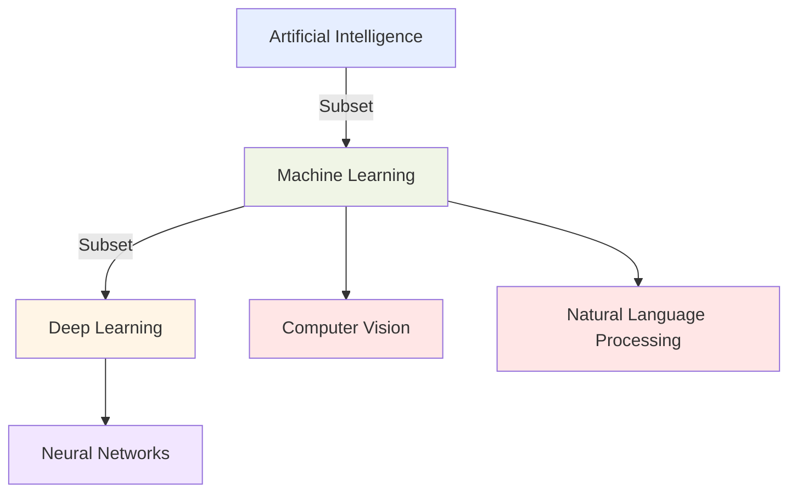
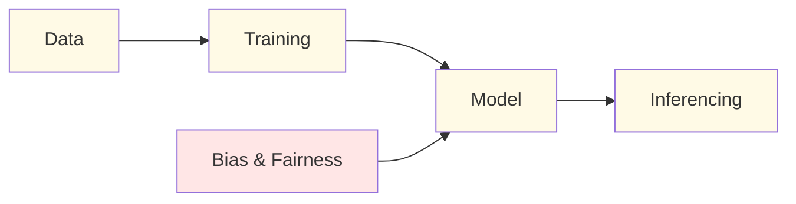
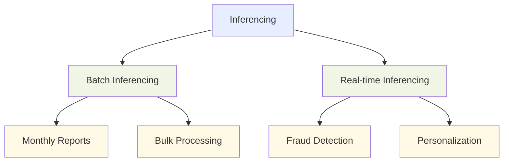
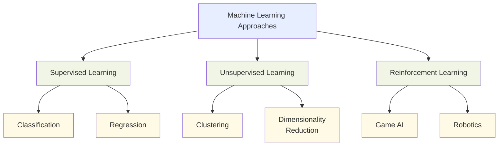
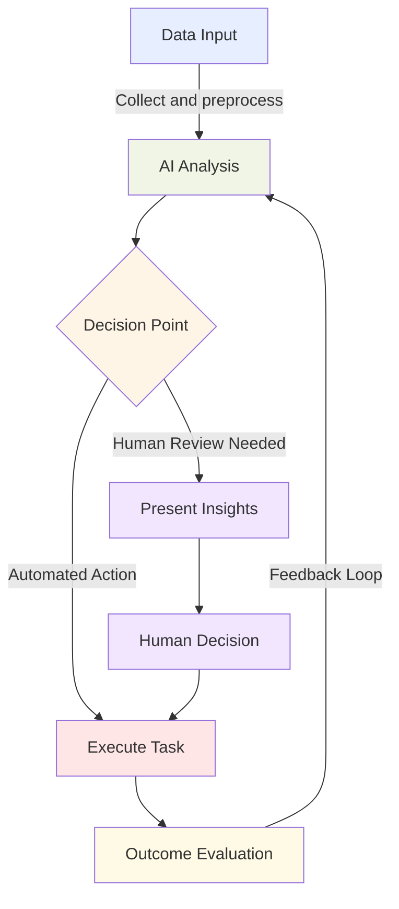
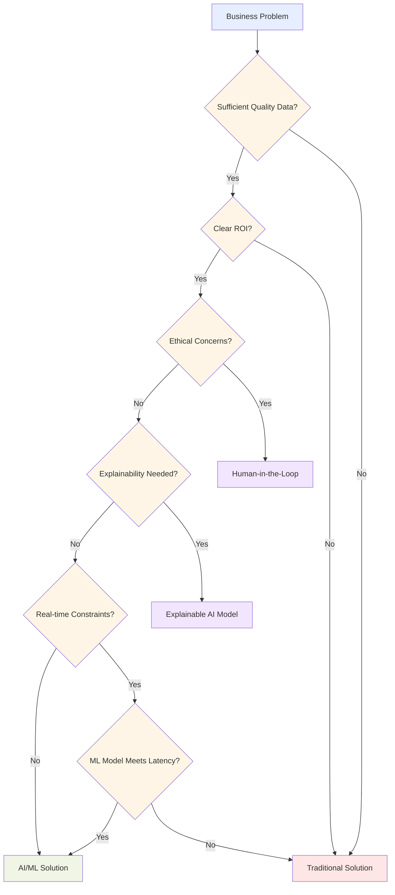
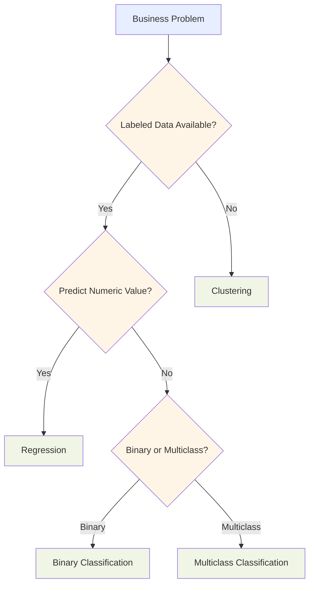
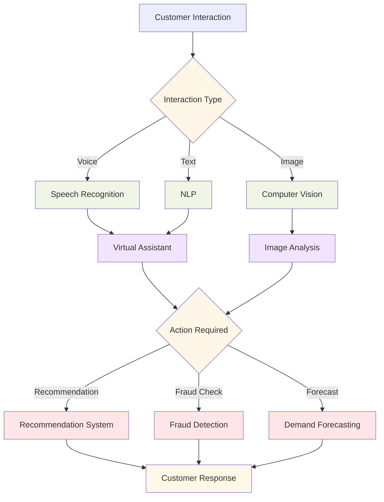
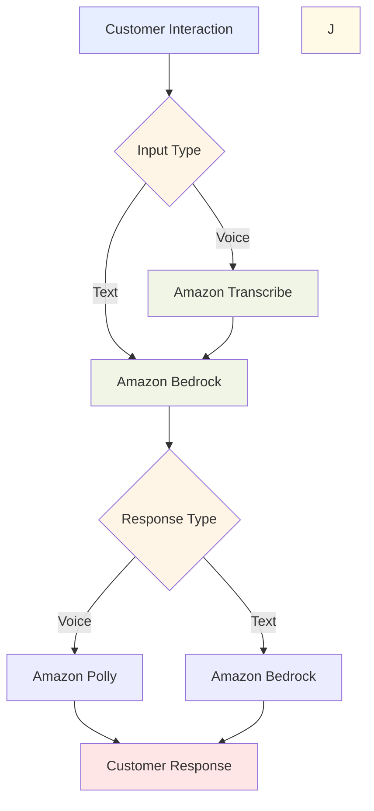
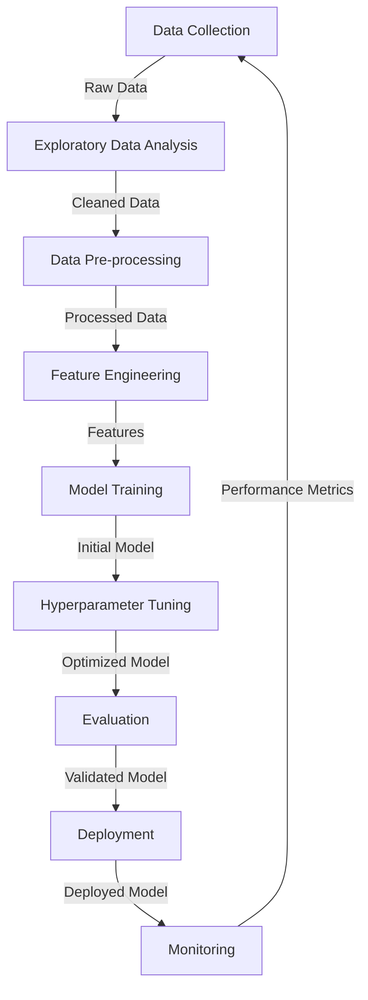

# Domain 1: Fundamentals of AI and ML (20% of scored content) 

## 1.1 AI and ML Concepts and Terminologies

Understanding artificial intelligence (AI) and its related concepts has become essential for professionals across all industries. AI transforms business processes, decision-making, and customer experiences, making it vital to grasp the fundamental terminology and concepts that underpin this technology. This knowledge enables effective communication with technical teams and empowers business leaders to make informed decisions about AI adoption and strategy.

The AWS Certified AI Practitioner exam assesses your ability to explain basic AI concepts and their practical applications in business contexts.[^200] Mastering these foundational elements will equip you to identify opportunities for AI implementation, evaluate AI solutions, and contribute meaningfully to AI-driven initiatives within your organization.

### Defining Basic AI Terms

Artificial Intelligence (AI) encompasses a broad range of technologies and approaches designed to enable machines to perform tasks that typically require human intelligence. To navigate the AI landscape effectively, it's crucial to understand the following key terms:

- **Artificial Intelligence (AI)**: The overarching field of creating intelligent machines that can simulate human-like cognitive functions such as learning, problem-solving, and decision-making.[^201]

- **Machine Learning (ML)**: A subset of AI that focuses on developing algorithms and statistical models that enable computer systems to improve their performance on a specific task through experience, without being explicitly programmed.[^202]

- **Deep Learning**: A specialized subset of machine learning that uses artificial neural networks with multiple layers (deep neural networks) to model and process complex patterns in data.[^203]

- **Neural Networks**: Computing systems inspired by biological neural networks, consisting of interconnected nodes (neurons) that process and transmit information.[^204]

- **Computer Vision**: A field of AI that enables machines to interpret and understand visual information from the world, such as images and videos.[^205]

- **Natural Language Processing (NLP)**: The branch of AI focused on enabling machines to understand, interpret, and generate human language in a valuable way.[^206]

- **Model**: A mathematical representation of a real-world process, trained on data to make predictions or decisions without being explicitly programmed to perform the task.[^207]

- **Algorithm**: A set of rules or instructions given to an AI system to help it learn from data and make decisions.[^208]

- **Training**: The process of teaching a machine learning model to make predictions by showing it many examples of input data and the corresponding correct outputs.[^209]

- **Inferencing**: The process of using a trained model to make predictions on new, unseen data.[^210]

- **Bias**: Systematic errors in AI systems that can lead to unfair or inaccurate outcomes, often reflecting human biases present in the training data or algorithm design.[^211]

- **Fairness**: The principle of ensuring that AI systems do not discriminate against individuals or groups based on protected characteristics such as race, gender, or age.[^212]

- **Fit**: How well a machine learning model's predictions match the actual outcomes in the training data. A good fit means the model accurately captures the underlying patterns without overfitting or underfitting.[^213]
I'll add a bullet point about Generative AI that mentions it will be covered in detail in the next chapter:

- **Generative AI**: A category of artificial intelligence that can create new content, including text, images, code, and more. These systems learn patterns from training data and generate novel outputs that reflect those patterns. Generative AI is revolutionizing numerous fields and applications. We'll explore this transformative technology in depth in the next chapter.

- **Large Language Model (LLM)**: A type of AI model trained on vast amounts of text data, capable of understanding and generating human-like text across a wide range of topics and tasks.[^214]

- **Transformer Model (LLM)**: They process entire sequences in parallel rather than one element at a time, making them highly efficient. They can capture long-range dependencies in text much better than previous models. The architecture scales extremely well, leading to models with billions or trillions of parameters. They're versatile and work for translation, text generation, image processing, protein folding, and more.

To illustrate the relationships between these concepts, let's consider a diagram:

The above diagram illustrates the hierarchical relationship between key concepts in the AI landscape. Artificial Intelligence represents the broadest domain, encompassing all technologies that enable computers to mimic human intelligence. Machine Learning is a subset of AI focused on systems that learn from data without explicit programming. Deep Learning further narrows the scope as a specialized subset of Machine Learning, utilizing complex, multi-layered neural networks. The diagram also highlights important application areas of Machine Learning, including Computer Vision and Natural Language Processing. Understanding this hierarchy helps business professionals navigate AI terminology and conceptualize how specific technologies relate to broader AI initiatives.

This second diagram depicts the essential workflow in developing and deploying AI systems. The process begins with Data collection and preparation, which feeds into the Training phase where algorithms learn patterns from the data. This results in a Model that encapsulates the learned patterns. The model then performs Inferencing—applying what it has learned to new, unseen data. Importantly, considerations of Bias & Fairness must be integrated during model development to ensure ethical AI systems. Business leaders who understand this lifecycle can better manage AI projects, allocate appropriate resources at each stage, and implement proper governance frameworks to address ethical concerns throughout the development process.

### Similarities and Differences Between AI, ML, and Deep Learning

While AI, ML, and deep learning are closely related, they have distinct characteristics and applications:

**Artificial Intelligence (AI)**:
- Broadest category, encompassing all efforts to make machines intelligent
- Can include rule-based systems and symbolic AI, not just data-driven approaches
- Aims to create systems that can perform tasks requiring human-like intelligence

**Machine Learning (ML)**:
- Subset of AI focused on algorithms that improve through experience
- Relies on statistical techniques to enable computers to "learn" from data
- Includes various approaches such as supervised learning, unsupervised learning, and reinforcement learning

**Deep Learning**:
- Specialized subset of machine learning
- Uses artificial neural networks with multiple layers
- Particularly effective for processing unstructured data like images, audio, and text

Table 1.1.1. Comparison of AI, ML, and Deep Learning

| Aspect | Artificial Intelligence | Machine Learning | Deep Learning |
|--------|-------------------------|-------------------|----------------|
| Scope | Broadest | Subset of AI | Subset of ML |
| Approach | Various (rule-based, symbolic, statistical) | Statistical, data-driven | Neural networks with multiple layers |
| Data Requirements | Varies | Large datasets | Very large datasets |
| Interpretability | Can be high (e.g., rule-based systems) | Moderate to low | Generally low |
| Typical Applications | Expert systems, game AI, robotics | Predictive analytics, recommendation systems | Image recognition, natural language processing |

In practice, these technologies often work together in AI solutions. For example, a customer service chatbot might use:
- AI principles for overall design and decision-making
- ML algorithms for intent classification and entity recognition
- Deep learning models (like LLMs) for generating human-like responses

Understanding these distinctions helps business professionals choose the right approach for specific use cases and communicate more effectively with technical teams.

### Types of Inferencing

Inferencing, the process of using a trained model to make predictions on new data, can be performed in various ways depending on the business requirements and technical constraints. The two main types of inferencing are:

1. **Batch Inferencing**:
   - Processes large volumes of data at once, typically on a scheduled basis
   - Suitable for non-time-sensitive applications or when processing large datasets is more efficient
   - Examples: Monthly customer churn predictions, bulk product recommendations

2. **Real-time Inferencing**:
   - Processes data and returns predictions immediately, often within milliseconds
   - Crucial for applications requiring instant decisions or responses
   - Examples: Fraud detection for online transactions, real-time personalization in e-commerce

When choosing between batch and real-time inferencing, consider factors such as:
- Latency requirements
- Data volume and frequency
- Cost considerations (real-time inferencing often requires more resources)
- Integration with existing systems and processes

For example, a financial services company might use real-time inferencing for fraud detection on individual transactions, while employing batch inferencing for monthly risk assessments of their entire customer portfolio.[^215]

### Types of Data in AI Models

AI models can work with various types of data, each requiring different preprocessing techniques and model architectures. Understanding these data types is crucial for selecting appropriate AI solutions and preparing data for model training:

1. **Labeled vs. Unlabeled Data**:
   - Labeled data: Includes both input features and corresponding output labels (used in supervised learning)
   - Unlabeled data: Contains only input features without corresponding labels (used in unsupervised learning)

2. **Structured vs. Unstructured Data**:
   - Structured data: Organized in a predefined format (e.g., databases, spreadsheets)
   - Unstructured data: Lacks a predefined format (e.g., text documents, images, audio files)

3. **Specific Data Types**:
   - Tabular data: Organized in rows and columns (e.g., customer information, sales records)
   - Time-series data: Sequential data points indexed in time order (e.g., stock prices, sensor readings)
   - Image data: Visual information represented as pixel values
   - Text data: Natural language in various formats (e.g., documents, social media posts, customer reviews)

Table 1.1.2. Data Types and Their Characteristics

| Data Type | Structure | Typical Sources | Common AI Applications |
|-----------|-----------|-----------------|------------------------|
| Tabular | Structured | Databases, spreadsheets | Customer segmentation, fraud detection |
| Time-series | Structured | IoT sensors, financial markets | Forecasting, anomaly detection |
| Image | Unstructured | Cameras, medical imaging | Object recognition, quality control |
| Text | Unstructured | Documents, social media | Sentiment analysis, chatbots |

Different AI models and techniques are better suited for certain types of data. For instance:
- Tabular data often works well with traditional machine learning algorithms like decision trees or random forests
- Image data typically requires deep learning models such as convolutional neural networks (CNNs)[^216]
- Text data is often processed using natural language processing techniques and models like recurrent neural networks (RNNs) or transformers[^217]

By understanding these data types, business professionals can better assess the feasibility of AI projects and communicate data requirements effectively with technical teams.

### Supervised, Unsupervised, and Reinforcement Learning

Machine learning approaches can be categorized into three main types based on how they learn from data:

1. **Supervised Learning**:
   - Uses labeled data where both input features and corresponding output labels are provided
   - The model learns to predict the output given new input data
   - Examples: Classification (e.g., spam detection), regression (e.g., price prediction)

2. **Unsupervised Learning**:
   - Works with unlabeled data, finding patterns or structures without predefined outputs
   - Useful for discovering hidden patterns or grouping similar data points
   - Examples: Clustering (e.g., customer segmentation), dimensionality reduction

3. **Reinforcement Learning**:
   - Learns through interaction with an environment, receiving rewards or penalties for actions
   - Aims to maximize cumulative rewards over time
   - Examples: Game AI, robotics, autonomous vehicles

Each approach has its strengths and is suited for different types of problems:

**Supervised Learning**:
- Best for problems where you have a clear target variable to predict
- Requires high-quality labeled data, which can be expensive or time-consuming to obtain
- Widely used in business applications like customer churn prediction or credit scoring

**Unsupervised Learning**:
- Useful for exploratory data analysis and finding hidden patterns
- Doesn't require labeled data, making it suitable when labeling is impractical or expensive
- Often used in market segmentation, anomaly detection, or recommendation systems

**Reinforcement Learning**:
- Ideal for sequential decision-making problems
- Can learn complex strategies through trial and error
- Applicable in scenarios like optimizing trading strategies or managing industrial processes

In practice, many AI solutions combine these approaches. For example, a recommendation system might use:
- Supervised learning to predict user ratings for items
- Unsupervised learning to group similar items or users
- Reinforcement learning to optimize the recommendation strategy over time

Understanding these learning paradigms helps business professionals assess the feasibility of AI projects, estimate data requirements, and set realistic expectations for AI system capabilities.

By mastering these fundamental AI concepts and terminologies, business professionals can effectively navigate the AI landscape, communicate with technical teams, and make informed decisions about AI adoption and strategy. As AI continues to evolve and transform industries, this knowledge will be invaluable in leveraging AI's potential to drive innovation and competitive advantage.

### Questions for self-check

1. **A data scientist is working on a project to identify patterns in customer purchasing behavior without any predefined categories. Which type of machine learning approach is most suitable for this task?**

   A. Supervised learning
   B. Unsupervised learning
   C. Reinforcement learning
   D. Semi-supervised learning

2. **An AI-powered chatbot is designed to improve its responses over time based on user feedback. Which learning paradigm does this scenario best represent?**

   A. Supervised learning
   B. Unsupervised learning
   C. Reinforcement learning
   D. Transfer learning

3. **A financial services company wants to implement an AI system for real-time fraud detection on individual transactions. Which type of inferencing should they use?**

   A. Batch inferencing
   B. Real-time inferencing
   C. Offline inferencing
   D. Delayed inferencing

4. **Which of the following best describes the relationship between Artificial Intelligence (AI), Machine Learning (ML), and Deep Learning?**

   A. They are interchangeable terms for the same technology
   B. Deep Learning is a subset of AI, which is a subset of ML
   C. ML is a subset of AI, and Deep Learning is a subset of ML
   D. AI, ML, and Deep Learning are separate, unrelated fields

5. **A retail company has a large dataset of customer information stored in a structured database. Which type of data would this be classified as?**

   A. Unstructured data
   B. Time-series data
   C. Image data
   D. Tabular data

### Answers and Explanations

1. **Correct answer: B. Unsupervised learning**

   Explanation: Unsupervised learning is the most suitable approach for identifying patterns in data without predefined categories or labels. In this scenario, the data scientist is looking to discover hidden patterns in customer purchasing behavior without any prior categorization. Unsupervised learning algorithms, such as clustering, can group similar customers or products together based on their characteristics, revealing natural patterns in the data.[^218]

2. **Correct answer: C. Reinforcement learning**

   Explanation: This scenario best represents reinforcement learning. In reinforcement learning, an agent (in this case, the chatbot) learns to make decisions by interacting with its environment (user interactions) and receiving feedback (user responses). The chatbot improves its performance over time by maximizing positive feedback, which is a key characteristic of reinforcement learning. This approach allows the AI to adapt and optimize its behavior based on real-world interactions.[^219]

3. **Correct answer: B. Real-time inferencing**

   Explanation: For real-time fraud detection on individual transactions, real-time inferencing is the most appropriate choice. Real-time inferencing processes data and returns predictions immediately, often within milliseconds, which is crucial for applications requiring instant decisions. In the case of fraud detection for financial transactions, the system needs to make immediate decisions to approve or flag transactions as they occur, making real-time inferencing essential.[^220]

4. **Correct answer: C. ML is a subset of AI, and Deep Learning is a subset of ML**

   Explanation: This option correctly describes the relationship between AI, ML, and Deep Learning. Artificial Intelligence is the broadest field, encompassing various approaches to create intelligent machines. Machine Learning is a subset of AI that focuses on algorithms that can learn from data. Deep Learning is a further specialized subset of ML that uses neural networks with multiple layers to model complex patterns in data. This hierarchical relationship is fundamental to understanding the AI landscape.[^221]

5. **Correct answer: D. Tabular data**

   Explanation: The scenario describes customer information stored in a structured database, which is characteristic of tabular data. Tabular data is organized in rows and columns, similar to a spreadsheet or database table. This type of structured data is common in business applications and is well-suited for many traditional machine learning algorithms. Understanding data types is crucial for selecting appropriate AI models and preprocessing techniques.[^222]

[^200]: AWS Certified AI Practitioner Exam Guide. URL: <https://d1.awsstatic.com/training-and-certification/docs-ai-practitioner/AWS-Certified-AI-Practitioner_Exam-Guide.pdf>

[^201]: AWS Cloud Adoption Framework for Artificial Intelligence, Machine Learning. URL: <https://docs.aws.amazon.com/whitepapers/latest/aws-caf-for-ai/aws-caf-for-ai.html>

[^202]: Amazon SageMaker Developer Guide: What Is Machine Learning? URL: <https://docs.aws.amazon.com/sagemaker/latest/dg/what-is-machine-learning.html>

[^203]: AWS Machine Learning Decision Guide: Choosing an AWS machine learning service. URL: <https://docs.aws.amazon.com/decision-guides/latest/machine-learning-on-aws-how-to-choose/guide.html>

[^204]: What is a Neural Network? - Artificial Neural Network Explained - AWS. URL: <https://aws.amazon.com/what-is/neural-network/>

[^205]: Amazon Rekognition Developer Guide: What Is Amazon Rekognition? URL: <https://docs.aws.amazon.com/rekognition/latest/dg/what-is.html>

[^206]: Amazon Comprehend Developer Guide: What Is Amazon Comprehend? URL: <https://docs.aws.amazon.com/comprehend/latest/dg/what-is.html>

[^207]: How I Got Into The Top 2% In AWS DeepRacer. URL: <https://medium.com/@marsmans/how-i-got-into-the-top-2-in-aws-deepracer-32127a364212>

[^208]: Choosing an AWS machine learning service. URL: <https://docs.aws.amazon.com/decision-guides/latest/machine-learning-on-aws-how-to-choose/guide.html>

[^209]: Amazon SageMaker Developer Guide: Train a Model. URL: <https://docs.aws.amazon.com/sagemaker/latest/dg/how-it-works-training.html>

[^210]: Amazon SageMaker Developer Guide: Deploy a Model. URL: <https://docs.aws.amazon.com/sagemaker/latest/dg/how-it-works-deployment.html>

[^211]: Tune ML models for additional objectives like fairness with SageMaker Automatic Model Tuning. URL: <https://aws.amazon.com/blogs/machine-learning/tune-ml-models-for-additional-objectives-like-fairness-with-sagemaker-automatic-model-tuning/>

[^212]: Responsible AI – Building AI Responsibly – AWS. URL: <https://aws.amazon.com/ai/responsible-ai/>

[^213]: Ground truth curation and metric interpretation best practices for evaluating generative AI question-answering using FMEval. URL: <https://aws.amazon.com/blogs/machine-learning/ground-truth-curation-and-metric-interpretation-best-practices-for-evaluating-generative-ai-question-answering-using-fmeval/>

[^214]: What is LLM? - Large Language Models Explained - AWS. URL: <https://aws.amazon.com/what-is/large-language-model/>

[^215]: Build a GNN-based real-time fraud detection solution using Amazon SageMaker, Amazon Neptune, and the Deep Graph Library. URL: <https://aws.amazon.com/blogs/machine-learning/build-a-gnn-based-real-time-fraud-detection-solution-using-amazon-sagemaker-amazon-neptune-and-the-deep-graph-library/>

[^216]: What is a Neural Network? - Artificial Neural Network Explained - AWS. URL: <https://aws.amazon.com/what-is/neural-network/>

[^217]: What is NLP? - Natural Language Processing Explained - AWS. URL: <https://aws.amazon.com/what-is/nlp/>

[^218]: Supervised vs Unsupervised Learning - AWS. URL: <https://aws.amazon.com/compare/the-difference-between-machine-learning-supervised-and-unsupervised/>

[^219]: Optimize customer engagement with reinforcement learning | AWS Machine Learning Blog. URL: <https://aws.amazon.com/blogs/machine-learning/optimize-customer-engagement-with-reinforcement-learning/>

[^220]: Real-time inference - Amazon SageMaker AI. URL: <https://docs.aws.amazon.com/sagemaker/latest/dg/realtime-endpoints.html>

[^221]: AWS Machine Learning Blog: AI, ML, and Deep Learning Explained. URL: <https://aws.amazon.com/compare/the-difference-between-artificial-intelligence-and-machine-learning/>

[^222]: AWS Machine Learning Blog: Working with Tabular Data in Amazon SageMaker. URL: <https://docs.aws.amazon.com/sagemaker/latest/dg/algorithms-tabular.html>

## 1.2 Practical use cases for AI

Artificial intelligence (AI) and machine learning (ML) have become powerful tools that transform how organizations operate, serve customers, and gain competitive advantages. Understanding where AI can deliver value—and where it might not be suitable—enables businesses to make strategic technology decisions. This subchapter explores practical AI applications, helps you identify appropriate use cases, and introduces the AWS services that can turn AI concepts into business solutions.

### Recognize applications where AI/ML can provide value

AI and ML technologies excel at analyzing large datasets, identifying patterns, and making predictions that enhance business operations in several key areas:

1. **Assisting human decision-making**: AI systems analyze vast amounts of data to provide insights that augment human expertise, leading to more informed decisions.

2. **Solution scalability**: ML models can process increasing volumes of data without proportional resource increases, enabling efficient business scaling.

3. **Automation**: AI-powered systems handle repetitive tasks, freeing human resources for strategic and creative work.

The following flowchart demonstrates how AI integrates into a typical business process:

*Figure 1.2.1: AI-Assisted Business Process Flow. This diagram illustrates how AI can be integrated into a typical business process, from data input to outcome evaluation, showing both automated actions and human decision points.*

Here are specific examples where AI/ML provides significant business value:

- **Customer Service**: AI-powered chatbots and virtual assistants handle routine customer inquiries 24/7, improving response times while allowing human agents to focus on complex issues. **Amazon Lex**, integrated with Amazon Connect, creates intelligent conversational interfaces that understand natural language.[^300]

- **Predictive Maintenance**: ML models analyze equipment sensor data to predict potential failures before they occur, reducing downtime and maintenance costs. **Amazon SageMaker** enables building, training, and deploying these predictive models at scale.[^301]

- **Personalized Recommendations**: E-commerce platforms use ML algorithms to analyze customer behavior and provide tailored product recommendations, increasing sales and satisfaction. **Amazon Personalize** offers a fully managed service to create real-time personalized recommendations.[^302]

- **Financial Fraud Detection**: Banks employ ML models to analyze transaction patterns and identify potentially fraudulent activities in real-time. **Amazon Fraud Detector** provides a fully managed service that uses ML to detect suspicious activities.[^303]

- **Supply Chain Optimization**: AI analyzes historical data, market trends, and external factors to optimize inventory levels, predict demand, and improve supply chain efficiency. **Amazon Forecast** generates accurate demand forecasts based on historical time series data.[^304]

These AI applications enable businesses to enhance operational efficiency, improve customer experiences, and gain competitive advantages in their markets.

### Determine when AI/ML solutions are not appropriate

Recognizing situations where AI may not be the optimal solution is equally important for making sound technology decisions. Several factors should influence whether to implement AI for a particular business challenge:

1. **Cost-benefit considerations**: AI implementation requires investments in data infrastructure, model development, and ongoing maintenance. For some problems, these costs may exceed potential benefits.

2. **Situations requiring specific outcomes**: When definitive, rule-based outcomes are needed (such as in regulatory compliance), traditional rule-based systems often work better than AI's probability-based approaches.

3. **Limited or poor-quality data**: AI/ML models depend on substantial high-quality data. Without sufficient quality data, predictions will be unreliable and potentially harmful to business operations.

4. **Ethical considerations**: Using AI for certain decision-making processes raises ethical concerns, particularly in sensitive areas like healthcare diagnostics or criminal justice. Human judgment remains essential for ensuring fair outcomes.

5. **Explainability requirements**: Some industries require clear explanations for decisions. While *explainable AI* has advanced, complex models like deep neural networks can be difficult to interpret, making them unsuitable when decision transparency is crucial.

6. **Real-time processing needs**: For ultra-low-latency applications, traditional rule-based systems may provide more reliable response times than some AI systems.

This flowchart helps determine whether an AI/ML solution fits a particular business need:

*Figure 1.2.2: AI/ML Solution Appropriateness Flowchart. This diagram outlines the decision-making process for determining whether an AI/ML solution is appropriate for a given business problem, considering factors such as data quality, ROI, ethical concerns, explainability needs, and real-time constraints.*

When evaluating AI solutions, ask these critical questions:

- Is there clear business value that outweighs implementation costs?
- Do we have sufficient high-quality data to train and maintain the model?
- Are there ethical or regulatory concerns with using AI for this application?
- Do we need to provide clear explanations for the system's decisions?
- Can we tolerate some uncertainty in the outcomes?

Sometimes a hybrid approach combining AI with human oversight or traditional systems provides the most effective solution.

### Select the appropriate ML techniques for specific use cases

Matching the right machine learning technique to your business problem significantly impacts project success. Different ML approaches suit different types of problems and data characteristics. Here are three fundamental ML techniques and their typical applications:

1. **Regression**:
   - **Purpose**: Predicts continuous numerical values based on input features.
   - **Use cases**: Sales forecasting, price prediction, demand estimation.
   - **Example**: Predicting house prices based on features like square footage, location, and number of bedrooms.

2. **Classification**:
   - **Purpose**: Categorizes input data into predefined classes or categories.
   - **Use cases**: Spam detection, sentiment analysis, image recognition.
   - **Example**: Determining whether an email is spam or legitimate based on its content and metadata.

3. **Clustering**:
   - **Purpose**: Groups similar data points without predefined categories.
   - **Use cases**: Customer segmentation, anomaly detection, recommendation systems.
   - **Example**: Grouping customers with similar purchasing behaviors for targeted marketing campaigns.

This table summarizes key ML techniques and their business applications:

*Table 1.2.1: ML Techniques and Their Business Applications*

| ML Technique | Description | Business Use Case | AWS Service |
|--------------|-------------|-------------------|-------------|
| Regression | Predicts continuous values | Sales forecasting | Amazon Forecast |
| Classification | Categorizes data into classes | Sentiment analysis | Amazon Comprehend |
| Clustering | Groups similar data points | Customer segmentation | Amazon SageMaker |

When selecting an ML technique, consider these factors:

1. **Nature of the problem**: Is it a prediction task (regression), a categorization task (classification), or an exploratory analysis (clustering)?

2. **Type of data available**: Is your data labeled (supervised learning) or unlabeled (unsupervised learning)?

3. **Desired outcome**: Do you need a specific numerical prediction, a category assignment, or insights into data patterns?

4. **Interpretability requirements**: Some techniques (e.g., decision trees) are more easily interpretable than others (e.g., neural networks).

5. **Scalability needs**: Consider the volume of data you'll be processing and the frequency of predictions required.

This decision flow helps select an appropriate ML technique:

*Figure 1.2.3: ML Technique Selection Flowchart. This diagram illustrates the decision-making process for selecting an appropriate ML technique based on the nature of the data and the desired outcome.*

In real-world scenarios, combining multiple techniques or employing more advanced methods may deliver optimal results. The key is aligning the technical approach with your specific business needs and data characteristics.

### Identify examples of real-world AI applications

AI technology has transformed operations across numerous industries. Understanding these practical applications can inspire new implementation ideas for your organization. Here are prominent examples of AI applications in various domains:

1. **Computer Vision**:
   - **Application**: Object detection and recognition in images and videos.
   - **Use case**: Autonomous vehicles use computer vision to identify road signs, pedestrians, and other vehicles.
   - **AWS service**: **Amazon Rekognition** provides pre-trained computer vision capabilities for image and video analysis.[^305]

2. **Natural Language Processing (NLP)**:
   - **Application**: Understanding and generating human language.
   - **Use case**: Chatbots that comprehend and respond to customer queries in natural language.
   - **AWS service**: **Amazon Comprehend** offers NLP capabilities for extracting insights from text.[^306]

3. **Speech Recognition**:
   - **Application**: Converting spoken language into text.
   - **Use case**: Voice-controlled virtual assistants like Alexa or Siri.
   - **AWS service**: **Amazon Transcribe** converts speech to text in real-time.[^307]

4. **Recommendation Systems**:
   - **Application**: Suggesting relevant items based on user preferences and behavior.
   - **Use case**: E-commerce platforms recommending products based on browsing and purchase history.
   - **AWS service**: **Amazon Personalize** provides custom recommendation capabilities.[^308]

5. **Fraud Detection**:
   - **Application**: Identifying unusual patterns that may indicate fraudulent activity.
   - **Use case**: Banks detecting and preventing credit card fraud in real-time.
   - **AWS service**: **Amazon Fraud Detector** identifies potentially fraudulent online activities.[^309]

6. **Forecasting**:
   - **Application**: Predicting future trends based on historical data.
   - **Use case**: Retailers forecasting product demand to optimize inventory.
   - **AWS service**: **Amazon Forecast** generates accurate demand forecasts from historical data.[^310]

This diagram illustrates how these AI applications integrate into a business ecosystem:

*Figure 1.2.4: Integrated AI Applications in Business. This diagram shows how various AI applications can be integrated into a business ecosystem, from initial customer interaction to final response, incorporating different AI technologies based on the interaction type and required action.*

These real-world applications demonstrate AI's versatility in solving complex business problems. By understanding these applications, you can identify similar opportunities within your organization to leverage AI for improved efficiency, customer experience, and decision-making.

### Explain the capabilities of AWS managed AI/ML services

AWS offers comprehensive managed AI/ML services that enable businesses to implement AI solutions without extensive in-house expertise or infrastructure. These services range from foundational tools for building custom ML models to pre-trained AI services for specific tasks:

*Table 1.2.2. AWS AI Services Comparison*

| Service | Capability | Features | Use Case |
|---------|------------|----------|----------|
| **Amazon SageMaker** | End-to-end ML platform for building, training, and deploying ML models at scale. | Integrated development environment (IDE) for ML, automated model tuning, distributed training, and model deployment. | Developing custom ML models for various business applications.[^311] |
| **Amazon Transcribe** | Automatic speech recognition service that converts speech to text. | Real-time transcription, custom vocabulary, speaker identification, and language detection. | Transcribing customer service calls for analysis and quality assurance.[^312] |
| **Amazon Translate** | Neural machine translation service providing fast, high-quality language translation. | Support for multiple languages, custom terminology, and batch translation. | Translating product descriptions and customer reviews for global e-commerce platforms.[^313] |
| **Amazon Comprehend** | Natural language processing service for extracting insights from text. | Entity recognition, key phrase extraction, sentiment analysis, and topic modeling. | Analyzing customer feedback to identify common issues and sentiment trends.[^314] |
| **Amazon Lex** | Service for building conversational interfaces using voice and text. | Automatic speech recognition, natural language understanding, and dialog management. | Creating chatbots for customer service and support.[^315] |
| **Amazon Polly** | Text-to-speech service that converts text into lifelike speech. | Multiple languages and voices, speech marks for synchronization, and custom lexicons. | Generating voice prompts for interactive voice response systems.[^316] |
| **Amazon Bedrock** | Fully managed service providing access to foundation models (FMs) from leading AI companies through a single API. | Access to models from AI21 Labs, Anthropic, Stability AI, and Amazon; fine-tuning capabilities; and enterprise-grade security. | Building generative AI applications for content creation, summarization, and question-answering.[^317] |

This diagram shows how AWS managed AI/ML services integrate into a comprehensive solution:

*Figure 1.2.5: Integrated AWS AI/ML Services. This diagram illustrates how various AWS managed AI/ML services can be combined to create a comprehensive AI solution for customer interactions, from input processing to response generation.*

Key advantages of AWS managed AI/ML services include:

1. **Reduced complexity**: These services abstract away infrastructure and ML complexities, allowing developers to focus on building applications.

2. **Scalability**: AWS manages resource scaling based on demand, ensuring consistent performance under varying loads.

3. **Cost-effectiveness**: Pay-as-you-go pricing allows businesses to start small and scale without large upfront investments.

4. **Continuous updates**: AWS regularly updates services with the latest AI/ML advancements, providing access to state-of-the-art capabilities.

5. **Integration**: These services easily integrate with other AWS services and existing applications through APIs and SDKs.

6. **Security and compliance**: AWS provides robust security features and compliance certifications, addressing common AI adoption concerns.

By leveraging these managed services, businesses of all sizes can rapidly prototype, develop, and deploy AI solutions without extensive in-house AI expertise or infrastructure.

Understanding practical AI use cases, recognizing when AI solutions are appropriate, selecting the right ML techniques, and leveraging AWS managed services are crucial skills for business professionals in the AI era. These capabilities enable you to drive AI initiatives and position your organization for success in an increasingly AI-driven world.

### Questions for self-check

1. **A retail company wants to implement an AI solution to improve its inventory management. Which of the following AWS services would be most appropriate for generating accurate demand forecasts based on historical sales data?**

   A. Amazon Rekognition
   B. Amazon Comprehend
   C. Amazon Forecast
   D. Amazon Personalize

2. **An AI project team is evaluating whether to implement a machine learning solution for a critical business process. Which of the following factors would NOT typically be a reason to avoid using an AI/ML solution?**

   A. The process requires clear explanations for all decisions made
   B. The company has access to large amounts of high-quality historical data
   C. The process involves sensitive ethical considerations
   D. The desired outcome is a definitive, rule-based result

3. **A financial services company wants to implement an AI system to detect potentially fraudulent transactions in real-time. Which machine learning technique would be most appropriate for this use case?**

   A. Regression
   B. Clustering
   C. Classification
   D. Dimensionality reduction

4. **A global e-commerce platform is developing an AI-powered customer service system. Which combination of AWS services would be most appropriate for creating a multilingual chatbot that can understand and respond to customer queries in various languages?**

   A. Amazon Polly and Amazon Rekognition
   B. Amazon Bedrock and Amazon Translate
   C. Amazon SageMaker and Amazon Forecast
   D. Amazon Comprehend and Amazon Personalize

5. **A data scientist is explaining the concept of overfitting to a business team. Which of the following statements best describes the potential business impact of an overfitted machine learning model?**

   A. The model will consistently underperform on all datasets, leading to poor business decisions
   B. The model will require significantly more computational resources, increasing operational costs
   C. The model will perform exceptionally well in production, potentially automating all related business processes
   D. The model will fail to generalize to new data, potentially leading to inaccurate predictions in real-world scenarios

### Answers and Explanations

1. **Correct answer: C. Amazon Forecast**

   Explanation: Amazon Forecast is specifically designed for generating accurate demand forecasts based on historical time series data, which is exactly what the retail company needs for improving inventory management.[^318] Amazon Rekognition (image and video analysis), Amazon Comprehend (natural language processing), and Amazon Personalize (personalized recommendations) are not suitable for this particular use case of demand forecasting.

2. **Correct answer: B. The company has access to large amounts of high-quality historical data**

   Explanation: Having access to large amounts of high-quality historical data is actually a positive factor for implementing an AI/ML solution, not a reason to avoid it. AI and ML models typically require substantial, high-quality data to perform well. The other options are valid reasons to be cautious about implementing AI/ML: the need for clear explanations (A) can be challenging for some complex ML models, ethical considerations (C) may require human oversight, and definitive rule-based outcomes (D) might be better served by traditional systems.

3. **Correct answer: C. Classification**

   Explanation: For detecting potentially fraudulent transactions in real-time, classification is the most appropriate machine learning technique. This is because fraud detection is essentially a binary classification problem (fraudulent or not fraudulent) based on transaction characteristics. Regression is used for predicting continuous values, clustering for grouping similar data points without predefined categories, and dimensionality reduction for reducing the number of input variables, none of which directly address the fraud detection use case.

4. **Correct answer: B. Amazon Bedrock and Amazon Translate**

   Explanation: To create a multilingual chatbot, the combination of Amazon Bedrock and Amazon Translate would be most appropriate. Amazon Bedrock provides the Large Language Models for building chatbots, while Amazon Translate enables real-time translation between languages. This combination allows the chatbot to understand and respond to customer queries in various languages. Also, many LLMs support multiple languages and can be used directly without translation.

5. **Correct answer: D. The model will fail to generalize to new data, potentially leading to inaccurate predictions in real-world scenarios**

   Explanation: This statement accurately describes the business impact of an overfitted model. Overfitting occurs when a model learns the training data too well, including its noise and peculiarities. As a result, while it may perform exceptionally well on the training data, it fails to generalize to new, unseen data. In a business context, this means the model may make inaccurate predictions when applied to real-world scenarios, potentially leading to poor decision-making. This highlights the importance of proper model validation and testing in AI projects.

[^300]: Amazon Lex Overview. URL: <https://aws.amazon.com/lex/>
[^301]: Amazon SageMaker Overview. URL: <https://aws.amazon.com/sagemaker/>
[^302]: Amazon Personalize Overview. URL: <https://aws.amazon.com/personalize/>
[^303]: Amazon Fraud Detector Overview. URL: <https://aws.amazon.com/fraud-detector/>
[^304]: Amazon Forecast Overview. URL: <https://aws.amazon.com/forecast/>
[^305]: Amazon Rekognition Overview. URL: <https://aws.amazon.com/rekognition/>
[^306]: Amazon Comprehend Overview. URL: <https://aws.amazon.com/comprehend/>
[^307]: Amazon Transcribe Overview. URL: <https://aws.amazon.com/transcribe/>
[^308]: Amazon Personalize Overview. URL: <https://aws.amazon.com/personalize/>
[^309]: Amazon Fraud Detector Overview. URL: <https://aws.amazon.com/fraud-detector/>
[^310]: Amazon Forecast Overview. URL: <https://aws.amazon.com/forecast/>
[^311]: Amazon SageMaker Overview. URL: <https://aws.amazon.com/sagemaker/>
[^312]: Amazon Transcribe Overview. URL: <https://aws.amazon.com/transcribe/>
[^313]: Amazon Translate Overview. URL: <https://aws.amazon.com/translate/>
[^314]: Amazon Comprehend Overview. URL: <https://aws.amazon.com/comprehend/>
[^315]: Amazon Lex Overview. URL: <https://aws.amazon.com/lex/>
[^316]: Amazon Polly Overview. URL: <https://aws.amazon.com/polly/>
[^317]: Amazon Bedrock Overview. URL: <https://aws.amazon.com/bedrock/>
[^318]: Amazon Forecast Documentation. URL: <https://docs.aws.amazon.com/forecast/>

## 1.3 The ML Development Lifecycle

Understanding the machine learning (ML) development lifecycle is essential for leveraging AI effectively in business environments. This knowledge enables professionals to confidently oversee AI projects, communicate with technical teams, and make data-driven decisions about AI initiatives. The ML development lifecycle consists of interconnected stages from data collection to model deployment and monitoring.[^400] Mastering this process helps organizations streamline AI implementation, reduce time-to-market, and maximize return on investment from AI projects.

The following sections explore the ML development lifecycle with a focus on practical business applications and how AWS services support each stage. This understanding will prepare you for the AWS Certified AI Practitioner exam while equipping you with knowledge to drive AI innovation within your organization.

### Components of an ML Pipeline

ML pipelines form the foundation of AI projects, comprising several critical stages that transform raw data into valuable business insights. A clear understanding of these components enables effective management of ML projects and facilitates productive communication with data science teams.

*Figure 1.3.1: ML Pipeline Components. This diagram illustrates the key stages of the ML development lifecycle, showing the flow from data collection to model monitoring and the iterative nature of the process.*

1. **Data Collection**: High-quality, relevant data forms the foundation of successful ML projects. This stage involves gathering data from diverse sources such as customer interactions, IoT devices, or third-party datasets. For example, an e-commerce company might collect user browsing history, purchase data, and product information to build a recommendation system.[^401]

2. **Exploratory Data Analysis (EDA)**: Data scientists examine collected data to understand patterns, identify anomalies, and formulate initial hypotheses during this crucial step. EDA guides subsequent pipeline stages and informs data preparation decisions. Tools like Amazon SageMaker Studio provide interactive notebooks for performing efficient EDA.[^402]

3. **Data Pre-processing**: Raw data typically contains inconsistencies, missing values, or irrelevant information that must be addressed. Pre-processing involves cleaning data, handling missing values, and transforming it into a suitable format for ML algorithms. Amazon SageMaker Data Wrangler offers a visual interface for collaborative data preparation tasks.[^403]

4. **Feature Engineering**: This stage involves creating new machine learning features or transforming existing ones to enhance model performance. For instance, a customer churn prediction model might benefit from a feature representing total customer spending over the past year. Amazon SageMaker Feature Store allows teams to create, share, and manage features across different ML projects.[^404]

5. **Model Training**: With prepared data and engineered features, the next step involves training the ML model by selecting an appropriate algorithm and using training data to teach the model to make predictions. Amazon SageMaker provides numerous built-in algorithms while supporting custom algorithms for flexible model development.[^405]

6. **Hyperparameter Tuning**: ML models contain hyperparameters that control their behavior and significantly impact performance. Amazon SageMaker Automatic Model Tuning employs advanced techniques like Bayesian optimization to automatically identify optimal hyperparameter configurations.[^406]

7. **Evaluation**: Before deployment, model performance must be assessed using various metrics. This stage involves testing the model on separate datasets to ensure it generalizes well to new, unseen data. Amazon SageMaker Model Monitor helps evaluate model performance over time.[^407]

8. **Deployment**: Once a model meets performance requirements, it's deployed to a production environment where it can generate predictions on real-world data. Amazon SageMaker offers multiple deployment options, including real-time inference endpoints and batch transform jobs.[^408]

9. **Monitoring**: Post-deployment, continuous monitoring ensures the model maintains performance over time. This involves tracking metrics and retraining when necessary. Amazon SageMaker Model Monitor automates detection of concept drift and data quality issues.[^409]

Understanding these components helps business professionals effectively oversee ML projects, allocate resources appropriately, set realistic expectations, and communicate more effectively with data science teams throughout the AI development process.

### Sources of ML Models

When initiating an ML project, organizations can obtain models from several sources. Understanding these options helps decision-makers develop effective model strategies and optimize resource allocation.

1. **Open Source Pre-trained Models**: These models have been trained on large datasets and made freely available to the public, offering several advantages:

   - Reduced development time and cost
   - Access to state-of-the-art architectures
   - Community support and continuous improvements

   For example, BERT (Bidirectional Encoder Representations from Transformers) is a popular open-source model for natural language processing tasks. Using Amazon SageMaker, you can easily deploy and fine-tune BERT for specific use cases like sentiment analysis or text classification.[^410]

2. **Training Custom Models**: This approach involves developing models from scratch or fine-tuning existing models for specific business needs. Benefits include:

   - Tailored solutions for unique business problems
   - Greater control over model behavior and performance
   - Potential for competitive advantage through proprietary algorithms

   Amazon SageMaker provides a comprehensive environment for training custom models, from data preparation to deployment and monitoring.[^411]

3. **AWS Pre-trained AI Services**: AWS offers a range of AI services with pre-trained models that can be easily integrated into applications. These include:

   - Amazon Rekognition for image and video analysis
   - Amazon Comprehend for natural language processing
   - Amazon Forecast for time-series forecasting

   These services provide quick solutions for common AI tasks without the need for extensive ML expertise.[^412]

4. **Transfer Learning**: This technique involves using a pre-trained model as a starting point and fine-tuning it for a specific task. It combines the benefits of pre-trained models with customization for specific use cases. Amazon SageMaker supports transfer learning, allowing organizations to leverage existing models while adapting them to their unique requirements.[^413]

The choice between these sources depends on factors such as the specific business problem, available resources, required level of customization, and time-to-market considerations. For instance, a startup looking to quickly implement a chatbot might opt for Amazon Lex, while a large enterprise developing a complex fraud detection system might choose to train a custom model using Amazon SageMaker.

### Methods to Use a Model in Production

Deploying ML models to production environments is a critical step in generating business value from AI investments. Several deployment methods exist, each with distinct advantages and considerations.

1. **Managed API Services**: This approach involves deploying models as managed API endpoints that integrate easily with existing applications. AWS offers several services for this purpose:

   - Amazon SageMaker Endpoints: Provides real-time inference with automatic scaling and load balancing.
   - Amazon Bedrock: Offers API access to foundation models for generative AI applications.[^414]

   Benefits of managed API services include:
   - Simplified deployment and management
   - Automatic scaling to handle varying loads
   - Built-in monitoring and logging capabilities

2. **Self-hosted API**: Organizations with specific requirements or existing infrastructure may prefer self-hosting model APIs using:

   - Amazon EC2 instances with Docker containers
   - Amazon ECS (Elastic Container Service) for container orchestration
   - Amazon EKS (Elastic Kubernetes Service) for Kubernetes-based deployments[^415]

   Self-hosting offers:
   - Greater control over the deployment environment
   - Ability to customize the API interface and functionality
   - Potential for cost optimization in high-volume scenarios

3. **Batch Inference**: For use cases without real-time prediction requirements, batch inference provides an efficient option. Amazon SageMaker Batch Transform processes large datasets in batches, suitable for scenarios like:

   - Generating product recommendations for an e-commerce catalog
   - Scoring credit risk for a large portfolio of loans
   - Analyzing sentiment for a backlog of customer reviews[^416]

4. **Edge Deployment**: Applications requiring low-latency inference or operating with limited connectivity benefit from edge device deployment. AWS IoT Greengrass enables ML inference on edge devices, supporting use cases such as:

   - Predictive maintenance in industrial settings
   - Real-time video analysis for security systems
   - Autonomous vehicle decision-making
   - Smart home device intelligence

   Edge deployment is particularly valuable when immediate decisions are needed without cloud dependency or when connectivity is intermittent. AWS provides optimized solutions for deploying models to various edge devices while maintaining performance.[^417]

5. **Embedded Models**: Some applications benefit from ML models embedded directly into applications or devices, suitable for:

   - Mobile apps requiring offline functionality
   - IoT devices with limited processing power
   - Applications with strict privacy requirements

   AWS services like Amazon SageMaker Neo optimize models for deployment on various hardware platforms, ensuring efficient execution in resource-constrained environments.[^418]

The selection of deployment method depends on factors such as latency requirements, inference volume, available infrastructure, data privacy considerations, and integration with existing systems. For example, a financial services company might use Amazon SageMaker Endpoints for real-time fraud detection during transactions while employing batch inference for monthly risk assessments of its entire customer base.

### AWS Services for ML Pipeline Stages

AWS provides comprehensive services supporting each ML pipeline stage, enabling organizations to build, train, and deploy ML models efficiently. Understanding these services helps organizations effectively leverage AWS's AI/ML capabilities and optimize their ML development lifecycle.

*Table 1.3.1: AWS Services for ML Pipeline Stages*

| Pipeline Stage | AWS Service | Key Features |
|----------------|-------------|--------------|
| Data Collection | Amazon S3 | Scalable object storage for datasets |
| | AWS Glue | ETL service for data preparation |
| Exploratory Data Analysis | Amazon SageMaker Studio | Interactive notebooks for data exploration |
| | Amazon QuickSight | Business intelligence tool for data visualization |
| Data Pre-processing | Amazon SageMaker Data Wrangler | Visual interface for data preparation |
| | AWS Glue DataBrew | Visual data preparation tool |
| Feature Engineering | Amazon SageMaker Feature Store | Centralized repository for feature management |
| | Amazon SageMaker Processing | Distributed data processing for feature creation |
| Model Training | Amazon SageMaker Training | Managed environment for model training |
| | Amazon EC2 | Customizable compute instances for training |
| Hyperparameter Tuning | Amazon SageMaker Automatic Model Tuning | Automated hyperparameter optimization |
| Evaluation | Amazon SageMaker Model Monitor | Automated model evaluation and monitoring |
| | Amazon CloudWatch | Metrics and logging for model performance |
| Deployment | Amazon SageMaker Endpoints | Real-time inference endpoints |
| | Amazon SageMaker Batch Transform | Batch inference for large datasets |
| Monitoring | Amazon SageMaker Model Monitor | Continuous monitoring of deployed models |
| | AWS Lambda | Serverless functions for custom monitoring logic |

Key AWS services supporting the ML pipeline include:

1. **Data Collection and Storage**: Amazon S3 provides scalable, secure storage for large datasets, while AWS Glue offers ETL capabilities to prepare data for analysis.[^419]

2. **Exploratory Data Analysis**: Amazon SageMaker Studio provides Jupyter notebooks for interactive data exploration, while Amazon QuickSight enables creation of interactive dashboards for data visualization.[^420]

3. **Data Pre-processing**: Amazon SageMaker Data Wrangler offers a visual interface for data cleaning and transformation, streamlining data preparation for ML models.[^421]

4. **Feature Engineering**: Amazon SageMaker Feature Store allows teams to create, store, and share features across ML projects, promoting consistency and reducing duplication.[^422]

5. **Model Training**: Amazon SageMaker Training provides a managed environment for ML model training, supporting numerous algorithms and frameworks.[^423]

6. **Hyperparameter Tuning**: Amazon SageMaker Automatic Model Tuning uses advanced techniques to optimize hyperparameters, improving model performance while saving time.[^424]

7. **Evaluation**: Amazon SageMaker Model Monitor enables continuous evaluation of model performance, detecting issues like data drift or model degradation.[^425]

8. **Deployment**: Amazon SageMaker Endpoints offer scalable, real-time inference capabilities, while Amazon SageMaker Batch Transform supports high-volume batch predictions.[^426]

9. **Monitoring**: Amazon SageMaker Model Monitor, along with Amazon CloudWatch, provides comprehensive monitoring of deployed models, ensuring continued performance in production.[^427]

By leveraging these AWS services, organizations can streamline ML development, reduce time-to-market for AI solutions, and ensure ongoing effectiveness of their ML models. For example, a retail company could use Amazon S3 to store customer transaction data, Amazon SageMaker Data Wrangler to clean and prepare the data, Amazon SageMaker Feature Store to create customer behavior features, and Amazon SageMaker to train and deploy a personalized recommendation model.

### Fundamental Concepts of MLOps

**MLOps** (Machine Learning Operations) combines Machine Learning, DevOps, and Data Engineering to streamline and automate the end-to-end ML lifecycle. Organizations looking to scale AI initiatives effectively and maintain high-quality production models need a solid understanding of MLOps principles.[^428]

Key MLOps concepts include:

1. **Experimentation**: Systematic experimentation forms the foundation of effective model development through:
   - Version control for data, code, and models
   - Reproducible experiments ensuring consistency
   - A/B testing for model version comparison

   Amazon SageMaker Experiments helps track and organize machine learning experiments, making it easier to reproduce results and compare different approaches.[^429]

2. **Repeatable Processes**: Standardized ML workflows ensure consistency and reduce errors through:
   - Automated data preparation pipelines
   - Standardized model training procedures
   - Consistent evaluation metrics

   AWS Step Functions creates repeatable, automated ML workflows that integrate various AWS services.[^430]

3. **Scalable Systems**: As ML projects grow, scalability becomes essential through:
   - Distributed training for large datasets
   - Elastic inference to handle varying prediction loads
   - Auto-scaling infrastructure to optimize costs

   Amazon SageMaker supports distributed training and provides auto-scaling inference endpoints to handle varying workloads efficiently.[^431]

4. **Managing Technical Debt**: MLOps reduces technical debt in ML systems by:
   - Implementing modular, reusable code
   - Maintaining comprehensive documentation
   - Regular refactoring and optimization of ML pipelines

   Tools like AWS CodeCommit and AWS CodePipeline help manage code versions and automate deployment processes, reducing technical debt.[^432]

5. **Achieving Production Readiness**: Ensuring ML models are production-ready involves:
   - Rigorous testing and validation
   - Performance optimization
   - Security and compliance checks

   Amazon SageMaker Edge Manager helps optimize models for deployment on edge devices, ensuring they meet performance requirements in production environments.[^433]

6. **Model Monitoring**: Continuous monitoring of deployed models maintains effectiveness through:
   - Tracking prediction accuracy
   - Detecting data drift
   - Monitoring system performance

   Amazon SageMaker Model Monitor provides tools for automated monitoring of model accuracy, data quality, and bias drift.[^434]

7. **Model Re-training**: As data patterns evolve, models require updates through:
   - Automated triggers for model retraining
   - Version control for model iterations
   - Smooth rollout of updated models

   Amazon SageMaker Pipelines enables creation of automated CI/CD pipelines for ML models, facilitating regular retraining and deployment.[^435]

Implementing MLOps practices delivers significant organizational benefits:

- Faster time-to-market for ML projects
- Improved model quality and reliability
- Reduced operational costs through automation
- Enhanced collaboration between data science and IT teams
- Better governance and compliance in AI initiatives

For example, a financial services company implementing MLOps might use Amazon SageMaker Pipelines to create an automated workflow for their credit scoring model. This workflow could include daily data updates, automated retraining when performance drops below a threshold, and staged deployment of new model versions—ensuring model accuracy and regulatory compliance while minimizing manual intervention and error risk.

### Model Performance and Business Metrics

Evaluating ML model success requires examining both technical performance metrics and business impact metrics. Business professionals need to understand both perspectives to make informed AI investment decisions and effectively communicate value to stakeholders.

#### Model Performance Metrics

These technical metrics assess model accuracy and effectiveness:

1. **Accuracy**: The proportion of correct predictions among total cases examined. While intuitive, accuracy can be misleading with imbalanced datasets.[^436]

2. **Area Under the ROC Curve (AUC)**: Measures a model's ability to distinguish between classes. An AUC of 1.0 indicates perfect classification, while 0.5 suggests random guessing. Receiver Operating Characteristic (ROC) curve is a graphical representation of preformance of classification models across different threshold settings. [^437]

3. **F1 Score**: The harmonic mean of precision and recall, providing a balanced performance measure especially useful for imbalanced datasets.[^438]

4. **Mean Absolute Error (MAE)** and **Root Mean Square Error (RMSE)**: Used for regression problems to measure average prediction error magnitude.[^439]

5. **Confusion Matrix**: A table showing true positives, true negatives, false positives, and false negatives, providing comprehensive classification performance insights.[^440]

It is not required to memorize all these performance metrics for the exam. Amazon SageMaker provides built-in capabilities to calculate these metrics during model evaluation, facilitating model performance assessment and comparison.[^441]

#### Business Metrics

These metrics translate model performance into tangible business value:

1. **Cost per User**: The operational cost of running the ML model per user or transaction, helping assess model efficiency and scalability.

2. **Development Costs**: Total investment in developing and deploying the ML model, including data acquisition, infrastructure, and personnel costs.

3. **Customer Feedback**: Qualitative and quantitative feedback from users interacting with ML-powered features, measured through Net Promoter Score (NPS) or customer satisfaction surveys.

4. **Return on Investment (ROI)**: Financial returns generated by the ML model relative to its cost, typically calculated over a specific timeframe.

5. **Time-to-Market**: Duration from project initiation to deployment, often reduced through effective AWS services and MLOps practices.

6. **Operational Efficiency**: Improvements in process speed, resource utilization, or error reduction attributed to the ML model.

7. **Revenue Impact**: Direct or indirect revenue increases from the ML model, such as improved customer retention or increased sales through personalized recommendations.

Aligning these metrics with specific business objectives is crucial for effective evaluation:

*Table 1.3.2: Aligning ML Metrics with Business Objectives*

| Business Objective | Model Performance Metric | Business Metric |
|--------------------|--------------------------|-----------------|
| Reduce Customer Churn | AUC for churn prediction | Customer Retention Rate |
| Increase Sales | Accuracy of recommendation system | Average Order Value |
| Improve Fraud Detection | F1 Score for fraud classification | Fraud-related Losses |
| Enhance Customer Support | Accuracy of query classification | Customer Satisfaction Score |
| Optimize Inventory | RMSE of demand forecasting | Inventory Turnover Rate |

When presenting ML project results to stakeholders, translate technical metrics into business impact:

- "Our customer churn prediction model achieved an AUC of 0.85, which translated to a 15% reduction in customer churn rate, saving an estimated $500,000 in annual revenue."
- "The new product recommendation system improved accuracy by 20%, leading to a 10% increase in average order value and generating an additional $2 million in quarterly revenue."

Amazon SageMaker MLOps tools help continuously monitor both technical and business metrics, enabling organizations to:

- Detect performance degradation early and trigger model retraining
- Assess ongoing business impact of deployed models
- Make data-driven decisions about model updates or replacements
- Justify AI investments with clear, measurable outcomes

By effectively using both model performance and business metrics, organizations ensure ML initiatives remain aligned with business goals, demonstrate tangible value, and drive continuous improvement in AI-powered solutions.

### Questions for self-check

1. **A retail company wants to implement a machine learning solution for inventory management. Which stage of the ML development lifecycle would involve creating new features from existing data, such as calculating the average sales velocity for each product?**

   A. Data Collection
   B. Exploratory Data Analysis
   C. Feature Engineering
   D. Model Training

2. **An insurance company has deployed a fraud detection model using Amazon SageMaker Endpoints. Which AWS service should they use to continuously monitor the model's performance and detect data drift in production?**

   A. Amazon CloudWatch
   B. AWS Lambda
   C. Amazon SageMaker Model Monitor
   D. Amazon QuickSight

3. **A data scientist is preparing to train a machine learning model for predicting customer churn. Which of the following metrics would be most appropriate for evaluating the model's performance in this scenario?**

   A. Mean Absolute Error (MAE)
   B. Area Under the ROC Curve (AUC)
   C. Root Mean Square Error (RMSE)
   D. Perplexity

4. **A financial services company wants to implement MLOps practices to streamline their ML development process. Which of the following is NOT a key concept of MLOps?**

   A. Experimentation with version control for data, code, and models
   B. Manual intervention for each model deployment to ensure quality
   C. Continuous monitoring of deployed models
   D. Automated triggers for model retraining

5. **An e-commerce company has implemented a product recommendation system using machine learning. Which of the following metrics would best demonstrate the business impact of this ML model to stakeholders?**

   A. F1 Score of the model
   B. Time-to-Market for model deployment
   C. Average Order Value increase
   D. Number of features used in the model

### Answers and Explanations

1. **Correct answer: C. Feature Engineering**

   Explanation: Feature Engineering is the stage in the ML development lifecycle where new features are created from existing data to improve model performance. In this scenario, calculating the average sales velocity for each product is an example of feature engineering. This process involves transforming raw data into more meaningful representations that can help the model better understand patterns in inventory management.[^442]

2. **Correct answer: C. Amazon SageMaker Model Monitor**

   Explanation: Amazon SageMaker Model Monitor is specifically designed for continuous monitoring of deployed models, including detection of data drift and model performance degradation. While Amazon CloudWatch can be used for general monitoring and AWS Lambda for custom logic, SageMaker Model Monitor provides built-in capabilities for ML-specific monitoring tasks, making it the most appropriate choice for this scenario.[^443]

3. **Correct answer: B. Area Under the ROC Curve (AUC)**

   Explanation: For a customer churn prediction model, which is a binary classification problem, the Area Under the ROC Curve (AUC) is a highly appropriate metric. AUC measures the model's ability to distinguish between classes (in this case, churning and non-churning customers) across various thresholds. It's particularly useful for imbalanced datasets, which are common in churn prediction scenarios. MAE and RMSE are more suitable for regression problems, while perplexity is typically used in natural language processing tasks.[^444]

4. **Correct answer: B. Manual intervention for each model deployment to ensure quality**

   Explanation: MLOps practices aim to automate and streamline the ML lifecycle, including model deployment. Manual intervention for each deployment goes against the principles of MLOps, which emphasizes automation, repeatability, and scalability. The other options (experimentation with version control, continuous monitoring, and automated triggers for retraining) are all key concepts of MLOps that help in managing ML projects more efficiently and effectively.[^445]

5. **Correct answer: C. Average Order Value increase**

   Explanation: When demonstrating the business impact of an ML model to stakeholders, it's crucial to use metrics that directly relate to business outcomes. An increase in Average Order Value is a clear business metric that shows how the recommendation system is driving more sales. While the F1 Score is important for model performance, it doesn't directly translate to business value. Time-to-Market is relevant but doesn't show ongoing impact, and the number of features used is a technical detail that doesn't demonstrate business value.[^446]

[^400]: Machine Learning Lifecycle Overview. URL: <https://docs.aws.amazon.com/wellarchitected/latest/machine-learning-lens/well-architected-machine-learning-lifecycle.html>
[^401]: Data Collection in Machine Learning. URL: <https://aws.amazon.com/blogs/machine-learning/building-automating-managing-and-scaling-ml-workflows-using-amazon-sagemaker-pipelines/>
[^402]: Amazon SageMaker Studio for EDA. URL: <https://docs.aws.amazon.com/sagemaker/latest/dg/studio.html>
[^403]: Amazon SageMaker Data Wrangler. URL: <https://aws.amazon.com/sagemaker/data-wrangler/>
[^404]: Amazon SageMaker Feature Store. URL: <https://aws.amazon.com/sagemaker/feature-store/>
[^405]: Amazon SageMaker Training. URL: <https://docs.aws.amazon.com/sagemaker/latest/dg/train-model.html>
[^406]: Amazon SageMaker Automatic Model Tuning. URL: <https://docs.aws.amazon.com/sagemaker/latest/dg/automatic-model-tuning.html>
[^407]: Amazon SageMaker Model Monitor. URL: <https://docs.aws.amazon.com/sagemaker/latest/dg/model-monitor.html>
[^408]: Amazon SageMaker Deployment Options. URL: <https://docs.aws.amazon.com/sagemaker/latest/dg/deploy-model.html>
[^409]: Amazon SageMaker Model Monitor for Continuous Monitoring. URL: <https://aws.amazon.com/sagemaker/model-monitor/>
[^410]: Using BERT with Amazon SageMaker. URL: <https://aws.amazon.com/blogs/machine-learning/fine-tuning-a-pytorch-bert-model-and-deploying-it-with-amazon-elastic-inference-on-amazon-sagemaker/>
[^411]: Training Custom Models with Amazon SageMaker. URL: <https://docs.aws.amazon.com/sagemaker/latest/dg/train-model.html>
[^412]: AWS Pre-trained AI Services. URL: <https://aws.amazon.com/machine-learning/ai-services/>
[^413]: Transfer Learning with Amazon SageMaker. URL: <https://aws.amazon.com/blogs/machine-learning/amazon-sagemaker-ground-truth-using-a-pre-trained-model-for-faster-data-labeling/>
[^414]: Amazon Bedrock for Generative AI. URL: <https://aws.amazon.com/bedrock/>
[^415]: Self-hosting ML Models on AWS. URL: <https://docs.aws.amazon.com/sagemaker/latest/dg/deploy-model.html>
[^416]: Amazon SageMaker Batch Transform. URL: <https://docs.aws.amazon.com/sagemaker/latest/dg/batch-transform.html>
[^417]: AWS IoT Greengrass for Edge ML. URL: <https://aws.amazon.com/greengrass/>
[^418]: Amazon SageMaker Neo for Model Optimization. URL: <https://aws.amazon.com/sagemaker/neo/>
[^419]: Amazon S3 and AWS Glue for Data Storage and ETL. URL: <https://aws.amazon.com/blogs/big-data/build-a-data-lake-foundation-with-aws-glue-and-amazon-s3/>
[^420]: Amazon SageMaker Studio and Amazon QuickSight for Data Exploration. URL: <https://docs.aws.amazon.com/quicksight/latest/user/sagemaker-integration.html>
[^421]: Amazon SageMaker Data Wrangler for Data Preparation. URL: <https://aws.amazon.com/sagemaker/data-wrangler/>
[^422]: Amazon SageMaker Feature Store Overview. URL: <https://aws.amazon.com/sagemaker/feature-store/>
[^423]: Amazon SageMaker Training Capabilities. URL: <https://docs.aws.amazon.com/sagemaker/latest/dg/train-model.html>
[^424]: Amazon SageMaker Automatic Model Tuning. URL: <https://docs.aws.amazon.com/sagemaker/latest/dg/automatic-model-tuning.html>
[^425]: Amazon SageMaker Model Monitor for Evaluation. URL: <https://docs.aws.amazon.com/sagemaker/latest/dg/model-monitor.html>
[^426]: Amazon SageMaker Deployment Options. URL: <https://docs.aws.amazon.com/sagemaker/latest/dg/deploy-model.html>
[^427]: Amazon SageMaker Model Monitor and CloudWatch Integration. URL: <https://docs.aws.amazon.com/sagemaker/latest/dg/model-monitor.html>
[^428]: MLOps Overview. URL: <https://aws.amazon.com/blogs/machine-learning/mlops-foundation-roadmap-for-enterprises-with-amazon-sagemaker/>
[^429]: Amazon SageMaker Experiments. URL: <https://docs.aws.amazon.com/sagemaker/latest/dg/experiments.html>
[^430]: AWS Step Functions for ML Workflows. URL: <https://docs.aws.amazon.com/step-functions/latest/dg/use-cases.html>
[^431]: Amazon SageMaker Distributed Training. URL: <https://docs.aws.amazon.com/sagemaker/latest/dg/distributed-training.html>
[^432]: AWS CodeCommit and CodePipeline for ML Version Control. URL: <https://aws.amazon.com/blogs/machine-learning/building-machine-learning-workflows-with-amazon-sagemaker-processing-jobs-and-aws-step-functions/>
[^433]: Amazon SageMaker Edge Manager. URL: <https://aws.amazon.com/sagemaker/edge-manager/>
[^434]: Amazon SageMaker Model Monitor Features. URL: <https://docs.aws.amazon.com/sagemaker/latest/dg/model-monitor.html>
[^435]: Amazon SageMaker Pipelines for ML CI/CD. URL: <https://aws.amazon.com/sagemaker/pipelines/>
[^436]: Accuracy Metric in ML. URL: <https://scikit-learn.org/stable/modules/generated/sklearn.metrics.accuracy_score.html>
[^437]: AUC-ROC Curve Explanation. URL: <https://developers.google.com/machine-learning/crash-course/classification/roc-and-auc>
[^438]: ML model metrics in Amazon SageMaker <https://docs.aws.amazon.com/sagemaker/latest/dg/autopilot-metrics-validation.html>
[^439]: Multiclass Model Insights: <https://docs.aws.amazon.com/machine-learning/latest/dg/multiclass-model-insights.html>
[^440]: Confusion Matrix definition: <https://docs.aws.amazon.com/glue/latest/dg/machine-learning-terminology.html>
[^441]: Amazon SageMaker model metrics: <https://docs.aws.amazon.com/sagemaker/latest/dg/autopilot-metrics-validation.html> 
[^442]: Feature engineering in machine learning: <https://docs.aws.amazon.com/wellarchitected/latest/machine-learning-lens/feature-engineering.html>
[^443]: Amazon SageMaker Model Monitor: <https://docs.aws.amazon.com/sagemaker/latest/dg/model-monitor.html>
[^444]: Area Under the ROC Curve (AUC) explanation: <https://en.wikipedia.org/wiki/Receiver_operating_characteristic>
[^445]: MLOps principles and practices: <https://aws.amazon.com/what-is/mlops/>
[^446]: Business metrics for ML models: <https://aws.amazon.com/machine-learning/ml-use-cases/business-metrics-analysis/>

