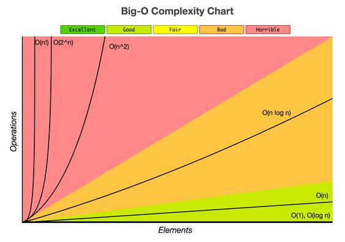

# I Data Structure 
## 1. Big O - Upper Bound (Worst Case)
- Big O, also known as Big O notation, represents an algorithm's worst-case complexity. It uses algebraic terms to describe the complexity of an algorithm.
- What it means: Big O (O) describes the worst-case scenario for an algorithm.
- In simple terms: It tells you the slowest an algorithm can run in the worst
circumstances.

 ### 1.1 Big O notation and how it relates to the rate of growth of a function.  
-  consider \( f(n) = 7n^3 + 100n^2 + 20n + 6 \)
1. **Highest-order Term**:
   - The highest-order term of a function is the term with the highest power of the variable (in this case, 'n'). In the given function, the highest-order term is 7n^3.

2. **Rate of Growth**:
   - The rate of growth of a function describes how quickly the function's value increases as the input size ('n') increases. In this case, the function's rate of growth is n^3 because of the highest-order term.

3. **Big O Notation**:
   - Big O notation (O()) is used to describe the upper bound of the rate of growth of a function. It represents the worst-case scenario in terms of the function's growth.
   - In the given example, the function 7n^3 + 100n^2 + 20n + 6 is said to be O(n^3) because its rate of growth is no faster than n^3.
   - However, it can also be said to be O(n^4), O(n^5), O(n^6), and so on. This is because the function grows more slowly than these higher-order terms, and thus, it is also correct to say that it grows no faster than them.
   - More generally, the function can be described as O(n^c) for any constant c ≥ 3.

In summary, the function's rate of growth determines its Big O notation, and it is possible to describe the function's growth using higher-order terms, as long as they represent an upper bound on the function's growth.

Let's write a C++ function that represents the given polynomial function \( f(n) = 7n^3 + 100n^2 + 20n + 6 \) and demonstrate how its growth rate can be described using Big O notation.

```cpp
#include <iostream>

// Function representing the polynomial: f(n) = 7n^3 + 100n^2 + 20n + 6
int polynomialFunction(int n) {
    return 7 * n * n * n + 100 * n * n + 20 * n + 6;
}

int main() {
    // Test the polynomial function for different values of n
    int n_values[] = {1, 10, 100, 1000};

    for (int n : n_values) {
        std::cout << "f(" << n << ") = " << polynomialFunction(n) << std::endl;
    }

    return 0;
}
```

### 1.2 Drop Non-Dominant 
To drop the non-dominant terms from the Big O notation of the function \( f(n) = 7n^3 + 100n^2 + 20n + 6 \), we consider only the term with the highest growth rate, which is \( 7n^3 \) in this case. 

So, the simplified Big O notation for the function \( f(n) \) is \( O(n^3) \).

This notation indicates that as the input size \( n \) grows, the dominant term \( n^3 \) will have the most significant impact on the overall growth rate of the function. The non-dominant terms \( 100n^2 \), \( 20n \), and \( 6 \) will become less significant as \( n \) becomes large.

### 1.3  asymptotic notation symbols
These are the three major asymptotic notation symbols used to describe the time complexity of algorithms:
1. **Omega (Ω)**:
   - **Meaning**: Omega (Ω) describes the best-case scenario for an algorithm. It represents the lower bound of the time complexity.
   - **Simple Explanation**: It tells you the fastest an algorithm can run in the best circumstances.

2. **Theta (Θ)**:
   - **Meaning**: Theta (Θ) represents the tight bound of the time complexity. It indicates the average or expected performance of the algorithm.
   - **Simple Explanation**: It tells you what to generally expect in terms of time complexity.

3. **Big O (O)**:
   - **Meaning**: Big O (O) describes the worst-case scenario for an algorithm. It represents the upper bound of the time complexity.
   - **Simple Explanation**: It tells you the slowest an algorithm can run in the worst circumstances.

In summary:
- Omega (Ω) gives the best-case scenario.
- Theta (Θ) provides a tight, average-case scenario.
- Big O (O) gives the worst-case scenario.
  
### 1.4 The basic concepts of Big O
These are the basic concepts of Big O notation along with their meanings and examples:

1. **O(1)**: Constant Time
   - **Meaning**: The time complexity is constant and doesn't depend on the size of the data set.
   - **Example**: Accessing an array element by its index.

2. **O(log n)**: Logarithmic Time
   - **Meaning**: The time complexity grows logarithmically as the size of the data set increases. Each step divides the data set in half (divide and conquer).
   - **Example**: Binary search.

3. **O(n)**: Linear Time
   - **Meaning**: The time complexity grows directly proportional to the size of the data set.
   - **Example**: Looping through an array.

```cpp
#include <iostream>
#include <vector>

void printArray(const std::vector<int>& arr) {
    // Iterate through the array and print each element
    for (int num : arr) {
        std::cout << num << " ";
    }
    std::cout << std::endl;
}

int main() {
    // Create a vector of integers
    std::vector<int> numbers = {1, 2, 3, 4, 5};

    // Call the function to print the array
    printArray(numbers);

    return 0;
}
```


4. **O(n log n)**: Linearithmic Time
   - **Meaning**: The time complexity grows logarithmically with the data set size, but also performs an additional linear operation within each step.
   - **Example**: Merge sort, quick sort.

5. **O(n^2)**: Polynomial Time
   - **Meaning**: The time complexity grows quadratically with the size of the data set. Typically involves nested loops where each loop iterates over the data set.
   - **Example**: Bubble sort (O(n^2)).
```cpp
#include <iostream>
#include <vector>

void bubbleSort(std::vector<int>& arr) {
    int n = arr.size();
    for (int i = 0; i < n - 1; ++i) {
        for (int j = 0; j < n - i - 1; ++j) {
            if (arr[j] > arr[j + 1]) {
                // Swap arr[j] and arr[j + 1]
                int temp = arr[j];
                arr[j] = arr[j + 1];
                arr[j + 1] = temp;
            }
        }
    }
}

int main() {
    // Create a vector of integers
    std::vector<int> numbers = {5, 3, 8, 2, 1};

    // Sort the array using bubble sort
    bubbleSort(numbers);

    // Print the sorted array
    for (int num : numbers) {
        std::cout << num << " ";
    }
    std::cout << std::endl;

    return 0;
}

```
Understanding these Big O concepts helps in analyzing the efficiency and scalability of algorithms and choosing the most suitable algorithm for a given problem based on its time complexity.



----------------------------------

## 2. Linked Lists

-------------------------------------

# II Algorithm


# III Advanced Algorithm
